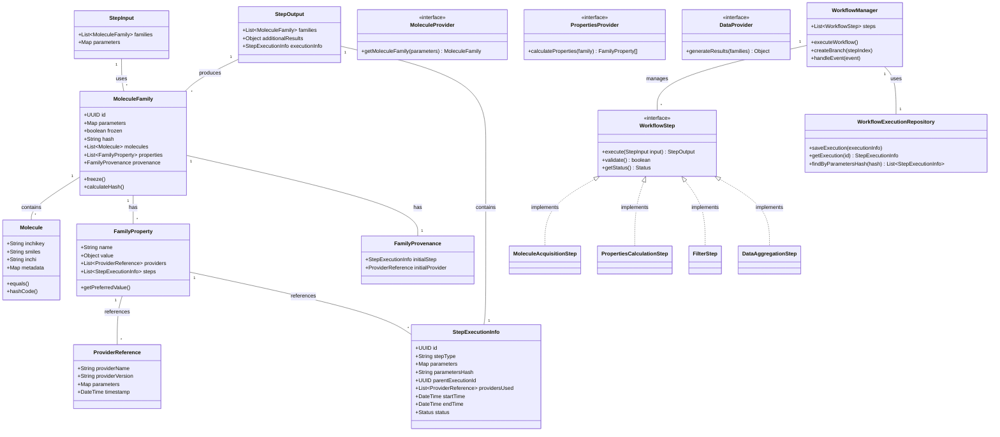
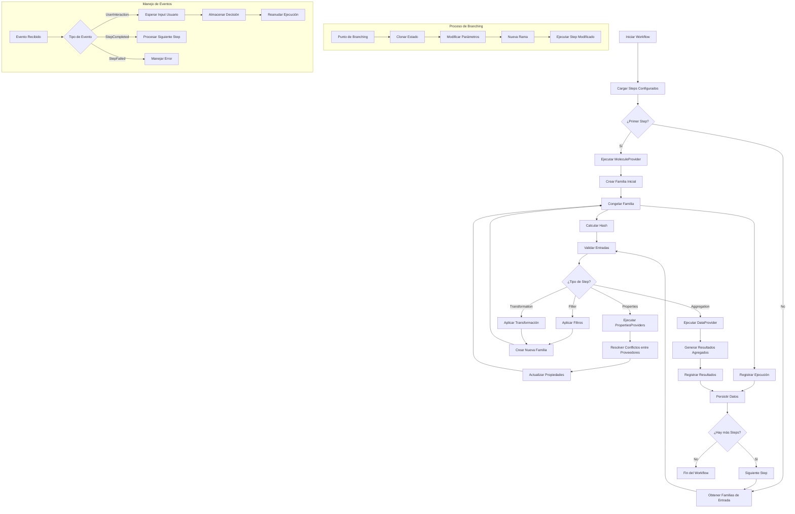

# boceto ChemFlow

## Archivo donde se plasman las ideas de lo que deberia ser chemflow

## Componentes Fundamentales

### 1. Modelo de Datos Central

**Moléculas**:
Cada molécula en el sistema se representa con:

- Identificadores canónicos: SMILES, InChI, InChIKey (como identificador único principal)//una tabla
- Propiedades calculadas: Múltiples valores para la misma propiedad de diferentes proveedores //otra tabla
- Metadatos de procedencia: Origen, fecha de cálculo, proveedor utilizado //tabla de metadatos tambien algunos otros los guarda el step

**Familias de Moléculas**:
Conjuntos inmutables de moléculas que:

- Comparten un origen común o propósito experimental
- Contienen metadatos completos sobre su creación
- Son versionadas y congeladas después de cada procesamiento
- Mantienen relaciones de parentesco entre familias derivadas

**Propiedades Moleculares**:
El sistema soporta un amplio espectro de propiedades calculables:

- Las propiedades tendrán referencias a muchas propiedades de una molécula, cada propiedad estará fuertemente tipada y será inmutable también tendrá conocimiento de qué step salió el step y que provider con que datos se obtuvo
- esto es importante recalcar los provider podrian simultaneamente calcular la misma propiedad y entonces en el step se escojera por ejemplo de cual provider se escojera la LogS o el Volumen Molar si se llega a obtener de 2 providers diferentes
  Las siguientes propiedades son de ejemplo: podra generar mas o menos
- **Propiedades fisicoquímicas**:

  - LogP (Coeficiente de reparto octanol-agua)
  - LogD (Coeficiente de reparto a pH específico)
  - pKa (Constante de disociación)
  - Solubilidad (LogS)
  - Peso Molecular (MW)
  - Área de Superficie Polar (PSA)
  - Volumen Molar
  - Refracción Molar (MR)

- **Propiedades estructurales**:

  - Número de Rotores Libres
  - Polarizabilidad
  - Carga Parcial Atómica

- **Propiedades electrónicas**:

  - Energía de HOMO/LUMO
  - Energía de Hidratación

- **Propiedades biológicas**:
  - Permeabilidad (ej. Caco-2)
  - LD50 (Dosis letal media)
  - Toxicidad predicha

### 2. Proveedores (Providers)

**Arquitectura de Proveedores**:
Cada proveedor se implementa como un módulo especializado que:

- **Proveedores de Moléculas**:

  - Generan familias desde diversas fuentes (bases de datos, archivos, generación in silico)
  - Ejemplos: Proveedor de prueba, Proveedor de base de datos ZINC, Proveedor de archivos SDF
  - Registran todos los parámetros de generación

- **Proveedores de Propiedades**:

  - Calculan propiedades específicas usando diferentes métodos
  - Ejemplos: Proveedor Test, Proveedor Gaussian, Proveedor AMBIT
  - Cada proveedor declara qué propiedades puede calcular
  - Algunos proveedores pueden calcular propiedades únicas, otros pueden solaparse

- **Proveedores de Análisis**:
  - Realizan operaciones complejas sobre familias completas
  - Ejemplos: Clustering, filtrado, análisis de diversidad
  - Generan resultados agregados y métricas estos normalemente son valores que se relacionana a toda la familia
  - asi que se generara una tabla para guardar el valor con el provider que se genero y a que familia se le asigno este valor

**Manejo de Múltiples Proveedores**:
El sistema permite que un mismo step utilice múltiples proveedores:

- **Selección de Proveedor por Propiedad**:

  - Cada step configura qué proveedor usar para cada propiedad
  - Ejemplo: Usar Gaussian para energía HOMO/LUMO y AMBIT para logP

- **Resolución de Conflictos**:

  - Cuando múltiples proveedores calculan la misma propiedad:
    - El usuario puede especificar preferencias
    - El sistema puede usar reglas de prioridad configurables
    - Todos los valores se almacenan con metadatos de origen

- **Ejecución Paralela**:
  - Proveedores independientes pueden ejecutarse concurrentemente
  - Dependencias entre propiedades se respetan automáticamente
  - algunos provedores realmente solo esperan resultados de usuarios o interacciones
  - normalmente se manejaran con eventos y estos eventos los gestionara los step con eventos

### 3. Pasos (Steps) se implementaran usando los step de flujos

**Anatomía de un Step**:

1. **Recepción de Entradas**:

   - Puede recibir 0-N familias de moléculas
   - Valida que las familias tengan las propiedades requeridas
   - Verifica la inmutabilidad de las entradas

2. **Ejecución de Proveedores**:

   - Invoca uno o más proveedores configurados
   - Gestiona la ejecución paralela cuando es posible
   - Recoge y consolida resultados

3. **Procesamiento de Resultados**:

   - Aplica reglas de selección cuando hay múltiples valores
   - Genera nuevas familias o enriquece las existentes
   - Calcula agregados y estadísticas si corresponde

4. **Congelación y Registro**:
   - Hace inmutables los resultados
   - Calcula hashes canónicos para trazabilidad
   - Registra toda la información de ejecución

**Ejemplos de tipos de Steps Específicos**:

- **MoleculeAcquisitionStep**:

  - Utiliza proveedores de moléculas para crear familias nuevas
  - Ejemplo: Obtener 1000 moléculas de ZINC con MW < 500

- **PropertiesCalculationStep**:

  - Añade propiedades a familias existentes
  - Puede usar múltiples proveedores para diferentes propiedades
  - Ejemplo: Calcular logP con Gaussian y logP y toxicidad con AMBIT
  - y se escoge el valor de logP preferido según las reglas de resolución
  - se guardan ambas pero se marca la de Gaussian como preferida y en la familia se escoge

- **FilterStep**:

  - Filtra familias basado en condiciones sobre propiedades
  - Ejemplo: Conservar moléculas con logP entre 1.0 y 5.0

- **DataAggregationStep**:

  - Calcula estadísticas y agregados a nivel de familia
  - Ejemplo: Calcular promedio de logP y desviación estándar
  - Se generan nuevos valores agregados y se actualizan las familias
    y se crean nuevas que tengan estos agregados que se crean para manejar inmutabilidad

- **TransformationStep**:
  - Transforma familias (split, merge, transformaciones químicas)
  - Ejemplo: Dividir familia por rangos de peso molecular

### 4. Workflow y Ejecución

    Sobre los pasos (Steps)

los steps podran resivir de 0 a varias familias de moleculas
cada familia de moleculas podra tener una o varias propiedades definidas
y una lista de parametros extras cada step puede pedir lo necesario para procesar

cada steps puede regresar ya sea las mismas familias de moleculas agregar valores a estas familias pero con trasavilidad
ya que los valores podran venir de diferentes providers y hay que guardar que provaider se uso con que parametros

cada step debera tener acceso a una lista de providers que se usara ya sea para generar familia de moleculas o sus datos
al finalizaar cada step se congelara los parametros que se usaron para ese step y asi poder crear nuevas ejecuciones cambiando los parametros
y asi crear ramas vifurcaciones en el flow

cada step regresara ya sea objetos de resultados(generados con provaiders); o familias con propiedades() y guardara la ejecucion los parametros para la ejecucion de los priver para la trazabilidad y confiansa asi para saber si se debe vifurcar al cambiar algun parametro

Sobre los providers de familias Se definira como trait para que puedan aver varios
cada provaider podra generar una familia de moleculas ya sea que pida parametros para hacerlo o no

sobre los providers propiedades
estos son provedores que pueden definir propiedades para toda una familia de moleculas este siempre guardara todos los parametros con los que
se ejecuta el provaider y la salida completa del programa o funcion que se ejecuta y generara la familia de moleculas con sus datos
agregados y lo regresara
sobre provaiders de datos este solo regresara un dato que se guardara como parametros puede recibir ya sea una familia o un solo dato normalmente
servira para promedios y demas cosas pero que se guardaran para trazabilidad pero tambien esto se podra obtener de diferentes fuentes

Sobre moleculas
estas solo tienen su inchi smile y inchi key como llave maestra son parte de la familia y hay propiedades que hacen referencia a estas si bien cada propidedad debe saber que provider la trajo deben de estar guardada en un lugar separado de los steps ya que estos no deben depender de los steps por si se quieren obtener propiedades de las moleculas ver por ejemplo todos los logP que tienen de que provaider fue obtenido y con que datos

Sistema de Flujos (Flow System)

    Flujos Tipados: Cada workflow define sus propios steps mediante enums específicos
    Ejecución Secuencial: Los steps se ejecutan en orden con validación de dependencias
    Estados de Ejecución: Pending, Running, Completed, Failed, Skipped, Cancelled
    Manejo de Eventos: Sistema de eventos para trazabilidad y notificaciones

Sistema de Steps

    Contrato Estricto: Todos los steps implementan el trait Step con métodos obligatorios
    Validación: Cada step valida sus parámetros antes de ejecutarse
    Trazabilidad: UUID único, registro de ejecución y estados
    Ejecución Asíncrona: Soporte para operaciones de larga duración

Características Clave

    Inmutabilidad: Los resultados se congelan después de cada step
    Branching: Capacidad de crear ramas (como Git) para experimentación
    Reproducibilidad: Hashes canónicos y registro completo de ejecución
    Interacción Humana: Steps pueden esperar aprobación del usuario

Arquitectura Técnica

    Traits Genéricos: Step y Flow como interfaces base
    Tipado Fuerte: Cada flow tiene su propio enum de steps
    Persistencia: Capacidad de guardar/recuperar estados desde base de datos
    Event Sourcing: Registro inmutable de todos los eventos

**Ejecución Paso a Paso**:

1. **Inicialización**:

   - Verificación de disponibilidad de proveedores
   - Creación de contexto de ejecución
   - se crean los Flow

2. **Ejecución de Steps**:

   - Cada step se ejecuta secuencialmente
   - Las entradas se obtienen de steps anteriores o fuentes externas
   - Los proveedores se ejecutan según la configuración
   - Los resultados se congelan y registran

3. **Manejo de Resultados**:
   - Salidas de cada step están disponibles para steps siguientes
   - Todas las ejecuciones se persisten con trazabilidad completa
   - Se generan reportes y resúmenes de ejecución

## Sistema de Ramificación (Branching)

### Mecanismo de Bifurcación

1. **Identificación del Punto de Divergencia**:

   - Usuario selecciona un step existente en una ejecución previa
   - Modifica parámetros o configuración de proveedores

2. **Reconstrucción del Estado**:

   - Sistema identifica la familia congelada de entrada al step
   - Verifica integridad mediante hashes canónicos
   - Prepara el contexto de ejecución para la rama

3. **Ejecución de la Rama**:

   - Ejecuta el step modificado con nueva configuración
   - Continúa ejecución de steps subsiguientes
   - Mantiene relación con la ejecución original

4. **Persistencia de Relaciones**:
   - Cada ejecución conoce su ejecución padre
   - Las ramas forman un árbol de versiones
   - Es posible comparar resultados entre ramas

## Trazabilidad y Reproducibilidad

### Hashes Canónicos

El sistema utiliza hashes canónicos para garantizar la integridad:

- **Hash de Familia**: Calculado sobre:

  - Identificadores y propiedades de todas las moléculas
  - Parámetros de creación
  - Metadatos y versiones de proveedores utilizados

- **Hash de Step**: Calculado sobre:
  - Hashes de familias de entrada
  - Parámetros del step
  - Configuración de proveedores
  - Versiones de todos los componentes

### Registro de Ejecución

Cada ejecución de step registra:

- **Información de Entrada**:

  - IDs y hashes de familias de entrada
  - Parámetros de ejecución

- **Información de Proveedores**:

  - Proveedores utilizados con sus versiones
  - Parámetros específicos para cada proveedor
  - Resultados individuales de cada proveedor

- **Información de Salida**:
  - IDs y hashes de familias de salida
  - Resultados agregados y estadísticas
  - Tiempos de ejecución y estado

## Persistencia y Consulta

### Almacenamiento en Base de Datos

    se creara una base de datos para esto
    donde se guardaran las moleculas
    las propiedades de las moleculas
    los resultados de las ejecuciones
    los metadatos de las ejecuciones
    ...

### Consultas y Auditoría

1. **Trazabilidad Completa**: Cada dato conoce su origen exacto
2. **Reproducibilidad Exacta**: Ejecuciones pueden reproducirse idénticamente
3. **Flexibilidad Experimental**: Múltiples proveedores y ramificación
4. **Escalabilidad**: Diseño normalizado para grandes volúmenes de datos
5. **Interoperabilidad**: Múltiples proveedores con interfaces estandarizadas
6. **Auditoría Completa**: Historial detallado de todas las operaciones

```rust
// ============================================================================
//                        SISTEMA DE FLUJOS (PSEUDOCÓDIGO RUST)
// ============================================================================
//
// Objetivo:
// - Modelar flujos secuenciales con Steps fuertemente tipados.
// - Cada FlowDefinido declara SU PROPIO conjunto de pasos (enum de pasos).
// - El motor garantiza: secuencia, validación de parámetros antes de ejecutar,
//   trazabilidad inmutable (event sourcing), branching tipo Git y reportes.
//
// Nota: Este archivo NO implementa lógica; solo describe qué debe hacer cada
//       pieza con comentarios detallados.
// ============================================================================
// - Cada Flow inicializa TODOS sus Steps en el constructor.
// - Cada Step tiene su propio UUID.
// - Los enerados solo son accesibles si el Step está Completed.
// - estos datos son accesibles directamente por la estructura con sus metodos
// - La trazabilidad sigue siendo event-sourcing inmutable.
// ============================================================================

// ============================================================================
//                         SISTEMA DE ERRORES
// ============================================================================
#[derive(Error, Debug, Serialize, Deserialize)]
enum FlowError {
    #[error("Validation error: {0}")]
    Validation(#[from] ValidationErrors),

    #[error("Step execution failed: {0}")]
    StepFailure(String),

    #[error("Persistence error: {0}")]
    Persistence(String),

    #[error("Step not found: {0}")]
    StepNotFound(Uuid),
}

#[derive(Error, Debug)]
enum StepError {
    #[error("Validation error: {0}")]
    Validation(#[from] ValidationErrors),

    #[error("Execution error: {0}")]
    Execution(String),

    #[error("Timeout error")]
    Timeout,
}

// ============================================================================
//                         ESTADOS DE EJECUCIÓN
// ============================================================================
enum Status {
    Pending,
    Running,
    Completed,
    Failed(String),
    Skipped,
    Cancelled,
}

// ============================================================================
//                         EVENTOS DEL FLOW
// ============================================================================
#[derive(Clone, Debug, Serialize, Deserialize)]
enum FlowEventType {
    StepStarted,
    StepCompleted,
    StepFailed(String),
    StepSkipped(String),
    BranchCreated,
    UserInteractionRequired,
}

#[derive(Clone, Debug, Serialize, Deserialize)]
struct FlowEvent {
    event_id: Uuid,
    flow_uuid: Uuid,
    step_uuid: Option<Uuid>,
    event_type: FlowEventType,
    timestamp: u64,
    metadata: serde_json::Value,
}


// ============================================================================
//                          TRAIT GENÉRICO STEP
// ============================================================================
/// Contrato común para todos los Steps.
/// - Cada Step debe tener un UUID único, un nombre y un estado.
/// - Debe validar sus parámetros antes de ejecutarse.
/// - Debe tener un método para ejecutar la lógica del paso.
 /// guardar totalmente su trazabilidad.
/// si durante la ejecución del paso se necesita acceder a datos de pasos anteriores, esto debe hacerse de manera segura y tipada.
/// si se necesita interaccionar con el usuario, esto debe hacerse a través de un mecanismo de eventos, cuando este en estado pendiente por ejemplo
/// y si toma una decision el usuario esta debe ser totalmente capturada para su trazabilidad todo aqui debe poder ser reproducible cuando se clone
#[async_trait]
trait Step {
    fn new(name: String) -> Self where Self: Sized;
    fn from_db(uuid: Uuid) -> Option<Self> where Self: Sized;
    fn uuid(&self) -> Uuid;            // UUID único del Step
    fn name(&self) -> &str;            // Nombre humano/técnico
    fn step_status(&self) -> Status;  // Estado actual
    fn validate_params(&self) -> Result<(), ValidationErrors>;// Verifica parámetros antes de ejecutar
    async fn execute(&mut self, input: Option<Self::Input>) -> Result<Self::Output, StepError>;// Ejecuta el Step
    fn clone_box(&self) -> Box<dyn Step<Input=Self::Input, Output=Self::Output> + Send>;
}
// ============================================================================
//                     TRAIT FLOW (GENÉRICO)
// ============================================================================
#[async_trait]
trait Flow {
    type StepEnum;
    //funcion que te permita recuperar un flow por su uuid de la base de datos tambien debe verificar si efectivamente es el tipo
    fn get_flow_by_uuid(uuid: Uuid) -> Option<Self> where Self: Sized;
    fn new(name: String) -> Self where Self: Sized;
    //regresa un step
    fn step(&self, index: usize) -> Option<&Self::StepEnum>;
    /// Identidad del Flow
    fn uuid(&self) -> Uuid;
        /// Flow padre si es branch
    fn parent_uuid(&self) -> Option<Uuid>;
        /// Número total de pasos
    fn steps_len(&self) -> usize;
        /// Índice actual
    fn current_index(&self) -> Option<usize>;
        /// Ejecuta el siguiente step (valida estados y parámetros)
    fn step_status(&self, index: usize) -> Status;

    fn run_next_step(&mut self);

    /// Ejecuta el siguiente step y espera a que termine
    fn run_next_step_and_wait(&mut self);
    fn new_branch(&self, up_to_index: usize) -> Box<dyn Flow<StepEnum=Self::StepEnum> + Send>;
    fn clone_box(&self) -> Box<dyn Flow<StepEnum=Self::StepEnum> + Send>;
    fn events(&self) -> &[FlowEvent];

    // ---------------------------
    // EVENT HANDLER
    // ---------------------------
    /// Registra un callback que se disparará cada vez que ocurra un evento
    /// en el Flow o en cualquiera de sus Steps.
    fn set_event_handler(&mut self, handler: EventCallback);
    /// Internamente, cada Flow concreto llamará a este método para disparar
    /// eventos a quien se haya suscrito.
    fn emit_event(&self, step_uuid: Option<Uuid>, event_type: FlowEventType);
}

// ============================================================================
// EJEMPLO DE STEPS
// ============================================================================

#[derive(Debug)]
struct StepA { uuid: Uuid, name: String, status: Status }
#[derive(Debug)]
struct StepB { uuid: Uuid, name: String, status: Status }
#[derive(Debug)]
struct StepC { uuid: Uuid, name: String, status: Status }

#[async_trait]
impl Step for StepA {
    fn new(name: String) -> Self {
        StepA { uuid: Uuid::new_v4(), name, status: Status::Pending }
    }
    fn from_db(_uuid: Uuid) -> Option<Self> { None }
    fn uuid(&self) -> Uuid { self.uuid }
    fn name(&self) -> &str { &self.name }
    fn step_status(&self) -> Status { self.status.clone() }
    fn validate_params(&self) -> Result<(), ValidationErrors> { Ok(()) }
    async fn execute(&mut self, _input: Option<Self::Input>) -> Result<Self::Output, StepError> {
        self.status = Status::Completed;
        Ok(())
    }
    fn clone_box(&self) -> Box<dyn Step<Input=Self::Input, Output=Self::Output> + Send> {
        Box::new(StepA { uuid: Uuid::new_v4(), name: self.name.clone(), status: Status::Pending })
    }
}

#[async_trait]
impl Step for StepB {
    fn new(name: String) -> Self { StepB { uuid: Uuid::new_v4(), name, status: Status::Pending } }
    fn from_db(_uuid: Uuid) -> Option<Self> { None }
    fn uuid(&self) -> Uuid { self.uuid }
    fn name(&self) -> &str { &self.name }
    fn step_status(&self) -> Status { self.status.clone() }
    fn validate_params(&self) -> Result<(), ValidationErrors> { Ok(()) }
    async fn execute(&mut self, _input: Option<Self::Input>) -> Result<Self::Output, StepError> {
        self.status = Status::Completed;
        Ok(())
    }
    fn clone_box(&self) -> Box<dyn Step<Input=Self::Input, Output=Self::Output> + Send> {
        Box::new(StepB { uuid: Uuid::new_v4(), name: self.name.clone(), status: Status::Pending })
    }
}

#[async_trait]
impl Step for StepC {
    fn new(name: String) -> Self { StepC { uuid: Uuid::new_v4(), name, status: Status::Pending } }
    fn from_db(_uuid: Uuid) -> Option<Self> { None }
    fn uuid(&self) -> Uuid { self.uuid }
    fn name(&self) -> &str { &self.name }
    fn step_status(&self) -> Status { self.status.clone() }
    fn validate_params(&self) -> Result<(), ValidationErrors> { Ok(()) }
    async fn execute(&mut self, _input: Option<Self::Input>) -> Result<Self::Output, StepError> {
        self.status = Status::Completed;
        Ok(())
    }
    fn clone_box(&self) -> Box<dyn Step<Input=Self::Input, Output=Self::Output> + Send> {
        Box::new(StepC { uuid: Uuid::new_v4(), name: self.name.clone(), status: Status::Pending })
    }
}
impl StepC {
    fn inserta_parametros(&mut self, _parametros: Vec<String>) {
        // Lógica interna exclusiva de StepC
    }
}

// ============================================================================
// ENUM DE STEPS PARA EL FLOW
// ============================================================================
#[derive(Debug)]
enum EjemploFlowStep {
    A(StepA),
    B(StepB),
    C(StepC),
}
impl EjemploFlowStep {
    fn get_nombre(&self) -> &str {
        match self {
            EjemploFlowStep::A(step) => step.name(),
            EjemploFlowStep::B(step) => step.name(),
            EjemploFlowStep::C(step) => step.name(),
        }
    }
    fn get_status(&self) -> &Status {
        match self {
            EjemploFlowStep::A(step) => step.step_status(),
            EjemploFlowStep::B(step) => step.step_status(),
            EjemploFlowStep::C(step) => step.step_status(),
        }
    }
    fn get_uuid(&self) -> Uuid {
        match self {
            EjemploFlowStep::A(step) => step.uuid(),
            EjemploFlowStep::B(step) => step.uuid(),
            EjemploFlowStep::C(step) => step.uuid(),
        }
    }
}

// ============================================================================
// IMPLEMENTACIÓN DEL FLOW
// ============================================================================
struct EjemploFlow {
    uuid: Uuid,
    steps: Vec<EjemploFlowStep>,
    current: usize,
    events: Vec<FlowEvent>,
}

#[async_trait]
impl Flow for EjemploFlow {
    type StepEnum = EjemploFlowStep;

    fn get_flow_by_uuid(_uuid: Uuid) -> Option<Self> {
         // 1. Consultar DB por flow con ese UUID
        // 2. Si existe, reconstruir EjemploFlow con Steps y estados
        // 3. Retornar Some(flow) o None si no existe
     }
    fn new(_name: String) -> Self {
        EjemploFlow {
            uuid: Uuid::new_v4(),
            steps: vec![
                EjemploFlowStep::A(StepA::new("Step A".into())),
                EjemploFlowStep::B(StepB::new("Step B".into())),
                EjemploFlowStep::C(StepC::new("Step C".into())),
            ],
            current: 0,
            events: vec![],
        }
    }

    fn step(&self, index: usize) -> Option<&Self::StepEnum> {
        self.steps.get(index)

    }

    fn inserta_parametros_c(&mut self, _parametros: Vec<String>) {
        if let Some(EjemploFlowStep::C(step)) = self.steps.get_mut(2) {
            step.inserta_parametros(_parametros);
        }
    }

    fn uuid(&self) -> Uuid { self.uuid }
    fn parent_uuid(&self) -> Option<Uuid> { None }
    fn steps_len(&self) -> usize { self.steps.len() }
    fn current_index(&self) -> Option<usize> { Some(self.current) }
    fn step_status(&self, index: usize) -> Status {
        match self.steps.get(index) {
            Some(EjemploFlowStep::A(s)) => s.step_status(),
            Some(EjemploFlowStep::B(s)) => s.step_status(),
            Some(EjemploFlowStep::C(s)) => s.step_status(),
            None => Status::Pending,
        }
    }

    fn run_next_step(&mut self) {

            // 0) Determinar el índice del siguiente paso a ejecutar (cursor).
            // 1) Verificar que el anterior (si existe) esté Completed; si no, abortar.
            // si se necesita obtener datos del paso anterior aqui los obtengo ya que termino y se los paso al siguiente para que pase su validacion
            // ya que hay dos formas de llenar los parametros de un step y esto lo definira cada step como le convenga uno sera directamente desde
            // en este caso EjemploFlow que tendra funciones para insertar los daos que necesite o aqui donde llamare una funcion que llenara
            // los datos del siguiente paso
            // 2) Verificar `validate_params()` del paso actual.
            //    - Si false: NO ejecutar; registrar incidente (y opcionalmente marcar Skipped, o Aborted).
            // 3) push_event(StepStarted), marcar Running (si se cachea).
            // 4) Llamar `run()` del Step dentro del match del enum:
            //      match self.steps[i] { Ingesta(s) => s.run(), Transforma(s) => s.run(), ... }
            // 5) Si Ok:
            //      - Congelar outputs (persistir, hash, metadata).
            //      - push_event(StepCompleted).
            //      - advance_cursor().
            // 6) Si Err(e):
            //      - push_event(StepFailed con `e`).
            //      - NO avanzar cursor.
            //      - Dejar evidencia para retry manual/automático.
            // 7) Notificar a subsistemas (reportes, UI, alertas).


            self.current += 1;

    }

    fn run_next_step_and_wait(&mut self) { self.run_next_step(); }
    fn new_branch(&self, _up_to_index: usize) -> Box<dyn Flow<StepEnum=Self::StepEnum> + Send> {
        // 1. Validar que _up_to_index Completed
        // 2. Clonar Steps y outputs hasta ese índice
        // 3. Crear nuevo UUID y parent_uuid = self.uuid
        // 4. Registrar evento BranchCreated
    }
    fn clone_box(&self) -> Box<dyn Flow<StepEnum=Self::StepEnum> + Send> {
        Box::new(Self::new("clone".into()))
    }
    fn events(&self) -> &[FlowEvent] { &self.events }

    fn set_event_handler(&mut self, _handler: EventCallback) {

    }
    fn emit_event(&self, _step_uuid: Option<Uuid>, _event_type: FlowEventType) {
        // 1. Crear FlowEvent con timestamp y detalles
        // 2. Append a self.events
        // 3. Persistir en DB
        // 4. Llamar event_handler si existe
    }
}


// ============================================================================
//  SEGUNDO EJEMPLO: OTRO FLOW (Ingesta -> Limpieza -> Feature Engineering)
// ============================================================================
// Objetivo de este segundo ejemplo:
// - Mostrar cómo se reutiliza el trait Step y el trait Flow para definir OTRO
//   flujo totalmente distinto al anterior sin tocar el primero.
// - Mantener la misma filosofía: enum central con TODOS los Steps concretos.
// - Explicar (en comentarios) qué debería ocurrir en cada método real.
// - NO es código funcional completo; faltan validaciones, persistencia,
//   control de concurrencia, timeouts, etc.
// ----------------------------------------------------------------------------

// -----------------------------
// STEPS DEL SEGUNDO FLOW
// -----------------------------
#[derive(Debug)]
struct IngestaArchivo { uuid: Uuid, nombre: String, status: Status /*, campos_parametros, buffers, etc. */ }
#[derive(Debug)]
struct LimpiezaDatos { uuid: Uuid, nombre: String, status: Status /*, reglas, expresiones, etc. */ }
#[derive(Debug)]
struct GeneraMatrizFeaturizada { uuid: Uuid, nombre: String, status: Status /*, config de ingeniería de features */ }

// NOTA: Se recicla exactamente el mismo trait Step. Cada implementación real
// haría sus validaciones y ejecución asíncrona. Aquí sólo se comentan ideas.
#[async_trait]
impl Step for IngestaArchivo {
    fn new(nombre: String) -> Self { Self { uuid: Uuid::new_v4(), nombre, status: Status::Pending } }
    fn from_db(_uuid: Uuid) -> Option<Self> { /* Reconstruir desde eventos/tabla */ None }
    fn uuid(&self) -> Uuid { self.uuid }
    fn name(&self) -> &str { &self.nombre }
    fn step_status(&self) -> Status { self.status.clone() }
    fn validate_params(&self) -> Result<(), ValidationErrors> {
        // Verificar existencia de ruta de archivo, permisos, tamaño, formato.
        // Retornar Err si algo crítico falta.
        Ok(())
    }
    async fn execute(&mut self, _input: Option<Self::Input>) -> Result<Self::Output, StepError> {
        // 1. Leer archivo (streaming / chunked en implementación real)
        // 2. Hacer checksum y registrar metadatos (evento)
        // 3. Persistir crudo si aplica
        // 4. Marcar Completed al final
        self.status = Status::Completed;
        Ok(())
    }
    fn clone_box(&self) -> Box<dyn Step<Input=Self::Input, Output=Self::Output> + Send> {
        Box::new(Self { uuid: Uuid::new_v4(), nombre: self.nombre.clone(), status: Status::Pending })
    }
}

#[async_trait]
impl Step for LimpiezaDatos {
    fn new(nombre: String) -> Self { Self { uuid: Uuid::new_v4(), nombre, status: Status::Pending } }
    fn from_db(_uuid: Uuid) -> Option<Self> { None }
    fn uuid(&self) -> Uuid { self.uuid }
    fn name(&self) -> &str { &self.nombre }
    fn step_status(&self) -> Status { self.status.clone() }
    fn validate_params(&self) -> Result<(), ValidationErrors> {
        // Validar que existe output del paso anterior (IngestaArchivo) y
        // que cumple mínimos (no vacío, formato válido, etc.).
        Ok(())
    }
    async fn execute(&mut self, _input: Option<Self::Input>) -> Result<Self::Output, StepError> {
        // Aplicar reglas: normalización, trimming, eliminación de duplicados.
        // Registrar stats (conteo de filas antes / después, % nulos, etc.).
        self.status = Status::Completed;
        Ok(())
    }
    fn clone_box(&self) -> Box<dyn Step<Input=Self::Input, Output=Self::Output> + Send> {
        Box::new(Self { uuid: Uuid::new_v4(), nombre: self.nombre.clone(), status: Status::Pending })
    }
}

#[async_trait]
impl Step for GeneraMatrizFeaturizada {
    fn new(nombre: String) -> Self { Self { uuid: Uuid::new_v4(), nombre, status: Status::Pending } }
    fn from_db(_uuid: Uuid) -> Option<Self> { None }
    fn uuid(&self) -> Uuid { self.uuid }
    fn name(&self) -> &str { &self.nombre }
    fn step_status(&self) -> Status { self.status.clone() }
    fn validate_params(&self) -> Result<(), ValidationErrors> {
        // Confirmar que los datos limpios existen y que la config de features
        // (p.ej. lista de columnas derivadas) es consistente.
        Ok(())
    }
    async fn execute(&mut self, _input: Option<Self::Input>) -> Result<Self::Output, StepError> {
        // 1. Generar columnas derivadas
        // 2. Calcular hashes / fingerprint para reproducibilidad
        // 3. Persistir matriz final// ============================================================================
//                        SISTEMA DE FLUJOS (PSEUDOCÓDIGO RUST)
// ============================================================================
//
// Objetivo:
// - Modelar flujos secuenciales con Steps fuertemente tipados.
// - Cada FlowDefinido declara SU PROPIO conjunto de pasos (enum de pasos).
// - El motor garantiza: secuencia, validación de parámetros antes de ejecutar,
//   trazabilidad inmutable (event sourcing), branching tipo Git y reportes.
//
// Nota: Este archivo NO implementa lógica; solo describe qué debe hacer cada
//       pieza con comentarios detallados.
// ============================================================================
// - Cada Flow inicializa TODOS sus Steps en el constructor.
// - Cada Step tiene su propio UUID.
// - Los enerados solo son accesibles si el Step está Completed.
// - estos datos son accesibles directamente por la estructura con sus metodos
// - La trazabilidad sigue siendo event-sourcing inmutable.
// ============================================================================

// ============================================================================
//                         SISTEMA DE ERRORES
// ============================================================================
#[derive(Error, Debug, Serialize, Deserialize)]
enum FlowError {
    #[error("Validation error: {0}")]
    Validation(#[from] ValidationErrors),

    #[error("Step execution failed: {0}")]
    StepFailure(String),

    #[error("Persistence error: {0}")]
    Persistence(String),

    #[error("Step not found: {0}")]
    StepNotFound(Uuid),
}

#[derive(Error, Debug)]
enum StepError {
    #[error("Validation error: {0}")]
    Validation(#[from] ValidationErrors),

    #[error("Execution error: {0}")]
    Execution(String),

    #[error("Timeout error")]
    Timeout,
}

// ============================================================================
//                         ESTADOS DE EJECUCIÓN
// ============================================================================
enum Status {
    Pending,
    Running,
    Completed,
    Failed(String),
    Skipped,
    Cancelled,
}

// ============================================================================
//                         EVENTOS DEL FLOW
// ============================================================================
#[derive(Clone, Debug, Serialize, Deserialize)]
enum FlowEventType {
    StepStarted,
    StepCompleted,
    StepFailed(String),
    StepSkipped(String),
    BranchCreated,
    UserInteractionRequired,
}

#[derive(Clone, Debug, Serialize, Deserialize)]
struct FlowEvent {
    event_id: Uuid,
    flow_uuid: Uuid,
    step_uuid: Option<Uuid>,
    event_type: FlowEventType,
    timestamp: u64,
    metadata: serde_json::Value,
}


// ============================================================================
//                          TRAIT GENÉRICO STEP
// ============================================================================
/// Contrato común para todos los Steps.
/// - Cada Step debe tener un UUID único, un nombre y un estado.
/// - Debe validar sus parámetros antes de ejecutarse.
/// - Debe tener un método para ejecutar la lógica del paso.
 /// guardar totalmente su trazabilidad.
/// si durante la ejecución del paso se necesita acceder a datos de pasos anteriores, esto debe hacerse de manera segura y tipada.
/// si se necesita interaccionar con el usuario, esto debe hacerse a través de un mecanismo de eventos, cuando este en estado pendiente por ejemplo
/// y si toma una decision el usuario esta debe ser totalmente capturada para su trazabilidad todo aqui debe poder ser reproducible cuando se clone
#[async_trait]
trait Step {
    fn new(name: String) -> Self where Self: Sized;
    fn from_db(uuid: Uuid) -> Option<Self> where Self: Sized;
    fn uuid(&self) -> Uuid;            // UUID único del Step
    fn name(&self) -> &str;            // Nombre humano/técnico
    fn step_status(&self) -> Status;  // Estado actual
    fn validate_params(&self) -> Result<(), ValidationErrors>;// Verifica parámetros antes de ejecutar
    async fn execute(&mut self, input: Option<Self::Input>) -> Result<Self::Output, StepError>;// Ejecuta el Step
    fn clone_box(&self) -> Box<dyn Step<Input=Self::Input, Output=Self::Output> + Send>;
}
// ============================================================================
//                     TRAIT FLOW (GENÉRICO)
// ============================================================================
#[async_trait]
trait Flow {
    type StepEnum;
    //funcion que te permita recuperar un flow por su uuid de la base de datos tambien debe verificar si efectivamente es el tipo
    fn get_flow_by_uuid(uuid: Uuid) -> Option<Self> where Self: Sized;
    fn new(name: String) -> Self where Self: Sized;
    //regresa un step
    fn step(&self, index: usize) -> Option<&Self::StepEnum>;
    /// Identidad del Flow
    fn uuid(&self) -> Uuid;
        /// Flow padre si es branch
    fn parent_uuid(&self) -> Option<Uuid>;
        /// Número total de pasos
    fn steps_len(&self) -> usize;
        /// Índice actual
    fn current_index(&self) -> Option<usize>;
        /// Ejecuta el siguiente step (valida estados y parámetros)
    fn step_status(&self, index: usize) -> Status;

    fn run_next_step(&mut self);

    /// Ejecuta el siguiente step y espera a que termine
    fn run_next_step_and_wait(&mut self);
    fn new_branch(&self, up_to_index: usize) -> Box<dyn Flow<StepEnum=Self::StepEnum> + Send>;
    fn clone_box(&self) -> Box<dyn Flow<StepEnum=Self::StepEnum> + Send>;
    fn events(&self) -> &[FlowEvent];

    // ---------------------------
    // EVENT HANDLER
    // ---------------------------
    /// Registra un callback que se disparará cada vez que ocurra un evento
    /// en el Flow o en cualquiera de sus Steps.
    fn set_event_handler(&mut self, handler: EventCallback);
    /// Internamente, cada Flow concreto llamará a este método para disparar
    /// eventos a quien se haya suscrito.
    fn emit_event(&self, step_uuid: Option<Uuid>, event_type: FlowEventType);
}

// ============================================================================
//                        SISTEMA DE FLUJOS (PSEUDOCÓDIGO RUST)
// ============================================================================
//
// Objetivo:
// - Modelar flujos secuenciales con Steps fuertemente tipados.
// - Cada FlowDefinido declara SU PROPIO conjunto de pasos (enum de pasos).
// - El motor garantiza: secuencia, validación de parámetros antes de ejecutar,
//   trazabilidad inmutable (event sourcing), branching tipo Git y reportes.
//
// Nota: Este archivo NO implementa lógica; solo describe qué debe hacer cada
//       pieza con comentarios detallados.
// ============================================================================
// - Cada Flow inicializa TODOS sus Steps en el constructor.
// - Cada Step tiene su propio UUID.
// - Los enerados solo son accesibles si el Step está Completed.
// - estos datos son accesibles directamente por la estructura con sus metodos
// - La trazabilidad sigue siendo event-sourcing inmutable.
// ============================================================================

// ============================================================================
//                         SISTEMA DE ERRORES
// ============================================================================
#[derive(Error, Debug, Serialize, Deserialize)]
enum FlowError {
    #[error("Validation error: {0}")]
    Validation(#[from] ValidationErrors),

    #[error("Step execution failed: {0}")]
    StepFailure(String),

    #[error("Persistence error: {0}")]
    Persistence(String),

    #[error("Step not found: {0}")]
    StepNotFound(Uuid),
}

#[derive(Error, Debug)]
enum StepError {
    #[error("Validation error: {0}")]
    Validation(#[from] ValidationErrors),

    #[error("Execution error: {0}")]
    Execution(String),

    #[error("Timeout error")]
    Timeout,
}

// ============================================================================
//                         ESTADOS DE EJECUCIÓN
// ============================================================================
enum Status {
    Pending,
    Running,
    Completed,
    Failed(String),
    Skipped,
    Cancelled,
}

// ============================================================================
//                         EVENTOS DEL FLOW
// ============================================================================
#[derive(Clone, Debug, Serialize, Deserialize)]
enum FlowEventType {
    StepStarted,
    StepCompleted,
    StepFailed(String),
    StepSkipped(String),
    BranchCreated,
    UserInteractionRequired,
}

#[derive(Clone, Debug, Serialize, Deserialize)]
struct FlowEvent {
    event_id: Uuid,
    flow_uuid: Uuid,
    step_uuid: Option<Uuid>,
    event_type: FlowEventType,
    timestamp: u64,
    metadata: serde_json::Value,
}


// ============================================================================
//                          TRAIT GENÉRICO STEP
// ============================================================================
/// Contrato común para todos los Steps.
/// - Cada Step debe tener un UUID único, un nombre y un estado.
/// - Debe validar sus parámetros antes de ejecutarse.
/// - Debe tener un método para ejecutar la lógica del paso.
 /// guardar totalmente su trazabilidad.
/// si durante la ejecución del paso se necesita acceder a datos de pasos anteriores, esto debe hacerse de manera segura y tipada.
/// si se necesita interaccionar con el usuario, esto debe hacerse a través de un mecanismo de eventos, cuando este en estado pendiente por ejemplo
/// y si toma una decision el usuario esta debe ser totalmente capturada para su trazabilidad todo aqui debe poder ser reproducible cuando se clone
#[async_trait]
trait Step {
    fn new(name: String) -> Self where Self: Sized;
    fn from_db(uuid: Uuid) -> Option<Self> where Self: Sized;
    fn uuid(&self) -> Uuid;            // UUID único del Step
    fn name(&self) -> &str;            // Nombre humano/técnico
    fn step_status(&self) -> Status;  // Estado actual
    fn validate_params(&self) -> Result<(), ValidationErrors>;// Verifica parámetros antes de ejecutar
    async fn execute(&mut self, input: Option<Self::Input>) -> Result<Self::Output, StepError>;// Ejecuta el Step
    fn clone_box(&self) -> Box<dyn Step<Input=Self::Input, Output=Self::Output> + Send>;
}
// ============================================================================
//                     TRAIT FLOW (GENÉRICO)
// ============================================================================
#[async_trait]
trait Flow {
    type StepEnum;
    //funcion que te permita recuperar un flow por su uuid de la base de datos tambien debe verificar si efectivamente es el tipo
    fn get_flow_by_uuid(uuid: Uuid) -> Option<Self> where Self: Sized;
    fn new(name: String) -> Self where Self: Sized;
    //regresa un step
    fn step(&self, index: usize) -> Option<&Self::StepEnum>;
    /// Identidad del Flow
    fn uuid(&self) -> Uuid;
        /// Flow padre si es branch
    fn parent_uuid(&self) -> Option<Uuid>;
        /// Número total de pasos
    fn steps_len(&self) -> usize;
        /// Índice actual
    fn current_index(&self) -> Option<usize>;
        /// Ejecuta el siguiente step (valida estados y parámetros)
    fn step_status(&self, index: usize) -> Status;

    fn run_next_step(&mut self);

    /// Ejecuta el siguiente step y espera a que termine
    fn run_next_step_and_wait(&mut self);
    fn new_branch(&self, up_to_index: usize) -> Box<dyn Flow<StepEnum=Self::StepEnum> + Send>;
    fn clone_box(&self) -> Box<dyn Flow<StepEnum=Self::StepEnum> + Send>;
    fn events(&self) -> &[FlowEvent];

    // ---------------------------
    // EVENT HANDLER
    // ---------------------------
    /// Registra un callback que se disparará cada vez que ocurra un evento
    /// en el Flow o en cualquiera de sus Steps.
    fn set_event_handler(&mut self, handler: EventCallback);
    /// Internamente, cada Flow concreto llamará a este método para disparar
    /// eventos a quien se haya suscrito.
    fn emit_event(&self, step_uuid: Option<Uuid>, event_type: FlowEventType);
}


// ============================================================================
// EJEMPLO DE STEPS
// ============================================================================

#[derive(Debug)]
struct StepA { uuid: Uuid, name: String, status: Status }
#[derive(Debug)]
struct StepB { uuid: Uuid, name: String, status: Status }
#[derive(Debug)]
struct StepC { uuid: Uuid, name: String, status: Status }

#[async_trait]
impl Step for StepA {
    fn new(name: String) -> Self {
        StepA { uuid: Uuid::new_v4(), name, status: Status::Pending }
    }
    fn from_db(_uuid: Uuid) -> Option<Self> { None }
    fn uuid(&self) -> Uuid { self.uuid }
    fn name(&self) -> &str { &self.name }
    fn step_status(&self) -> Status { self.status.clone() }
    fn validate_params(&self) -> Result<(), ValidationErrors> { Ok(()) }
    async fn execute(&mut self, _input: Option<Self::Input>) -> Result<Self::Output, StepError> {
        self.status = Status::Completed;
        Ok(())
    }
    fn clone_box(&self) -> Box<dyn Step<Input=Self::Input, Output=Self::Output> + Send> {
        Box::new(StepA { uuid: Uuid::new_v4(), name: self.name.clone(), status: Status::Pending })
    }
}

#[async_trait]
impl Step for StepB {
    fn new(name: String) -> Self { StepB { uuid: Uuid::new_v4(), name, status: Status::Pending } }
    fn from_db(_uuid: Uuid) -> Option<Self> { None }
    fn uuid(&self) -> Uuid { self.uuid }
    fn name(&self) -> &str { &self.name }
    fn step_status(&self) -> Status { self.status.clone() }
    fn validate_params(&self) -> Result<(), ValidationErrors> { Ok(()) }
    async fn execute(&mut self, _input: Option<Self::Input>) -> Result<Self::Output, StepError> {
        self.status = Status::Completed;
        Ok(())
    }
    fn clone_box(&self) -> Box<dyn Step<Input=Self::Input, Output=Self::Output> + Send> {
        Box::new(StepB { uuid: Uuid::new_v4(), name: self.name.clone(), status: Status::Pending })
    }
}

#[async_trait]
impl Step for StepC {
    fn new(name: String) -> Self { StepC { uuid: Uuid::new_v4(), name, status: Status::Pending } }
    fn from_db(_uuid: Uuid) -> Option<Self> { None }
    fn uuid(&self) -> Uuid { self.uuid }
    fn name(&self) -> &str { &self.name }
    fn step_status(&self) -> Status { self.status.clone() }
    fn validate_params(&self) -> Result<(), ValidationErrors> { Ok(()) }
    async fn execute(&mut self, _input: Option<Self::Input>) -> Result<Self::Output, StepError> {
        self.status = Status::Completed;
        Ok(())
    }
    fn clone_box(&self) -> Box<dyn Step<Input=Self::Input, Output=Self::Output> + Send> {
        Box::new(StepC { uuid: Uuid::new_v4(), name: self.name.clone(), status: Status::Pending })
    }
}
impl StepC {
    fn inserta_parametros(&mut self, _parametros: Vec<String>) {
        // Lógica interna exclusiva de StepC
    }
}

// ============================================================================
// ENUM DE STEPS PARA EL FLOW
// ============================================================================
#[derive(Debug)]
enum EjemploFlowStep {
    A(StepA),
    B(StepB),
    C(StepC),
}
impl EjemploFlowStep {
    fn get_nombre(&self) -> &str {
        match self {
            EjemploFlowStep::A(step) => step.name(),
            EjemploFlowStep::B(step) => step.name(),
            EjemploFlowStep::C(step) => step.name(),
        }
    }
    fn get_status(&self) -> &Status {
        match self {
            EjemploFlowStep::A(step) => step.step_status(),
            EjemploFlowStep::B(step) => step.step_status(),
            EjemploFlowStep::C(step) => step.step_status(),
        }
    }
    fn get_uuid(&self) -> Uuid {
        match self {
            EjemploFlowStep::A(step) => step.uuid(),
            EjemploFlowStep::B(step) => step.uuid(),
            EjemploFlowStep::C(step) => step.uuid(),
        }
    }
}

// ============================================================================
// IMPLEMENTACIÓN DEL FLOW
// ============================================================================
struct EjemploFlow {
    uuid: Uuid,
    steps: Vec<EjemploFlowStep>,
    current: usize,
    events: Vec<FlowEvent>,
}

#[async_trait]
impl Flow for EjemploFlow {
    type StepEnum = EjemploFlowStep;

    fn get_flow_by_uuid(_uuid: Uuid) -> Option<Self> {
         // 1. Consultar DB por flow con ese UUID
        // 2. Si existe, reconstruir EjemploFlow con Steps y estados
        // 3. Retornar Some(flow) o None si no existe
     }
    fn new(_name: String) -> Self {
        EjemploFlow {
            uuid: Uuid::new_v4(),
            steps: vec![
                EjemploFlowStep::A(StepA::new("Step A".into())),
                EjemploFlowStep::B(StepB::new("Step B".into())),
                EjemploFlowStep::C(StepC::new("Step C".into())),
            ],
            current: 0,
            events: vec![],
        }
    }

    fn step(&self, index: usize) -> Option<&Self::StepEnum> {
        self.steps.get(index)

    }

    fn inserta_parametros_c(&mut self, _parametros: Vec<String>) {
        if let Some(EjemploFlowStep::C(step)) = self.steps.get_mut(2) {
            step.inserta_parametros(_parametros);
        }
    }

    fn uuid(&self) -> Uuid { self.uuid }
    fn parent_uuid(&self) -> Option<Uuid> { None }
    fn steps_len(&self) -> usize { self.steps.len() }
    fn current_index(&self) -> Option<usize> { Some(self.current) }
    fn step_status(&self, index: usize) -> Status {
        match self.steps.get(index) {
            Some(EjemploFlowStep::A(s)) => s.step_status(),
            Some(EjemploFlowStep::B(s)) => s.step_status(),
            Some(EjemploFlowStep::C(s)) => s.step_status(),
            None => Status::Pending,
        }
    }

    fn run_next_step(&mut self) {

            // 0) Determinar el índice del siguiente paso a ejecutar (cursor).
            // 1) Verificar que el anterior (si existe) esté Completed; si no, abortar.
            // si se necesita obtener datos del paso anterior aqui los obtengo ya que termino y se los paso al siguiente para que pase su validacion
            // ya que hay dos formas de llenar los parametros de un step y esto lo definira cada step como le convenga uno sera directamente desde
            // en este caso EjemploFlow que tendra funciones para insertar los daos que necesite o aqui donde llamare una funcion que llenara
            // los datos del siguiente paso
            // 2) Verificar `validate_params()` del paso actual.
            //    - Si false: NO ejecutar; registrar incidente (y opcionalmente marcar Skipped, o Aborted).
            // 3) push_event(StepStarted), marcar Running (si se cachea).
            // 4) Llamar `run()` del Step dentro del match del enum:
            //      match self.steps[i] { Ingesta(s) => s.run(), Transforma(s) => s.run(), ... }
            // 5) Si Ok:
            //      - Congelar outputs (persistir, hash, metadata).
            //      - push_event(StepCompleted).
            //      - advance_cursor().
            // 6) Si Err(e):
            //      - push_event(StepFailed con `e`).
            //      - NO avanzar cursor.
            //      - Dejar evidencia para retry manual/automático.
            // 7) Notificar a subsistemas (reportes, UI, alertas).


            self.current += 1;

    }

    fn run_next_step_and_wait(&mut self) { self.run_next_step(); }
    fn new_branch(&self, _up_to_index: usize) -> Box<dyn Flow<StepEnum=Self::StepEnum> + Send> {
        // 1. Validar que _up_to_index Completed
        // 2. Clonar Steps y outputs hasta ese índice
        // 3. Crear nuevo UUID y parent_uuid = self.uuid
        // 4. Registrar evento BranchCreated
    }
    fn clone_box(&self) -> Box<dyn Flow<StepEnum=Self::StepEnum> + Send> {
        Box::new(Self::new("clone".into()))
    }
    fn events(&self) -> &[FlowEvent] { &self.events }

    fn set_event_handler(&mut self, _handler: EventCallback) {

    }
    fn emit_event(&self, _step_uuid: Option<Uuid>, _event_type: FlowEventType) {
        // 1. Crear FlowEvent con timestamp y detalles
        // 2. Append a self.events
        // 3. Persistir en DB
        // 4. Llamar event_handler si existe
    }
}

// ============================================================================
//  segundo EJEMPLO: FLOW CON INTERACCIÓN HUMANA Y BRANCHING
// ============================================================================
// Escenario: Un flujo científico donde antes de ejecutar una simulación costosa
// se requiere validación/aprobación manual de parámetros generados.
// Steps:
//   1. PreparaParametros -> genera un conjunto candidato.
//   2. EsperaAprobacionUsuario -> queda en Pending hasta que un usuario aprueba.
//   3. EjecutaSimulacion -> corre cómputo intensivo (HPC / cluster / GPU).
//   4. GeneraReporte -> consolida resultados y emite artefactos.
// Puntos clave mostrados en comentarios:
//   - Cómo un Step puede pausar el flujo (estado Pending) a la espera de input externo.
//   - Emisión de evento UserInteractionRequired.
//   - Posible branching justo DESPUÉS de la simulación para explorar variantes de reporte.
// ---------------------------------------------------------------------------

#[derive(Debug)]
struct PreparaParametros { uuid: Uuid, nombre: String, status: Status /* campos: rng_seed, ranges, etc. */ }
#[derive(Debug)]
struct EsperaAprobacionUsuario { uuid: Uuid, nombre: String, status: Status /* campos: propuesta_serializada */ }
#[derive(Debug)]
struct EjecutaSimulacion { uuid: Uuid, nombre: String, status: Status /* campos: recursos, job_id */ }
#[derive(Debug)]
struct GeneraReporte { uuid: Uuid, nombre: String, status: Status /* campos: paths de resultados */ }

#[async_trait]
impl Step for PreparaParametros {
    fn new(nombre: String) -> Self { Self { uuid: Uuid::new_v4(), nombre, status: Status::Pending } }
    fn from_db(_uuid: Uuid) -> Option<Self> { None }
    fn uuid(&self) -> Uuid { self.uuid }
    fn name(&self) -> &str { &self.nombre }
    fn step_status(&self) -> Status { self.status.clone() }
    fn validate_params(&self) -> Result<(), ValidationErrors> { Ok(()) }
    async fn execute(&mut self, _input: Option<Self::Input>) -> Result<Self::Output, StepError> {
        // Generar parámetros, serializar y registrar evento.
        self.status = Status::Completed; Ok(())
    }
    fn clone_box(&self) -> Box<dyn Step<Input=Self::Input, Output=Self::Output> + Send> { Box::new(Self { uuid: Uuid::new_v4(), nombre: self.nombre.clone(), status: Status::Pending }) }
}

#[async_trait]
impl Step for EsperaAprobacionUsuario {
    fn new(nombre: String) -> Self { Self { uuid: Uuid::new_v4(), nombre, status: Status::Pending } }
    fn from_db(_uuid: Uuid) -> Option<Self> { None }
    fn uuid(&self) -> Uuid { self.uuid }
    fn name(&self) -> &str { &self.nombre }
    fn step_status(&self) -> Status { self.status.clone() }
    fn validate_params(&self) -> Result<(), ValidationErrors> { Ok(()) }
    async fn execute(&mut self, _input: Option<Self::Input>) -> Result<Self::Output, StepError> {
        // Este Step NO completa automáticamente: emite UserInteractionRequired
        // y queda en Pending/Running hasta que un evento externo (aprobación)
        // dispare la transición a Completed en una implementación real.
        // Aquí solo comentario para ilustrar.
        Ok(())
    }
    fn clone_box(&self) -> Box<dyn Step<Input=Self::Input, Output=Self::Output> + Send> { Box::new(Self { uuid: Uuid::new_v4(), nombre: self.nombre.clone(), status: Status::Pending }) }
}

#[async_trait]
impl Step for EjecutaSimulacion {
    fn new(nombre: String) -> Self { Self { uuid: Uuid::new_v4(), nombre, status: Status::Pending } }
    fn from_db(_uuid: Uuid) -> Option<Self> { None }
    fn uuid(&self) -> Uuid { self.uuid }
    fn name(&self) -> &str { &self.nombre }
    fn step_status(&self) -> Status { self.status.clone() }
    fn validate_params(&self) -> Result<(), ValidationErrors> {
        // Confirmar que parámetros aprobados existen (estatus del Step anterior).
        Ok(())
    }
    async fn execute(&mut self, _input: Option<Self::Input>) -> Result<Self::Output, StepError> {
        // En real: lanzar job distribuido y marcar Running hasta callback.
        self.status = Status::Completed; Ok(())
    }
    fn clone_box(&self) -> Box<dyn Step<Input=Self::Input, Output=Self::Output> + Send> { Box::new(Self { uuid: Uuid::new_v4(), nombre: self.nombre.clone(), status: Status::Pending }) }
}

#[async_trait]
impl Step for GeneraReporte {
    fn new(nombre: String) -> Self { Self { uuid: Uuid::new_v4(), nombre, status: Status::Pending } }
    fn from_db(_uuid: Uuid) -> Option<Self> { None }
    fn uuid(&self) -> Uuid { self.uuid }
    fn name(&self) -> &str { &self.nombre }
    fn step_status(&self) -> Status { self.status.clone() }
    fn validate_params(&self) -> Result<(), ValidationErrors> { Ok(()) }
    async fn execute(&mut self, _input: Option<Self::Input>) -> Result<Self::Output, StepError> {
        // Consolidar resultados, generar PDFs/JSON, hash de integridad.
        self.status = Status::Completed; Ok(())
    }
    fn clone_box(&self) -> Box<dyn Step<Input=Self::Input, Output=Self::Output> + Send> { Box::new(Self { uuid: Uuid::new_v4(), nombre: self.nombre.clone(), status: Status::Pending }) }
}

#[derive(Debug)]
enum SimulacionFlowStep {
    Prepara(PreparaParametros),
    Aprobacion(EsperaAprobacionUsuario),
    Simulacion(EjecutaSimulacion),
    Reporte(GeneraReporte),
}

struct SimulacionFlow {
    uuid: Uuid,
    parent: Option<Uuid>,
    pasos: Vec<SimulacionFlowStep>,
    cursor: usize,
    eventos: Vec<FlowEvent>,
}

#[async_trait]
impl Flow for SimulacionFlow {
    type StepEnum = SimulacionFlowStep;
    fn get_flow_by_uuid(_uuid: Uuid) -> Option<Self> { None }
    fn new(_nombre: String) -> Self {
        SimulacionFlow {
            uuid: Uuid::new_v4(),
            parent: None,
            pasos: vec![
                SimulacionFlowStep::Prepara(PreparaParametros::new("Preparar parámetros".into())),
                SimulacionFlowStep::Aprobacion(EsperaAprobacionUsuario::new("Esperar aprobación".into())),
                SimulacionFlowStep::Simulacion(EjecutaSimulacion::new("Correr simulación".into())),
                SimulacionFlowStep::Reporte(GeneraReporte::new("Generar reporte".into())),
            ],
            cursor: 0,
            eventos: vec![],
        }
    }
    fn step(&self, index: usize) -> Option<&Self::StepEnum> { self.pasos.get(index) }
    fn uuid(&self) -> Uuid { self.uuid }
    fn parent_uuid(&self) -> Option<Uuid> { self.parent }
    fn steps_len(&self) -> usize { self.pasos.len() }
    fn current_index(&self) -> Option<usize> { Some(self.cursor) }
    fn step_status(&self, _index: usize) -> Status { /* similar a otros */ Status::Pending }
    fn run_next_step(&mut self) {
        // Igual secuencia conceptual. Especial atención al segundo Step:
        // - Si es Aprobacion y no hay decisión todavía -> no avanzar.
        // - Cuando llega el input externo -> transición a Completed + evento.
        self.cursor += 1; // placeholder
    }
    fn run_next_step_and_wait(&mut self) { self.run_next_step(); }
    fn new_branch(&self, _up_to_index: usize) -> Box<dyn Flow<StepEnum=Self::StepEnum> + Send> {
        // Podría branch-ear justo después de Simulacion para generar múltiples
        // variantes de reporte (diferentes plantillas) sin repetir cómputo.
        Box::new(Self::new("branch".into()))
    }
    fn clone_box(&self) -> Box<dyn Flow<StepEnum=Self::StepEnum> + Send> { Box::new(Self::new("clone".into())) }
    fn events(&self) -> &[FlowEvent] { &self.eventos }
    fn set_event_handler(&mut self, _handler: EventCallback) { /* almacenar */ }
    fn emit_event(&self, _step_uuid: Option<Uuid>, _event_type: FlowEventType) { /* registrar */ }
}


// ============================================================================
//  tercer EJEMPLO: FLUJO PARA DESCUBRIMIENTO / PREPARACIÓN DE ANTIOXIDANTES
// ============================================================================
// Objetivo: Ilustrar un flujo orientado a dominio químico usando providers ya
// existentes (molecule, properties, data) para construir un pipeline típico:
//   1. Generar familias semilla de moléculas antioxidantes (MoleculeProvider)
//   2. Calcular propiedades antioxidantes (PropertiesProvider)
//   3. Agregar métricas y estadísticas (DataProvider)
//   4. Seleccionar candidatos finales (heurísticas o ranking)
// NOTA: Igual que los demás, es pseudocódigo; las llamadas reales a providers
// se documentan en comentarios para guiar la implementación futura.
// ----------------------------------------------------------------------------

// -----------------------------
// STEPS DEL FLUJO ANTIOXIDANTE
// -----------------------------
#[derive(Debug)]
struct GeneraSemillasAntiox { uuid: Uuid, nombre: String, status: Status /* campos: params del provider, familia generada */ }
#[derive(Debug)]
struct CalculaPropiedadesAntiox { uuid: Uuid, nombre: String, status: Status /* campos: referencia a familia, lista de propiedades calculadas */ }
#[derive(Debug)]
struct AgregaEstadisticasAntiox { uuid: Uuid, nombre: String, status: Status /* campos: json agregaciones */ }
#[derive(Debug)]
struct SeleccionaTopAntiox { uuid: Uuid, nombre: String, status: Status /* campos: ranking, filtros aplicados */ }

// Paso 1: Usa AntioxidantSeedProvider (providers::molecule::implementations::antioxidant_seed_provider)
#[async_trait]
impl Step for GeneraSemillasAntiox {
    fn new(nombre: String) -> Self { Self { uuid: Uuid::new_v4(), nombre, status: Status::Pending } }
    fn from_db(_uuid: Uuid) -> Option<Self> { None /* reconstruir a partir de eventos (familia serializada) */ }
    fn uuid(&self) -> Uuid { self.uuid }
    fn name(&self) -> &str { &self.nombre }
    fn step_status(&self) -> Status { self.status.clone() }
    fn validate_params(&self) -> Result<(), ValidationErrors> {
        // Verificar parámetros para AntioxidantSeedProvider: include_phenolics, extra_seeds, etc.
        // Asegurar que cualquier SMILES adicional es sintácticamente válido (pre-chequeo opcional).
        Ok(())
    }
    async fn execute(&mut self, _input: Option<Self::Input>) -> Result<Self::Output, StepError> {
        // 1. Instanciar AntioxidantSeedProvider
        // 2. Preparar HashMap<String, Value> con parámetros (posible override de defaults)
        // 3. Invocar get_molecule_family() -> MoleculeFamily
        // 4. Guardar familia serializada + referencia provider en eventos (provenance)
        // 5. Marcar Completed
        self.status = Status::Completed; Ok(())
    }
    fn clone_box(&self) -> Box<dyn Step<Input=Self::Input, Output=Self::Output> + Send> { Box::new(Self { uuid: Uuid::new_v4(), nombre: self.nombre.clone(), status: Status::Pending }) }
}

// Paso 2: Usa AntioxidantActivityPropertiesProvider (providers::properties::implementations)
#[async_trait]
impl Step for CalculaPropiedadesAntiox {
    fn new(nombre: String) -> Self { Self { uuid: Uuid::new_v4(), nombre, status: Status::Pending } }
    fn from_db(_uuid: Uuid) -> Option<Self> { None }
    fn uuid(&self) -> Uuid { self.uuid }
    fn name(&self) -> &str { &self.nombre }
    fn step_status(&self) -> Status { self.status.clone() }
    fn validate_params(&self) -> Result<(), ValidationErrors> {
        // Confirmar que el Step anterior (GeneraSemillasAntiox) está Completed y su familia existe.
        // Validar parámetros de scoring si hubiera (thresholds, seeds para RNG, etc.).
        Ok(())
    }
    async fn execute(&mut self, _input: Option<Self::Input>) -> Result<Self::Output, StepError> {
        // 1. Recuperar la familia generada (deserializar de eventos o caché interna del Flow)
        // 2. Instanciar AntioxidantActivityPropertiesProvider
        // 3. Calcular propiedades (scores) y agregarlas a la MoleculeFamily (propiedad radical_scavenging_score etc.)
        // 4. Registrar provider_reference en la propiedad para reproducibilidad
        // 5. Marcar Completed
        self.status = Status::Completed; Ok(())
    }
    fn clone_box(&self) -> Box<dyn Step<Input=Self::Input, Output=Self::Output> + Send> { Box::new(Self { uuid: Uuid::new_v4(), nombre: self.nombre.clone(), status: Status::Pending }) }
}

// Paso 3: Usa AntioxidantAggregateProvider (providers::data::antioxidant_aggregate_provider)
#[async_trait]
impl Step for AgregaEstadisticasAntiox {
    fn new(nombre: String) -> Self { Self { uuid: Uuid::new_v4(), nombre, status: Status::Pending } }
    fn from_db(_uuid: Uuid) -> Option<Self> { None }
    fn uuid(&self) -> Uuid { self.uuid }
    fn name(&self) -> &str { &self.nombre }
    fn step_status(&self) -> Status { self.status.clone() }
    fn validate_params(&self) -> Result<(), ValidationErrors> {
        // Chequear que las propiedades antioxidantes ya fueron calculadas.
        // Validar parámetros (ej: min_score) con defaults del provider.
        Ok(())
    }
    async fn execute(&mut self, _input: Option<Self::Input>) -> Result<Self::Output, StepError> {
        // 1. Instanciar AntioxidantAggregateProvider
        // 2. Construir parámetros (HashMap) incluyendo min_score si se definió
        // 3. Invocar calculate(&[familia], params) -> JSON con count, mean, etc.
        // 4. Almacenar JSON en evento (metadata) + versión del provider
        // 5. Marcar Completed
        self.status = Status::Completed; Ok(())
    }
    fn clone_box(&self) -> Box<dyn Step<Input=Self::Input, Output=Self::Output> + Send> { Box::new(Self { uuid: Uuid::new_v4(), nombre: self.nombre.clone(), status: Status::Pending }) }
}

// Paso 4: Selección de candidatos (ranking/filtrado final)
#[async_trait]
impl Step for SeleccionaTopAntiox {
    fn new(nombre: String) -> Self { Self { uuid: Uuid::new_v4(), nombre, status: Status::Pending } }
    fn from_db(_uuid: Uuid) -> Option<Self> { None }
    fn uuid(&self) -> Uuid { self.uuid }
    fn name(&self) -> &str { &self.nombre }
    fn step_status(&self) -> Status { self.status.clone() }
    fn validate_params(&self) -> Result<(), ValidationErrors> {
        // Confirmar que estadísticas agregadas existen.
        // Validar parámetros como: top_k, min_mean_score, excluir_duplicados.
        Ok(())
    }
    async fn execute(&mut self, _input: Option<Self::Input>) -> Result<Self::Output, StepError> {
        // 1. Leer outputs previos (familia con scores + JSON agregaciones)
        // 2. Aplicar ranking (ordenar por score, filtrar por mean si corresponde)
        // 3. Serializar lista final de candidatos (IDs, SMILES, puntajes)
        // 4. Emitir evento final (Flow podría cerrarse o permitir branching).
        self.status = Status::Completed; Ok(())
    }
    fn clone_box(&self) -> Box<dyn Step<Input=Self::Input, Output=Self::Output> + Send> { Box::new(Self { uuid: Uuid::new_v4(), nombre: self.nombre.clone(), status: Status::Pending }) }
}

// -----------------------------
// ENUM DEL FLUJO ANTIOXIDANTE
// -----------------------------
#[derive(Debug)]
enum AntioxidantFlowStep {
    Semillas(GeneraSemillasAntiox),
    Propiedades(CalculaPropiedadesAntiox),
    Agrega(AgregaEstadisticasAntiox),
    Seleccion(SeleccionaTopAntiox),
}

impl AntioxidantFlowStep {
    fn uuid(&self) -> Uuid { match self { Self::Semillas(s) => s.uuid(), Self::Propiedades(s) => s.uuid(), Self::Agrega(s) => s.uuid(), Self::Seleccion(s) => s.uuid() } }
    fn status(&self) -> Status { match self { Self::Semillas(s) => s.step_status(), Self::Propiedades(s) => s.step_status(), Self::Agrega(s) => s.step_status(), Self::Seleccion(s) => s.step_status() } }
    fn nombre(&self) -> &str { match self { Self::Semillas(s) => s.name(), Self::Propiedades(s) => s.name(), Self::Agrega(s) => s.name(), Self::Seleccion(s) => s.name() } }
}

// -----------------------------
// DEFINICIÓN DEL FLOW ANTIOXIDANTE es une ejemplo no representa el funcionamiento real del sistema completo
// -----------------------------
struct AntioxidantDiscoveryFlow {
    uuid: Uuid,
    parent: Option<Uuid>,
    pasos: Vec<AntioxidantFlowStep>,
    cursor: usize,
    eventos: Vec<FlowEvent>,
}

#[async_trait]
impl Flow for AntioxidantDiscoveryFlow {
    type StepEnum = AntioxidantFlowStep;
    fn get_flow_by_uuid(_uuid: Uuid) -> Option<Self> { None /* reconstrucción futura */ }
    fn new(_nombre: String) -> Self {
        AntioxidantDiscoveryFlow {
            uuid: Uuid::new_v4(),
            parent: None,
            pasos: vec![
                AntioxidantFlowStep::Semillas(GeneraSemillasAntiox::new("Generar semillas".into())),
                AntioxidantFlowStep::Propiedades(CalculaPropiedadesAntiox::new("Calcular propiedades".into())),
                AntioxidantFlowStep::Agrega(AgregaEstadisticasAntiox::new("Agregar estadísticas".into())),
                AntioxidantFlowStep::Seleccion(SeleccionaTopAntiox::new("Seleccionar top candidatos".into())),
            ],
            cursor: 0,
            eventos: vec![],
        }
    }
    fn step(&self, index: usize) -> Option<&Self::StepEnum> { self.pasos.get(index) }
    fn uuid(&self) -> Uuid { self.uuid }
    fn parent_uuid(&self) -> Option<Uuid> { self.parent }
    fn steps_len(&self) -> usize { self.pasos.len() }
    fn current_index(&self) -> Option<usize> { Some(self.cursor) }
    fn step_status(&self, index: usize) -> Status { self.pasos.get(index).map(|s| s.status()).unwrap_or(Status::Pending) }
    fn run_next_step(&mut self) {
        // Secuencia idéntica conceptual (ver primer flow):
        // 0) Verificar bounds y estado previo.
        // 1) Validar parámetros específicos del paso actual.
        // 2) Emitir StepStarted + guardar provider params si aplica.
        // 3) Ejecutar lógica (providers de molécula / propiedades / datos / ranking).
        // 4) Persistir outputs (familia serializada, propiedades, JSON agregaciones, lista candidatos).
        // 5) Emitir StepCompleted y avanzar cursor SOLO si Completed.
        // 6) Si error: StepFailed, registrar motivo, dejar posibilidad de retry.
        self.cursor += 1; // placeholder
    }
    fn run_next_step_and_wait(&mut self) { self.run_next_step(); }
    fn new_branch(&self, _up_to_index: usize) -> Box<dyn Flow<StepEnum=Self::StepEnum> + Send> {
        // Permitir experimentar con distintos criterios de ranking sin repetir pasos 1-3.
        Box::new(Self::new("branch".into()))
    }
    fn clone_box(&self) -> Box<dyn Flow<StepEnum=Self::StepEnum> + Send> { Box::new(Self::new("clone".into())) }
    fn events(&self) -> &[FlowEvent] { &self.eventos }
    fn set_event_handler(&mut self, _handler: EventCallback) { /* almacenar callback para UI/monitoring */ }
    fn emit_event(&self, _step_uuid: Option<Uuid>, _event_type: FlowEventType) { /* registrar en eventos + persistencia */ }
}

```

# Sistema ChemFlow - Diseño Completo

## Diagrama de Clases



## Diagrama de Base de Datos

```mermaid
erDiagram
    MOLECULES {
        String inchikey PK
        String smiles
        String inchi
        JSON metadata
        DateTime created_at
    }

    MOLECULE_FAMILIES {
        UUID id PK
        JSON parameters
        Boolean frozen
        String hash
        UUID initial_step_id FK
        UUID initial_provider_id FK
        DateTime created_at
    }

    MOLECULE_FAMILY_MOLECULES {
        UUID family_id FK
        String molecule_id FK
        Integer order
        DateTime created_at
        PK (family_id, molecule_id)
    }

    FAMILY_PROPERTIES {
        UUID id PK
        UUID family_id FK
        String name
        JSON value
        DateTime created_at
    }

    PROVIDER_REFERENCES {
        UUID id PK
        String provider_name
        String provider_version
        JSON parameters
        DateTime created_at
    }

    FAMILY_PROPERTY_PROVIDERS {
        UUID property_id FK
        UUID provider_id FK
        DateTime created_at
        PK (property_id, provider_id)
    }

    FAMILY_PROPERTY_STEPS {
        UUID property_id FK
        UUID step_id FK
        DateTime created_at
        PK (property_id, step_id)
    }

    WORKFLOW_STEP_EXECUTIONS {
        UUID id PK
        String step_type
        JSON parameters
        String parameters_hash
        UUID parent_execution_id FK
        DateTime start_time
        DateTime end_time
        String status
    }

    WORKFLOW_STEP_RESULTS {
        UUID id PK
        UUID execution_id FK
        JSON result_data
        DateTime created_at
    }

    WORKFLOW_STEP_FAMILY {
        UUID execution_id FK
        UUID family_id FK
        String type "input|output"
        DateTime created_at
        PK (execution_id, family_id)
    }

    MOLECULE_FAMILIES ||--o{ MOLECULE_FAMILY_MOLECULES : contains
    MOLECULE_FAMILIES ||--o{ FAMILY_PROPERTIES : has
    MOLECULE_FAMILIES }|--|| WORKFLOW_STEP_EXECUTIONS : initial_step
    MOLECULE_FAMILIES }|--|| PROVIDER_REFERENCES : initial_provider
    FAMILY_PROPERTIES }|--o{ FAMILY_PROPERTY_PROVIDERS : references
    FAMILY_PROPERTIES }|--o{ FAMILY_PROPERTY_STEPS : references
    WORKFLOW_STEP_EXECUTIONS ||--o{ WORKFLOW_STEP_RESULTS : produces
    WORKFLOW_STEP_EXECUTIONS ||--o{ WORKFLOW_STEP_FAMILY : uses
    WORKFLOW_STEP_EXECUTIONS }|--|| WORKFLOW_STEP_EXECUTIONS : parent
```

## Tabla de Definiciones

| Componente                  | Tipo           | Descripción                                                                                            |
| --------------------------- | -------------- | ------------------------------------------------------------------------------------------------------ |
| Molecule                    | Entidad        | Representa una molécula individual con identificadores únicos (InChIKey) y estructuras (SMILES, InChI) |
| MoleculeFamily              | Entidad        | Agrupa moléculas con metadatos comunes, parámetros y estado (congelado/inmutable)                      |
| FamilyProperty              | Valor Agregado | Almacena valores de propiedades con información de proveniencia (qué proveedor/step lo generó)         |
| ProviderReference           | Entidad        | Referencia a un proveedor específico con versión y parámetros utilizados                               |
| FamilyProvenance            | Valor Agregado | Información sobre el origen de una familia (step y proveedor inicial)                                  |
| StepInput                   | DTO            | Contenedor de entrada para un step (familias + parámetros)                                             |
| StepOutput                  | DTO            | Resultado de un step (familias modificadas/nuevas + resultados adicionales)                            |
| StepExecutionInfo           | Entidad        | Metadata completa de ejecución de un step (parámetros, hash, jerarquía, proveedores)                   |
| WorkflowStep                | Interfaz       | Contrato para todos los steps concretos del workflow                                                   |
| MoleculeProvider            | Interfaz       | Contrato para proveedores que generan familias de moléculas                                            |
| PropertiesProvider          | Interfaz       | Contrato para proveedores que calculan propiedades                                                     |
| DataProvider                | Interfaz       | Contrato para proveedores que generan resultados agregados                                             |
| WorkflowManager             | Servicio       | Orquesta la ejecución de steps, maneja branching y eventos                                             |
| WorkflowExecutionRepository | Repositorio    | Persiste y recupera información de ejecuciones de steps                                                |

## Diagrama de Flujo del Funcionamiento



## Explicación del Flujo

1. **Inicialización**: El workflow carga la configuración de steps y determina si es el primer step (necesita un MoleculeProvider) o steps subsiguientes.

2. **Ejecución de Proveedores**:

   - Para el primer step: Se ejecuta un MoleculeProvider para crear la familia inicial
   - Para steps de propiedades: Se ejecutan PropertiesProviders y se resuelven conflictos entre valores
   - Para steps de filtrado: Se aplican filtros y se crean nuevas familias
   - Para steps de agregación: Se ejecutan DataProviders para generar resultados agregados
   - Para steps de transformación: Se aplican transformaciones y se crean nuevas familias

3. **Inmutabilidad**: Después de cada step, las familias resultantes se congelan y se calcula su hash para garantizar inmutabilidad.

4. **Persistencia**: Toda la información de ejecución, resultados y relaciones se persiste en la base de datos.

5. **Continuación**: El workflow verifica si hay más steps y continúa con el siguiente o finaliza.

6. **Branching**: En cualquier punto, se puede crear una rama clonando el estado actual y modificando parámetros.

7. **Manejo de Eventos**: El sistema responde a eventos (interacción de usuario, finalización de steps, errores) para controlar el flujo de ejecución.

Este diseño garantiza trazabilidad completa, reproducibilidad de resultados y flexibilidad para experimentación a través del sistema de branching.
