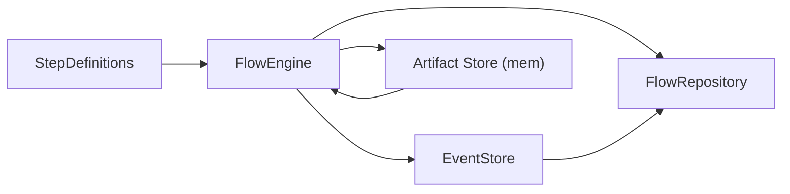
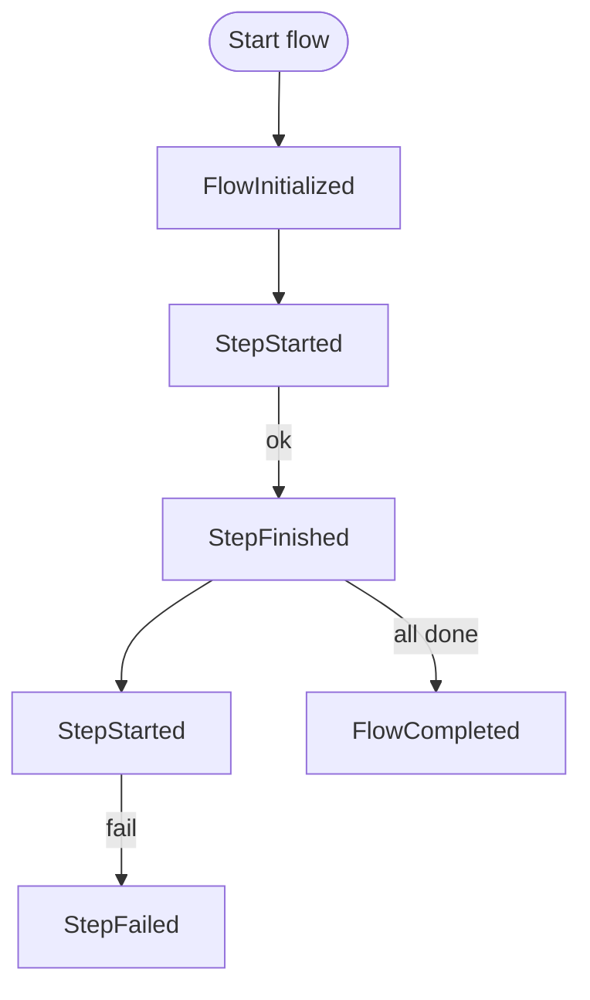

# chem-core

Crate `chem-core` — motor lineal determinista (F2) para orquestación de "flows".

Este README resume el propósito del crate, describe los archivos y módulos
clave, presenta diagramas de arquitectura y flujo, lista dependencias y
explica cómo ejecutar los tests y ejemplos mínimos.

## Objetivo

`chem-core` proporciona una orquestación determinista y neutral (sin
semántica de dominio) para ejecutar flujos compuestos por `Steps`. El motor
emite eventos append-only (`EventStore`), permite reconstruir estado por
replay (`FlowRepository`) y calcula fingerprints deterministas para cada step
para garantizar reproducibilidad.

Principales responsabilidades:

- Inicializar y avanzar ejecuciones step a step.
- Emitir eventos: `FlowInitialized`, `StepStarted`, `StepFinished`,
  `StepFailed`, `StepSignal`, `BranchCreated`, etc.
- Mantener invariantes: append-only, stop-on-failure y determinismo de
  fingerprints.
- Soportar inyección de params determinista (CompositeInjector) y gates
  humanos (estado `AwaitingUserInput`).

## Contrato / "Contract" mínimo

Inputs/outputs principales:

- Input: `FlowDefinition` + `flow_id` (Uuid) + `EventStore` + `FlowRepository`.
- Output: eventos append-only en `EventStore` y estado reconstruible en
  `FlowRepository`.

Errores y modos:

- Errores terminales modelados en `errors::CoreEngineError` (p.ej. `FlowHasFailed`).
- Invariantes violadas devuelven errores explícitos y no mutan el estado.

## Estructura del crate y propósito de archivos

A continuación se listan los módulos/archivos más relevantes y su función:

- `src/lib.rs` — Re-exports y documentación top-level del crate.
- `src/constants.rs` — Constantes del engine (p.ej. `ENGINE_VERSION`) que
  participan en el cálculo de fingerprints.
- `src/engine/mod.rs` — Implementación del `FlowEngine` (orquestación),
  políticas de retry (F7) y funciones como `next_with`, `branch`,
  `last_step_fingerprint`, etc. (punto de integración principal).
- `src/event/types.rs` — Definición de `FlowEventKind` y `FlowEvent`.
  Tipos serializables que representan el log del flow.
- `src/event/store.rs` — Trait `EventStore` y `InMemoryEventStore` (append-only).
- `src/repo/types.rs` — `FlowDefinition`, `FlowInstance`, `StepSlot` y
  `InMemoryFlowRepository` (replay y reconstrucción del estado).
- `src/model/artifact.rs` — `Artifact` neutral: payload JSON + `hash` + metadata.
- `src/model/typed_artifact.rs` — Infraestructura opcional para artifacts tipados
  (`ArtifactSpec`, `TypedArtifact`).
- `src/model/context.rs` — `ExecutionContext` entregado a los steps
  (input único opcional + params canonicalizados).
- `src/model/fingerprint.rs` — `StepFingerprintInput` (shape de datos usado
  para canonicalizar y hashear fingerprints).
- `src/hashing/canonical_json.rs` — Serialización JSON canónica estable.
- `src/hashing/hash.rs` — Helpers de hashing (usa `blake3` internamente).
- `src/step/definition.rs` — Contrato `StepDefinition` (run, id, base_params).
- `src/step/run_result.rs` — `StepRunResult`, `StepSignal` y resultados
  neutros que el engine traduce a eventos.
- `src/step/status.rs` — `StepStatus` (Pending, Running, AwaitingUserInput,...).
- `src/step/typed.rs` y `src/step/pipeline.rs` — Soporte de Steps tipados y
  `Pipe` para construir pipelines con chequeos en tiempo de compilación.
- `src/injection/mod.rs` — `ParamInjector` trait y `CompositeInjector` que
  aplican inyectores en orden determinista (base -> injectors -> overrides -> human).
- `tests/*.rs` — Suite de tests que cubren hashing, branching, inyección,
  gates humanos y comportamiento general del engine.

> Nota: Muchos archivos tienen docstrings en español con la intención de
> explicar invariantes y contratos (buscar `//!` en los fuentes para más
> detalle).

## Diagramas (arquitectura y flujo)

### Diagrama de alto nivel (arquitectura)



### Ciclo de vida simple de un flow (señales principales)



### Ejemplo de fingerprint input (modelo)

- engine_version
- step_id
- input_hashes (ordenadas)
- params (canonical JSON)
- definition_hash

Estos campos se serializan canónicamente (`to_canonical_json`) y luego se
hashean (BLAKE3) para producir el fingerprint string.

## Dependencias conocidas

El crate depende (directa o indirectamente) de crates comunes en Rust:

- serde, serde_json — serialización y manipulación JSON.
- blake3 — hashing rápido y estable usado para fingerprints.
- chrono — timestamps en eventos.
- uuid — identificadores de flows.
- thiserror — definición de errores legibles.

Revisa `Cargo.toml` del crate para la lista completa y versiones exactas.

## Branching (F9) — Lógica y uso

Descripción:

El soporte de branching permite crear una nueva ejecución (rama) a partir de
un flujo existente en un punto concreto (`from_step_id`). La rama es un nuevo
`flow_id` que contiene el historial (eventos) hasta el `StepFinished` del
paso origen. Este diseño permite:

- Reproducir exactamente el estado hasta el punto de bifurcación.
- Ejecutar la rama de forma independiente (posible divergencia posterior).

Invariantes y reglas clave:

- Solo se permite crear un branch desde pasos en estado `FinishedOk`.
- El engine emite un evento `BranchCreated` en el flujo padre con metadatos
  (branch_id, parent_flow_id, root_flow_id, created_from_step_id y
  divergence_params_hash opcional).
- La operación de branch realiza una copia parcial de eventos: toma todos
  los eventos del flujo padre hasta (e incluyendo) el último `StepFinished`
  correspondiente a `from_step_id` y los re-emite (append) en el `EventStore`
  para el nuevo `branch_id`. Esto permite que la rama tenga un registro
  válido para replay hasta ese punto.
- La copia parcial es un snapshot lógico del log, no copia artifacts
  binarios: los artifacts referenciados se mantienen por hash y deben estar
  disponibles (o ser eventualmente re-hydratados por un backend persistente).

Consecuencias operativas:

- Si el backend de `EventStore` es persistente (p.ej. Postgres), la tabla de
  branches (migración `0006_workflow_branches`) debe registrar el mapping
  entre parent y branch, además de `divergence_params_hash` si se provee.
- Al rehidratar el estado de una rama, el `FlowRepository` aplica replay a
  partir de la secuencia copiada (incluida la `FlowInitialized` y los
  `StepFinished` del origen), de modo que `cursor` y `StepSlot` reflejen el
  estado correcto.

Ejemplo de uso (pseudocódigo):

1. Ejecutar flow A hasta completar `step_x`.
2. Llamar a `engine.branch(flow_a, &definition, "step_x", Some(div_hash))`.
3. Obtendrás `branch_id` nuevo. Inspeccionar `engine.events_for(branch_id)` debe
   contener los eventos iniciales hasta `step_x`.
4. Ejecutar `engine.next_with(branch_id, &definition)` para continuar la rama.

Notas de diseño:

- El branch es una operación barata a nivel lógico (append de eventos) y
  mantiene la semántica append-only del `EventStore`.
- El `divergence_params_hash` es una forma estándar de documentar por qué la
  rama difiere (p.ej. cambios en overrides). No entra automáticamente en
  recalculo de fingerprints del motor; si se desea que influya en
  reproducibilidad, debe incorporarse en la creación de nuevos inputs/params
  para los steps subsiguientes.

Archivos relacionados:

- `src/engine/mod.rs` — Implementación de `FlowEngine::branch`, copia parcial
  de eventos y emisión de `BranchCreated`.
- `src/event/types.rs` — Define el evento `BranchCreated`.
- `src/repo/types.rs` — `FlowRepository::load` y `FlowInstance` — cómo se
  aplica replay para reconstruir estado en la rama.

Si quieres, puedo añadir un ejemplo end-to-end (test) que crea un branch y
valida que los eventos del `branch_id` contienen la copia parcial esperada
hasta el `StepFinished` de origen.

## Cómo ejecutar tests y checks (rápido)

En la raíz del workspace (donde se encuentra `Cargo.toml` de workspace):

```bash
# Ejecutar tests sólo para el crate chem-core
cargo test -p chem-core

# Ejecutar lints/format (si el proyecto tiene configuraciones adicionales)
cargo fmt --all
cargo clippy -p chem-core --all-targets -- -D warnings
```

Si trabajas dentro de `crates/chem-core`, los mismos comandos funcionan pero
es conveniente ejecutar desde la raíz del workspace para que cargo resuelva
las dependencias del workspace.

## API pública y puntos de extensión

Resumen de elementos exportados más relevantes (ver `src/lib.rs`):

- FlowEngine: Orquestador principal. Métodos clave: `new_with_stores`,
  `next_with`, `branch`, `last_step_fingerprint`, `events_for`.
- EventStore trait + InMemoryEventStore: Implementación de referencia.
- FlowDefinition / InMemoryFlowRepository: Construcción de flujo y replay.
- Artifact / ArtifactKind / TypedArtifact: Representación de outputs de steps.
- ParamInjector / CompositeInjector: Extensión para inyectar parámetros
  determinísticamente.
- TypedStep / Pipe: API de alto nivel para escribir steps con tipado fuerte.

Extender el motor:

- Implementa `StepDefinition` o `TypedStep` para crear nuevos steps.
- Implementa `ParamInjector` para añadir lógica de inyección de params.
- Provee un `EventStore` alternativo (p.ej. Postgres) implementando el trait
  `EventStore`.

## Invariantes importantes y decisiones de diseño

- Append-only: el `EventStore` es inmutable por diseño; sólo se agregan
  eventos.
- Stop-on-failure: un `StepFailed` detiene la ejecución posterior.
- Determinismo: los fingerprints dependen de inputs canónicos y
  `ENGINE_VERSION`. Cambiar `ENGINE_VERSION` o la serialización altera
  reproducibilidad.
- `CompositeInjector` aplica inyectores en orden fijo y realiza merge
  superficial (shallow) de objetos JSON.

## Tests y calidad

Las pruebas del crate (`crates/chem-core/tests`) cubren:

- Estabilidad del hashing y canonicalización (`hash_helpers.rs`).
- Branching y clon parcial de eventos (`branching_*.rs`).
- Comportamiento de inyectores compuestos (`composite_injector_tests.rs`).
- Escenarios e2e con gates humanos y fingerprint invariance.

Al modificar este crate, correr `cargo test -p chem-core` y observar
fallos en tests relacionados; los mensajes en tests son explícitos acerca
de las invariantes esperadas.

## Ejemplo mínimo de uso

1. Definir steps (implementar `StepDefinition` o usar `TypedStep`).
2. Crear `FlowDefinition` con `build_flow_definition` o `Pipe::build()`.
3. Crear stores: `InMemoryEventStore::default()` y `InMemoryFlowRepository::new()`.
4. Crear engine: `FlowEngine::new_with_stores(ev_store, repo)`.
5. Avanzar el flow con `engine.next_with(flow_id, &definition)` y recuperar
   fingerprints con `engine.last_step_fingerprint(flow_id, step_id)`.

Revisa las pruebas en `crates/chem-core/tests` para ejemplos prácticos de
uso.

## Notas para desarrolladores

- Muchos módulos están documentados en español en los archivos fuente. Leer
  las docstrings (`//!`) es útil para comprender invariantes y contratos.
- Si agregas cambios que afectan la serialización canónica o `ENGINE_VERSION`,
  actualiza los tests que validan fingerprints.
- Prefiere implementar tests unitarios pequeños que verifiquen invariantes
  antes de cambios mayores en el engine.

## Siguientes pasos sugeridos

- Documentar ejemplos de `TypedStep` concretos en `examples/`.
- Añadir un README breve en la carpeta `tests/` mostrando cómo ejecutar y
  entender los tests principales.

---

Archivo generado automáticamente: documentación inicial del crate `chem-core`.

Si deseas, puedo:

- Añadir diagramas más detallados (mermaid) para el `FlowEngine` interno.
- Generar ejemplos de `TypedStep` y un `examples/` runnable.
- Extraer la lista exacta de dependencias desde `Cargo.toml` y añadir versiones.
