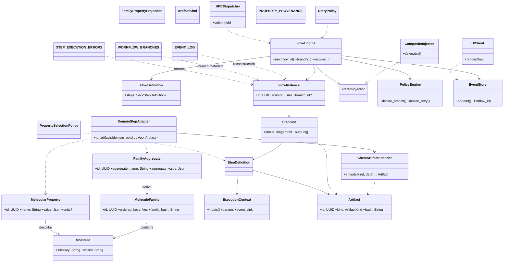

# ChemFlow – Diagramas y Arquitectura

## Índice (Segmento 0–2)

0. Objetivo & Alcance
1. Jerarquía de Dominio (Visión Canon)
2. Principios Arquitectónicos y Capas

---

## 0. Objetivo & Alcance

Establecer un documento fuente único, coherente y exhaustivo para:

1. Modelar entidades químicas y sus artefactos de procesamiento.
2. Definir un motor de ejecución genérico, determinista, reproducible y auditable.
3. Asegurar desacoplamiento total entre Core y semántica química (Anti‑Corrupción).
4. Permitir branching y comparación reproducible (fingerprints + hashes).
5. Garantizar recuperación tras fallo sin pérdida ni corrupción.

KPIs primarios: determinismo, inmutabilidad, trazabilidad, extensibilidad sin ruptura.

## 1. Jerarquía de Dominio (Visión Canon)

Orden lógico y de dependencia (no ciclos):

1. Molecule (átomo de identidad química estable)
2. MoleculeFamily (colección ordenada congelada de moléculas)
3. Molecular Property Value (propiedad puntual por molécula)
4. Family Property (vista / agrupación lógica multi‑proveedor de valores de moléculas – opcional proyección)
5. Family Aggregate (estadístico derivado sobre familia)
6. Domain Artifact (cualquier empaquetado listo para Core)
7. Workflow Step Execution (metadatos de proceso)
8. Event (registro inmutable)

Cada nivel sólo referencia hashes/IDs del inmediatamente inferior → favorece desacoplamiento y caching.

## 2. Principios Arquitectónicos y Capas

| Capa             | Responsabilidad                            | Conoce Química | Mutabilidad                  | Notas                    |
| ---------------- | ------------------------------------------ | -------------- | ---------------------------- | ------------------------ |
| Dominio Químico  | Identidad, relaciones y semántica          | Sí             | Datos inmutables post-freeze | Famílias y moléculas     |
| Adaptación (ACL) | Envolver DomainStep → StepDefinition       | Parcial        | Pura                         | Traduce tipos            |
| Core (Motor)     | Orquestación, eventos, branching, recovery | No             | Estructuras efímeras         | Sólo ArtifactKind + JSON |
| Persistencia     | Guardar ejecuciones / artifacts / eventos  | No             | Append-only (eventos)        | Integridad HASH          |
| Integraciones    | UI, APIs, HPC dispatch, Observabilidad     | Indirecto      | N/A                          | Consumidores de eventos  |

Separación estricta: El Core jamás parsea SMILES ni interpreta units; sólo manipula identificadores y `ArtifactKind`.

### 2.1 Diagrama General de Clases (Panorámico)

