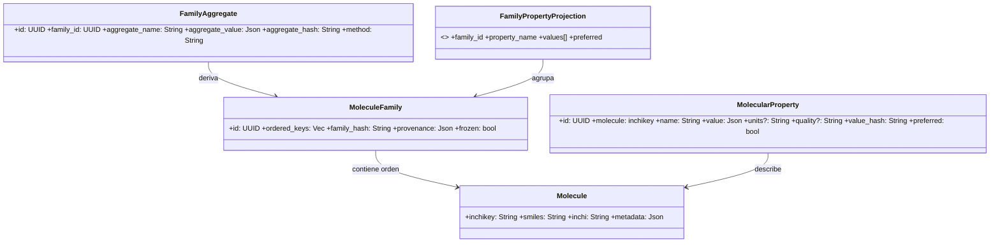
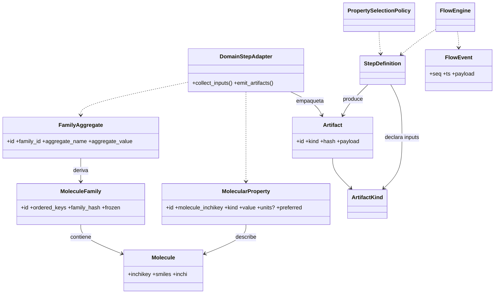

## 3. Modelo de Dominio – Diagramas e Invariantes

### 3.1 Class Diagram (Dominio Puro)



### 3.6 Diagrama de Clases Dominio ↔ Core (Químico → Artefactos)



### 3.2 Invariantes Dominio

| ID   | Invariante             | Descripción                                                                   | Enforcement                              |
| ---- | ---------------------- | ----------------------------------------------------------------------------- | ---------------------------------------- |
| INV1 | inchikey único         | Una molécula por inchikey                                                     | PK MOLECULES                             |
| INV2 | Familia congelada      | No se altera `ordered_keys` tras primer uso como INPUT                        | flag frozen + rechazo mutaciones         |
| INV3 | Hash consistente       | family_hash = hash(ordered_keys normalizado)                                  | Recalcular y comparar antes de persistir |
| INV4 | Propiedad inmutable    | value_hash identifica valor; nunca se edita in situ                           | Insert‑only; cambios = nuevo registro    |
| INV5 | Aggregate determinista | aggregate_hash depende sólo (family_hash, params método)                      | Recomputar y validar colisión            |
| INV6 | preferred único        | A lo sumo un MolecularProperty preferred=(true) por (molecule, property_name) | índice parcial único                     |

### 3.3 Taxonomía de Propiedades Moleculares (Dominio)

Categorías (ejemplos — extensible):

- Fisicoquímicas: LogP, LogD, pKa, LogS (solubilidad), MW, PSA, VolumenMolar, RefraccionMolar.
- Estructurales: RotoresLibres, Polarizabilidad, CargaParcialAtómica.
- Electrónicas: EnergiaHOMO, EnergiaLUMO, EnergiaHidratación.
- Biológicas (predichas): PermeabilidadCaco2, LD50, ToxicidadPredicha.

```rust
#[derive(Clone, Debug, Eq, PartialEq, Hash)]
pub enum MolecularPropertyKind {
	LogP,
	LogD,
	PKa,
	LogS,
	PesoMolecular,
	PSA,
	VolumenMolar,
	RefraccionMolar,
	RotoresLibres,
	Polarizabilidad,
	CargaParcialAtomica,
	EnergiaHOMO,
	EnergiaLUMO,
	EnergiaHidratacion,
	PermeabilidadCaco2,
	LD50,
	ToxicidadPredicha,
}
```

### 3.4 Inmutabilidad y Proveniencia de Propiedades

| Campo                 | Descripción                        | Motivo                 |
| --------------------- | ---------------------------------- | ---------------------- |
| molecule_inchikey     | Identidad molécula                 | Foreign key            |
| property_kind         | Enum estable                       | Consistencia & queries |
| value                 | JSON normalizado                   | Flexibilidad           |
| units                 | Unidades SI/estándar               | Comparabilidad         |
| provider_name/version | Proveniencia exacta                | Reproducibilidad       |
| step_id               | Step que produjo el valor          | Trazabilidad           |
| quality               | Score/confianza                    | Resolución conflictos  |
| preferred             | Selección                          | Fast lookup            |
| value_hash            | Hash(value+units+provider+version) | Inmutabilidad          |

### 3.5 Resolución Multi‑Proveedor

Modelo de política, scoring, evento `PropertyPreferenceAssigned`, rationale JSON y mitigaciones de riesgos (oscilación, empates, unidades, outliers) descritos. Diagrama de secuencia incluido.

Parámetros recomendados para determinismo: providers, selection_policy, weights, freshness_half_life_days, min_quality, aggregate_method (opcional).
