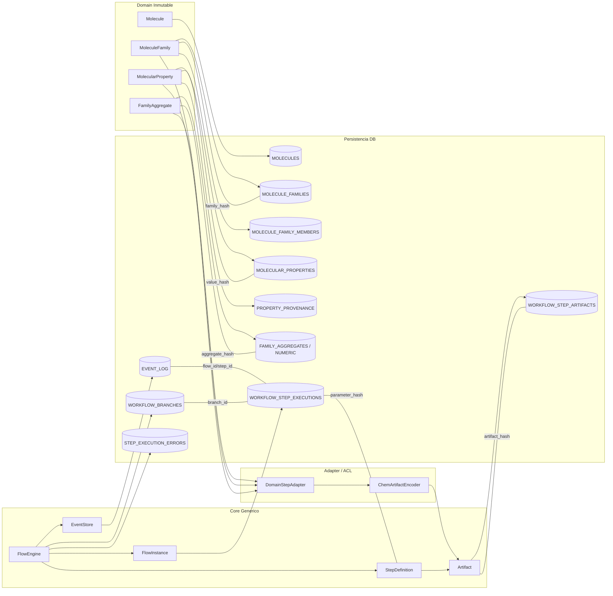

## 4. Mapeo Dominio ↔ Core ↔ Base de Datos

### 4.1 Diagrama de Mapeo

### 4.2 Relación Canónica

| Concepto              | Persistencia                                | Identidad                |
| --------------------- | ------------------------------------------- | ------------------------ |
| Molecule              | MOLECULES.inchikey                          | inchikey                 |
| MoleculeFamily        | MOLECULE_FAMILIES.family_hash               | family_hash              |
| MolecularProperty     | MOLECULAR_PROPERTIES.value_hash             | value_hash               |
| FamilyAggregate       | FAMILY_AGGREGATES.aggregate_hash            | aggregate_hash           |
| Artifact              | WORKFLOW_STEP_ARTIFACTS.artifact_hash       | artifact_hash            |
| Step Execution        | WORKFLOW_STEP_EXECUTIONS.step_id            | step_id                  |
| Parámetros Step       | WORKFLOW_STEP_EXECUTIONS.parameter_hash     | parameter_hash           |
| Evento                | EVENT_LOG.seq                               | seq                      |
| Branch                | WORKFLOW_BRANCHES.branch_id                 | branch_id                |
| Error ejecución       | STEP_EXECUTION_ERRORS(step_id,attempt)      | attempt_number compuesto |
| Preferencia propiedad | MOLECULAR_PROPERTIES.preferred + evento     | preferred=true           |
| Divergencia rama      | WORKFLOW_BRANCHES.divergence_params (+hash) | divergence_params_hash   |

### 4.3 Flujo de Persistencia

1. Congelar dominio (hashes).
2. Adaptar a artifacts neutrales.
3. Ejecutar Step → eventos + artifacts.
4. EVENT_LOG fuente temporal.
5. Branching agrega metadata sin duplicar histórico.
6. Retries agregan intentos inmutables.

### 4.4 Principios de Integridad

- Hash verificado antes de insert.
- Insert-only para datos inmutables.
- Unicidad preferido vía índice parcial.
- Fingerprint recalculable (no autoridad).
- Branch auditable sin copia física.
