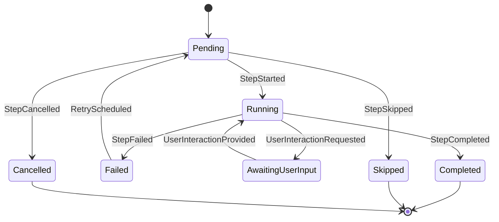
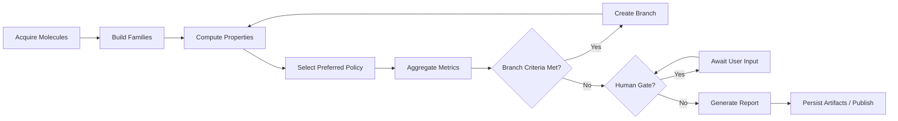

## 5. Motor Genérico (Core) – Clases


### 5.1 Branching + Retry Diagrama


## 6. Ciclo de Vida Step (0–7) + State Machine

Enumeración pasos 0–7 y diagrama de estados:



### 6.1 Flujo End-to-End



## 7. Inyección de Parámetros y Fusión Determinista

Orden:

```
base_params → injectors → user_overrides → human_gate_payload → (runtime_derived fuera fingerprint)
```

Reglas merge: última clave gana; arrays reemplazan salvo estrategia explícita append.

## 8. Eventos Tipados (Event Sourcing)

| Evento                     | Razón               | Clave                            | Productor |
| -------------------------- | ------------------- | -------------------------------- | --------- |
| FlowCreated                | Nueva instancia     | def_hash                         | Engine    |
| StepStarted                | Cambio estado       | step_id,index                    | Engine    |
| StepValidationFailed       | Rechazo             | error                            | Engine    |
| ProviderInvoked            | Observabilidad      | provider_id,version,params_hash  | Step      |
| ArtifactCreated            | Salida              | artifact_id,kind,hash            | Step      |
| StepCompleted              | Exito               | fingerprint                      | Engine    |
| StepFailed                 | Error runtime       | error_class                      | Engine    |
| StepSkipped                | Política            | reason                           | Engine    |
| UserInteractionRequested   | Gate                | schema,correlation_id            | Engine    |
| UserInteractionProvided    | Gate resuelto       | decision_hash                    | Engine    |
| BranchCreated              | Fork                | parent_flow,from_step,child_flow | Engine    |
| RecoveryStarted            | Inicio recovery     | flow_id                          | Engine    |
| RecoveryCompleted          | Fin recovery        | actions                          | Engine    |
| RetryScheduled             | Retry               | retry_count                      | Engine    |
| PropertyPreferenceAssigned | Selección preferida | molecule,property_id             | Dominio   |

## 9. Fingerprint / Reproducibilidad

Composición mínima:  
sorted(input_hashes) + canonical_json(params_sin_runtime) + step_kind + internal_version + provider_matrix_sorted + schema_version + deterministic_flag (+seed).

Usos: caching, comparación ramas, auditoría divergencias, invalidación selectiva.
