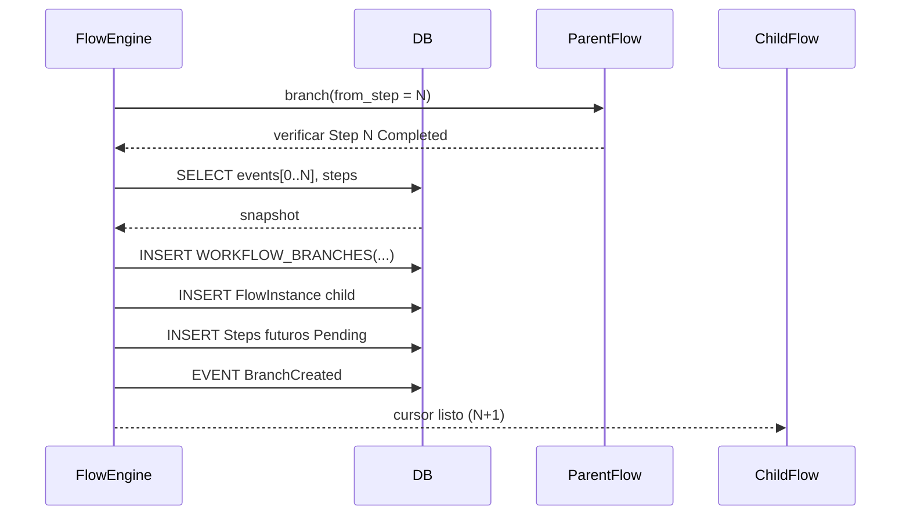

## 10. Branching Determinista

Condiciones: parámetros divergentes, entradas divergentes, política exploratoria.

### 10.1 Modelo de Datos Branching

Relación padre→hijo usando branch_id, root_flow_id, parent_flow_id, created_from_step_id.

```
ROOT FLOW (branch_id = B0)
  Step 0 ... Step N
        | branch(from_step=N)
        v
CHILD FLOW (branch_id = B1, parent_flow_id = root_flow_id, created_from_step_id = Step N)
```

### 10.2 Secuencia Creación Rama



Evento BranchCreated: branch_id, parent_flow_id, root_flow_id, created_from_step_id, divergence_params_hash.

## 11. Retry / Skips / Human Gate

| Caso             | Transición                | Notas                           |
| ---------------- | ------------------------- | ------------------------------- |
| Error validación | Pending→Failed            | No run                          |
| Error runtime    | Running→Failed            | Artifacts parciales descartados |
| Retry manual     | Failed→Pending            | Nuevo intento                   |
| Skip política    | Pending→Skipped           | Evento StepSkipped              |
| Gate humano      | Running→AwaitingUserInput | Cursor detenido                 |
| Input humano     | AwaitingUserInput→Running | Continúa                        |

### 11.1 Modelo Reintentos

Campos: retry_count, max_retries + tabla STEP_EXECUTION_ERRORS (error_id, attempt_number, error_class, transient, details JSONB).

Beneficios: auditoría, métricas MTTR/MTBF, políticas inteligentes.
