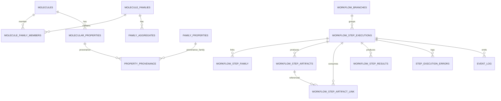

## 12. Base de Datos – Esquema Normalizado

Tablas completas (campos) reproducidas igual al original (MOLECULES ... EVENT_LOG).

### 12.1 Estandarización de Nombres

| Anterior                      | Nuevo                    | Acción          |
| ----------------------------- | ------------------------ | --------------- |
| MOLECULAR_PROPERTY_PROVENANCE | PROPERTY_PROVENANCE      | Alias migración |
| FamilyPropertyProjection      | FAMILY_PROPERTIES        | Materialización |
| FAMILY_AGGREGATES genérico    | FAMILY_AGGREGATE_NUMERIC | Normalización   |

### 12.2 Normalización Agregados

Dual: JSONB (compatibilidad) + tablas especializadas (numéricos).

### 12.3 Branching – WORKFLOW_BRANCHES

Campos: branch_id, root_flow_id, parent_flow_id, created_from_step_id, divergence_params, reason.

### 12.4 Retries

retry_count, max_retries.

### 12.5 STEP_EXECUTION_ERRORS

Historial granular (attempt_number, transient, clasificación).

### 12.6 Consultas Ejemplo

Incluye SQL para errores transitorios, ramas y comparación parameter_hash.

## 13. Índices y Rendimiento

### 13.1 Objetivos

p95 < 50ms lecturas críticas, escalabilidad lineal, replay eficiente.

### 13.2 Principios

Índices sólo para queries recurrentes, parciales, evitar duplicidad hash/PK, JSONB GIN selectivo.

### 13.3 SQL Índices Recomendados

(Se reproduce bloque SQL completo original con CREATE INDEX ...)

### 13.4 Patrones Acceso

Tabla de casos de uso vs índices.

### 13.5 Índices Parciales

preferred=true, status='Pending'.

### 13.6 GIN / JSONB Criterios

Sólo si patrones `parameters ?` / `@>` observados.

### 13.7 Mantenimiento

Monitoreo: pg_stat_statements, auto_explain, autovacuum tuning, bloat, idx_scan ratio.

### 13.8 Evolución

Particionado EVENT_LOG, bloom filter, índices compuestos adicionales condicionales.

### 13.9 Anti‑Patrones Evitados

Lista (índices poco selectivos, GIN indiscriminado, etc.)

### 13.10 Checklist Mensual

Top queries, idx_scan/seq_scan, crecimiento, índices sin uso, bloat, nuevas políticas.

### 13.11 Sistema Base

PostgreSQL 15, extensiones sugeridas.

### 13.12 Métricas

Tabla de métricas exportables.

### 13.13 Resumen Ejecutivo

Optimización enfocada en lookup determinista, scheduling, replay, preferidos.

## 14. Recuperación (Recovery) y Consistencia

Algoritmo: cargar ejecuciones → marcar Running huérfanas → reconstruir cache → validar hashes → localizar Pending → continuar. Eventos RecoveryStarted / RecoveryCompleted.
