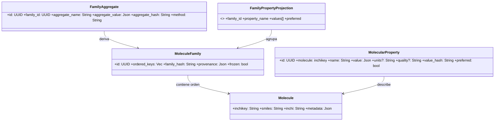

<div align="center">

# ChemFlow – Diagramas y Arquitectura

</div>

## Índice

0. Objetivo & Alcance
1. Jerarquía de Dominio (Visión Canon)
2. Principios Arquitectónicos y Capas
3. Modelo de Dominio – Diagramas e Invariantes
4. Mapeo Dominio ↔ Core ↔ Base de Datos
5. Motor Genérico (Core) – Clases
6. Ciclo de Vida de un Step (0–7) + State Machine
7. Inyección de Parámetros y Fusión Determinista
8. Eventos Tipados (Event Sourcing)
9. Fingerprint / Reproducibilidad (Profundizado)
10. Branching Determinista y Criterios
11. Retry, Skips, Human Gate (Políticas)
12. Base de Datos – Esquema Normalizado
13. Índices y Consideraciones de Rendimiento
14. Recuperación (Recovery) y Consistencia
15. Creación de un Step Completo (Ejemplo Canon)
16. Providers / Adaptadores y Desacoplamientolas estructuras de datos principales para representar las cosas quimicas en el archivo src/main de Rust llamare a estas estructuras Domain Molecule, MoleculeFamily, MolecularProperty para representar las cosas quimicas en el dominio de la aplicacion el dominio se creara en crates/chem-domain
Molecule, Mo
17. Definiciones Formales (Tablas Resumen)
18. Anti‑Patrones y Riesgos
19. Ejemplo End‑To‑End (Resumen)
20. Auditoría y Trazabilidad Completa
21. Evolución / Versionado
22. Extensiones Futuras Seguras
23. Organización de Carpetas (Propuesta Rust – Versión Ampliada)
24. Orden de Creación de Componentes (Secuencia Recomendada)

---

## 0. Objetivo & Alcance

Establecer un documento fuente único, coherente y exhaustivo para:

1. Modelar entidades químicas y sus artefactos de procesamiento.
2. Definir un motor de ejecución genérico, determinista, reproducible y auditable.
3. Asegurar desacoplamiento total entre Core y semántica química (Anti‑Corrupción).
4. Permitir branching y comparación reproducible (fingerprints + hashes).
5. Garantizar recuperación tras fallo sin pérdida ni corrupción.

KPIs primarios: determinismo, inmutabilidad, trazabilidad, extensibilidad sin ruptura.

## 1. Jerarquía de Dominio (Visión Canon)

Orden lógico y de dependencia (no ciclos):

1. Molecule (átomo de identidad química estable)
2. MoleculeFamily (colección ordenada congelada de moléculas)
3. Molecular Property Value (propiedad puntual por molécula)
4. Family Property (vista / agrupación lógica multi‑proveedor de valores de moléculas – opcional proyección)
5. Family Aggregate (estadístico derivado sobre familia)
6. Domain Artifact (cualquier empaquetado listo para Core)
7. Workflow Step Execution (metadatos de proceso)
8. Event (registro inmutable)

Cada nivel sólo referencia hashes/IDs del inmediatamente inferior → favorece desacoplamiento y caching.

## 2. Principios Arquitectónicos y Capas

| Capa             | Responsabilidad                            | Conoce Química | Mutabilidad                  | Notas                    |
| ---------------- | ------------------------------------------ | -------------- | ---------------------------- | ------------------------ |
| Dominio Químico  | Identidad, relaciones y semántica          | Sí             | Datos inmutables post-freeze | Famílias y moléculas     |
| Adaptación (ACL) | Envolver DomainStep → StepDefinition       | Parcial        | Pura                         | Traduce tipos            |
| Core (Motor)     | Orquestación, eventos, branching, recovery | No             | Estructuras efímeras         | Sólo ArtifactKind + JSON |
| Persistencia     | Guardar ejecuciones / artifacts / eventos  | No             | Append-only (eventos)        | Integridad HASH          |
| Integraciones    | UI, APIs, HPC dispatch, Observabilidad     | Indirecto      | N/A                          | Consumidores de eventos  |

Separación estricta: El Core jamás parsea SMILES ni interpreta units; sólo manipula identificadores y `ArtifactKind`.

### 2.1 Diagrama General de Clases (Panorámico)

Visión unificada: Dominio Químico ↔ Adaptación ↔ Core ↔ Persistencia ↔ Integraciones.


## 3. Modelo de Dominio – Diagramas e Invariantes

### 3.1 Class Diagram (Dominio Puro)



### 3.6 Diagrama de Clases Dominio ↔ Core (Químico → Artefactos)

Muestra cómo entidades químicas se encapsulan en artifacts neutrales para el Core.


### 3.2 Invariantes Dominio

| ID   | Invariante             | Descripción                                                                   | Enforcement                              |
| ---- | ---------------------- | ----------------------------------------------------------------------------- | ---------------------------------------- |
| INV1 | inchikey único         | Una molécula por inchikey                                                     | PK MOLECULES                             |
| INV2 | Familia congelada      | No se altera `ordered_keys` tras primer uso como INPUT                        | flag frozen + rechazo mutaciones         |
| INV3 | Hash consistente       | family_hash = hash(ordered_keys normalizado)                                  | Recalcular y comparar antes de persistir |
| INV4 | Propiedad inmutable    | value_hash identifica valor; nunca se edita in situ                           | Insert‑only; cambios = nuevo registro    |
| INV5 | Aggregate determinista | aggregate_hash depende sólo (family_hash, params método)                      | Recomputar y validar colisión            |
| INV6 | preferred único        | A lo sumo un MolecularProperty preferred=(true) por (molecule, property_name) | índice parcial único                     |

### 3.3 Taxonomía de Propiedades Moleculares (Dominio)

Las propiedades listadas NO pertenecen al Core; son semántica de dominio. Se tipifican para:

1. Validación fuerte (evitar strings arbitrarios).
2. Homogeneizar unidades y comparabilidad multi‑proveedor.
3. Soportar políticas de preferencia y agregación.

Categorías (ejemplos — extensible):

- Fisicoquímicas: LogP, LogD, pKa, LogS (solubilidad), MW, PSA, VolumenMolar, RefraccionMolar.
- Estructurales: RotoresLibres, Polarizabilidad, CargaParcialAtómica.
- Electrónicas: EnergiaHOMO, EnergiaLUMO, EnergiaHidratación.
- Biológicas (predichas): PermeabilidadCaco2, LD50, ToxicidadPredicha.

Representación sugerida (enum dominio):

```rust
#[derive(Clone, Debug, Eq, PartialEq, Hash)]
pub enum MolecularPropertyKind {
    LogP,
    LogD,
    PKa,
    LogS,
    PesoMolecular,
    PSA,
    VolumenMolar,
    RefraccionMolar,
    RotoresLibres,
    Polarizabilidad,
    CargaParcialAtomica,
    EnergiaHOMO,
    EnergiaLUMO,
    EnergiaHidratacion,
    PermeabilidadCaco2,
    LD50,
    ToxicidadPredicha,
    // Extensible; agregar variantes mantiene compatibilidad si se serializa por nombre estable
}
```

### 3.4 Inmutabilidad y Proveniencia de Propiedades

Cada medición (valor de propiedad) es inmutable. Si un proveedor recalcula se inserta NUEVO registro con nuevo `value_hash`. Campos mínimos por valor:

| Campo                 | Descripción                                       | Motivo                   |
| --------------------- | ------------------------------------------------- | ------------------------ |
| molecule_inchikey     | Identidad molécula                                | Foreign key              |
| property_kind         | Enum estable                                      | Consistencia & queries   |
| value                 | JSON normalizado (numérico, objeto, distribución) | Flexibilidad             |
| units                 | Unidades SI/estándar canónicas                    | Comparabilidad           |
| provider_name/version | Proveniencia exacta                               | Reproducibilidad         |
| step_id               | Step que produjo el valor                         | Trazabilidad a ejecución |
| quality               | Métrica opcional (score/confianza)                | Resolución de conflictos |
| preferred (bool)      | Marcador de selección                             | Fast lookup              |
| value_hash            | Hash(value + units + provider + version)          | Inmutabilidad            |

Preferred se asigna por política (evento `PropertyPreferenceAssigned`), nunca mutando el valor; se actualiza bandera o tabla de proyección.

### 3.5 Resolución Multi‑Proveedor (Conflict Resolution)

Problema: múltiples proveedores pueden devolver la MISMA propiedad (p.ej. LogS) para la misma molécula con diferencias (modelo, precisión, condiciones experimentales). Necesitamos elegir (o mantener varias) consistentemente.

Estrategia en capas:

1. Ingesta: todos los valores se almacenan (insert-only).
2. Normalización: unidades convertidas a canonical antes de hash.
3. Scoring: se calcula score = f(provider_reliability, quality_flag, data_freshness, model_version_rank).
4. Selección: política configurable (max score, prefer lista ordenada, consenso, agregación estadística).
5. Emisión evento: `PropertyPreferenceAssigned` (molecule, property_kind, chosen_value_id, rationale_hash).

Modelo de Política:

```rust
pub trait PropertySelectionPolicy {
    fn choose(&self, candidates: &[PropertyCandidate]) -> SelectionOutcome;
}

pub struct PropertyCandidate<'a> {
    pub value_id: Uuid,
    pub provider: &'a str,
    pub version: &'a str,
    pub quality: Option<f64>,
    pub timestamp: chrono::DateTime<chrono::Utc>,
    pub value: &'a serde_json::Value,
}

pub enum SelectionOutcome {
    Chosen { value_id: Uuid, score: f64, rationale: serde_json::Value },
    Tie(Vec<Uuid>),          // puede disparar estrategia secundaria
    Aggregate { value_id: Uuid, method: String }, // p.ej. promedio z-normalizado
}
```

Algoritmo de ejemplo (MaxScoreFallback):

```text
score = w_quality * quality_norm + w_freshness * recency_norm + w_provider * provider_weight(provider)
Seleccionar mayor score;
En caso de empate: prefer provider en lista blanca > menor version_gap > hash lexicográfico.
```

Diagrama de secuencia (selección en Step de propiedades):


Persistencia de la elección:

1. Flag `preferred=true` en el valor elegido (índice parcial único asegura unicidad).
2. Evento con rationale (JSON) → permite auditar por qué se eligió.

Rationale sugerido:

```json
{
  "policy": "max_score",
  "weights": { "quality": 0.5, "freshness": 0.3, "provider": 0.2 },
  "candidates_eval": [
    { "value_id": "...", "score": 0.91, "provider": "ProvA", "quality": 0.95 },
    { "value_id": "...", "score": 0.82, "provider": "ProvB", "quality": 0.89 }
  ]
}
```

#### Consideraciones de Integridad

| Riesgo                                           | Mitigación                                                              |
| ------------------------------------------------ | ----------------------------------------------------------------------- |
| Oscilación de preferido por re‑ingesta frecuente | Versionar política y recalcular sólo si nuevo score supera umbral delta |
| Empate repetido                                  | Registrar tie estable (hash lista ordenada) para evitar re‑emisión      |
| Inconsistencia unidades                          | Conversión a canonical antes de hashing y scoring                       |
| Proveedor con outliers                           | Cap de score + trimming al calcular agregados                           |

#### Relación con Core

El Core sólo ve artifacts y eventos. La resolución multi‑proveedor:

- Se ejecuta dentro del Step de dominio (antes de emitir ArtifactCreated final si se produce proyección/aggregate).
- Emite evento neutral (`PropertyPreferenceAssigned`) sin semántica química para el Core.
- No altera fingerprint salvo que política (cuyos parámetros) formen parte explícita de los parámetros del Step (recomendado) → reproducibilidad.

#### Parámetros Recomendados para el Step de Propiedades

| Parámetro                | Tipo             | Uso en Fingerprint | Descripción                                                 |
| ------------------------ | ---------------- | ------------------ | ----------------------------------------------------------- |
| providers                | Lista de cadenas | Sí                 | Proveedores a invocar (orden = prioridad base)              |
| selection_policy         | String           | Sí                 | Identificador de política (max_score, consensus, aggregate) |
| weights                  | JSON             | Sí                 | Pesos de scoring (quality, freshness, provider)             |
| freshness_half_life_days | f64              | Sí                 | Normalización recency                                       |
| min_quality              | f64              | Sí                 | Filtro de descarte temprano                                 |
| aggregate_method         | String?          | Sí (si usado)      | mean_zscore / median / trimmed_mean                         |

Al incluirlos en fingerprint se garantiza que un cambio de política induce divergencia rastreable (branch potencial).

---

## 4. Mapeo Dominio ↔ Core ↔ Base de Datos

### 4.1 Diagrama de Mapeo (Capas y Referencias Canónicas)


### 4.2 Relación Canónica (Resumen Conceptual)

| Dominio / Core Concepto        | Persistencia (Tabla / Campo)                                 | Clave de Inmutabilidad / Identidad            |
| ------------------------------ | ------------------------------------------------------------ | --------------------------------------------- |
| Molecule                       | MOLECULES.inchikey (PK)                                      | inchikey                                      |
| MoleculeFamily                 | MOLECULE_FAMILIES.id + family_hash                           | family_hash (derivado ordered_keys)           |
| Miembros de familia            | MOLECULE_FAMILY_MEMBERS(family_id, position)                 | (family_id, position)                         |
| MolecularProperty (valor)      | MOLECULAR_PROPERTIES.id + value_hash                         | value_hash (value+units+provider+version)     |
| Proveniencia propiedad         | PROPERTY_PROVENANCE.molecular_property_id / step_id          | (provenance_id)                               |
| FamilyAggregate                | FAMILY_AGGREGATES.aggregate_hash                             | aggregate_hash                                |
| Artifact (Core)                | WORKFLOW_STEP_ARTIFACTS.artifact_hash                        | artifact_hash                                 |
| Step Execution                 | WORKFLOW_STEP_EXECUTIONS.step_id                             | step_id (UUID)                                |
| Parámetros Step (canónicos)    | WORKFLOW_STEP_EXECUTIONS.parameter_hash                      | parameter_hash (canonical_json)               |
| Fingerprint Step               | (No columna dedicada; incluido en eventos / caching externo) | fingerprint (derivado)                        |
| Evento tipado                  | EVENT_LOG.seq (orden), event_type                            | seq (monótono)                                |
| Branch                         | WORKFLOW_BRANCHES.branch_id                                  | branch_id                                     |
| Asociación rama ↔ ejecución    | WORKFLOW_STEP_EXECUTIONS.branch_id                           | (branch_id, step_id)                          |
| Error de ejecución             | STEP_EXECUTION_ERRORS(attempt_number, step_id)               | (step_id, attempt_number)                     |
| Selección preferida propiedad  | MOLECULAR_PROPERTIES.preferred (índice parcial) + evento     | preferred=true + evento rationale             |
| Divergencia de parámetros rama | WORKFLOW_BRANCHES.divergence_params (hash externo en evento) | divergence_params_hash (evento BranchCreated) |

### 4.3 Flujo de Persistencia (Secuencia Lógica)

1. Dominio crea / congela identidad (familia, propiedades) → hashes calculados.
2. Adaptador empaqueta en artifacts neutrales (hash determinista payload).
3. Core ejecuta Step → emite eventos → registra artifacts y ejecución.
4. EVENT_LOG actúa como fuente de verdad temporal (replay); tablas derivadas reflejan proyecciones estructuradas.
5. Branching agrega metadatos (WORKFLOW_BRANCHES) sin duplicar histórico previo.
6. Retries añaden intentos (STEP_EXECUTION_ERRORS) manteniendo inmutabilidad de ejecuciones previas.

### 4.4 Principios de Integridad Aplicados

- Hashes verificables antes de insert (familia, propiedad, aggregate, artifact).
- Insert‑only para datos inmutables; mutaciones = nuevos registros (propiedades, artifacts).
- Unicidad preferido garantizada por índice parcial + evento justificante.
- Fingerprint nunca se persiste como autoridad única (se recalcula y valida).
- Divergencia de ramas auditable sin copia física de artifacts previos (referencias por hash).

## 5. Motor Genérico (Core) – Clases


### 5.1 Diagrama de Clases del Motor de Flujo (Branching + Retry)

Incluye elementos extendidos: Branching, Retries y Registro de Errores.


## 6. Ciclo de Vida Step (0–7) + State Machine

0. Localizar índice `cursor`.
1. Validar precondiciones (previo completado, inputs disponibles).
2. Recolectar inputs por `ArtifactKind` (hash lookup).
3. Inyección parámetros (CompositeInjector).
4. Fusión + validación (`validate_params`).
5. Emisión `StepStarted` → estado Running.
6. `run(ctx)` → genera artifacts / error.
7. Registrar `ArtifactCreated*` y `StepCompleted` o `StepFailed`.


### 6.1 Diagrama de Flujo General End‑to‑End

Visión macro de un pipeline típico incluyendo branching y gates.


## 7. Inyección de Parámetros y Fusión Determinista

Orden estable (afecta reproducibilidad):

```text
merged = canonical_merge(
    base_params,
    injector_chain(flow,i),
    user_overrides?,
    human_gate_payload?,
    // runtime_derived  (NO entra en fingerprint)
)
```

Reglas de merge: última clave gana, arrays reemplazan (no concatenan) salvo que se marque `merge_strategy="append"` en metadata.

## 8. Eventos Tipados (Event Sourcing)

| Evento                     | Razón               | Payload Clave                              | Productor |
| -------------------------- | ------------------- | ------------------------------------------ | --------- |
| FlowCreated                | Nueva instancia     | flow_id, def_hash                          | Engine    |
| StepStarted                | Cambio estado       | step_id, index                             | Engine    |
| StepValidationFailed       | Rechazo temprano    | step_id, error                             | Engine    |
| ProviderInvoked            | Observabilidad      | step_id, provider_id, version, params_hash | Step      |
| ArtifactCreated            | Registro salida     | step_id, artifact_id, kind, hash           | Step      |
| StepCompleted              | Cierre exitoso      | step_id, fingerprint                       | Engine    |
| StepFailed                 | Error runtime       | step_id, error_class                       | Engine    |
| StepSkipped                | Política skip       | step_id, reason                            | Engine    |
| UserInteractionRequested   | Gate humano         | step_id, schema, correlation_id            | Engine    |
| UserInteractionProvided    | Gate resuelto       | step_id, decision_hash                     | Engine    |
| BranchCreated              | Fork reproducible   | parent_flow, from_step, child_flow         | Engine    |
| RecoveryStarted            | Inicio recovery     | flow_id                                    | Engine    |
| RecoveryCompleted          | Fin recovery        | flow_id, actions                           | Engine    |
| RetryScheduled             | Retry programado    | step_id, retry_count                       | Engine    |
| PropertyPreferenceAssigned | Selección preferida | molecule, property_name, property_id       | Dominio   |

Todos ordenados por `seq` monotónico. No se reescriben ni borran.

## 9. Fingerprint / Reproducibilidad (Profundizado)

Composición mínima: sorted(hashes inputs) + canonical_json(params_sin_runtime) + step_kind + internal_version + provider_matrix_sorted + schema_version + deterministic_flag (+ seed).  
Uso: (a) caching, (b) comparación de ramas, (c) auditoría divergencias, (d) invalidación selectiva.

## 10. Branching Determinista

Condiciones recomendadas (cualquiera): parámetro divergente, entradas divergentes, política exploratoria. Artefacts previos se referencian (no se copian). Fingerprint base sirve para detectar convergencia (deduplicación potencial futura).

### 10.1 Modelo de Datos de Branching (Extensión)

Para clarificar la relación padre→hijo en la base de datos se introducen los siguientes conceptos/columnas:

- `branch_id (UUID)`: Identificador lógico de la rama a la que pertenecen todas las ejecuciones (steps) de un flujo derivado. Todas las ejecuciones en la rama comparten el mismo `branch_id`.
- `root_execution_id (UUID)`: Ya existente; referencia a la primera ejecución (step) raíz del flujo original del que derivan todas las ramas. Permite agrupar historiales completos multi‑branch.
- `parent_step_id (UUID)`: Ya existente; señala el step concreto a partir del cual se generó la rama (en el flujo padre). Si el step de origen es el N, el primer step de la rama normalmente inicia en N+1 o redefine la secuencia restante.
- Tabla `WORKFLOW_BRANCHES`: Metadata de la rama (nombre, timestamps, justificación, parámetros divergentes). Abstrae la creación y facilita auditoría.

Relación:

```
ROOT FLOW (branch_id = B0)
    Step 0 ... Step N  (último común)
            | branch(from_step=N)
            v
CHILD FLOW (branch_id = B1, parent_flow_id = root_flow_id, created_from_step_id = Step N)
```

Rehidratación: para reconstruir una rama basta cargar `WORKFLOW_BRANCHES` y luego filtrar `WORKFLOW_STEP_EXECUTIONS` por `branch_id` ordenando por `seq` de eventos.

### 10.2 Secuencia de Creación de Rama (Actualizado)


El evento `BranchCreated` ahora incluye explícitamente: `branch_id`, `parent_flow_id`, `root_flow_id`, `created_from_step_id`, `divergence_params_hash` para auditoría mínima sin volcar JSON completo (este último derivado de `divergence_params`).

## 11. Retry / Skips / Human Gate

| Caso             | Transición                | Notas                                      |
| ---------------- | ------------------------- | ------------------------------------------ |
| Error validación | Pending→Failed            | No ejecuta run                             |
| Error runtime    | Running→Failed            | Conserva artifacts parciales descartados   |
| Retry manual     | Failed→Pending            | Nuevo StepStarted crea historial adicional |
| Skip política    | Pending→Skipped           | Emite StepSkipped                          |
| Gate humano      | Running→AwaitingUserInput | Suspende avance cursor                     |
| Input humano     | AwaitingUserInput→Running | Reanuda run (o finaliza)                   |

### 11.1 Extensión de Modelo para Reintentos

Se añaden campos a `WORKFLOW_STEP_EXECUTIONS`:

- `retry_count INT NOT NULL DEFAULT 0` – número de reintentos consumidos.
- `max_retries INT NULL` – política establecida para ese step (nullable si ilimitado/externo).

Nueva tabla `STEP_EXECUTION_ERRORS` para registrar cada fallo (incluye validaciones y runtime) sin sobre‑escribir datos previos:

| Campo          | Tipo        | Descripción                                 |
| -------------- | ----------- | ------------------------------------------- |
| error_id       | UUID PK     | Identidad del registro de error             |
| step_id        | UUID FK     | Referencia a WORKFLOW_STEP_EXECUTIONS       |
| attempt_number | INT         | 0 = intento original, >0 reintentos         |
| ts             | TIMESTAMPTZ | Timestamp del error                         |
| error_class    | TEXT        | Clasificación (Validation, Runtime, Policy) |
| error_code     | TEXT        | Código programático opcional                |
| message        | TEXT        | Mensaje corto                               |
| details        | JSONB       | Stack / payload estructurado                |
| transient      | BOOLEAN     | Sugerencia de elegibilidad a retry          |

Beneficios: auditoría precisa, métricas MTTR/MTBF y selección inteligente de políticas de retry.

## 12. Base de Datos – Esquema Normalizado


### 12.1 Estandarización de Nombres (Consistencia)

Inconsistencias identificadas y resolución:

| Anterior                              | Nuevo Estándar                                    | Acción                        |
| ------------------------------------- | ------------------------------------------------- | ----------------------------- |
| MOLECULAR_PROPERTY_PROVENANCE         | PROPERTY_PROVENANCE                               | Renombrado (alias de compat.) |
| (Proyección) FamilyPropertyProjection | FAMILY_PROPERTIES                                 | Materialización opcional      |
| FAMILY_AGGREGATES (JSONB genérico)    | FAMILY_AGGREGATE_NUMERIC (y otras especializadas) | Se añaden tablas normalizadas |

`MOLECULAR_PROPERTY_PROVENANCE` se mantiene como alias interno sólo para migraciones; toda documentación nueva usa `PROPERTY_PROVENANCE`.

### 12.2 Normalización de Agregados

Razón: `aggregate_value JSONB` puede introducir heterogeneidad (tipos numéricos vs distribuciones). Estrategia híbrida:

1. Mantener `FAMILY_AGGREGATES` (compatibilidad / agregados complejos no tabulares).
2. Añadir tablas especializadas por tipo dominante:
   - `FAMILY_AGGREGATE_NUMERIC`: valores escalares (media, mediana, desviación, conteos normalizados).
   - Futuro: `FAMILY_AGGREGATE_DISTRIBUTION` (p.ej. histogramas con bins normalizados) si se requiere.

Beneficios: índices específicos, consultas más eficientes, constraints de tipo y menor ambigüedad semántica.

### 12.3 Branching – Tabla `WORKFLOW_BRANCHES`

Campos clave:

| Campo                | Descripción                                     |
| -------------------- | ----------------------------------------------- |
| branch_id            | Identificador único de la rama                  |
| root_flow_id         | Flujo original (rama raíz)                      |
| parent_flow_id       | Flujo padre inmediato (NULL si raíz)            |
| created_from_step_id | Step del padre donde se hizo el fork            |
| divergence_params    | JSON con parámetros cambiados respecto al padre |
| reason               | Texto libre / etiqueta (exploración, fix, tune) |

### 12.4 Retries – Campos en `WORKFLOW_STEP_EXECUTIONS`

`retry_count` aumenta en cada transición Failed→Pending. `max_retries` permite a un PolicyEngine decidir corte; si se excede, estado final = Failed (terminal) y se produce evento `RetryScheduled` sólo mientras `retry_count < max_retries`.

### 12.5 Registro de Errores – `STEP_EXECUTION_ERRORS`

Cada error se inserta con `attempt_number` correlacionado; esto permite reconstruir timeline exacto y analizar patrones de fallos intermitentes.

### 12.6 Consultas Ejemplo

Obtener últimos errores transitorios antes de un retry:

```sql
SELECT * FROM STEP_EXECUTION_ERRORS
WHERE step_id = $1 AND transient = true
ORDER BY attempt_number DESC LIMIT 3;
```

Recuperar todas las ramas divergentes desde un flow raíz:

```sql
SELECT b.branch_id, b.reason, count(se.step_id) AS steps
FROM WORKFLOW_BRANCHES b
LEFT JOIN WORKFLOW_STEP_EXECUTIONS se ON se.branch_id = b.branch_id
WHERE b.root_flow_id = $1
GROUP BY b.branch_id, b.reason;
```

Fingerprint comparativo entre ramas (inputs idénticos, params divergentes):

```sql
SELECT se.branch_id, se.step_id, se.parameter_hash, se.status
FROM WORKFLOW_STEP_EXECUTIONS se
WHERE se.root_execution_id = $1 AND se.status = 'Completed';
```

## 13. Índices y Consideraciones de Rendimiento

### 13.1 Objetivos

- Latencia p95 < 50ms para lecturas críticas (status de flujo, propiedades preferidas).
- Escalabilidad lineal en EVENT_LOG y MOLECULAR_PROPERTIES sin degradación >20% al duplicar volumen.
- Minimizar writes amplificados (índices estrictamente necesarios).
- Habilitar replay rápido (< N log(steps)) apoyado en índices secuenciales.

### 13.2 Principios de Indexación

| Principio                        | Aplicación                                                               |
| -------------------------------- | ------------------------------------------------------------------------ |
| Índice sólo si query recurrente  | Se evita “por si acaso” (auditar con pg_stat_statements)                 |
| Clave estrecha primero           | Columnas de alta selectividad al inicio (ej: molecule_inchikey)          |
| Parciales para filtros fijos     | preferred=true, status='Pending'                                         |
| Covering (INCLUDE)               | Evitar lookups adicionales cuando se lee sólo un subconjunto             |
| JSONB: GIN sólo si necesario     | Campos JSONB grandes (parameters, aggregation) accedidos por clave → GIN |
| Secuencia → BTREE / BRIN híbrido | EVENT_LOG.seq (BTREE), ts BRIN si partición temporal futura              |
| Evitar duplicidad semántica      | No indexar hash y PK si PK ya contiene hash (salvo consultas frecuentes) |

### 13.3 Índices Recomendados (SQL Propuesto)

```sql
-- MOLECULES
CREATE UNIQUE INDEX IF NOT EXISTS uq_molecules_inchikey ON MOLECULES(inchikey);

-- MOLECULE_FAMILIES
CREATE UNIQUE INDEX IF NOT EXISTS uq_families_family_hash ON MOLECULE_FAMILIES(family_hash);
CREATE INDEX IF NOT EXISTS ix_families_frozen ON MOLECULE_FAMILIES(frozen);

-- MOLECULE_FAMILY_MEMBERS (acceso ordenado)
CREATE UNIQUE INDEX IF NOT EXISTS uq_family_members_order ON MOLECULE_FAMILY_MEMBERS(family_id, position);
CREATE INDEX IF NOT EXISTS ix_family_members_molecule ON MOLECULE_FAMILY_MEMBERS(molecule_inchikey);

-- MOLECULAR_PROPERTIES (búsqueda por molécula + propiedad + preferido)
CREATE INDEX IF NOT EXISTS ix_properties_lookup
  ON MOLECULAR_PROPERTIES(molecule_inchikey, property_name, preferred);
-- Partial: garante unicidad del preferido
CREATE UNIQUE INDEX IF NOT EXISTS uq_properties_preferred
  ON MOLECULAR_PROPERTIES(molecule_inchikey, property_name)
  WHERE preferred = true;
-- Hash de valor (deduplicación y aceleración ingest)
CREATE UNIQUE INDEX IF NOT EXISTS uq_properties_value_hash ON MOLECULAR_PROPERTIES(value_hash);
-- Acceso por propiedad global (agregaciones)
CREATE INDEX IF NOT EXISTS ix_properties_property_name ON MOLECULAR_PROPERTIES(property_name);

-- PROPERTY_PROVENANCE (auditoría y filtrado provider/model)
CREATE INDEX IF NOT EXISTS ix_prov_property_id ON PROPERTY_PROVENANCE(molecular_property_id);
CREATE INDEX IF NOT EXISTS ix_prov_step_id ON PROPERTY_PROVENANCE(step_id);
CREATE INDEX IF NOT EXISTS ix_prov_provider_version ON PROPERTY_PROVENANCE(provider_name, provider_version);

-- FAMILY_AGGREGATES y FAMILY_AGGREGATE_NUMERIC
CREATE UNIQUE INDEX IF NOT EXISTS uq_family_aggregate_hash ON FAMILY_AGGREGATES(aggregate_hash);
CREATE INDEX IF NOT EXISTS ix_family_aggregate_name ON FAMILY_AGGREGATES(family_id, aggregate_name);
CREATE UNIQUE INDEX IF NOT EXISTS uq_family_agg_numeric_hash ON FAMILY_AGGREGATE_NUMERIC(value_hash);
CREATE INDEX IF NOT EXISTS ix_family_agg_numeric_name ON FAMILY_AGGREGATE_NUMERIC(family_id, aggregate_name);

-- WORKFLOW_STEP_EXECUTIONS (estado y replay)
CREATE INDEX IF NOT EXISTS ix_steps_flow_cursor ON WORKFLOW_STEP_EXECUTIONS(root_execution_id, step_id);
CREATE INDEX IF NOT EXISTS ix_steps_branch ON WORKFLOW_STEP_EXECUTIONS(branch_id, step_id);
CREATE INDEX IF NOT EXISTS ix_steps_status ON WORKFLOW_STEP_EXECUTIONS(status);
-- Pending crítico (scheduler)
CREATE INDEX IF NOT EXISTS ix_steps_pending_priority
  ON WORKFLOW_STEP_EXECUTIONS(status, start_time NULLS LAST)
  WHERE status = 'Pending';
-- Parámetros canónicos (cache hit)
CREATE INDEX IF NOT EXISTS ix_steps_parameter_hash ON WORKFLOW_STEP_EXECUTIONS(parameter_hash);
-- Fingerprint opcional (si se materializa)
-- CREATE INDEX ix_steps_fingerprint ON WORKFLOW_STEP_EXECUTIONS(fingerprint);

-- WORKFLOW_STEP_ARTIFACTS (resolución rápida por hash para cache)
CREATE UNIQUE INDEX IF NOT EXISTS uq_artifacts_hash ON WORKFLOW_STEP_ARTIFACTS(artifact_hash);
CREATE INDEX IF NOT EXISTS ix_artifacts_type ON WORKFLOW_STEP_ARTIFACTS(artifact_type);

-- WORKFLOW_STEP_ARTIFACT_LINK (consumo)
CREATE INDEX IF NOT EXISTS ix_artifact_link_artifact ON WORKFLOW_STEP_ARTIFACT_LINK(artifact_id);

-- EVENT_LOG (lectura secuencial y filtrada)
CREATE INDEX IF NOT EXISTS ix_events_flow_seq ON EVENT_LOG(flow_id, seq);
CREATE INDEX IF NOT EXISTS ix_events_step ON EVENT_LOG(step_id);
-- Para grandes volúmenes temporales
-- CREATE INDEX ix_events_ts_brin ON EVENT_LOG USING BRIN(ts);

-- WORKFLOW_BRANCHES
CREATE INDEX IF NOT EXISTS ix_branches_root ON WORKFLOW_BRANCHES(root_flow_id);
CREATE INDEX IF NOT EXISTS ix_branches_parent ON WORKFLOW_BRANCHES(parent_flow_id);

-- STEP_EXECUTION_ERRORS
CREATE INDEX IF NOT EXISTS ix_errors_step_attempt ON STEP_EXECUTION_ERRORS(step_id, attempt_number);
CREATE INDEX IF NOT EXISTS ix_errors_class ON STEP_EXECUTION_ERRORS(error_class);

-- JSONB GIN selectivo (sólo si existe patrón de consulta por clave dinámica)
-- CREATE INDEX ix_steps_parameters_gin ON WORKFLOW_STEP_EXECUTIONS USING GIN (parameters jsonb_path_ops);
```

### 13.4 Patrones de Acceso y Justificación

| Caso de Uso                         | Query típica (simplificada)                                           | Índices apalancados                                   |
| ----------------------------------- | --------------------------------------------------------------------- | ----------------------------------------------------- |
| Seleccionar propiedad preferida     | WHERE molecule_inchikey=? AND property_name=? AND preferred=true      | ix_properties_lookup + uq_properties_preferred        |
| Determinar siguiente step pendiente | WHERE status='Pending' ORDER sBY start_time NULLS LAST LIMIT 1        | ix_steps_pending_priority                             |
| Replay flujo                        | SELECT \* FROM EVENT_LOG WHERE flow_id=? ORDER BY seq                 | ix_events_flow_seq                                    |
| Detección de duplicados propiedad   | INSERT ... ON CONFLICT (value_hash)                                   | uq_properties_value_hash                              |
| Cache artifact por hash             | SELECT artifact_id FROM WORKFLOW_STEP_ARTIFACTS WHERE artifact_hash=? | uq_artifacts_hash                                     |
| Ramificación / auditoría árbol      | SELECT \* FROM WORKFLOW_BRANCHES WHERE root_flow_id=?                 | ix_branches_root                                      |
| Resolución de errores recientes     | SELECT \* FROM STEP_EXECUTION_ERRORS WHERE step_id=? ORDER BY attempt | ix_errors_step_attempt                                |
| Agregados numéricos por familia     | WHERE family_id=? AND aggregate_name=?                                | ix_family_agg_numeric_name / ix_family_aggregate_name |
| Proveedor / versión comparativos    | WHERE provider_name=? AND provider_version=?                          | ix_prov_provider_version                              |

### 13.5 Índices Parciales y Beneficios

| Índice Parcial             | Condición             | Beneficio                         |
| -------------------------- | --------------------- | --------------------------------- |
| uq_properties_preferred    | preferred = true      | Evita full-scan en verificación   |
| ix_steps_pending_priority  | status = 'Pending'    | Scheduler O(log N_pending)        |
| (futuro) ix_events_ts_brin | (ninguna, BRIN en ts) | Bajo costo para rangos temporales |

### 13.6 GIN / JSONB Criterios

Agregar GIN sólo si se observan estas firmas en pg_stat_statements (ejemplos):

```text
WHERE parameters ? 'selection_policy'
WHERE parameters @> '{"weights":{"quality":0.5}}'
```

De lo contrario, costo de mantenimiento > beneficio.

### 13.7 Mantenimiento y Observabilidad

| Aspecto           | Config / Acción                                                         |
| ----------------- | ----------------------------------------------------------------------- |
| Monitoreo         | pg_stat_statements, auto_explain (threshold)                            |
| Fragmentación     | REINDEX CONCURRENTLY en índices muy actualizados (raro aquí)            |
| Autovacuum        | Ajustar scale_factor bajo en EVENT_LOG                                  |
| Bloat             | pgstattuple para validar en tablas grandes                              |
| Alertas           | Métricas: idx_scan vs seq_scan (ratio esperado > 0.8 en casos críticos) |
| Planes regresivos | pg_store_plans (opcional)                                               |

### 13.8 Estrategia de Evolución

| Escenario                          | Acción                                                                    |
| ---------------------------------- | ------------------------------------------------------------------------- |
| EVENT_LOG > 200M filas             | Particionar por rango mensual + BRIN en ts                                |
| MOLECULAR_PROPERTIES crecimiento > | Bloom filter index (evaluar) sobre value_hash                             |
| Alta cardinalidad branch_id        | Índice compuesto (branch_id, status) (si consultas frecuentes por estado) |
| JSONB consultas frecuentes         | Activar GIN jsonb_path_ops selectivo                                      |
| Agregados masivos heterogéneos     | Crear FAMILY_AGGREGATE_DISTRIBUTION + índices específicos                 |

### 13.9 Anti‑Patrones Evitados

| Anti‑Patrón                            | Riesgo                      | Mitigación                               |
| -------------------------------------- | --------------------------- | ---------------------------------------- |
| Índices sobre columnas poco selectivas | Inflado de writes           | No indexar flags salvo partial           |
| GIN indiscriminado                     | Alto costo de mantenimiento | Criterios estrictos sección 13.6         |
| Duplicar hash + PK sin uso             | Espacio desperdiciado       | Sólo uniq en hash cuando lookup directo  |
| Falta de índice secuencial             | Replay lento                | ix_events_flow_seq obligatorio           |
| Índice multi-col mal ordenado          | No uso por planner          | Ordenar por cardinalidad / filtro real   |
| JSONB sin índice adecuado              | Costos ocultos              | Auditar consultas y añadir GIN selectivo |

### 13.10 Checklist de Revisión Periódica (Mensual)

1. Top 20 queries (pg_stat_statements) → validar usan índice esperado.
2. Ver ratio idx_scan/seq_scan por tabla.
3. Evaluar crecimiento y necesidad de particionado (EVENT_LOG, STEP_EXECUTION_ERRORS).
4. Confirmar ausencia de índices nunca usados (pg_stat_user_indexes.idx_scan=0).
5. Revisar bloat >30% (pgstattuple) → planear REINDEX.
6. Validar que nuevas políticas (branching / retry) no introdujeron patrones no indexados.

### 13.11 Sistema Base

- PostgreSQL 15.x
- Extensiones sugeridas: pg_stat_statements, auto_explain, (opcional) pg_cron para mantenimiento.
- Futuros: TimescaleDB si métricas/eventos de alta cadencia evolucionan a series temporales.

### 13.12 Métricas Clave a Exportar

| Métrica                           | Fuente                    | Uso                          |
| --------------------------------- | ------------------------- | ---------------------------- |
| chemflow_db_events_lag_ms         | NOW() - MAX(EVENT_LOG.ts) | Detección de retraso ingest  |
| chemflow_db_pending_steps_total   | COUNT(status='Pending')   | Backlog scheduler            |
| chemflow_db_retry_rate_ratio      | retries / completed       | Salud de proveedores / steps |
| chemflow_db_index_cache_hit_ratio | pg_statio_user_indexes    | Ajuste shared_buffers        |
| chemflow_db_seq_scan_ratio        | seq_scan / total_scan     | Eficacia indexación          |
| chemflow_db_bloat_ratio           | pgstattuple               | Monitoreo de bloat           |

### 13.13 Resumen Ejecutivo

Índices priorizados para: (a) lookup determinista (hashes), (b) scheduling (pending), (c) replay (flow_id, seq), (d) selección preferida (partial), (e) auditoría (provider/version). JSONB indexado sólo bajo evidencia empírica. Evolución planificada con partición temporal y BRIN si escala masivo.

---

## 14. Recuperación (Recovery) y Consistencia

Algoritmo resumido: cargar ejecuciones → marcar Running huérfanas → reconstruir cache de artifacts por hash → validar integridad (hashes) → localizar primer Pending → continuar. Eventos RecoveryStarted / RecoveryCompleted encapsulan resultado.

## 15. Creación de un Step Completo (Ejemplo Canon)

Objetivo: guiar la implementación de un Step alineado con los diagramas (clases core, eventos, BD) garantizando: determinismo, reproducibilidad, branching limpio, recovery y desacoplamiento dominio.

### 15.1 Principios (Refuerzo)

- Inmutabilidad: artifacts producidos no se mutan ni se re‑emiten con mismo hash alterado.
- Determinismo: fingerprint depende sólo de inputs + parámetros canonizados + versiones internas.
- Validación temprana: `validate_params` separa errores de configuración de fallos runtime.
- Fusión estable: orden de merge fijo (base → injectors → overrides → gate → runtime\*).
- Runtime derivations: no alteran fingerprint (se reflejan sólo en metadata/artifact payload).
- Recovery: `rehydrate` reproduce misma identidad (UUID) sin lógica adicional.
- Branching: `clone_for_branch` cambia UUID, mantiene configuración base.

### 15.2 Contrato Minimal (Trait Conceptual)

```rust
pub trait StepDefinition {
    fn id(&self) -> Uuid;                // Identificador estable (persistencia / eventos)
    fn name(&self) -> &str;              // Nombre legible
    fn kind(&self) -> StepKind;          // Clasificación semántica
    fn required_input_kinds(&self) -> &[ArtifactKind];
    fn base_params(&self) -> Value;      // Declaración estática inicial
    fn validate_params(&self, merged: &Value) -> Result<Value, StepError>;
    fn run(&self, ctx: &mut ExecutionContext, params: &Value) -> Result<RunOutput, StepError>;
    fn fingerprint(&self, inputs: &[ArtifactRef], params: &Value) -> Fingerprint;
    fn rehydrate(meta: RehydrateMeta) -> Self where Self: Sized;      // Recovery
    fn clone_for_branch(&self) -> Self where Self: Sized;             // Branching
}
```

### 15.3 Data Shapes Relacionados

| Tipo             | Contenido                               | Nota                                          |
| ---------------- | --------------------------------------- | --------------------------------------------- |
| ExecutionContext | inputs[], params merged, event_sink     | No persistente                                |
| RunOutput        | artifacts[], metadata JSON              | metadata se persiste parcial (según política) |
| Artifact         | id, kind, hash, payload, metadata       | hash = función canónica determinista          |
| RehydrateMeta    | id, serialized_params, internal_version | Fuente para rehidratar                        |

### 15.4 Ejemplo: `NormalizePropertiesStep`

Propósito: Normalizar una tabla de propiedades moleculares generando un artifact `NormalizedProperties`.

```rust
use uuid::Uuid;
use serde::{Serialize, Deserialize};
use serde_json::{json, Value};

#[derive(Clone, Debug, Serialize, Deserialize)]
pub struct StaticParams {
    pub min: f64,
    pub max: f64,
    pub strategy: String,      // "zscore" | "minmax"
    pub seed: Option<u64>,
}

pub struct NormalizePropertiesStep {
    id: Uuid,
    static_params: StaticParams,
    internal_version: &'static str, // para fingerprint / migraciones
}

impl NormalizePropertiesStep {
    pub fn new(static_params: StaticParams) -> Self {
        Self { id: Uuid::new_v4(), static_params, internal_version: "v1" }
    }
    pub fn rehydrate_with(id: Uuid, static_params: StaticParams, internal_version: &'static str) -> Self {
        Self { id, static_params, internal_version }
    }
}

impl StepDefinition for NormalizePropertiesStep {
    fn id(&self) -> Uuid { self.id }
    fn name(&self) -> &str { "NormalizeProperties" }
    fn kind(&self) -> StepKind { StepKind::Custom("NormalizeProperties") }
    fn required_input_kinds(&self) -> &[ArtifactKind] {
        const KINDS: &[ArtifactKind] = &[ArtifactKind::PropertiesTable];
        KINDS
    }
    fn base_params(&self) -> Value { serde_json::to_value(&self.static_params).unwrap() }

    fn validate_params(&self, merged: &Value) -> Result<Value, StepError> {
        let min = merged.get("min").and_then(|v| v.as_f64()).ok_or_else(|| StepError::invalid("missing min"))?;
        let max = merged.get("max").and_then(|v| v.as_f64()).ok_or_else(|| StepError::invalid("missing max"))?;
        if !(min < max) { return Err(StepError::invalid("min must be < max")); }
        let strategy = merged.get("strategy").and_then(|v| v.as_str()).unwrap_or("");
        if strategy != "zscore" && strategy != "minmax" { return Err(StepError::invalid("unsupported strategy")); }
        if let Some(dt) = merged.get("dynamic_threshold").and_then(|v| v.as_f64()) {
            if dt < 0.0 || dt > 1.0 { return Err(StepError::invalid("dynamic_threshold out of [0,1]")); }
        }
        Ok(merged.clone())
    }

    fn run(&self, ctx: &mut ExecutionContext, params: &Value) -> Result<RunOutput, StepError> {
        if ctx.inputs.is_empty() { return Err(StepError::invalid("no input artifacts")); }
        let derived_cutoff = ctx.inputs.first()
            .and_then(|a| a.metadata.get("mean_logP").and_then(|v| v.as_f64()))
            .unwrap_or(0.5);
        ctx.event_sink.emit(FlowEventPayload::ProviderInvoked {
            provider_id: "norm-core".into(),
            version: self.internal_version.into(),
            params_hash: short_hash(params),
        });
        let artifact_payload = json!({
            "strategy": params.get("strategy").cloned().unwrap_or(Value::String("minmax".into())),
            "derived_cutoff": derived_cutoff,
            "normalized_count": 1234,
        });
        let artifact_hash = hash_json(&artifact_payload);
        let artifact = Artifact::new(
            ArtifactKind::NormalizedProperties,
            artifact_hash.clone(),
            artifact_payload,
            json!({"source_step": self.id, "schema_version": 1})
        );
        ctx.event_sink.emit(FlowEventPayload::ArtifactCreated {
            artifact_id: artifact.id,
            kind: artifact.kind,
            hash: artifact.hash.clone(),
        });
        Ok(RunOutput { artifacts: vec![artifact], metadata: json!({"derived_cutoff": derived_cutoff}) })
    }

    fn fingerprint(&self, inputs: &[ArtifactRef], params: &Value) -> Fingerprint {
        let mut hashes: Vec<&str> = inputs.iter().map(|r| r.hash.as_str()).collect();
        hashes.sort();
        let canonical = canonical_json(params);
        Fingerprint::new(format!("{}|{}|{}", hashes.join("+"), canonical, self.internal_version))
    }

    fn rehydrate(meta: RehydrateMeta) -> Self where Self: Sized {
        let static_params: StaticParams = serde_json::from_value(meta.serialized_params)
            .expect("params deserialize");
        Self::rehydrate_with(meta.id, static_params, meta.internal_version)
    }

    fn clone_for_branch(&self) -> Self where Self: Sized {
        Self { id: Uuid::new_v4(), static_params: self.static_params.clone(), internal_version: self.internal_version }
    }
}
```

### 15.5 Checklist Específico del Ejemplo

| Aspecto               | Garantía                                   | Dónde               |
| --------------------- | ------------------------------------------ | ------------------- |
| Validación rangos     | min < max                                  | validate_params     |
| Estrategia soportada  | enum controlado                            | validate_params     |
| Fingerprint estable   | inputs ordenados + json canónico + versión | fingerprint         |
| Evento observabilidad | ProviderInvoked emitido                    | run                 |
| Creación artifact     | ArtifactCreated emitido                    | run                 |
| Metadata mínima       | source_step + schema_version               | run (Artifact::new) |
| Campos adicionales    | derived_cutoff, normalized_count           | run                 |
| Documentación         | Invariante y uso de props                  | README.md           |

### 15.6 Relación con Diagramas

- Diagrama de clases Core: usa StepDefinition, Artifact, ExecutionContext.
- State Machine: transiciones StepStarted / StepCompleted / StepFailed aplican igual.
- ER: artifact → WORKFLOW_STEP_ARTIFACTS; evento ProviderInvoked → EVENT_LOG.
- Fingerprint participa en branching (sección 10) al compararse contra ejecuciones previas.

### 15.7 Errores y Estrategias de Retry

| Error              | Tipo       | Acción                             |
| ------------------ | ---------- | ---------------------------------- |
| Parámetro inválido | Validation | Emite StepValidationFailed, no run |
| Falta input        | Validation | Igual que arriba                   |
| Excepción cálculo  | Runtime    | StepFailed, elegible retry         |

### 15.8 Extensión Posterior

Para soporte de múltiples normalizaciones simultáneas: producir varios artifacts (uno por estrategia) — cada uno con su propio hash y evento ArtifactCreated.

---

## 16. Providers / Adaptadores y Desacoplamiento

`DomainStepAdapter` aplica patrón Anti‑Corruption Layer: recibe outputs domain puros, encapsula en Artifact(kind, hash, payload) sin filtrar semántica. Cambios en estructuras químicas no impactan Core mientras se preserven: (a) determinismo de hash, (b) shape JSON estable.

## 17. Definiciones Formales (Tablas Resumen)

Incluye en esta versión: Clases Core (5.10), Jerarquía Dominio (5.11) y Mapeo (5.12) — se mantienen sincronizadas.

## 18. Anti‑Patrones y Riesgos

| Riesgo                      | Descripción                         | Mitigación                                  |
| --------------------------- | ----------------------------------- | ------------------------------------------- |
| Mutación de familia         | Cambiar miembros tras freeze        | Enforce frozen + rechazar UPDATE            |
| Fingerprint no canónico     | Orden o normalización inconsistente | Función canonical_json única                |
| Reprocesar sin idempotencia | Duplicación artifacts               | Hash estable previo a insert + UNIQUE(hash) |
| Eventos fuera de orden      | Concurrencia / race                 | sec BIGSERIAL + transacción atómica         |
| Mezcla semántica en Core    | Lógica química infiltrada           | Revisiones + capa adapter formal            |

## 19. Ejemplo End‑To‑End (Resumen)


Descripción breve: El diagrama muestra el flujo lineal básico con puntos de decisión para branching determinista y gate humano. Cada transición emite eventos (StepStarted, ArtifactCreated, StepCompleted) y los artifacts quedan indexados por hash para reproducibilidad.

## 20. Auditoría y Trazabilidad Completa

Objetivo: Permitir reconstruir de forma determinista (a) qué ocurrió, (b) en qué orden, (c) con qué parámetros, (d) qué entradas y salidas exactas tuvo cada step, (e) qué decisiones (automáticas o humanas) influyeron, y (f) cómo divergieron (branching) y convergieron los flujos.

### 20.1 Clases Core Involucradas

- FlowEngine: orquestador; emite eventos.
- FlowInstance: identidad del flujo + branch_id.
- StepSlot: estado y fingerprint de cada ejecución de step.
- StepDefinition: lógica determinista (contrato).
- Artifact: salida inmutable referenciada por hash.
- EventStore: fuente de verdad temporal.
- PolicyEngine / PropertySelectionPolicy / RetryPolicy: producen decisiones auditables vía eventos.
- ParamInjector / CompositeInjector: afectan parámetros finales (guardados en WORKFLOW_STEP_EXECUTIONS.parameters).

### 20.2 Tablas Principales y Rol

| Tabla                                    | Rol                                                                                |
| ---------------------------------------- | ---------------------------------------------------------------------------------- |
| EVENT_LOG                                | Secuencia total ordenada (replay, reconstrucción de timeline).                     |
| WORKFLOW_STEP_EXECUTIONS                 | Estado materializado por step: status, parámetros canónicos, branch_id, tiempos.   |
| WORKFLOW_STEP_ARTIFACTS                  | Artifacts producidos (hash, tipo, payload).                                        |
| WORKFLOW_STEP_ARTIFACT_LINK              | Referencias de consumo (qué step usó qué artifact).                                |
| WORKFLOW_BRANCHES                        | Metadatos de ramas (origen, divergencia).                                          |
| STEP_EXECUTION_ERRORS                    | Historial completo de fallos y reintentos.                                         |
| MOLECULAR_PROPERTIES / FAMILY_AGGREGATES | Datos de dominio vinculables a steps vía provenance (PROPERTY_PROVENANCE.step_id). |
| PROPERTY_PROVENANCE                      | Traza desde valores/aggregates hasta el step que los originó.                      |
| WORKFLOW_STEP_RESULTS (opcional)         | Resultados estructurados adicionales (scores, metrics).                            |

### 20.3 Ejes de Trazabilidad

1. Temporal (orden): EVENT_LOG.seq y ts.
2. Lógico (pipeline): índice de step (derivable de StepStarted/StepCompleted) + WORKFLOW_STEP_EXECUTIONS.
3. Paramétrico: WORKFLOW_STEP_EXECUTIONS.parameters + parameter_hash (comparación entre ramas).
4. Artefactual: WORKFLOW_STEP_ARTIFACTS (producción) + WORKFLOW_STEP_ARTIFACT_LINK (consumo) → grafo de dependencia.
5. Dominio: PROPERTY_PROVENANCE enlaza propiedades/aggregates con step_id y provider.
6. Decisiones: eventos BranchCreated, PropertyPreferenceAssigned, UserInteractionRequested/Provided, RetryScheduled registran razones y hashes de divergencia/rationale.
7. Errores: STEP_EXECUTION_ERRORS.attempt_number permite analizar evolución y clasificación (error_class, transient).

### 20.4 Procedimiento de Reconstrucción (Replay Forense)

Paso a paso:

1. Cargar EVENT_LOG filtrando por flow_id (y sus branches: WORKFLOW_BRANCHES.root_flow_id).
2. Reproducir estado: aplicar eventos en orden (state machine) para reconstituir statuses.
3. Para cada StepCompleted:
   - Obtener parámetros canónicos (WORKFLOW_STEP_EXECUTIONS.parameters).
   - Calcular fingerprint esperado y contrastar con el registrado en evento (si se persiste en payload) o reproducido.
4. Resolver entradas: consultar WORKFLOW_STEP_ARTIFACT_LINK por step_id → listar artifacts (hash) y verificar existencia en WORKFLOW_STEP_ARTIFACTS.
5. Resolver salidas: WORKFLOW_STEP_ARTIFACTS.produced_in_step = step_id.
6. Alinear dominio: para cada propiedad agregada al dominio que posea PROPERTY_PROVENANCE.step_id = step_id.
7. Analizar branching: WORKFLOW_BRANCHES (branch_id, created_from_step_id) + evento BranchCreated payload (divergence_params_hash) → comparar parameter_hash antes/después.
8. Auditar selección preferida: evento PropertyPreferenceAssigned + MOLECULAR_PROPERTIES(preferred=true) asegura consistencia.
9. Inspeccionar reintentos: STEP_EXECUTION_ERRORS ordenado por attempt_number hasta estado terminal.
10. Validar integridad hash: recomputar hash(payload) de artifacts y comparar con artifact_hash (unicidad).

### 20.5 Consultas Clave

Último estado sintetizado por step:

```sql
SELECT se.step_id, se.status, se.parameter_hash, se.retry_count
FROM WORKFLOW_STEP_EXECUTIONS se
WHERE se.branch_id = $1
ORDER BY se.start_time;
```

Gráfo de dependencias (producción → consumo):

```sql
SELECT p.artifact_id, p.artifact_type, c.step_id AS consumed_in_step
FROM WORKFLOW_STEP_ARTIFACTS p
LEFT JOIN WORKFLOW_STEP_ARTIFACT_LINK c ON c.artifact_id = p.artifact_id
WHERE p.produced_in_step = $1;
```

Reconstrucción de rationale de selección preferida:

```sql
SELECT e.seq, e.payload
FROM EVENT_LOG e
WHERE e.event_type = 'PropertyPreferenceAssigned'
  AND (e.payload->>'molecule') = $1
  AND (e.payload->>'property_name') = $2
ORDER BY e.seq DESC LIMIT 1;
```

### 20.6 Matriz Clase ↔ Tabla (Resumen)

| Clase / Concepto               | Tabla Primaria                                                                | Enlaces Secundarios                    |
| ------------------------------ | ----------------------------------------------------------------------------- | -------------------------------------- |
| FlowInstance                   | (implícito en EVENT_LOG.flow_id) + WORKFLOW_STEP_EXECUTIONS.root_execution_id | WORKFLOW_BRANCHES                      |
| StepSlot / StepDefinition exec | WORKFLOW_STEP_EXECUTIONS                                                      | EVENT_LOG, STEP_EXECUTION_ERRORS       |
| Artifact                       | WORKFLOW_STEP_ARTIFACTS                                                       | WORKFLOW_STEP_ARTIFACT_LINK            |
| Property (valor)               | MOLECULAR_PROPERTIES                                                          | PROPERTY_PROVENANCE, eventos selección |
| Aggregate                      | FAMILY_AGGREGATES / FAMILY_AGGREGATE_NUMERIC                                  | PROPERTY_PROVENANCE (si aplica)        |
| Branch                         | WORKFLOW_BRANCHES                                                             | EVENT_LOG (BranchCreated)              |
| Retry intentos                 | STEP_EXECUTION_ERRORS                                                         | EVENT_LOG (RetryScheduled)             |
| Selección preferida            | MOLECULAR_PROPERTIES(preferred)                                               | EVENT_LOG (PropertyPreferenceAssigned) |

### 20.7 Garantías Clave

- No ambigüedad temporal: seq monotónico.
- No pérdida de relación entrada→salida: ambos lados referencian artifact_id/hash.
- Divergencia reproducible: parameter_hash + divergence_params_hash permiten comparar ramas.
- Idempotencia forense: re‑ejecutar replay no altera tablas (lectura pura).
- Aislamiento de semántica química: Core sólo necesita artifact_kind y hashes; el resto proviene de tablas de dominio.

### 20.8 Validaciones Recomendadas (Jobs de Consistencia)

1. Artifacts huérfanos (sin consumo ni retención): política de retención.
2. Propiedades preferidas sin evento correspondiente (alerta).
3. Eventos StepCompleted sin WORKFLOW_STEP_EXECUTIONS (inconsistencia transaccional).
4. property_preferred duplicado (asegurado por índice parcial; monitorear violaciones).
5. Divergence_params_hash ausente en una rama ≠ raíz (alerta integridad).

### 20.9 Resumen

La trazabilidad completa se fundamenta en: EVENT_LOG como única fuente temporal + materializaciones normalizadas (WORKFLOW_STEP_EXECUTIONS, WORKFLOW_STEP_ARTIFACTS) + enlaces de consumo + proveniencia de dominio. Cada decisión crítica se refleja como evento tipado firmable y todas las reconstrucciones se derivan de datos inmutables (hash‑backed).

---

## 21. Evolución / Versionado

Estrategia: versionado lógico en `internal_version` StepDefinition + `schema_version` global. Migraciones: añadir campos → tolerancia forward; remover requiere migración de proyecciones, nunca edición histórica de EVENT_LOG.

## 22. Extensiones Futuras Seguras

1. DAG (múltiples padres) → ampliar StepSlot.inputs como lista etiquetada.
2. Cache distribuido (fingerprint→artifact set).
3. Firma criptográfica de eventos (sello legal).
4. Política adaptativa de providers (scoring histórico).
5. Materialización incremental de FamilyPropertyProjection.

## 23. Organización de Carpetas (Propuesta Rust – Versión Ampliada)

Objetivo: estructurar el workspace para reflejar límites arquitectónicos (Dominio, Core, Adaptación, Persistencia, Políticas, Proveedores, Integraciones, CLI) maximizando: desacoplamiento, testabilidad, reproducibilidad y facilidad de evolución incremental descrita en la sección 24. Se añade un crate específico para Proveedores externos y se enriquecen capas de pruebas (benchmarks, fuzzing) y tooling.

### 23.1 Estructura de Carpetas (Workspace Rust)

```
chemflow-rust/
├─ Cargo.toml                  (workspace raíz)
├─ rust-toolchain
├─ README.md
├─ crates/
│  ├─ chem-domain/             (Entidades químicas puras + invariantes)
│  │  ├─ src/
│  │  │  ├─ molecule.rs
│  │  │  ├─ molecule_family.rs
│  │  │  ├─ properties/
│  │  │  │  ├─ kind.rs
│  │  │  │  ├─ value.rs
│  │  │  │  ├─ provenance.rs
│  │  │  │  └─ selection_policy.rs
│  │  │  ├─ aggregates/
│  │  │  │  ├─ numeric.rs
│  │  │  │  ├─ categorical.rs
│  │  │  │  └─ projection.rs
│  │  │  ├─ invariants/
│  │  │  │  ├─ molecule_invariants.rs
│  │  │  │  ├─ family_invariants.rs
│  │  │  │  └─ property_invariants.rs
│  │  │  └─ lib.rs
│  │  ├─ tests/
│  │  │  ├─ molecule_tests.rs
│  │  │  ├─ family_tests.rs
│  │  │  └─ property_tests.rs
│  │  └─ Cargo.toml
│  ├─ chem-core/               (Motor genérico sin semántica química)
│  │  ├─ src/
│  │  │  ├─ engine/
│  │  │  │  ├─ flow_engine.rs
│  │  │  │  ├─ recovery.rs
│  │  │  │  ├─ branching.rs
│  │  │  │  ├─ policy_engine.rs
│  │  │  │  └─ validator.rs
│  │  │  ├─ model/
│  │  │  │  ├─ flow_definition.rs
│  │  │  │  ├─ flow_instance.rs
│  │  │  │  ├─ step_slot.rs
│  │  │  │  ├─ step_definition.rs
│  │  │  │  ├─ artifact.rs
│  │  │  │  ├─ events.rs
│  │  │  │  └─ execution_context.rs
│  │  │  ├─ params/
│  │  │  │  ├─ injector.rs
│  │  │  │  ├─ composite_injector.rs
│  │  │  │  ├─ human_gate.rs
│  │  │  │  └─ merge_strategies.rs
│  │  │  ├─ retry/
│  │  │  │  ├─ retry_policy.rs
│  │  │  │  ├─ backoff.rs
│  │  │  │  └─ error_classification.rs
│  │  │  ├─ hashing/
│  │  │  │  ├─ fingerprint.rs
│  │  │  │  ├─ canonical_json.rs
│  │  │  │  └─ hash_utils.rs
│  │  │  ├─ cache/
│  │  │  │  ├─ cache_trait.rs
│  │  │  │  └─ memory_cache.rs
│  │  │  ├─ state_machine.rs
│  │  │  └─ lib.rs
│  │  ├─ tests/
│  │  │  ├─ engine_tests.rs
│  │  │  ├─ state_machine_tests.rs
│  │  │  └─ fingerprint_tests.rs
│  │  └─ Cargo.toml
│  ├─ chem-adapters/           (ACL dominio ↔ core; empaquetado a artifacts)
│  │  ├─ src/
│  │  │  ├─ domain_step_adapter.rs
│  │  │  ├─ chem_artifact_encoder.rs
│  │  │  ├─ steps/
│  │  │  │  ├─ acquire.rs
│  │  │  │  ├─ compute_properties.rs
│  │  │  │  ├─ normalize_properties.rs
│  │  │  │  ├─ aggregate.rs
│  │  │  │  ├─ filter.rs
│  │  │  │  ├─ report.rs
│  │  │  │  └─ human_gate_step.rs
│  │  │  ├─ provider_adapters/
│  │  │  │  ├─ molecule_provider_adapter.rs
│  │  │  │  ├─ property_provider_adapter.rs
│  │  │  │  └─ data_provider_adapter.rs
│  │  │  └─ lib.rs
│  │  ├─ tests/
│  │  │  ├─ adapter_tests.rs
│  │  │  ├─ step_tests.rs
│  │  │  └─ integration_tests.rs
│  │  └─ Cargo.toml
│  ├─ chem-persistence/        (Repos, mapeos y migraciones Postgres)
│  │  ├─ src/
│  │  │  ├─ repositories/
│  │  │  │  ├─ flow_repository.rs
│  │  │  │
| chem-core        | Orquestación genérica (eventos, branching, retry)   | Reemplazable / potencial OSS genérico |
| chem-adapters    | Traducción dominio ↔ artifacts neutrales            | Protege Core de cambios semánticos    |
| chem-persistence | Persistencia y migraciones                          | Backend intercambiable                |
| chem-policies    | Políticas versionadas (selección, retry, branching) | Experimentación aislada               |
| chem-providers   | Integración con proveedores externos (IO pesado)    | Aísla dependencias y latencia         |
| chem-cli         | Operación interactiva / scripts                     | Distribución sencilla                 |
| chem-infra       | Observabilidad, HPC, storage, alertas               | Dependencias pesadas encapsuladas     |

```

### 23.3 Dependencias Permitidas (Reglas de Capa)

```
chem-domain -> (ninguna interna)
chem-core -> chem-domain
chem-policies -> chem-core, chem-domain
chem-adapters -> chem-core, chem-domain
chem-persistence -> chem-core, chem-domain
chem-providers -> chem-core, chem-domain, chem-adapters
chem-infra -> chem-core, chem-adapters, chem-policies
chem-cli -> chem-core, chem-adapters, chem-persistence, chem-policies, chem-providers
tests/\* -> cualquiera (activando features)
```

Validación automática recomendada: script `check_deps.sh` usando `cargo metadata` + (opcional) `cargo-deny`.

### 23.4 Features y Flags Sugeridos (Cargo)

Workspace (añade librerías para observabilidad y async, manteniendo compatibilidad con lo ya descrito en secciones previas):

```toml
[workspace]
members = [
    "crates/chem-domain",
    "crates/chem-core",
    "crates/chem-adapters",
    "crates/chem-persistence",
    "crates/chem-policies",
    "crates/chem-providers",
    "crates/chem-cli",
    "crates/chem-infra"
]

[workspace.package]
edition = "2021"
rust-version = "1.70"

[workspace.dependencies]
serde = { version = "1.0", features = ["derive"] }
serde_json = "1.0"
uuid = { version = "1.0", features = ["v4", "serde"] }
chrono = { version = "0.4", features = ["serde"] }
anyhow = "1.0"
thiserror = "1.0"
tracing = "0.1"
tracing-subscriber = "0.3"
tokio = { version = "1.0", features = ["full"] }
// Nota: Se eliminó sqlx. Persistencia estándar ahora usa Diesel (ver crate `chem-persistence`).
```

Ejemplo features `chem-core` (extiende lista previa añadiendo caching y branching explícito):

```toml
[features]
default = ["fingerprint", "retry", "caching"]
fingerprint = []
retry = []
caching = []
user_interaction = []
branching = []
```

Directrices: no activar experimental (branching, caching) en `default` hasta estabilizar; separar features facilita compilaciones mínimas para pruebas del dominio.

### 23.5 Migración Incremental desde la Estructura Actual

1. Inicializar workspace y mover bin actual a `chem-cli` dejando `chem-core` como `lib` (mantener compilación verde).
2. Extraer dominio puro a `chem-domain` (tipos + invariantes) hasta que `chem-core` no dependa de semántica química.
3. Crear `chem-adapters` moviendo lógica de empaquetado (steps concretos) fuera del Core.
4. Introducir `chem-persistence` (repos + migraciones mínimas) e inyectar interfaces en el motor.
5. Añadir `chem-policies` abstra-yendo selección de propiedades y retry simple (interfaz estable).
6. Extraer proveedores a `chem-providers` (mantener Stubs si aún no hay integración real) y adaptar Steps a usar registry.
7. Incorporar `chem-infra` (observabilidad básica + HPC simulada) tras estabilizar eventos.
8. Activar features opcionales (branching, caching, user_interaction) una vez completadas tablas sección 12.
9. Añadir capas de pruebas extendidas (benchmarks, fuzz) tras asegurar determinismo base.

Cada paso: commit pequeño + tests verdes + verificación de dependencias con `check_deps.sh`.

### 23.6 Tests Estratificados (Ampliados)

| Nivel          | Ubicación                   | Objetivo                                     |
| -------------- | --------------------------- | -------------------------------------------- |
| Unidad dominio | `chem-domain/tests`         | Invariantes (hash, preferred único)          |
| Unidad core    | `chem-core/tests`           | State machine, fingerprint, branching básica |
| Adaptadores    | `chem-adapters/tests`       | Mapping domain→artifact                      |
| Persistencia   | `chem-persistence/tests`    | Transacciones, idempotencia, migraciones     |
| Políticas      | `chem-policies/tests`       | Selección / retry / branching heurístico     |
| Proveedores    | `chem-providers/tests`      | Registro, fallback, simulación latencias     |
| Integración    | `tests/integration`         | Branching + retry + recovery + human gate    |
| End‑to‑End     | `tests/smoke/end_to_end.rs` | Pipeline completo determinista               |
| Benchmarks     | `tests/benchmarks`          | Hot paths (fingerprint, ejecución, DB)       |
| Fuzzing        | `tests/fuzz`                | Robustez parámetros / payload artifacts      |

### 23.7 Observabilidad, Tooling y Scripts

| Script                   | Función                                     |
| ------------------------ | ------------------------------------------- |
| `dev_db.sh`              | Levantar BD desarrollo (Docker/local)       |
| `deploy_migrations.sh`   | Aplicar migraciones en orden                |
| `lint_all.sh`            | `cargo clippy --all-targets --all-features` |
| `test_all.sh`            | Ejecutar suite completa (sin benches)       |
| `coverage.sh`            | Generar cobertura (p.ej. tarpaulin)         |
| `check_deps.sh`          | Validar reglas de capa                      |
| `regenerate_diagrams.sh` | Render Mermaid → SVG/PNG                    |

### 23.8 Principios de Aceptación

1. Cero ciclos entre crates (verificable automáticamente).
2. `chem-core` ignora enumeraciones químicas concretas (sólo traits neutrales).
3. Cambios en heurísticas (políticas) no recompilan Core si no se usan features adicionales.
4. Un pipeline completo se arma orquestando crates; no se modifica código del motor para añadir dominios.
5. Dependencias externas (IO / HPC / proveedores) encapsuladas fuera de Core (latencia controlada y fácil mocking).
6. Fingerprints permanecen deterministas bajo activación de features opcionales (tests de regresión dedicados).
7. Los cambios en las políticas de selección de propiedades y en las estrategias de reintento no deben requerir cambios en el código del núcleo, siempre que se mantenga la misma firma de trait.

### 23.9 Próximos Pasos Opcionales

- Añadir `deny.toml` (licencias / vulnerabilidades).
- Publicar `chem-core` como crate independiente (cuando API se estabilice).
- Integrar `cargo-nextest` para acelerar CI.
- Añadir `criterion` para benchmarks formales y registrar tendencias.
- Implementar plugin simple de lint de arquitectura (script que falle si se viola matriz de dependencias).

## 24. Orden de Creación de Componentes (Secuencia Recomendada)

Objetivo: consolidar primero los contratos inmutables (tipos de dominio, firmas de traits, forma de eventos y algoritmo de fingerprint) y después capas progresivamente más volátiles (políticas, branching, inyección avanzada, observabilidad, caching). El orden minimiza refactors porque cada fase sólo depende de contratos congelados en fases previas.

### 24.1 Vista Global (Mapa de Dependencias)

```
Fundaciones → Dominio → Motor Lineal → Persistencia (mem → Postgres) → Adaptadores/Steps
→ Políticas Básicas → Retry → Errores Persistidos → Branching → Inyección Avanzada / Human Gate
→ Políticas Avanzadas → Agregados Normalizados → Observabilidad → Hardening / Caching
```

### 24.2 Convenciones

- Núcleo: aquello imprescindible que define el “contrato” de la fase.
- Contrato Estabilizado: partes que se congelan al cerrar la fase (no se tocan en adelante salvo migración controlada).
- GATE_Fx: condición objetiva de cierre de fase.
- Paralelo Seguro: trabajo que puede hacerse en paralelo sin romper el contrato ya fijado.
- Pasos sugeridos: secuencia concreta de implementación dentro de la fase.

---

### F0 – Fundaciones del Workspace

| Núcleo                                                                                    | Contrato Estabilizado                      | GATE_F0                                              | Paralelo Seguro                                |
| ----------------------------------------------------------------------------------------- | ------------------------------------------ | ---------------------------------------------------- | ---------------------------------------------- |
| Matriz de dependencias (check_deps.sh), formato (rustfmt), clippy baseline, pin toolchain | Reglas de capa aceptadas + estilo uniforme | Script check_deps.sh pasa sin violaciones y CI verde | README/CONTRIBUTING inicial, plantilla scripts |

Objetivos Clave:

- Evitar deuda estructural temprana.
- Asegurar reproducibilidad de build (toolchain fijada).

Pasos sugeridos:

1. Script `check_deps.sh` (usa `cargo metadata`) y falla en ciclos.
2. Pipeline CI: `cargo fmt --check`, `cargo clippy --all-targets --all-features`, `cargo test`.
3. Módulo `hashing::canonical_json` único (no duplicar lógica).
4. Crear `CoreError` / `DomainError` con `thiserror`.
5. Añadir `rust-toolchain` (pin nightly o stable acordado) y caché en CI.
6. Esqueleto `README.md` + `CONTRIBUTING.md`.
7. Primera build limpia confirmando baseline.

Criterios de Cierre (GATE_F0):

- Sin warnings críticos de clippy (nivel deny configurado mínimo).
- Script de dependencias pasa.
- Hashing canónico centralizado (no funciones duplicadas).

---

### F1 – Dominio Inmutable (chem-domain)

| Núcleo                                                                        | Contrato Estabilizado                   | GATE_F1                       | Paralelo Seguro                          |
| ----------------------------------------------------------------------------- | --------------------------------------- | ----------------------------- | ---------------------------------------- |
| Molecule, MoleculeFamily, MolecularProperty, agregados numéricos, invariantes | Hash familia + value_hash reproducibles | 3 ejecuciones → mismos hashes | Catálogo ampliado de futuras propiedades |

Objetivos Clave:

- Garantizar identidad y hash determinista.
- Asegurar insert-only para propiedades.

Pasos sugeridos:

1. `Molecule::new` normaliza InChIKey.
2. `MoleculeFamily::from_iter` fija orden y calcula `family_hash`.
3. Test reproducibilidad (familia idéntica → mismo hash).
4. `MolecularProperty::new` genera `value_hash`.
5. Simular índice de unicidad de inchikey (estructura en tests).
6. Documentar invariantes (`/// INVx:`).
7. Revisión API pública y congelación.

GATE_F1:

- Tests hash determinista pasan.
- No hay mutadores post-freeze.
- value_hash estable (snapshot test).

---

### F2 – Motor Lineal Determinista (chem-core mínimo)

| Núcleo                                                     | Contrato Estabilizado                    | GATE_F2                                                       | Paralelo Seguro                                                 |
| ---------------------------------------------------------- | ---------------------------------------- | ------------------------------------------------------------- | --------------------------------------------------------------- |
| Traits EventStore / FlowRepository + impl memoria + replay | Forma eventos + algoritmo canonical_json | 3 ejecuciones idénticas = misma secuencia eventos/fingerprint | Borrador traits (RetryPolicy / PropertySelectionPolicy) sin uso |

Objetivos Clave:

- Ejecutar pipeline lineal determinista.
- Fingerprint consistente (inputs + params + version interna).

Pasos sugeridos:

1. Definir `StepStatus`.
2. `FlowEngine::next` con validaciones.
3. Emisor centralizado de eventos.
4. Test secuencia idéntica (diff textual).
5. Utilidad `compute_fingerprint`.
6. Verificar neutralidad: sin semántica química.
7. Documentar qué entra/no entra en fingerprint.

GATE_F2:

- Event log idéntico run vs run.
- Fingerprint reproducible.
- Sin semántica dominio en core.

---

### F3 – Persistencia In-Memory Contratada

| Núcleo                                                     | Contrato Estabilizado      | GATE_F3                     | Paralelo Seguro               |
| ---------------------------------------------------------- | -------------------------- | --------------------------- | ----------------------------- |
| Traits EventStore / FlowRepository + impl memoria + replay | Esquema tablas core fijado | Rehidratación DB == memoria | Diseño preliminar esquema SQL |

Objetivos Clave:

- Durabilidad y equivalencia con backend memoria.
- Aislar mapeos dominio↔filas.

Pasos sugeridos:

1. Migración transaccional inicial.
2. Implementar repos Postgres con transacciones atómicas.
3. Test equivalencia (fingerprint final).
4. Índices secuenciales (flow_id, seq).
5. Manejo de errores transitorios (retry simple).
6. Revisión de tipos (UUID, timestamptz).
7. Snapshot esquema documentado.

GATE_F3:

- Replay DB = Replay memoria.
- Sin divergencias en eventos.

---

### F4 – Adaptadores y Steps Iniciales (chem-adapters)

| Núcleo                                                                              | Contrato Estabilizado                              | GATE_F4                          | Paralelo Seguro                |
| ----------------------------------------------------------------------------------- | -------------------------------------------------- | -------------------------------- | ------------------------------ |
| DomainStepAdapter, AcquireMoleculesStep, ComputePropertiesStep stub, Artifact shape | `Artifact {id, kind, hash, payload, metadata_min}` | Hash artifact estable (snapshot) | Bosquejo Normalize / Aggregate |

Objetivos Clave:

- Traducir dominio a artifacts neutrales.
- Validar pipeline Acquire→Compute.

Pasos sugeridos:

1. Trait/función `DomainArtifactEncoder`.
2. AcquireMoleculesStep determinista (dataset sintético).
3. ComputePropertiesStep (sin selección).
4. Test integridad (hash familia referenciado).
5. Ejemplo `examples/basic_workflow.toml`.
6. Verificar no filtrado de datos.
7. Revisión cero tipos dominio en core.

GATE_F4:

- Pipeline lineal produce artifacts hashables reproducibles.
- Artifact shape congelado.

---

### F5 – Persistencia Postgres Mínima (chem-persistence)

| Núcleo                                                                                                    | Contrato Estabilizado      | GATE_F5                     | Paralelo Seguro                |
| --------------------------------------------------------------------------------------------------------- | -------------------------- | --------------------------- | ------------------------------ |
| Migraciones base (EVENT_LOG, WORKFLOW_STEP_EXECUTIONS, WORKFLOW_STEP_ARTIFACTS), mappers, repos concretos | Esquema tablas core fijado | Rehidratación DB == memoria | Índices secundarios (deferred) |

Objetivos Clave:

- Durabilidad y equivalencia con backend memoria.
- Aislar mapeos dominio↔filas.

Pasos sugeridos:

1. Migración transaccional inicial.
2. Implementar repos Postgres con transacciones atómicas.
3. Test equivalencia (fingerprint final).
4. Índices secuenciales (flow_id, seq).
5. Manejo de errores transitorios (retry simple).
6. Revisión de tipos (UUID, timestamptz).
7. Snapshot esquema documentado.

GATE_F5:

- Replay DB = Replay memoria.
- Sin divergencias en eventos.

---

### F6 – Políticas de Selección Básica (chem-policies)

| Núcleo                                                                                      | Contrato Estabilizado           | GATE_F6                                            | Paralelo Seguro                      |
| ------------------------------------------------------------------------------------------- | ------------------------------- | -------------------------------------------------- | ------------------------------------ |
| Trait PropertySelectionPolicy + MaxScore, evento PropertyPreferenceAssigned, preferred flag | Firma choose() + payload evento | Política no altera fingerprint salvo cambio params | Weighted / Consensus (feature gated) |

Objetivos Clave:

- Resolución multi-proveedor determinista.
- Evento auditable con rationale.
- Rationale JSON canónico y conversion a datos tipados.
- verificacion de datos fuertemnete tipados. y funciones parametizables para asegurar que la selección es estable y reproducible.
Pasos sugeridos:

1. Struct `PropertyCandidate`.
2. Implementación MaxScore (tie-break estable).
3. Emitir evento antes de StepCompleted.
4. Tests: determinismo selección.
5. Parámetros incluidos en fingerprint.
6. Rationale JSON canónico y conversion a datos tipados.
7. Feature flags para políticas extra.

GATE_F6:

- Selección estable en entradas iguales.
- Fingerprint sólo cambia con params/política.

---

### F7 – Retry Manual Mínimo

| Núcleo | Contrato Estabilizado | GATE_F7 | Paralelo Seguro |
| ----------------------------------- | --------------------------------------- | ---------------------- | ------------------------------- |Script check_deps.sh (usa cargo metadata) y falla en ciclos.
Pipeline CI: cargo fmt --check, cargo clippy --all-targets --all-features, cargo test.
Módulo hashing::canonical_json único (no duplicar lógica).
Crear CoreError / DomainError con thiserror.
Añadir rust-toolchain (pin nightly o stable acordado) y caché en CI.
Esqueleto README.md + CONTRIBUTING.md.
Primera build limpia confirmando baseline.----------------------------------------------------------------------- | --------------------------------------- | ---------------------- | ------------------------------- |Script check_deps.sh (usa cargo metadata) y falla en ciclos.
Pipeline CI: cargo fmt --check, cargo clippy --all-targets --all-features, cargo test.
Módulo hashing::canonical_json único (no duplicar lógica).
Crear CoreError / DomainError con thiserror.
Añadir rust-toolchain (pin nightly o stable acordado) y caché en CI.
Esqueleto README.md + CONTRIBUTING.md.
Primera build limpia confirmando baseline.----------------------------------------------------------------------- | --------------------------------------- | ---------------------- | ------------------------------- |Script check_deps.sh (usa cargo metadata) y falla en ciclos.
Pipeline CI: cargo fmt --check, cargo clippy --all-targets --all-features, cargo test.
Módulo hashing::canonical_json único (no duplicar lógica).
Crear CoreError / DomainError con thiserror.
Añadir rust-toolchain (pin nightly o stable acordado) y caché en CI.
Esqueleto README.md + CONTRIBUTING.md.
Primera build limpia confirmando baseline.----------------------------------------------------------------------- | --------------------------------------- | ---------------------- | ------------------------------- |
| RetryPolicy (should_retry), transición Failed→Pending, retry_count memoria, evento RetryScheduled opcional | Semántica retry (no altera fingerprint) | Backoff diseño inicial | Borrador estrategia exponencial |

Objetivos Clave:

- Reintentos sin persistencia de errores.
- Idempotencia de fingerprint.

Pasos sugeridos:

1. Campo `retry_count` en StepSlot.
2. `FlowEngine::retry(step_id)`.
3. Evento RetryScheduled (si < max).
4. Test: exceder max rechaza.
5. Nuevos artifacts generan nuevos IDs (no colisión hash).
6. Métrica interna retries.
7. Documentar semántica.

GATE_F7:

- Reintento no cambia fingerprint.
- No artifacts duplicados.

---

### F8 – Persistencia Extendida de Errores

| Núcleo                                                             | Contrato Estabilizado            | GATE_F8                     | Paralelo Seguro        |
| ------------------------------------------------------------------ | -------------------------------- | --------------------------- | ---------------------- |
| Migración STEP_EXECUTION_ERRORS, persistir retry_count/max_retries | Esquema errores + attempt_number | Rehidratación DB == memoria | Métricas error (luego) |
Objetivos Clave:

- Auditoría granular de fallos.
- Base para políticas avanzadas.

Pasos sugeridos:

1. Migración tabla errores + índice (step_id, attempt_number).
2. Persistir retry_count tras transición.
3. Insert por fallo (Validation/Runtime).
4. Test reconstrucción timeline.
5. Consulta verificación counts.
6. Clasificación error_class / transient.
7. Documentación formato details JSON.

GATE_F8:

- Timeline errores exacto.
- RetryPolicy puede leer clasificación.

---

### F9 – Branching Determinista

| Núcleo                                                                                        | Contrato Estabilizado                      | GATE_F9                           | Paralelo Seguro  |
| --------------------------------------------------------------------------------------------- | ------------------------------------------ | --------------------------------- | ---------------- |
| Tabla WORKFLOW_BRANCHES, API branch(from_step), evento BranchCreated (divergence_params_hash) | Modelo branch + invariantes fork Completed | Árbol raíz + 2 ramas reproducible | CLI listar ramas |

Objetivos Clave:

- Fork reproducible sin duplicar histórico anterior.
- Comparación de fingerprints post-divergencia.

Pasos sugeridos:

1. Migración WORKFLOW_BRANCHES.
2. Implementar clon parcial (slots ≤ N).
3. Copiar sólo eventos hasta N.
4. divergence_params_hash (hash canónico).
5. Test convergencia sin cambios params.
6. CLI `branch --from-step`.
7. Documentar invariantes (no branch sobre Failed/Pending).

GATE_F9:

- Ramas reproducibles con árbol consistente.
- Sin duplicación de eventos futuros.

---

### F10 – Inyección Compuesta + Human Gate

| Núcleo                                                                                                      | Contrato Estabilizado                                | GATE_F10                           | Paralelo Seguro      |
| ----------------------------------------------------------------------------------------------------------- | ---------------------------------------------------- | ---------------------------------- | -------------------- |
| ParamInjector trait, CompositeInjector, estado AwaitingUserInput, eventos UserInteractionRequested/Provided | Orden merge estable (base→injectors→overrides→human) | Nuevos inyectores por ArtifactKind | UI mínima aprobación |

Objetivos Clave:

- Parametrización extensible determinista.
- Interacción humana sin contaminar fingerprint salvo overrides.

Pasos sugeridos:

1. Definir orden merge fijo.
2. CompositeInjector determinista + test.
3. Extender state machine (AwaitingUserInput).
4. `resume_user_input(...)`.
5. Validar schema input humano.
6. decision_hash (rationale).
7. Test fingerprint estable con/ sin gate (mismos overrides).

GATE_F10:

- Fingerprint sólo cambia con overrides.
- Reanudación segura y reproducible.

---

### F11 – Políticas Avanzadas / Branching Automático

| Núcleo                                                                 | Contrato Estabilizado                        | GATE_F11                                      | Paralelo Seguro                    |
| ---------------------------------------------------------------------- | -------------------------------------------- | --------------------------------------------- | ---------------------------------- |
| PolicyEngine (decide_branch / decide_retry), persist divergence_params | Firma PolicyEngine + shape divergence_params | Branch sólo si fingerprint proyectado diverge | Heurísticas experimentales (flags) |

Objetivos Clave:

- Decisiones automáticas reproducibles.
- Divergencia justificada y registrada.

Pasos sugeridos:

1. Interface PolicyEngine.
2. Fingerprint hipotético (dry-run).
3. Criterios (threshold / hash diff).
4. Evento BranchCreated por autopolicy.
5. Test exactamente una rama nueva.
6. Métrica branches automáticos.
7. Feature flag `branching_auto`.

GATE_F11:

- Branching automático sin falsos positivos.
- Divergence_params trazables.

---

### F12 – Normalización de Agregados

| Núcleo                                                                      | Contrato Estabilizado                        | GATE_F12                               | Paralelo Seguro                  |
| --------------------------------------------------------------------------- | -------------------------------------------- | -------------------------------------- | -------------------------------- |
| Tabla FAMILY_AGGREGATE_NUMERIC + refactor Step agregados (JSONB + numérico) | Esquema numérico (family_id, aggregate_name) | Consultas sin parseo JSON equivalentes | Diseño tabla DISTRIBUTION futuro |

Objetivos Clave:

- Consultas eficientes.
- Mantener compatibilidad JSON.

Pasos sugeridos:

1. Migración tabla + índice compuesto.
2. Escritura dual (transacción).
3. Test hash agregados equivalentes.
4. Ejemplo consulta optimizada.
5. Verificar rollback consistente.
6. Documentar naming agregados.

GATE_F12:

- Escritura dual estable.
- Hash no cambia vs versión previa.

---

### F13 – Observabilidad y Tooling

| Núcleo                                                                                              | Contrato Estabilizado                  | GATE_F13            | Paralelo Seguro                    |
| --------------------------------------------------------------------------------------------------- | -------------------------------------- | ------------------- | ---------------------------------- |
| Trait Metrics + logging estructurado (flow_id, branch_id), scripts check_deps / regenerate_diagrams | API métrica estable (Noop por defecto) | Exporter Prometheus | Integración tracing spans completa |

Objetivos Clave:

- Instrumentar sin vendor lock.
- No afectar determinismo.

Pasos sugeridos:

1. Trait `MetricsSink`.
2. Noop + simple Prometheus exporter.
3. Spans `step.run`.
4. Script diagrams a SVG/PNG.
5. Test feature metrics no altera fingerprint.
6. Panel ejemplo docs.
7. Job CI separado para lint arquitectura.

GATE_F13:

- Métricas desactivables sin recompilar core (features).
- Logs correlacionados.

---

### F14 – Hardening y Caching

| Núcleo                                                                                           | Contrato Estabilizado                         | GATE_F14                 | Paralelo Seguro                      |
| ------------------------------------------------------------------------------------------------ | --------------------------------------------- | ------------------------ | ------------------------------------ |
| Cache fingerprint→artifact (trait), backend alterno memoria, firma encadenada eventos (opcional) | Semántica cache (miss = comportamiento igual) | Cache distribuida futura | Firma criptográfica fuerte posterior |

Objetivos Clave:

- Optimizar sin alterar semántica.
- Base para validación criptográfica.

Pasos sugeridos:

1. Trait `ArtifactCache` (get/put).
2. Implementación in-memory.
3. ChainSignature (prev_sig + event_hash).
4. Feature flag `event_signing`.
5. Test: cache hit evita recomputar (hash artifact igual).
6. Estrategia invalidación (version bump).
7. Revisión seguridad (firma fuera de fingerprint).

GATE_F14:

- Activar cache no cambia resultados (sólo latencia).
- Firma opcional validada encadenada.

---
