# Sección 2 - Principios Arquitectónicos y Capas

| Capa             | Responsabilidad                            | Conoce Química | Mutabilidad                  | Notas                    |
| ---------------- | ------------------------------------------ | -------------- | ---------------------------- | ------------------------ |
| Dominio Químico  | Identidad, relaciones y semántica          | Sí             | Datos inmutables post-freeze | Famílias y moléculas     |
| Adaptación (ACL) | Envolver DomainStep → StepDefinition       | Parcial        | Pura                         | Traduce tipos            |
| Core (Motor)     | Orquestación, eventos, branching, recovery | No             | Estructuras efímeras         | Sólo ArtifactKind + JSON |
| Persistencia     | Guardar ejecuciones / artifacts / eventos  | No             | Append-only (eventos)        | Integridad HASH          |
| Integraciones    | UI, APIs, HPC dispatch, Observabilidad     | Indirecto      | N/A                          | Consumidores de eventos  |

Separación estricta: El Core jamás parsea SMILES ni interpreta units; sólo manipula identificadores y `ArtifactKind`.

### 2.1 Diagrama General de Clases (Panorámico)

Visión unificada: Dominio Químico ↔ Adaptación ↔ Core ↔ Persistencia ↔ Integraciones.

```mermaid
classDiagram
    %% Dominio
    class Molecule {+inchikey: String +smiles: String +metadata: Json}
    class MoleculeFamily {+id: UUID +ordered_keys: Vec<inchikey> +family_hash: String +frozen: bool}
    class MolecularProperty {+id: UUID +molecule: inchikey +name: String +value: Json +units? +preferred: bool}
    class FamilyAggregate {+id: UUID +family_id: UUID +aggregate_name: String +aggregate_value: Json}
    class FamilyPropertyProjection {<<computed>> +family_id +property_name +values[] +preferred}

    %% Adaptación
    class DomainStepAdapter {+to_artifacts(domain_objs): Vec~Artifact~ +collect_inputs(): Vec~Artifact~}
    class ChemArtifactEncoder {+encode(kind, data): Artifact +decode(artifact): DomainObj}

    %% Core
    class FlowEngine {+next(flow_id) +branch(from_step) +recover(flow_id) +resume_user_input(params)}
    class FlowDefinition {+steps: Vec~StepDefinition~ +id: UUID}
    class FlowInstance {+id: UUID +cursor: usize +branch_id: UUID +status: FlowStatus}
    class StepSlot {+defn: StepDefinition +status: StepStatus +fingerprint: String +outputs: Vec~Artifact~}
    class StepDefinition {<<interface>> +id() +name() +kind() +required_input_kinds() +base_params() +validate_params() +run() +fingerprint() +rehydrate() +clone_for_branch()}
    class ExecutionContext {+inputs: Vec~Artifact~ +params: Json +event_sink: EventSink}
    class ParamInjector {<<interface>> +inject(flow, step): Json}
    class CompositeInjector {+delegates: Vec~ParamInjector~ +inject()}
    class PolicyEngine {+decide_branch(criteria) +decide_retry(error) +decide_skip(step)}
    class EventStore {<<interface>> +append(event) +list(flow_id) +replay(flow_id)}
    class Artifact {+id: UUID +kind: ArtifactKind +hash: String +payload: Json +metadata: Json}
    class ArtifactKind {<<enum>> Molecule, Family, Property, Aggregate}
    class PropertySelectionPolicy {+select(properties): preferred}
    class RetryPolicy {+should_retry(error, attempt): bool}

    %% Persistencia / Auditoría
    class PROPERTY_PROVENANCE {+property_id +provider +version +step_id}
    class WORKFLOW_BRANCHES {+branch_id +root_flow_id +parent_flow_id +divergence_params_hash}
    class STEP_EXECUTION_ERRORS {+step_id +attempt_number +error_class +transient +details}
    class EVENT_LOG {+seq: BIGSERIAL +flow_id +event_type +payload +ts}

    %% Integraciones
    class UIClient {+render(flow) +await_user_input(step)}
    class HPCDispatcher {+submit(job) +monitor(status)}

    %% Relaciones
    MoleculeFamily --> Molecule : contiene orden
    MolecularProperty --> Molecule : describe
    FamilyAggregate --> MoleculeFamily : deriva
    FamilyPropertyProjection --> MoleculeFamily : agrupa
    DomainStepAdapter --> ChemArtifactEncoder : usa
    DomainStepAdapter ..> MolecularProperty : adapta
    DomainStepAdapter ..> FamilyAggregate : adapta
    ChemArtifactEncoder --> Artifact : produce
    FlowEngine --> FlowDefinition : orquesta
    FlowEngine --> FlowInstance : gestiona
    FlowInstance --> StepSlot : contiene
    StepSlot --> StepDefinition : instancia
    StepSlot --> Artifact : produce
    CompositeInjector ..|> ParamInjector
    FlowEngine --> ParamInjector : inyecta
    FlowEngine --> EventStore : persiste
    FlowEngine --> PolicyEngine : consulta
    StepDefinition --> ExecutionContext : ejecuta en
    StepDefinition --> Artifact : consume/produce
    PropertySelectionPolicy ..> StepDefinition : configura
    RetryPolicy ..> FlowEngine : guía
    EVENT_LOG ..> FlowInstance : reconstruye
    WORKFLOW_BRANCHES ..> FlowInstance : ramifica
    STEP_EXECUTION_ERRORS ..> FlowInstance : registra errores
    UIClient ..> EventStore : lee
    HPCDispatcher ..> FlowEngine : despacha
```

