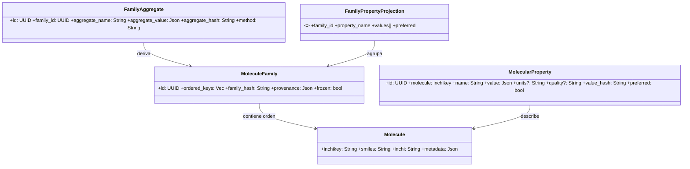

# Sección 3 - Modelo de Dominio – Diagramas e Invariantes

### 3.1 Class Diagram (Dominio Puro)



### 3.6 Diagrama de Clases Dominio ↔ Core (Químico → Artefactos)

Muestra cómo entidades químicas se encapsulan en artifacts neutrales para el Core.


### 3.2 Invariantes Dominio

| ID   | Invariante             | Descripción                                                                   | Enforcement                              |
| ---- | ---------------------- | ----------------------------------------------------------------------------- | ---------------------------------------- |
| INV1 | inchikey único         | Una molécula por inchikey                                                     | PK MOLECULES                             |
| INV2 | Familia congelada      | No se altera `ordered_keys` tras primer uso como INPUT                        | flag frozen + rechazo mutaciones         |
| INV3 | Hash consistente       | family_hash = hash(ordered_keys normalizado)                                  | Recalcular y comparar antes de persistir |
| INV4 | Propiedad inmutable    | value_hash identifica valor; nunca se edita in situ                           | Insert‑only; cambios = nuevo registro    |
| INV5 | Aggregate determinista | aggregate_hash depende sólo (family_hash, params método)                      | Recomputar y validar colisión            |
| INV6 | preferred único        | A lo sumo un MolecularProperty preferred=(true) por (molecule, property_name) | índice parcial único                     |

### 3.3 Taxonomía de Propiedades Moleculares (Dominio)

Las propiedades listadas NO pertenecen al Core; son semántica de dominio. Se tipifican para:

1. Validación fuerte (evitar strings arbitrarios).
2. Homogeneizar unidades y comparabilidad multi‑proveedor.
3. Soportar políticas de preferencia y agregación.

Categorías (ejemplos — extensible):

- Fisicoquímicas: LogP, LogD, pKa, LogS (solubilidad), MW, PSA, VolumenMolar, RefraccionMolar.
- Estructurales: RotoresLibres, Polarizabilidad, CargaParcialAtómica.
- Electrónicas: EnergiaHOMO, EnergiaLUMO, EnergiaHidratación.
- Biológicas (predichas): PermeabilidadCaco2, LD50, ToxicidadPredicha.

Representación sugerida (enum dominio):

```rust
#[derive(Clone, Debug, Eq, PartialEq, Hash)]
pub enum MolecularPropertyKind {
    LogP,
    LogD,
    PKa,
    LogS,
    PesoMolecular,
    PSA,
    VolumenMolar,
    RefraccionMolar,
    RotoresLibres,
    Polarizabilidad,
    CargaParcialAtomica,
    EnergiaHOMO,
    EnergiaLUMO,
    EnergiaHidratacion,
    PermeabilidadCaco2,
    LD50,
    ToxicidadPredicha,
    // Extensible; agregar variantes mantiene compatibilidad si se serializa por nombre estable
}
```

### 3.4 Inmutabilidad y Proveniencia de Propiedades

Cada medición (valor de propiedad) es inmutable. Si un proveedor recalcula se inserta NUEVO registro con nuevo `value_hash`. Campos mínimos por valor:

| Campo                 | Descripción                                       | Motivo                   |
| --------------------- | ------------------------------------------------- | ------------------------ |
| molecule_inchikey     | Identidad molécula                                | Foreign key              |
| property_kind         | Enum estable                                      | Consistencia & queries   |
| value                 | JSON normalizado (numérico, objeto, distribución) | Flexibilidad             |
| units                 | Unidades SI/estándar canónicas                    | Comparabilidad           |
| provider_name/version | Proveniencia exacta                               | Reproducibilidad         |
| step_id               | Step que produjo el valor                         | Trazabilidad a ejecución |
| quality               | Métrica opcional (score/confianza)                | Resolución de conflictos |
| preferred (bool)      | Marcador de selección                             | Fast lookup              |
| value_hash            | Hash(value + units + provider + version)          | Inmutabilidad            |

Preferred se asigna por política (evento `PropertyPreferenceAssigned`), nunca mutando el valor; se actualiza bandera o tabla de proyección.

### 3.5 Resolución Multi‑Proveedor (Conflict Resolution)

Problema: múltiples proveedores pueden devolver la MISMA propiedad (p.ej. LogS) para la misma molécula con diferencias (modelo, precisión, condiciones experimentales). Necesitamos elegir (o mantener varias) consistentemente.

Estrategia en capas:

1. Ingesta: todos los valores se almacenan (insert-only).
2. Normalización: unidades convertidas a canonical antes de hash.
3. Scoring: se calcula score = f(provider_reliability, quality_flag, data_freshness, model_version_rank).
4. Selección: política configurable (max score, prefer lista ordenada, consenso, agregación estadística).
5. Emisión evento: `PropertyPreferenceAssigned` (molecule, property_kind, chosen_value_id, rationale_hash).

Modelo de Política:

```rust
pub trait PropertySelectionPolicy {
    fn choose(&self, candidates: &[PropertyCandidate]) -> SelectionOutcome;
}

pub struct PropertyCandidate<'a> {
    pub value_id: Uuid,
    pub provider: &'a str,
    pub version: &'a str,
    pub quality: Option<f64>,
    pub timestamp: chrono::DateTime<chrono::Utc>,
    pub value: &'a serde_json::Value,
}

pub enum SelectionOutcome {
    Chosen { value_id: Uuid, score: f64, rationale: serde_json::Value },
    Tie(Vec<Uuid>),          // puede disparar estrategia secundaria
    Aggregate { value_id: Uuid, method: String }, // p.ej. promedio z-normalizado
}
```

Algoritmo de ejemplo (MaxScoreFallback):

```text
score = w_quality * quality_norm + w_freshness * recency_norm + w_provider * provider_weight(provider)
Seleccionar mayor score;
En caso de empate: prefer provider en lista blanca > menor version_gap > hash lexicográfico.
```

Diagrama de secuencia (selección en Step de propiedades):


Persistencia de la elección:

1. Flag `preferred=true` en el valor elegido (índice parcial único asegura unicidad).
2. Evento con rationale (JSON) → permite auditar por qué se eligió.

Rationale sugerido:

```json
{
  "policy": "max_score",
  "weights": { "quality": 0.5, "freshness": 0.3, "provider": 0.2 },
  "candidates_eval": [
    { "value_id": "...", "score": 0.91, "provider": "ProvA", "quality": 0.95 },
    { "value_id": "...", "score": 0.82, "provider": "ProvB", "quality": 0.89 }
  ]
}
```

#### Consideraciones de Integridad

| Riesgo                                           | Mitigación                                                              |
| ------------------------------------------------ | ----------------------------------------------------------------------- |
| Oscilación de preferido por re‑ingesta frecuente | Versionar política y recalcular sólo si nuevo score supera umbral delta |
| Empate repetido                                  | Registrar tie estable (hash lista ordenada) para evitar re‑emisión      |
| Inconsistencia unidades                          | Conversión a canonical antes de hashing y scoring                       |
| Proveedor con outliers                           | Cap de score + trimming al calcular agregados                           |

#### Relación con Core

El Core sólo ve artifacts y eventos. La resolución multi‑proveedor:

- Se ejecuta dentro del Step de dominio (antes de emitir ArtifactCreated final si se produce proyección/aggregate).
- Emite evento neutral (`PropertyPreferenceAssigned`) sin semántica química para el Core.
- No altera fingerprint salvo que política (cuyos parámetros) formen parte explícita de los parámetros del Step (recomendado) → reproducibilidad.

#### Parámetros Recomendados para el Step de Propiedades

| Parámetro                | Tipo             | Uso en Fingerprint | Descripción                                                 |
| ------------------------ | ---------------- | ------------------ | ----------------------------------------------------------- |
| providers                | Lista de cadenas | Sí                 | Proveedores a invocar (orden = prioridad base)              |
| selection_policy         | String           | Sí                 | Identificador de política (max_score, consensus, aggregate) |
| weights                  | JSON             | Sí                 | Pesos de scoring (quality, freshness, provider)             |
| freshness_half_life_days | f64              | Sí                 | Normalización recency                                       |
| min_quality              | f64              | Sí                 | Filtro de descarte temprano                                 |
| aggregate_method         | String?          | Sí (si usado)      | mean_zscore / median / trimmed_mean                         |

Al incluirlos en fingerprint se garantiza que un cambio de política induce divergencia rastreable (branch potencial).

---

