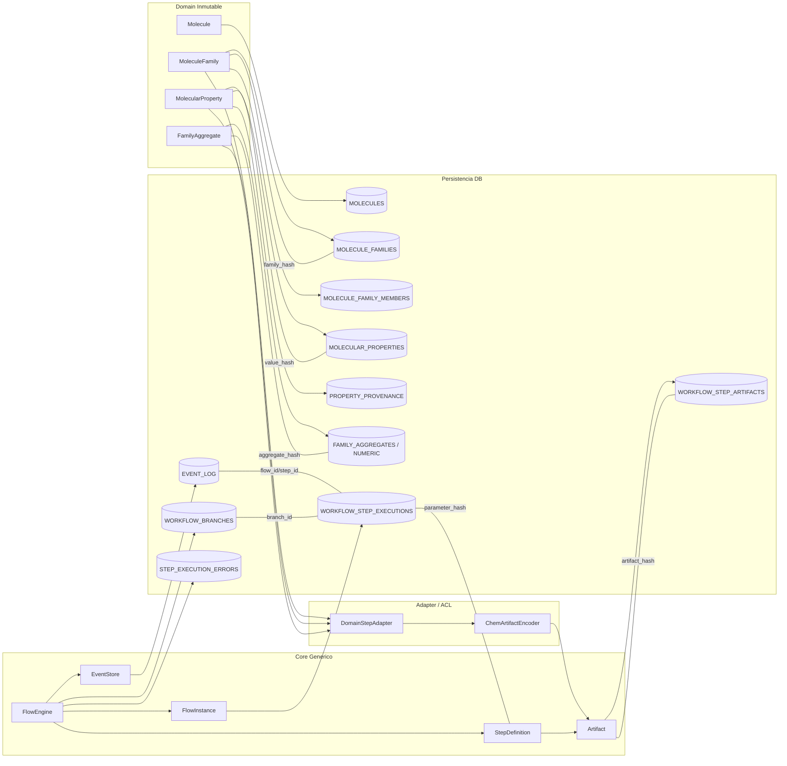

# Sección 4 - Mapeo Dominio ↔ Core ↔ Base de Datos

### 4.1 Diagrama de Mapeo (Capas y Referencias Canónicas)

### 4.2 Relación Canónica (Resumen Conceptual)

| Dominio / Core Concepto        | Persistencia (Tabla / Campo)                                 | Clave de Inmutabilidad / Identidad            |
| ------------------------------ | ------------------------------------------------------------ | --------------------------------------------- |
| Molecule                       | MOLECULES.inchikey (PK)                                      | inchikey                                      |
| MoleculeFamily                 | MOLECULE_FAMILIES.id + family_hash                           | family_hash (derivado ordered_keys)           |
| Miembros de familia            | MOLECULE_FAMILY_MEMBERS(family_id, position)                 | (family_id, position)                         |
| MolecularProperty (valor)      | MOLECULAR_PROPERTIES.id + value_hash                         | value_hash (value+units+provider+version)     |
| Proveniencia propiedad         | PROPERTY_PROVENANCE.molecular_property_id / step_id          | (provenance_id)                               |
| FamilyAggregate                | FAMILY_AGGREGATES.aggregate_hash                             | aggregate_hash                                |
| Artifact (Core)                | WORKFLOW_STEP_ARTIFACTS.artifact_hash                        | artifact_hash                                 |
| Step Execution                 | WORKFLOW_STEP_EXECUTIONS.step_id                             | step_id (UUID)                                |
| Parámetros Step (canónicos)    | WORKFLOW_STEP_EXECUTIONS.parameter_hash                      | parameter_hash (canonical_json)               |
| Fingerprint Step               | (No columna dedicada; incluido en eventos / caching externo) | fingerprint (derivado)                        |
| Evento tipado                  | EVENT_LOG.seq (orden), event_type                            | seq (monótono)                                |
| Branch                         | WORKFLOW_BRANCHES.branch_id                                  | branch_id                                     |
| Asociación rama ↔ ejecución    | WORKFLOW_STEP_EXECUTIONS.branch_id                           | (branch_id, step_id)                          |
| Error de ejecución             | STEP_EXECUTION_ERRORS(attempt_number, step_id)               | (step_id, attempt_number)                     |
| Selección preferida propiedad  | MOLECULAR_PROPERTIES.preferred (índice parcial) + evento     | preferred=true + evento rationale             |
| Divergencia de parámetros rama | WORKFLOW_BRANCHES.divergence_params (hash externo en evento) | divergence_params_hash (evento BranchCreated) |

### 4.3 Flujo de Persistencia (Secuencia Lógica)

1. Dominio crea / congela identidad (familia, propiedades) → hashes calculados.
2. Adaptador empaqueta en artifacts neutrales (hash determinista payload).
3. Core ejecuta Step → emite eventos → registra artifacts y ejecución.
4. EVENT_LOG actúa como fuente de verdad temporal (replay); tablas derivadas reflejan proyecciones estructuradas.
5. Branching agrega metadatos (WORKFLOW_BRANCHES) sin duplicar histórico previo.
6. Retries añaden intentos (STEP_EXECUTION_ERRORS) manteniendo inmutabilidad de ejecuciones previas.

### 4.4 Principios de Integridad Aplicados

- Hashes verificables antes de insert (familia, propiedad, aggregate, artifact).
- Insert‑only para datos inmutables; mutaciones = nuevos registros (propiedades, artifacts).
- Unicidad preferido garantizada por índice parcial + evento justificante.
- Fingerprint nunca se persiste como autoridad única (se recalcula y valida).
- Divergencia de ramas auditable sin copia física de artifacts previos (referencias por hash).

