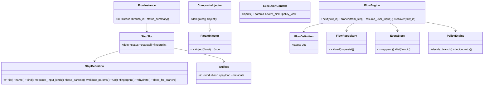
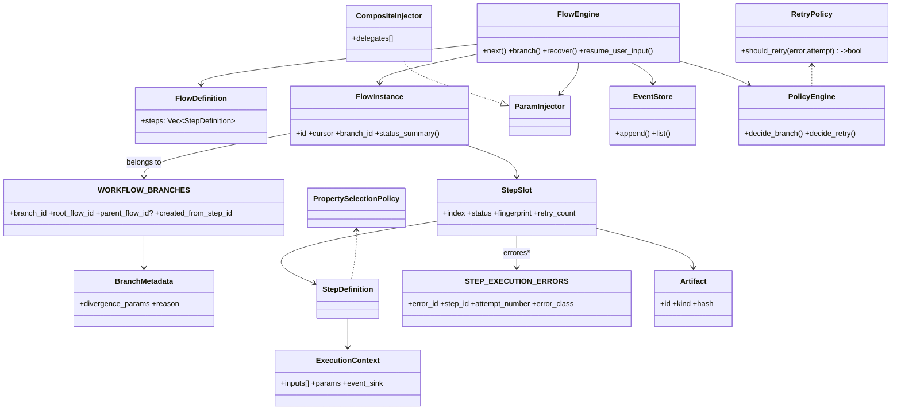

# Sección 5 - Motor Genérico (Core) – Clases

```mermaid
classDiagram
class FlowEngine { +next(flow_id) +branch(from_step) +resume_user_input(..) +recover(flow_id) }
class FlowDefinition { +steps: Vec<StepDefinition> }
class FlowInstance { +id +cursor +branch_id +status_summary()}
class StepSlot { +defn +status +outputs[] +fingerprint }
class StepDefinition { <<interface>> +id() +name() +kind() +required_input_kinds() +base_params() +validate_params() +run() +fingerprint() +rehydrate() +clone_for_branch() }
class ExecutionContext { +inputs[] +params +event_sink +policy_view }
class Artifact { +id +kind +hash +payload +metadata }
class ParamInjector { <<interface>> +inject(flow,i):Json }
class CompositeInjector { +delegates[] +inject() }
class EventStore { <<interface>> +append() +list(flow_id) }
class FlowRepository { <<interface>> +load() +persist() }
class PolicyEngine { +decide_branch() +decide_retry() }

FlowEngine --> FlowDefinition
FlowEngine --> FlowRepository
FlowEngine --> EventStore
FlowEngine --> PolicyEngine
FlowInstance --> StepSlot
StepSlot --> StepDefinition
StepSlot --> Artifact
CompositeInjector ..|> ParamInjector
```

### 5.1 Diagrama de Clases del Motor de Flujo (Branching + Retry)

Incluye elementos extendidos: Branching, Retries y Registro de Errores.

```mermaid
classDiagram
    class FlowEngine {+next() +branch() +recover() +resume_user_input()}
    class FlowDefinition {+steps: Vec~StepDefinition~}
    class FlowInstance {+id +cursor +branch_id +status_summary()}
    class WORKFLOW_BRANCHES {+branch_id +root_flow_id +parent_flow_id? +created_from_step_id}
    class BranchMetadata {+divergence_params +reason}
    class StepSlot {+index +status +fingerprint +retry_count}
    class StepDefinition
    class RetryPolicy {+should_retry(error,attempt)->bool}
    class ParamInjector
    class CompositeInjector {+delegates[]}
    class ExecutionContext {+inputs[] +params +event_sink}
    class EventStore {+append() +list()}
    class STEP_EXECUTION_ERRORS {+error_id +step_id +attempt_number +error_class}
    class Artifact {+id +kind +hash}
    class PolicyEngine {+decide_branch() +decide_retry()}
    class PropertySelectionPolicy

    FlowEngine --> FlowDefinition
    FlowEngine --> FlowInstance
    FlowEngine --> PolicyEngine
    FlowInstance --> StepSlot
    StepSlot --> StepDefinition
    StepSlot --> Artifact
    CompositeInjector ..|> ParamInjector
    FlowEngine --> ParamInjector
    FlowEngine --> EventStore
    StepDefinition --> ExecutionContext
    RetryPolicy <.. PolicyEngine
    PropertySelectionPolicy <.. StepDefinition
    FlowInstance --> WORKFLOW_BRANCHES : belongs to
    WORKFLOW_BRANCHES --> BranchMetadata
    StepSlot --> STEP_EXECUTION_ERRORS : errores*
```

