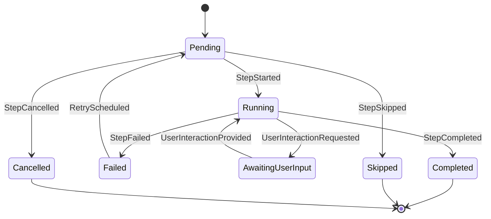

# Sección 6 - Ciclo de Vida Step (0–7) + State Machine

0. Localizar índice `cursor`.
1. Validar precondiciones (previo completado, inputs disponibles).
2. Recolectar inputs por `ArtifactKind` (hash lookup).
3. Inyección parámetros (CompositeInjector).
4. Fusión + validación (`validate_params`).
5. Emisión `StepStarted` → estado Running.
6. `run(ctx)` → genera artifacts / error.
7. Registrar `ArtifactCreated*` y `StepCompleted` o `StepFailed`.



### 6.1 Diagrama de Flujo General End‑to‑End

Visión macro de un pipeline típico incluyendo branching y gates.

```mermaid
flowchart LR
    subgraph Ingesta
        A[Acquire Molecules]
        B[Build Families]
    end
    subgraph Propiedades
        C[Compute Properties]
        D[Select Preferred (Policy)]
    end
    subgraph Agregacion
        E[Aggregate Metrics]
    end
    subgraph Decisiones
        F{Branch Criteria Met?}
        G{Human Gate?}
    end
    subgraph Salida
        H[Generate Report]
        I[Persist Artifacts / Publish]
    end

    A --> B --> C --> D --> E --> F
    F -- Yes --> BR[Create Branch] --> C
    F -- No --> G
    G -- Yes --> UI[Await User Input] --> G
    G -- No --> H --> I
```

