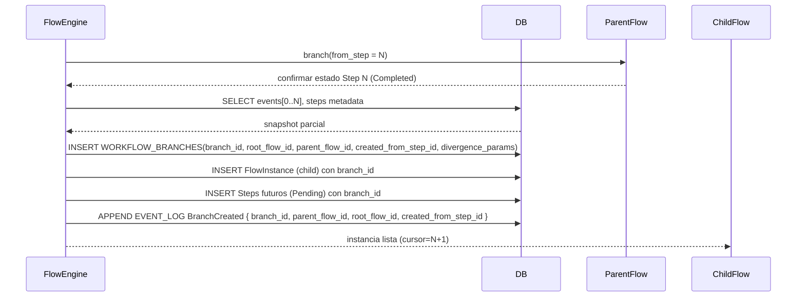

# Sección 10 - Branching Determinista

Condiciones recomendadas (cualquiera): parámetro divergente, entradas divergentes, política exploratoria. Artefacts previos se referencian (no se copian). Fingerprint base sirve para detectar convergencia (deduplicación potencial futura).

### 10.1 Modelo de Datos de Branching (Extensión)

Para clarificar la relación padre→hijo en la base de datos se introducen los siguientes conceptos/columnas:

- `branch_id (UUID)`: Identificador lógico de la rama a la que pertenecen todas las ejecuciones (steps) de un flujo derivado. Todas las ejecuciones en la rama comparten el mismo `branch_id`.
- `root_execution_id (UUID)`: Ya existente; referencia a la primera ejecución (step) raíz del flujo original del que derivan todas las ramas. Permite agrupar historiales completos multi‑branch.
- `parent_step_id (UUID)`: Ya existente; señala el step concreto a partir del cual se generó la rama (en el flujo padre). Si el step de origen es el N, el primer step de la rama normalmente inicia en N+1 o redefine la secuencia restante.
- Tabla `WORKFLOW_BRANCHES`: Metadata de la rama (nombre, timestamps, justificación, parámetros divergentes). Abstrae la creación y facilita auditoría.

Relación:

```
ROOT FLOW (branch_id = B0)
    Step 0 ... Step N  (último común)
            | branch(from_step=N)
            v
CHILD FLOW (branch_id = B1, parent_flow_id = root_flow_id, created_from_step_id = Step N)
```

Rehidratación: para reconstruir una rama basta cargar `WORKFLOW_BRANCHES` y luego filtrar `WORKFLOW_STEP_EXECUTIONS` por `branch_id` ordenando por `seq` de eventos.

### 10.2 Secuencia de Creación de Rama (Actualizado)



El evento `BranchCreated` ahora incluye explícitamente: `branch_id`, `parent_flow_id`, `root_flow_id`, `created_from_step_id`, `divergence_params_hash` para auditoría mínima sin volcar JSON completo (este último derivado de `divergence_params`).

