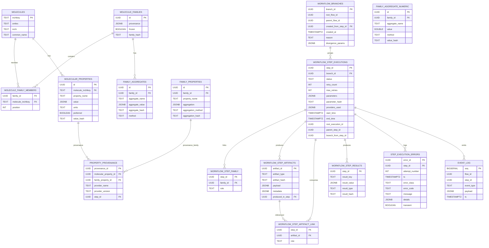

# Sección 12 - Base de Datos – Esquema Normalizado



### 12.1 Estandarización de Nombres (Consistencia)

Inconsistencias identificadas y resolución:

| Anterior                              | Nuevo Estándar                                    | Acción                        |
| ------------------------------------- | ------------------------------------------------- | ----------------------------- |
| MOLECULAR_PROPERTY_PROVENANCE         | PROPERTY_PROVENANCE                               | Renombrado (alias de compat.) |
| (Proyección) FamilyPropertyProjection | FAMILY_PROPERTIES                                 | Materialización opcional      |
| FAMILY_AGGREGATES (JSONB genérico)    | FAMILY_AGGREGATE_NUMERIC (y otras especializadas) | Se añaden tablas normalizadas |

`MOLECULAR_PROPERTY_PROVENANCE` se mantiene como alias interno sólo para migraciones; toda documentación nueva usa `PROPERTY_PROVENANCE`.

### 12.2 Normalización de Agregados

Razón: `aggregate_value JSONB` puede introducir heterogeneidad (tipos numéricos vs distribuciones). Estrategia híbrida:

1. Mantener `FAMILY_AGGREGATES` (compatibilidad / agregados complejos no tabulares).
2. Añadir tablas especializadas por tipo dominante:
   - `FAMILY_AGGREGATE_NUMERIC`: valores escalares (media, mediana, desviación, conteos normalizados).
   - Futuro: `FAMILY_AGGREGATE_DISTRIBUTION` (p.ej. histogramas con bins normalizados) si se requiere.

Beneficios: índices específicos, consultas más eficientes, constraints de tipo y menor ambigüedad semántica.

### 12.3 Branching – Tabla `WORKFLOW_BRANCHES`

Campos clave:

| Campo                | Descripción                                     |
| -------------------- | ----------------------------------------------- |
| branch_id            | Identificador único de la rama                  |
| root_flow_id         | Flujo original (rama raíz)                      |
| parent_flow_id       | Flujo padre inmediato (NULL si raíz)            |
| created_from_step_id | Step del padre donde se hizo el fork            |
| divergence_params    | JSON con parámetros cambiados respecto al padre |
| reason               | Texto libre / etiqueta (exploración, fix, tune) |

### 12.4 Retries – Campos en `WORKFLOW_STEP_EXECUTIONS`

`retry_count` aumenta en cada transición Failed→Pending. `max_retries` permite a un PolicyEngine decidir corte; si se excede, estado final = Failed (terminal) y se produce evento `RetryScheduled` sólo mientras `retry_count < max_retries`.

### 12.5 Registro de Errores – `STEP_EXECUTION_ERRORS`

Cada error se inserta con `attempt_number` correlacionado; esto permite reconstruir timeline exacto y analizar patrones de fallos intermitentes.

### 12.6 Consultas Ejemplo

Obtener últimos errores transitorios antes de un retry:

```sql
SELECT * FROM STEP_EXECUTION_ERRORS
WHERE step_id = $1 AND transient = true
ORDER BY attempt_number DESC LIMIT 3;
```

Recuperar todas las ramas divergentes desde un flow raíz:

```sql
SELECT b.branch_id, b.reason, count(se.step_id) AS steps
FROM WORKFLOW_BRANCHES b
LEFT JOIN WORKFLOW_STEP_EXECUTIONS se ON se.branch_id = b.branch_id
WHERE b.root_flow_id = $1
GROUP BY b.branch_id, b.reason;
```

Fingerprint comparativo entre ramas (inputs idénticos, params divergentes):

```sql
SELECT se.branch_id, se.step_id, se.parameter_hash, se.status
FROM WORKFLOW_STEP_EXECUTIONS se
WHERE se.root_execution_id = $1 AND se.status = 'Completed';
```

