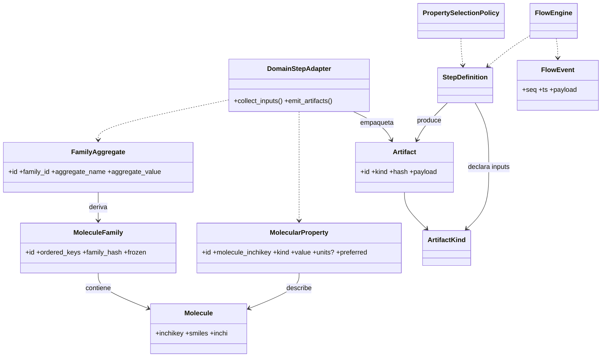

# Tarea 1:

voy a crear las estructuras de datos principales para representar las cosas quimicas en el archivo src/main de Rust llamare a estas estructuras Domain Molecule, MoleculeFamily, MolecularProperty para representar las cosas quimicas en el dominio de la aplicacion el dominio se creara en crates/chem-domain
Molecule, MoleculeFamily, MolecularProperty, agregados numéricos, invariantes Hash familia + value_hash reproducibles 3 ejecuciones → mismos hashes Catálogo ampliado de futuras propiedades
Objetivos Clave:
Implemetar
Garantizar identidad y hash determinista.
Asegurar insert-only para propiedades.
Pasos sugeridos:

Molecule::new normaliza InChIKey.
MoleculeFamily::from_iter fija orden y calcula family_hash.
Test reproducibilidad (familia idéntica → mismo hash).
MolecularProperty::new genera value_hash.
Simular índice de unicidad de inchikey (estructura en tests).
Documentar invariantes (/// INVx:).
Revisión API pública y congelación.
GATE_F1:

Tests hash determinista pasan.
No hay mutadores post-freeze.
value_hash estable (snapshot test).

Molecule (átomo de identidad química estable)
MoleculeFamily (colección ordenada congelada de moléculas)
Molecular Property Value (propiedad puntual por molécula)
Family Property (vista / agrupación lógica multi‑proveedor de valores de moléculas – opcional proyección)

### 3.1 Class Diagram (Dominio Puro)


### 3.6 Diagrama de Clases Dominio ↔ Core (Químico → Artefactos)

Muestra cómo entidades químicas se encapsulan en artifacts neutrales para el Core.



### 3.2 Invariantes Dominio

| ID   | Invariante             | Descripción                                                                   | Enforcement                              |
| ---- | ---------------------- | ----------------------------------------------------------------------------- | ---------------------------------------- |
| INV1 | inchikey único         | Una molécula por inchikey                                                     | PK MOLECULES                             |
| INV2 | Familia congelada      | No se altera `ordered_keys` tras primer uso como INPUT                        | flag frozen + rechazo mutaciones         |
| INV3 | Hash consistente       | family_hash = hash(ordered_keys normalizado)                                  | Recalcular y comparar antes de persistir |
| INV4 | Propiedad inmutable    | value_hash identifica valor; nunca se edita in situ                           | Insert‑only; cambios = nuevo registro    |
| INV5 | Aggregate determinista | aggregate_hash depende sólo (family_hash, params método)                      | Recomputar y validar colisión            |
| INV6 | preferred único        | A lo sumo un MolecularProperty preferred=(true) por (molecule, property_name) | índice parcial único                     |

### 3.3 Taxonomía de Propiedades Moleculares (Dominio)

Las propiedades listadas NO pertenecen al Core; son semántica de dominio. Se tipifican para:

1. Validación fuerte (evitar strings arbitrarios).
2. Homogeneizar unidades y comparabilidad multi‑proveedor.
3. Soportar políticas de preferencia y agregación.

Categorías (ejemplos — extensible):

- Fisicoquímicas: LogP, LogD, pKa, LogS (solubilidad), MW, PSA, VolumenMolar, RefraccionMolar.
- Estructurales: RotoresLibres, Polarizabilidad, CargaParcialAtómica.
- Electrónicas: EnergiaHOMO, EnergiaLUMO, EnergiaHidratación.
- Biológicas (predichas): PermeabilidadCaco2, LD50, ToxicidadPredicha.

Representación sugerida (enum dominio):

```rust
#[derive(Clone, Debug, Eq, PartialEq, Hash)]
pub enum MolecularPropertyKind {
    LogP,
    LogD,
    PKa,
    LogS,
    PesoMolecular,
    PSA,
    VolumenMolar,
    RefraccionMolar,
    RotoresLibres,
    Polarizabilidad,
    CargaParcialAtomica,
    EnergiaHOMO,
    EnergiaLUMO,
    EnergiaHidratacion,
    PermeabilidadCaco2,
    LD50,
    ToxicidadPredicha,
    // Extensible; agregar variantes mantiene compatibilidad si se serializa por nombre estable
}
```

### 3.4 Inmutabilidad y Proveniencia de Propiedades

Cada medición (valor de propiedad) es inmutable. Si un proveedor recalcula se inserta NUEVO registro con nuevo `value_hash`. Campos mínimos por valor:

| Campo                 | Descripción                                       | Motivo                   |
| --------------------- | ------------------------------------------------- | ------------------------ |
| molecule_inchikey     | Identidad molécula                                | Foreign key              |
| property_kind         | Enum estable                                      | Consistencia & queries   |
| value                 | JSON normalizado (numérico, objeto, distribución) | Flexibilidad             |
| units                 | Unidades SI/estándar canónicas                    | Comparabilidad           |
| provider_name/version | Proveniencia exacta                               | Reproducibilidad         |
| step_id               | Step que produjo el valor                         | Trazabilidad a ejecución |
| quality               | Métrica opcional (score/confianza)                | Resolución de conflictos |
| preferred (bool)      | Marcador de selección                             | Fast lookup              |
| value_hash            | Hash(value + units + provider + version)          | Inmutabilidad            |

Preferred se asigna por política (evento `PropertyPreferenceAssigned`), nunca mutando el valor; se actualiza bandera o tabla de proyección.
