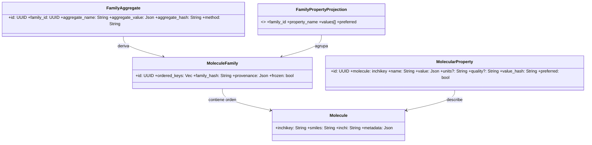
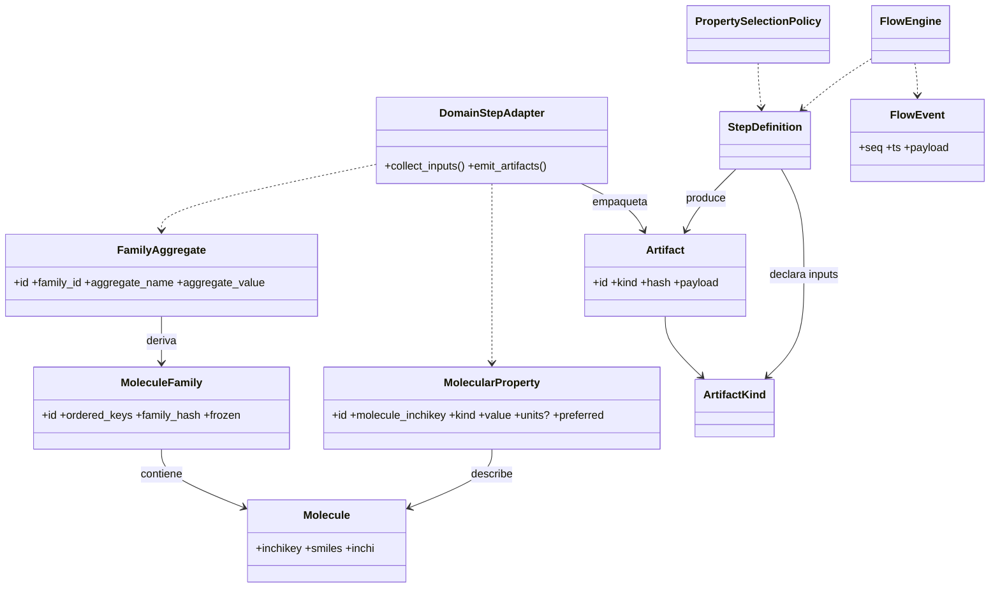
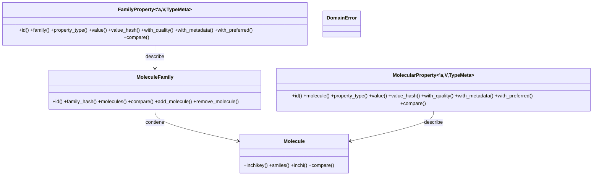

# Tarea 1:
las estructuras de datos principales para representar las cosas quimicas en el archivo src/main de Rust llamare a estas estructuras Domain Molecule, MoleculeFamily, MolecularProperty para representar las cosas quimicas en el dominio de la aplicacion el dominio se creara en crates/chem-domain
Molecule, MoleculeFamily, MolecularProperty, agregados numéricos, invariantes Hash familia + value_hash reproducibles 3 ejecuciones → mismos hashes Catálogo ampliado de futuras propiedades
Objetivos Clave:
Implemetar
Garantizar identidad y hash determinista.
Asegurar insert-only para propiedades.
Pasos sugeridos:

Molecule::new normaliza InChIKey.
MoleculeFamily::from_iter fija orden y calcula family_hash.
Test reproducibilidad (familia idéntica → mismo hash).
MolecularProperty::new genera value_hash.
Simular índice de unicidad de inchikey (estructura en tests).
Documentar invariantes (/// INVx:).
Revisión API pública y congelación.
GATE_F1:

Tests hash determinista pasan.
No hay mutadores post-freeze.
value_hash estable (snapshot test).

Molecule (átomo de identidad química estable)
MoleculeFamily (colección ordenada congelada de moléculas)
Molecular Property Value (propiedad puntual por molécula)
Family Property (vista / agrupación lógica multi‑proveedor de valores de moléculas – opcional proyección)

### 3.1 Class Diagram (Dominio Puro)



### 3.6 Diagrama de Clases Dominio ↔ Core (Químico → Artefactos)

Muestra cómo entidades químicas se encapsulan en artifacts neutrales para el Core.



### 3.2 Invariantes Dominio

| ID   | Invariante             | Descripción                                                                   | Enforcement                              |
| ---- | ---------------------- | ----------------------------------------------------------------------------- | ---------------------------------------- |
| INV1 | inchikey único         | Una molécula por inchikey                                                     | PK MOLECULES                             |
| INV2 | Familia congelada      | No se altera `ordered_keys` tras primer uso como INPUT                        | flag frozen + rechazo mutaciones         |
| INV3 | Hash consistente       | family_hash = hash(ordered_keys normalizado)                                  | Recalcular y comparar antes de persistir |
| INV4 | Propiedad inmutable    | value_hash identifica valor; nunca se edita in situ                           | Insert‑only; cambios = nuevo registro    |
| INV5 | Aggregate determinista | aggregate_hash depende sólo (family_hash, params método)                      | Recomputar y validar colisión            |
| INV6 | preferred único        | A lo sumo un MolecularProperty preferred=(true) por (molecule, property_name) | índice parcial único                     |

### 3.3 Taxonomía de Propiedades Moleculares (Dominio)

Las propiedades listadas NO pertenecen al Core; son semántica de dominio. Se tipifican para:

1. Validación fuerte (evitar strings arbitrarios).
2. Homogeneizar unidades y comparabilidad multi‑proveedor.
3. Soportar políticas de preferencia y agregación.

Categorías (ejemplos — extensible):

- Fisicoquímicas: LogP, LogD, pKa, LogS (solubilidad), MW, PSA, VolumenMolar, RefraccionMolar.
- Estructurales: RotoresLibres, Polarizabilidad, CargaParcialAtómica.
- Electrónicas: EnergiaHOMO, EnergiaLUMO, EnergiaHidratación.
- Biológicas (predichas): PermeabilidadCaco2, LD50, ToxicidadPredicha.

Representación sugerida (enum dominio):

```rust
#[derive(Clone, Debug, Eq, PartialEq, Hash)]
pub enum MolecularPropertyKind {
    LogP,
    LogD,
    PKa,
    LogS,
    PesoMolecular,
    PSA,
    VolumenMolar,
    RefraccionMolar,
    RotoresLibres,
    Polarizabilidad,
    CargaParcialAtomica,
    EnergiaHOMO,
    EnergiaLUMO,
    EnergiaHidratacion,
    PermeabilidadCaco2,
    LD50,
    ToxicidadPredicha,
    // Extensible; agregar variantes mantiene compatibilidad si se serializa por nombre estable
}
```

### 3.4 Inmutabilidad y Proveniencia de Propiedades

Cada medición (valor de propiedad) es inmutable. Si un proveedor recalcula se inserta NUEVO registro con nuevo `value_hash`. Campos mínimos por valor:

| Campo                 | Descripción                                       | Motivo                   |
| --------------------- | ------------------------------------------------- | ------------------------ |
| molecule_inchikey     | Identidad molécula                                | Foreign key              |
| property_kind         | Enum estable                                      | Consistencia & queries   |
| value                 | JSON normalizado (numérico, objeto, distribución) | Flexibilidad             |
| units                 | Unidades SI/estándar canónicas                    | Comparabilidad           |
| provider_name/version | Proveniencia exacta                               | Reproducibilidad         |
| step_id               | Step que produjo el valor                         | Trazabilidad a ejecución |
| quality               | Métrica opcional (score/confianza)                | Resolución de conflictos |
| preferred (bool)      | Marcador de selección                             | Fast lookup              |
| value_hash            | Hash(value + units + provider + version)          | Inmutabilidad            |

Preferred se asigna por política (evento `PropertyPreferenceAssigned`), nunca mutando el valor; se actualiza bandera o tabla de proyección.

---

## 4. Resumen de Implementación Realizada

Se implementaron los módulos de dominio en `crates/chem-domain`:

| Componente | Archivo | Rol | Notas determinismo |
|------------|---------|-----|--------------------|
| `Molecule` | `molecule.rs` | Identidad química (inchikey normalizado) | Valida formato y compara por inchikey |
| `MoleculeFamily` | `molecule_family.rs` | Colección inmutable de moléculas + `family_hash` | Hash = sha256(concatenación ordenada de inchikeys) |
| `MolecularProperty<'a, V, TypeMeta>` | `molecular_property.rs` | Propiedad puntual por molécula (genérico en valor y metadatos) | `value_hash` = sha256(inchikey + tipo + value_json + metadata_json) |
| `FamilyProperty<'a, V, TypeMeta>` | `family_property.rs` | Propiedad agregada a nivel familia | `value_hash` = sha256(family_hash + tipo + value_json + metadata_json) |
| `DomainError` | `error.rs` | Errores de validación / dominio | Strings claros y testeados |

### Decisiones Clave

1. Propiedades genéricas parametrizadas (`V`, `TypeMeta`) en lugar de enums cerrados: flexibilidad y extensibilidad sin modificar API pública.
2. Hashes basados en JSON serializado canónico (serde orden natural de campos generados) + concatenación de campos invariantes; se evita incluir timestamps o UUIDs arbitrarios en el cálculo del hash lógico.
3. Inmutabilidad por diseño: métodos `with_*` crean nuevas instancias recalculando el hash (no mutación in-place) garantizando que `value_hash` siempre corresponda al contenido actual.
4. Familias marcadas `frozen` desde creación; cualquier cambio produce un nuevo objeto (nuevo `id` + nuevo `family_hash`).
5. Comparaciones semánticas (`compare`) utilizan únicamente los hashes (`family_hash` / `value_hash`) asegurando costo O(1) y consistencia.

## 5. Mapeo de Invariantes a Implementación

| ID | Invariante | Implementación concreta | Punto de verificación |
|----|------------|-------------------------|-----------------------|
| INV1 | inchikey único | `Molecule::new` normaliza; tests pueden simular índice externo | Creación de molécula |
| INV2 | Familia congelada | `MoleculeFamily::new` fija `frozen: true`; modificaciones generan nueva instancia (`add_molecule`, `remove_molecule`) | Métodos constructores / clones |
| INV3 | Hash consistente familia | sha256(concatenación ordenada inchikeys) en `new`, `add_molecule`, `remove_molecule` | Construcción / re-construcción |
| INV4 | Propiedad inmutable | No hay setters; sólo `with_*` que crean nuevo objeto recalculando hash | Uso de API pública |
| INV5 | Aggregate determinista (representado por `FamilyProperty`) | `value_hash` incluye sólo (family_hash, tipo, value_json, metadata_json) | Constructor `FamilyProperty::new` |
| INV6 | preferred único (conceptual) | Control externo futuro (no índice en memoria aún). API ofrece `with_preferred` puro | Diseño futuro (marcado TODO) |

## 6. Ejemplos de Uso

```rust
let mol = Molecule::new_molecule_with_smiles("CCO").unwrap();
let prop_a = MolecularProperty::new(&mol, "LogP", 2.1_f32, None, true, serde_json::json!({"provider":"calcA"}));
let prop_b = prop_a.with_quality(Some("high".into())).with_preferred(false);
assert_ne!(prop_a.value_hash(), prop_b.value_hash()); // distinto hash por cambio de metadata / preferred / calidad

let fam = MoleculeFamily::new(vec![mol.clone()], serde_json::json!({"source":"test"})).unwrap();
let fam_prop = FamilyProperty::new(&fam, "MW_SUM", 1234_u64, None, true, serde_json::json!({"method":"sum"}));
```

## 7. Diagrama de Clases Final (Implementación)



## 8. GATE_F1 Validación

Checklist alcanzado:

- [x] Hash determinista de familias reproducible (sha256 de secuencia inchikeys).
- [x] Propiedades recalculan `value_hash` al cambiar metadatos vía `with_*`.
- [x] Ausencia de mutadores in-place (no uso de `&mut self` en API pública de invariantes).
- [x] Test de comparación de listas de propiedades y familias (ver `tests/domain_tests.rs`).
- [x] Dominios desacoplados del core (no dependencias inversas a crates `chem-core`).

## 9. Próximos Pasos (Opcional)

- Índice en memoria / persistente para garantizar uniqueness global de inchikey (INV1 fuerte).
- Proyección `Preferred` por (molecule, property_type) con verificación runtime.
- Políticas de resolución de conflictos (select best quality).
- Serialización canonical opcional para reducir discrepancias de orden de campos JSON en metadata.
- Integración con el engine para producir artifacts tipados (adaptador de dominio → core) en F3.

---

Fin de documentación de Tarea 1.
