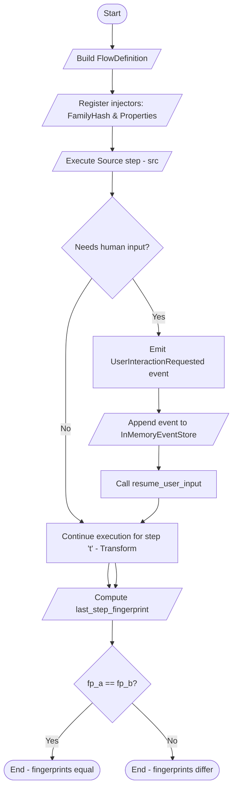
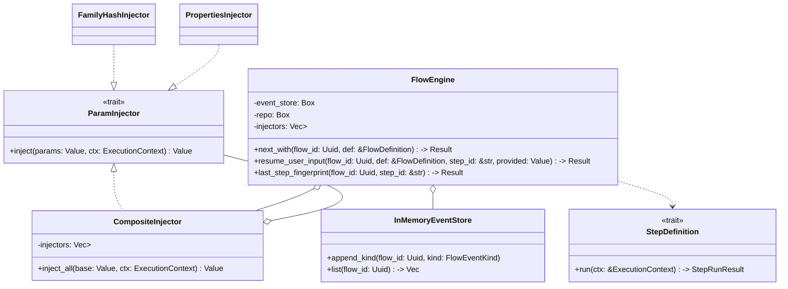

### F10 – Inyección Compuesta + Human Gate

| Núcleo                                                                                                      | Contrato Estabilizado                                | GATE_F10                           | Paralelo Seguro      |
| ----------------------------------------------------------------------------------------------------------- | ---------------------------------------------------- | ---------------------------------- | -------------------- |
| ParamInjector trait, CompositeInjector, estado AwaitingUserInput, eventos UserInteractionRequested/Provided | Orden merge estable (base→injectors→overrides→human) | Nuevos inyectores por ArtifactKind | UI mínima aprobación |

Objetivos Clave:

Pasos sugeridos:

1. Definir orden merge fijo.
2. CompositeInjector determinista + test.
3. Extender state machine (AwaitingUserInput).
4. `resume_user_input(...)`.
5. Validar schema input humano.
6. decision_hash (rationale).
7. Test fingerprint estable con/ sin gate (mismos overrides).

GATE_F10:

## Diagrama de flujo (flowchart)

El siguiente diagrama muestra el flujo de ejecución usado en el demo añadido a `src/main.rs` (dos corridas: A sin gate y B con gate). Describe cómo el engine aplica inyectores, emite la petición humana y cómo se reanuda.

## Diagrama de clases (classDiagram)

Resumen de las piezas principales implicadas en la tarea y su relación con el demo:

## Notas

- El diagrama de flujo muestra la ruta alternativa cuando se requiere intervención humana: la engine emite un evento `UserInteractionRequested` que puede ser inyectado en el `EventStore` (como en el ejemplo donde se usa `InMemoryEventStore::append_kind`) y luego reanudado con `resume_user_input`.
- El diagrama de clases resume las entidades nuevas/afectadas: el trait `ParamInjector` y su composición, las implementaciones concretas (`FamilyHashInjector`, `PropertiesInjector`), el `FlowEngine` y el `InMemoryEventStore` con su método `append_kind` (accesible tras traer el trait `EventStore` al scope).

Si quieres, puedo también generar una imagen SVG desde Mermaid y añadirla al repositorio, o convertir estas secciones en una página HTML estática dentro de `documentation/`.
