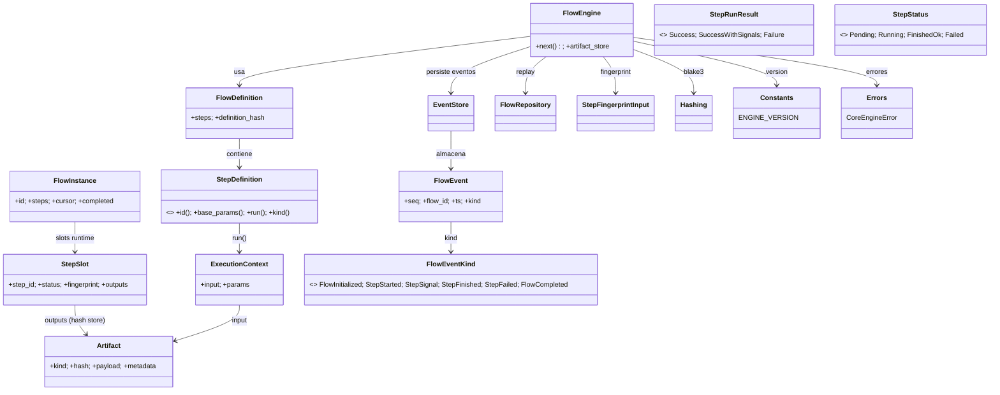

### F2 – Motor Lineal Determinista (chem-core mínimo)

Versión: 0.5 (FlowFingerprint agregado + attempts + documentación consolidada)

---

### 1. Objetivo

Implementar un motor mínimo (chem-core) capaz de ejecutar un flujo lineal de Steps de manera 100% determinista, generando:

1. Secuencia de eventos idéntica entre runs repetidos (mismos inputs & params & versión interna).
2. Fingerprints reproducibles de cada Step y del conjunto (flow lineage comprobable).
3. Ausencia total de semántica química (solo tipos neutrales: ArtifactKind, JSON, hashes, UUIDs).
4. Soporte de señales livianas (StepSignal) que no alteran estado reconstruido.
5. Encadenamiento simplificado: un único Artifact (opcional) fluye entre steps (modelo pipeline).

### 2. Alcance (IN) / Exclusiones (OUT)

IN:

- Ejecución lineal (sin branching, retries ni skips).
- Replay in-memory de eventos para reconstruir estado del Flow.
- Fingerprints deterministas por Step.
- Persistencia en memoria: EventStore + FlowRepository.
- Señales livianas (SuccessWithSignals / StepSignal).
- Simplificación: un único artifact de entrada `Option<Artifact>` para cada Step (None solo en Source inicial).

OUT (diferido a F3+):

- Branching, retries, políticas, timeouts, paralelismo.
- Persistencia en disco / DB.
- Event sourcing avanzado (compaction, snapshots, índices secundarios).
- Métricas, tracing, auditoría extendida.

### 3. Glosario Core Mínimo

- FlowDefinition: Lista ordenada e inmutable de StepDefinition.
- StepDefinition: Contrato determinista (implementaciones futuras en adaptadores neutrales / dominio).
- StepSlot: Estado runtime asociado a una definición (fingerprint, status, output hashes).
- FlowInstance: Estado reconstruido (id, cursor, colección StepSlots).
- Artifact: Unidad de datos neutral (hash + kind + payload JSON + metadata opcional no hasheada).
- Event: Registro inmutable (FlowInitialized, StepStarted, StepFinished, StepFailed, StepSignal, FlowCompleted).

### 4. Traits / Contratos

```rust
pub trait StepDefinition {
    fn id(&self) -> &str;                 // estable, único en el flow
    fn name(&self) -> &str { self.id() }  // alias humano opcional
    fn base_params(&self) -> serde_json::Value; // defaults deterministas
    fn run(&self, ctx: &ExecutionContext) -> StepRunResult; // pura w.r.t input + params
    fn kind(&self) -> StepKind;           // Source | Transform | Sink | Check
}

pub trait EventStore { // append-only
    fn append_kind(&mut self, flow_id: Uuid, kind: FlowEventKind) -> FlowEvent; // asigna seq+ts
    fn list(&self, flow_id: Uuid) -> Vec<FlowEvent>;
}

pub trait FlowRepository { // replay → FlowInstance
    fn load(&self, flow_id: Uuid, events: &[FlowEvent], definition: &FlowDefinition) -> FlowInstance;
}
```

### 5. Modelos de Datos (Structs Implementados)

```rust
pub struct FlowDefinition { pub steps: Vec<Box<dyn StepDefinition>> }

pub struct FlowInstance {
    pub id: Uuid,
    pub steps: Vec<StepSlot>,  // index == posición
    pub cursor: usize,         // siguiente step a ejecutar
    pub completed: bool,
}

pub struct StepSlot {
    pub step_id: String,
    pub status: StepStatus,
    pub fingerprint: Option<String>,
    pub outputs: Vec<String>,          // sólo hashes (Artifacts se guardan en store)
    pub started_at: Option<DateTime<Utc>>,
    pub finished_at: Option<DateTime<Utc>>,
    pub attempts: u32,                 // Conteo de ejecuciones (en F2 siempre 1 si se inició; base futuros retries)
}

#[derive(Clone, Copy, Debug, Eq, PartialEq)]
pub enum StepStatus { Pending, Running, FinishedOk, Failed }

pub struct Artifact {
    pub kind: ArtifactKind,
    pub hash: String,                   // hash canonical(payload)
    pub payload: serde_json::Value,     // datos neutrales
    pub metadata: Option<serde_json::Value>, // fuera del hash
}

pub struct ExecutionContext {
    pub input: Option<Artifact>,        // None sólo para primer Step Source
    pub params: serde_json::Value,
}

pub enum StepRunResult {
    Success { outputs: Vec<Artifact> },
    SuccessWithSignals { outputs: Vec<Artifact>, signals: Vec<StepSignal> },
    Failure { error: CoreEngineError },
}
```

Nota: `ArtifactKind` mínima en F2: `GenericJson`.

### 5.1 Diagrama de Clases (Estado Real F2)



#### 5.2 Diagrama de Flujo Ejecución (FlowEngine::next)

```mermaid
flowchart LR
    A[Invocar next(flow_id)] --> B{Existen eventos?}
    B -- No --> B0[Emit FlowInitialized]
    B0 --> C[Replay -> FlowInstance]
    B -- Sí --> C[Replay -> FlowInstance]
    C --> D{completed?}
    D -- Sí --> Z1[Err FlowCompleted]
    D -- No --> E{cursor < steps.len()?}
    E -- No --> Z2[Err StepAlreadyTerminal]
    E -- Sí --> F[Obtener StepDefinition]
    F --> G{Status Pending?}
    G -- No --> Z3[Err StepAlreadyTerminal]
    G -- Sí --> H[Tomar artifact previo (si index>0)]
    H --> H1{Step index>0 y no hay artifact?}
    H1 -- Sí --> Z4[Err MissingInputs]
    H1 -- No --> I[Fingerprint (engine_version, step_id, input_hashes, params, def_hash)]
    I --> J[Emit StepStarted]
    J --> K[step.run(ctx)]
    K --> L{Resultado}
    L -- Failure --> F1[Emit StepFailed]
    F1 --> R[No avanza cursor]
    L -- Success --> M[Hash outputs]
    L -- SuccessWithSignals --> S0[Emit StepSignal(s)] --> M[Hash outputs]
    M --> N[Persistir artifacts + Emit StepFinished]
    N --> P{Último step?}
    P -- Sí --> Q[Calcular flow_fingerprint + Emit FlowCompleted(flow_fingerprint)]
    P -- No --> R[Avanza cursor]
    R --> S[Fin]
```

### 5.3 Tabla Resumen Componentes

| Componente | Tipo | Responsabilidad | Entrada / Salida | Invariantes |
|------------|------|-----------------|------------------|-------------|
| FlowEngine | Struct | Orquestar ejecución determinista | flow_id + definición -> eventos | INV_CORE_1..5, INV_CORE_SIG, INV_CORE_FLOW_FP |
| FlowDefinition | Struct | Lista inmutable + hash definición | steps -> definition_hash | Hash depende orden ids |
| FlowInstance | Struct (replay) | Estado reconstruido (cursor, statuses) | eventos -> instancia | Idempotente |
| StepSlot | Struct | Snapshot step | eventos -> status/outputs/fingerprint | Ciclo de vida válido |
| StepDefinition | Trait | Lógica pura determinista | ExecutionContext -> resultado | Pura w.r.t input/params |
| ExecutionContext | Struct | Empaqueta input único + params | build interno | input None solo en Source |
| Artifact | Struct | Contenedor neutral | step outputs -> store | hash == hash(canonical(payload)) |
| StepRunResult | Enum | Resultado + señales | run() -> enum | Una emisión por step |
| FlowEvent/Kind | Struct/Enum | Historial inmutable | append -> replay | Orden estable |
| EventStore | Trait | Append + list | eventos | Append-only |
| FlowRepository | Trait | Replay -> FlowInstance | events + definition | Ignora StepSignal para estado |
| StepFingerprintInput | Struct | Precursor fingerprint | campos deterministas | Campos exactos |
| Hashing | Módulo | canonical_json + blake3 | Value -> hash | Orden de claves |
| CoreEngineError | Enum | Errores core | variantes tipadas | Mensajes estables |
| compute_step_fingerprint | Func | Encapsula cálculo | input sorted + params | Idempotente |

### 5.4 Flujo de Colaboración Simplificado (input único)

1. Cargar eventos y si vacío emitir `FlowInitialized`.
2. Replay -> `FlowInstance` (ignora StepSignal para estado).
3. Validar: no completado, índice válido, slot Pending.
4. Preparar `ExecutionContext` con `input` = output[0] del step anterior (o None si index==0).
5. Calcular fingerprint (ANTES de `StepStarted`, orden congelado v0.4).
6. Emitir `StepStarted`.
7. Ejecutar `run`.
8. Persistir artifacts (hash verificado) + emitir `StepFinished` (y `StepSignal` por cada señal si aplica).
9. Si último y éxito -> calcular `flow_fingerprint` (hash ordenado de fingerprints de todos los StepFinished exitosos) y emitir `FlowCompleted { flow_fingerprint }`.

### 5.5 Mapeo Invariantes → Código

| Invariante | Ubicación | Mecanismo |
|------------|-----------|-----------|
| INV_CORE_1 | engine::next (status Pending) | Err StepAlreadyTerminal |
| INV_CORE_2 | engine::next (input requerido ausente index>0) | Err MissingInputs |
| INV_CORE_3 | Tests (fingerprint_stability, multi-run) | Igualdad fingerprints |
| INV_CORE_4 | Tests evento (secuencia) | Igualdad logs |
| INV_CORE_5 | debug_assert hash(payload) | Validación integridad |
| INV_CORE_SIG | Replay ignora StepSignal | Estado igual con/ sin señales |
| INV_CORE_SRC | Primer step debe ser Source | Err FirstStepMustBeSource |
| INV_CORE_STOP | Stop-on-failure: no ejecutar steps posteriores tras un Failed | Err FlowHasFailed |
| G5 (20 rep) | canonical_json_repetition_20 | Hash estable |

### 5.6 Diferencias vs Diseño Original (Razonadas)

- Eliminado `required_input_kinds`: simplificación pipeline lineal (reduce branching en F2).
- `ExecutionContext.inputs: Vec<Artifact>` → `ExecutionContext.input: Option<Artifact>`.
- `StepSlot.outputs` almacena hashes (`Vec<String>`), artifacts reales en store para deduplicar.
- Añadido `SuccessWithSignals` + eventos `StepSignal` sin impacto en replay.
- `Failure` tipado (`CoreEngineError`) + `StepFailed.error` tipado.
- `metadata` ahora `Option<Value>` para evitar objetos vacíos.
- Helper `compute_step_fingerprint` público.

### 6. Ciclo de Vida de un Step

Estados:

```text
Pending -> Running -> FinishedOk
Pending -> Running -> Failed
```

Reglas:

- Solo `FinishedOk` avanza cursor.
- `input=None` permitido únicamente si `kind == Source` y `index==0`.
- Primer step debe ser `Source` explícitamente (INV_CORE_SRC).
- Si existe cualquier step `Failed`, llamadas posteriores a `next` devolverán `FlowHasFailed` (INV_CORE_STOP) y no se avanza más.
- Último step `FinishedOk` => `FlowInstance.completed=true`.

### 7. Eventos (Tipados)

| Evento | Momento | Campos | Determinismo |
|--------|---------|--------|--------------|
| FlowInitialized | inicio primera ejecución | definition_hash, step_count | Sí |
| StepStarted | después de fingerprint, antes de run | step_index, step_id | Sí |
| StepFinished | tras éxito | step_index, step_id, outputs(Vec de hashes), fingerprint (pre-calculado) | Sí |
| StepFailed | tras error | step_index, step_id, error, fingerprint (pre-calculado) | Sí |
| StepSignal | tras SuccessWithSignals | step_index, step_id, signal, data | Orden estable |
| FlowCompleted | último FinishedOk | flow_fingerprint | Sí |

Representación:

```rust
pub enum FlowEventKind {
    FlowInitialized { definition_hash: String, step_count: usize },
    StepStarted { step_index: usize, step_id: String },
    StepFinished { step_index: usize, step_id: String, outputs: Vec<String>, fingerprint: String },
    StepFailed { step_index: usize, step_id: String, error: CoreEngineError, fingerprint: String },
    StepSignal { step_index: usize, step_id: String, signal: String, data: serde_json::Value },
    FlowCompleted { flow_fingerprint: String },
}

pub struct FlowEvent {
    pub seq: u64,
    pub flow_id: Uuid,
    pub kind: FlowEventKind,
    pub ts: DateTime<Utc>,
}
```

### 8. Algoritmo `FlowEngine::next(flow_id)` (Pseudocódigo)

```text
1. events = store.list(flow_id); if empty -> emit FlowInitialized.
2. instance = replay(events, definition).
3. if instance.completed -> Err(FlowAlreadyCompleted).
4. step_index = cursor; validar < steps.len().
5. slot.status == Pending ? else Err(StepAlreadyTerminal).
6. Validar primer step: debe ser Source (INV_CORE_SRC).
7. input = (si step_index>0) primer hash outputs step_index-1 -> fetch artifact, else None.
8. if step_index>0 && input.is_none() => Err(MissingInputs).
9. fingerprint = hash(canonical_json{ engine_version, step_id, input_hashes(sorted), params, definition_hash }).
10. emitir StepStarted.
11. result = step.run(ExecutionContext{input, params}).
12. hashear outputs -> outputs_hashes.
13. match result:
    a) Success => StepFinished.
    b) SuccessWithSignals => StepFinished + StepSignal por señal.
    c) Failure => StepFailed.
14. actualizar slot + cursor (si FinishedOk incrementa).
15. si último y FinishedOk => flow_fingerprint = hash(sorted(list(fingerprints))) & FlowCompleted{flow_fingerprint}.
16. append todos los eventos en orden (orden estable: Started -> (Signals*) -> Finished -> (posible Completed)).
```

### 9. Fingerprint (Campos Exactos)

```json
{
  "engine_version": "F2.0",
  "step_id": "<string>",
  "input_hashes": ["<hash>"] ,
  "params": { /* canonical JSON */ },
  "definition_hash": "<hash>"
}
```

- `input_hashes` ordenado lexicográficamente (0 o 1 elemento en modelo encadenado).
- Hash = blake3(hex) sobre canonical_json de la estructura.

### 10. Determinismo – Reglas

- No timestamps ni randomness en fingerprint.
- Orden estable en `input_hashes`.
- canonical_json ordena claves de objetos (ASCII ascendente) y normaliza números.
- Estructuras internas inmutables tras construcción (FlowDefinition, StepDefinition).

### 11. Invariantes

| ID | Invariante | Momento | Acción |
|----|------------|---------|--------|
| INV_CORE_1 | No re-ejecución step terminal | antes StepStarted | error |
| INV_CORE_2 | Falta input requerido (index>0) | antes StepStarted | error |
| INV_CORE_3 | Fingerprint estable multi-run | tests | assert |
| INV_CORE_4 | Secuencia eventos estable | tests | diff vacío |
| INV_CORE_5 | hash(payload)==hash_canonical | creación artifact | debug assert |
| INV_CORE_SIG | Señales no alteran replay | tests | igualdad estado |
| INV_CORE_SRC | Primer step es Source | validación inicial | error FirstStepMustBeSource |
| INV_CORE_STOP | No ejecutar tras un Failed | antes StepStarted | error FlowHasFailed |
| INV_CORE_FLOW_FP | Flow fingerprint agregado estable entre runs idénticos | al emitir FlowCompleted | assert test aggregated_flow_fingerprint_deterministic |

### 12. Tests (Escenarios)

1. run_linear_single_step
2. run_linear_two_steps
3. determinism_repeated_run
4. fingerprint_stability
5. failure_stops_following_steps
6. first_step_must_be_source
7. canonical_json_ordering
8. chained_increment_steps_with_even_signals
9. signal_triggers_side_effect_print_hello
10. two_step_number_and_message_flow
11. signal_and_transform_number_flow
12. definition_hash_only_ids (hash sólo ids y orden)
13. aggregated_flow_fingerprint_deterministic (INV_CORE_FLOW_FP)

### 13. Plan de Implementación Incremental

A. hashing (canonical_json + blake3) + tests básicos.
B. Traits núcleo (StepDefinition, StepRunResult, StepStatus) + Artifact.
C. EventStore in-memory + tipos FlowEvent.
D. FlowRepository (replay) + FlowInstance.
E. FlowEngine::next (happy path) + tests 1-2.
F. Fingerprint + tests determinismo (3-4-7).
G. Manejo fallo + test failure_does_not_advance.
H. Señales + tests 8-9-11.
I. Refactor input único + test missing_previous_output.
J. Documentación final + checklist.

### 14. Criterios GATE_F2

- G1: 3 ejecuciones idénticas => logs (sin ts) iguales.
- G2: Fingerprints idénticos run a run.
- G3: `chem-core` sin tipos químicos (grep limpio).
- G4: Tests enumerados todos green.
- G5: canonical_json determinista (20 rep).
- G6: Señales reproducibles, no alteran replay.
- G7: Modelo input único documentado y reflejado en código.

### 15. Extensiones Futuras

- Retries / políticas.
- Branching determinista.
- Persistencia durable (sqlite/postgres).
- Indexación / consultas de eventos.
- Políticas de caching por fingerprint.

### 16. Ejemplo Mini (2 Steps)

Step 0 (GenerateSeed) -> outputs `[1,2]` (hash hA).  
Step 1 (SumValues) input hA -> `{ "sum":3 }` (hash hB).

Secuencia (sin ts):

```text
0 FlowInitialized(...)
1 StepStarted(0, generate_seed)          # fingerprint fpA calculado antes de este evento
2 StepFinished(0, generate_seed, [hA], fpA)
3 StepStarted(1, sum_values)              # fingerprint fpB calculado antes
4 StepFinished(1, sum_values, [hB], fpB)
5 FlowCompleted(flow_fingerprint=hash([fpA,fpB] ordenados))
```

### 17. Recomendaciones

- Concentrar canonical JSON en módulo hashing.
- Exponer `compute_step_fingerprint` para test introspectivo.
- Artefact store separado (hash->Artifact) para deduplicación.
- Mantener señales sin efectos secundarios en engine.

### 18. Checklist Rápida Código (Actualizada)

- [x] hashing canonical + tests
- [x] Traits núcleo + structs
- [x] EventStore + FlowRepository
- [x] FlowEngine::next + validaciones
- [x] Fingerprints y tests determinismo
- [x] Failure path + cursor estable
- [x] Señales + tests
- [x] Refactor input único + test missing_previous_output
- [x] Documentación sincronizada (este archivo)
- [x] Flow fingerprint agregado documentado
- [x] Invariante INV_CORE_FLOW_FP testado
- [x] Sin semántica química en `chem-core`

### 19. Métrica de Éxito

Base estable para F3 (branching / retries) sin refactor profundo de contratos: StepDefinition, ExecutionContext (input único), EventStore, FlowEngine::next.

---

### 20. Errores Core (Actualizados v0.4)

| Error | Descripción | Disparador |
|-------|-------------|-----------|
| FlowCompleted | Flow ya finalizado | Intento de ejecutar tras FlowCompleted |
| StepAlreadyTerminal | Step no Pending | Re-ejecución slot Running/Finished/Failed |
| MissingInputs | Falta artifact requerido (index>0) | input_artifact None |
| FirstStepMustBeSource | Primer step no es Source | index==0 && kind!=Source |
| FlowHasFailed | Existe un Failed previo | Stop-on-failure al invocar next |
| InvalidStepIndex | Índice inválido (teórico) | Defensa interna |
| Internal(..) | Errores internos | Casos imprevistos |

### 21. Nota Interna (No Contractual) – ExecutionOutcome

Estructura interna usada para separar cálculo de resultados (fingerprint, hashes, señales) de la serialización a eventos. No expuesta como API pública; permite futuras extensiones (retries / métricas) sin cambiar la interfaz externa.

Resumen: Documento alineado con implementación real tras refactor a input único, soporte de señales, flow fingerprint agregado y nuevas invariantes.

---

## 22. Ergonomía Tipada: Macros y Builder del Engine (NOVEDAD)

Para reducir el boilerplate y reforzar el tipado en Steps y Artifacts, se incorporaron:

- Macros para declarar Artifacts y Steps fuertemente tipados: `typed_artifact!` y `typed_step!` (exportadas por `chem-core`).
- Un builder tipado del `FlowEngine` que valida en compilación la compatibilidad IO entre pasos y en runtime que el primer paso sea `Source`.

Importación típica:

```rust
use chem_core::{typed_artifact, typed_step, FlowEngine};
use chem_core::step::StepKind;
```

### 22.1. Artifacts tipados con `typed_artifact!`

Formas soportadas:

- KIND por defecto (`GenericJson`):

```rust
typed_artifact!(TextOut { text: String });
```

- KIND explícito:

```rust
typed_artifact!(MyData { a: i32, b: String } kind: chem_core::model::ArtifactKind::GenericJson);
```

La macro genera:

- `struct` público con campos + `schema_version: u32`.
- Implementación de `ArtifactSpec` (requerido por el engine).

### 22.2. Steps tipados con `typed_step!`

La macro crea `struct` + implementación de `TypedStep` (y, por adaptación, `StepDefinition`). Hay dos variantes:

- `source`: primer paso, no recibe input (`input=None`).
- `step`: pasos `Transform` o `Sink` con `input` y `output` tipados.

Ejemplos reales (pipeline de 4 pasos):

```rust
// 1) Fuente: recibe un seed por campo y emite el texto en mayúsculas
typed_step! {
    source SeedStep {
        id: "seed_text",
        output: TextOut,
        params: (),
        fields { seed: String },
        run(me, _p) {
            let upper = me.seed.to_uppercase();
            TextOut { text: upper, schema_version: 1 }
        }
    }
}

// 2) Transform: divide en chars
typed_step! {
    step SplitStep {
        id: "split_chars",
        kind: StepKind::Transform,
        input: TextOut,
        output: CharsPas,
        params: (),
        run(_self, inp, _p) {
            let chars: Vec<char> = inp.text.chars().collect();
            CharsPas { chars, schema_version: 1 }
        }
    }
}

// 3) Transform: reenvía
typed_step! {
    step ForwardStep {
        id: "forward_chars",
        kind: StepKind::Transform,
        input: CharsPas,
        output: CharsPas,
        params: (),
        run(_self, inp, _p) { CharsPas { chars: inp.chars, schema_version: 1 } }
    }
}

// 4) Sink: imprime y cuenta
typed_step! {
    step PrintAndCountStep {
        id: "print_count",
        kind: StepKind::Sink,
        input: CharsPas,
        output: CountOut,
        params: (),
        run(_self, inp, _p) {
            let joined: String = inp.chars.iter().map(|c| c.to_string()).collect::<Vec<_>>().join("-");
            println!("Chars: {}", joined);
            CountOut { count: joined.chars().filter(|c| *c != '-').count(), schema_version: 1 }
        }
    }
}
```

Notas:

- El identificador del “self” en `run(...)` no debe ser la palabra reservada `self`; use `me`, `_self`, etc.
- La macro cubre el caso de éxito simple. Si necesitas emitir señales (`StepSignal`) desde un `run`, puedes:
  - Implementar `TypedStep` manualmente, o
  - Extender la macro (futuro) para una variante con señales.

### 22.3. Builder tipado del Engine

Construcción ergonómica in-memory con validaciones:

```rust
let mut engine = FlowEngine::new()
    .firstStep(SeedStep::new("HolaMundo".to_string())) // alias camelCase disponible
    .addStep(SplitStep::new())
    .addStep(ForwardStep::new())
    .addStep(PrintAndCountStep::new())
    .build();
engine.set_name("demo_chars");
engine.run_to_end().expect("run ok");
```

Garantías del builder:

- En compilación: `addStep<N>` exige `N::Input == Prev::Output` (vía trait `SameAs`), evitando cadenas inválidas.
- En runtime: `firstStep` paniquea si el primer paso no es `Source` (INV_CORE_SRC).
- La definición y el `flow_id` por defecto quedan fijados en el engine; se exponen lecturas “zero-arg”.

Lecturas disponibles (modo por defecto):

- `engine.events()` → `Vec<FlowEvent>`
- `engine.event_variants()` → `Vec<&'static str>` abreviado `I,S,F,X,G,C`
- `engine.flow_fingerprint()` → `Option<String>`
- `engine.last_step_output_typed::<T>(step_id)` → último output tipado del step `step_id`

### 22.4. Paso de parámetros tipados (Params)

Cada `TypedStep` declara un tipo `Params` (serializable) que contribuye al fingerprint del step. En F2 el engine usa `params_default()` del step.

Patrones soportados hoy:

- Parametrización por `Default` del tipo `Params`.
- Configuración por campos del `struct` del step (pasados al constructor `new(...)`).

Ejemplo de `Params` propio:

```rust
#[derive(Clone, serde::Serialize, serde::Deserialize, Default)]
struct SplitParams { keep_hyphen: bool }

typed_step! {
    step SplitStep2 {
        id: "split2",
        kind: StepKind::Transform,
        input: TextOut,
        output: CharsPas,
        params: SplitParams,
        run(_self, inp, p) {
            let mut chars: Vec<char> = inp.text.chars().collect();
            if !p.keep_hyphen { chars.retain(|&c| c != '-') }
            CharsPas { chars, schema_version: 1 }
        }
    }
}
```

Notas importantes:

- El engine toma `params_default()` (deriva de `Default::default()`). Si necesitas que los parámetros dependan de campos del step (por instancia), implementa `TypedStep` manualmente o extiende la macro para soportar `params_from_fields` (futuro).
- Los `Params` se serializan y participan del fingerprint (determinismo).

### 22.5. Ejemplo completo (resumen)

```rust
typed_artifact!(TextOut  { text: String });
typed_artifact!(CharsPas { chars: Vec<char> });
typed_artifact!(CountOut { count: usize });

// Steps: Seed -> Split -> Forward -> Print/Count
// (ver ejemplos en 22.2)

let mut engine = FlowEngine::new()
    .firstStep(SeedStep::new("HolaMundo".to_string()))
    .addStep(SplitStep::new())
    .addStep(ForwardStep::new())
    .addStep(PrintAndCountStep::new())
    .build();
engine.set_name("demo_chars");
engine.run_to_end().unwrap();

// Lecturas
let variants = engine.event_variants().unwrap_or_default();
let flow_fp  = engine.flow_fingerprint().unwrap_or_default();
if let Some(Ok(out)) = engine.last_step_output_typed::<CountOut>("print_count") {
    println!("count={}", out.inner.count);
}
```

### 22.6. Errores y validaciones esperadas

- Primer paso no `Source` → `panic!("El primer step debe ser de tipo Source")` en el builder; y/o `CoreEngineError::FirstStepMustBeSource` en ejecución.
- Encadenamiento inválido en compilación (tipo de entrada/salida no coincide): error de trait bound del compilador (fallo en `N::Input: SameAs<Prev::Output>`).

---

## 23. Próximos pasos sugeridos (F2+)

- Macro `typed_step!` con soporte para emitir señales y para derivar `Params` desde los campos de instancia.
- API para inyectar `Params` no-default por instancia de ejecución.
- Ejemplos con stores persistentes (Postgres) usando el mismo builder tipado.


