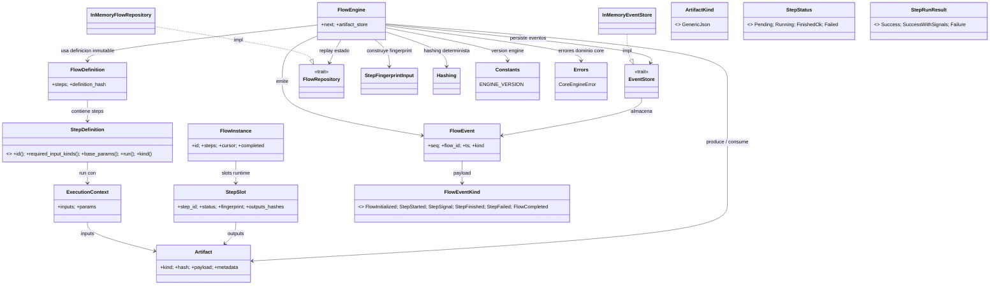

### F2 – Motor Lineal Determinista (chem-core mínimo)

Versión: 0.2 (Especificación Detallada)

---

### 1. Objetivo

Implementar un motor mínimo (chem-core) capaz de ejecutar un flujo lineal de Steps de manera 100% determinista, generando:

1. Secuencia de eventos idéntica entre runs repetidos (mismos inputs & params & versión interna).
2. Fingerprints reproducibles de cada Step y del conjunto (flow lineage comprobable).
3. Ausencia total de semántica química (solo tipos neutrales: ArtifactKind, JSON, hashes, UUIDs).

### 2. Alcance (IN) / Exclusiones (OUT)

IN:
- Ejecución lineal (sin branching, retries ni skips aún).
- Replay in-memory de eventos para reconstruir estado del Flow.
- Cálculo y verificación de fingerprints por Step.
- Persistencia en memoria: EventStore + FlowRepository (estructuras simples).
- Validaciones básicas (orden, inputs disponibles, estado terminal).

OUT (diferido a F3+):
- Branching, retries, políticas, timeouts, paralelismo.
- Persistencia en disco / DB.
- Event sourcing avanzado (compaction, snapshots, índices secundarios).
- Métricas, tracing, auditoría extendida.

### 3. Glosario Core Mínimo
- FlowDefinition: Lista ordenada e inmutable de StepDefinition.
- StepDefinition: Contrato para ejecutar una unidad pura determinista (lado adaptadores proveerán implementaciones concretas en futuro).
- StepSlot: Estado runtime asociado a una definición durante una ejecución (fingerprint, status, outputs).
- FlowInstance: Representa ejecución en progreso (id, cursor, colección de StepSlots).
- Artifact: Unidad de resultado/entrada neutral (hash + kind + payload JSON + metadata opcional).
- Event: Registro inmutable que narra cambios (StepStarted, StepFinished, etc.).

### 4. Traits / Contratos

```rust
pub trait StepDefinition {
	fn id(&self) -> &str;              // estable, único en el flow
	fn name(&self) -> &str;            // humano
	fn required_input_kinds(&self) -> &[ArtifactKind];
	fn base_params(&self) -> serde_json::Value; // defaults deterministas
	fn run(&self, ctx: &ExecutionContext) -> StepRunResult; // pura w.r.t inputs+params
	fn kind(&self) -> StepKind; // clasificación neutral (Transform, Source, Sink, Check)
}

pub trait EventStore { // append-only
	fn append(&mut self, flow_id: Uuid, event: FlowEvent);
	fn list(&self, flow_id: Uuid) -> Vec<FlowEvent>;
}

pub trait FlowRepository { // reconstruye instancia a partir de eventos
	fn load(&self, flow_id: Uuid, events: &[FlowEvent], definition: &FlowDefinition) -> FlowInstance;
}
```

### 5. Modelos de Datos (Structs Propuestos)

```rust
pub struct FlowDefinition { pub steps: Vec<Box<dyn StepDefinition>> }

pub struct FlowInstance {
	pub id: Uuid,
	pub steps: Vec<StepSlot>, // index == posición
	pub cursor: usize,        // siguiente step a ejecutar
	pub completed: bool,
}

pub struct StepSlot {
	pub step_id: String,
	pub status: StepStatus,
	pub fingerprint: Option<String>,
	pub outputs: Vec<Artifact>,
	pub started_at: Option<DateTime<Utc>>,
	pub finished_at: Option<DateTime<Utc>>,
}

#[derive(Clone, Copy, Debug, Eq, PartialEq)]
pub enum StepStatus { Pending, Running, FinishedOk, Failed }

pub struct Artifact {
	pub kind: ArtifactKind,
	pub hash: String,                // hash canonical del payload
	pub payload: serde_json::Value,  // neutro
	pub metadata: serde_json::Value, // opcional
}

pub struct ExecutionContext {
	pub inputs: Vec<Artifact>,
	pub params: serde_json::Value,
}

pub enum StepRunResult { Success { outputs: Vec<Artifact> }, Failure { error: String } }
```

Nota: `ArtifactKind` se define como enum neutral ampliable (p.ej. GenericJson, DomainAdapterOutput, AggregationOutput...). Para F2 basta `GenericJson`.

### 5.1 Diagrama de Clases Implementado (Estado Real F2)

El siguiente diagrama refleja la implementación actual en el crate `chem-core` tras completar F2. Se incluyen traits, structs concretos y relaciones clave. (Los adapters de dominio NO aparecen porque F2 es estrictamente neutral.)



#### 5.1.1 Diagrama de Flujo de Ejecución (FlowEngine::next)

El siguiente flujo muestra los pasos deterministas al ejecutar un step (alineado con la sección del algoritmo y las invariantes INV_CORE_1..5):

```mermaid
flowchart LR
	A[Invocar next -flow_id- ] --> B{Hay eventos?}
	B -- No --> B0[Emit FlowInitialized]
	B0 --> C[Replay eventos -> FlowInstance]
	B -- Sí --> C[Replay eventos -> FlowInstance]
	C --> D{FlowInstance.completed?}
	D -- Sí --> Z1[Error FlowCompleted]
	D -- No --> E{cursor < steps.len ?}
	E -- No --> Z2[Error StepAlreadyTerminal]
	E -- Sí --> F[Obtener StepDefinition actual]
	F --> G{Status Pending?}
	G -- No --> Z3[Error StepAlreadyTerminal]
	G -- Sí --> H[Recolectar inputs requeridos]
	H --> H1{Faltan kinds?}
	H1 -- Sí --> Z4[Error MissingInputs]
	H1 -- No --> I[Fingerprint sorted input_hashes + params + def_hash + engine_version]
	I --> J[Emit StepStarted]
	J --> K[step.run ctx]
	K --> L{Resultado}
	L -- Failure --> F1[Emit StepFailed]
	F1 --> R[No avanza cursor]
	L -- Success --> M[Hash outputs]
	L -- SuccessWithSignals --> S0[Emit StepSignal s ] --> M[Hash outputs]
	M --> N[Persistir artifacts]
	N --> O[Emit StepFinished]
	O --> P{Último step?}
	P -- Sí --> Q[Emit FlowCompleted]
	P -- No --> R[Avanza cursor]
	R --> S[Fin next]

```



### 5.2 Descripción de Componentes (Responsabilidad / Colaboraciones / Invariantes)

| Componente | Tipo | Responsabilidad Principal | Entrada / Salida | Invariantes Relevantes |
|------------|------|---------------------------|------------------|------------------------|
| FlowEngine | Struct | Orquestar ejecución lineal determinista, emitir eventos, calcular fingerprints | Inputs: (flow_id, FlowDefinition, estado previo via eventos); Output: nuevos eventos + actualización de artifact_store | Respeta orden secuencial; no re-ejecuta steps terminales (INV_CORE_1); exige inputs requeridos (INV_CORE_2); asegura hash artifact (INV_CORE_5) |
| FlowDefinition | Struct | Lista inmutable de steps + hash determinista de definición | Steps y definition_hash | definition_hash = hash(orden exacto de step_id) |
| FlowInstance | Struct (derivado por replay) | Representación reconstruida del estado (cursor, statuses, fingerprints, outputs) | Lista de FlowEvent | Cursor apunta al primer Pending o = len() |
| StepSlot | Struct | Snapshot de estado/outputs/fingerprint de un step | Eventos StepStarted/Finished/Failed | status evoluciona siguiendo la máquina de estados permitida |
| StepDefinition | Trait | Contrato puro de ejecución determinista | ExecutionContext -> StepRunResult | Debe ser pura w.r.t inputs + params; no I/O side effects visibles al core |
| ExecutionContext | Struct | Paquete inmutable de insumos (inputs + params canónicos) | Construido por engine antes de run | Inputs coinciden con required_input_kinds del Step |
| Artifact | Struct | Contenedor neutral de datos y metadata no hasheada | Step outputs -> FlowEngine | hash siempre = hash(canonical_json(payload)) (debug_assert) |
| ArtifactKind | Enum | Taxonomía mínima neutral de tipos de artifact | N/A | Variantes sin semántica de dominio (F2: GenericJson) |
| StepStatus | Enum | Ciclo de vida del step | Mutado vía replay | Transiciones válidas: Pending→Running→FinishedOk/Failed |
| StepRunResult | Enum | Resultado abstracto de run() | Devuelto por StepDefinition | Una sola emisión por ejecución de Step |
| FlowEventKind | Enum | Payload tipado de eventos mínimos F2 | Generado por engine y replay | Orden append define `seq` monotónico |
| FlowEvent | Struct | Registro inmutable (seq, ts, kind) | Persistido en EventStore | `seq` estrictamente creciente, no se modifica |
| EventStore | Trait | Contrato append-only para eventos | append_kind / list | No mutación de eventos pasados |
| InMemoryEventStore | Impl | Almacenamiento volátil de eventos | HashMap(flow_id -> Vec(Event)) | seq = posición en vector |
| FlowRepository | Trait | Replay declarativo a FlowInstance | events + definition -> FlowInstance | No agrega lógica de negocio, sólo reconstrucción |
| InMemoryFlowRepository | Impl | Implementación mínima de replay | Itera eventos en orden | Idempotente: mismo input => mismo estado |
| StepFingerprintInput | Struct | Modelo intermedio antes de hash del fingerprint | engine_version, step_id, input_hashes, params, definition_hash | Campos EXACTOS definen identidad determinista |
| Hashing | Módulo | Serialización canónica + hashing blake3 | Value -> String | Orden de claves estable; arrays intactas |
| Constants (ENGINE_VERSION) | Constante | Versionar fingerprint global | &str | Cambios de versión invalidan cache determinista |
| CoreEngineError | Enum | Errores semánticos del motor | Distintas variantes | Mensajes estables (usados en tests) |
| compute_step_fingerprint | Func helper | Encapsula cálculo fingerprint siguiendo spec | (step_id, sorted_input_hashes, params, def_hash) -> String | Orden input_hashes debe llegar preordenado |

#### 5.3 Flujo de Colaboración Simplificado

1. `FlowEngine::next` obtiene eventos previos (`EventStore::list`).
2. `FlowRepository::load` reconstruye `FlowInstance` y apunta `cursor` al primer `Pending`.
3. Se validan invariantes (estado terminal, índice válido, inputs requeridos disponibles).
4. Se construye `ExecutionContext` con artifacts filtrados y params base.
5. Se emite `StepStarted` y se calcula fingerprint vía `compute_step_fingerprint` (usa `StepFingerprintInput` + `Hashing`).
6. Se ejecuta `StepDefinition::run` y se obtienen outputs.
7. Para cada output se canonicaliza y hashea payload (invariante de integridad), se guarda en `artifact_store` y se emite `StepFinished` (o `StepFailed`).
8. Si era el último step y terminó OK se emite `FlowCompleted`.

#### 5.4 Mapeo de Invariantes → Código

| Invariante | Código/Ubicación | Mecanismo |
|------------|------------------|-----------|
| INV_CORE_1 | `engine::next` (chequeo status Pending) | Error `StepAlreadyTerminal` |
| INV_CORE_2 | `engine::next` (loop validación required_input_kinds) | Error `MissingInputs` |
| INV_CORE_3 | Tests (`deterministic_two_step_flow`, `fingerprint_stability`, `all_step_fingerprints_equal_across_three_runs`) | Comparación de fingerprints |
| INV_CORE_4 | Tests (`determinism_three_runs_event_sequence`) | Comparación secuencias variantes |
| INV_CORE_5 | Debug assert en loop outputs (`debug_assert_eq!`) | Valida hash(payload) |
| G5 (20 rep) | Test `canonical_json_repetition_20` | Hash estable |

#### 5.5 Diferencias Menores vs. Diseño Propuesto Original

- `StepRunResult::Failure` usa `CoreEngineError` (en spec era `String`). Se optó por error tipado para mayor robustez.
- `FlowEventKind::StepFailed.error` mantiene tipo `CoreEngineError` (spec textual indicaba `error: String`).
- Se añadió helper público `compute_step_fingerprint` alineado con Recomendaciones §17.
- Artifacts almacenan `metadata: Option<Value>` (spec proponía `serde_json::Value` puro) para evitar JSON vacío cuando no se usa.

Ninguno de estos cambios rompe los objetivos de F2: determinismo, neutralidad y reproducibilidad.


### 6. Ciclo de Vida de un Step
Estados válidos (transiciones):
```
Pending -> Running -> FinishedOk
Pending -> Running -> Failed
```
Reglas:
- El flow avanza cursor solo cuando `FinishedOk`.
- Los Steps puede no requerir inputs (source).
- Los Steps deben ser parametrizados (base_params + overrides opcionales).
- El ultimo step que termina `FinishedOk` marca `FlowInstance.completed = true`.
### 7. Eventos (Tipados Mínimos)

| Evento | Momento | Payload Campos | Contribuye a determinismo |
| ------ | ------- | -------------- | ------------------------- |
| FlowInitialized | creación instancia | flow_id, definition_hash, step_count | Sí (debe repetirse igual) |
| StepStarted | antes de run | flow_id, step_index, step_id, ts | Sí |
| StepFinished | tras éxito | flow_id, step_index, step_id, outputs_hashes[], fingerprint, ts | Sí |
| StepFailed | tras error | flow_id, step_index, step_id, error (hash implícito si serializamos), fingerprint, ts | Sí |
| StepSignal | metadato liviano tras SuccessWithSignals | flow_id, step_index, step_id, signal, data, ts | No modifica estado pero debe ser reproducible |
| FlowCompleted | último step ok | flow_id, ts | Sí |

Representación interna (actual en código):

```rust
pub enum FlowEventKind {
	FlowInitialized { definition_hash: String, step_count: usize },
	StepStarted { step_index: usize, step_id: String },
	StepFinished { step_index: usize, step_id: String, outputs: Vec<String>, fingerprint: String },
	StepFailed { step_index: usize, step_id: String, error: CoreEngineError, fingerprint: String },
	StepSignal { step_index: usize, step_id: String, signal: String, data: serde_json::Value },
	FlowCompleted,
}

pub struct FlowEvent {
	pub seq: u64,
	pub flow_id: Uuid,
	pub kind: FlowEventKind,
	pub ts: DateTime<Utc>,
}
```
`seq` en el impl in-memory se deriva de longitud del vector (0..n). Determinismo exige misma inserción en mismo orden (garantizado si el camino de ejecución es puro y sin branching). `StepSignal` no altera el estado reconstruido (replay lo ignora) pero su presencia y orden sí deben ser estables para reproducibilidad audit trail.

### 8. Algoritmo `FlowEngine::next(flow_id)` (Pseudocódigo)

```text
1. Cargar eventos → reconstruir FlowInstance (replay ignora StepSignal para estado). 
2. Si completed=true -> Err(FlowAlreadyCompleted).
3. step_index = cursor.
4. Validar step_index < steps.len().
5. Asegurar StepSlot.status == Pending.
6. Recolectar inputs (outputs previos filtrados por kinds si aplica).
7. Canonicalizar params.
8. Emitir StepStarted.
9. fingerprint = hash(canonical_json { engine_version, step_id, input_hashes(sorted), params, definition_hash }).
10. result = step.run(ctx).
11. Hash de cada output -> outputs_hashes[].
12. match result:
	a. Success { outputs } => emitir StepFinished.
	b. SuccessWithSignals { outputs, signals } => emitir StepFinished + por cada señal emitir StepSignal.
	c. Failure { error } => emitir StepFailed.
13. Actualizar StepSlot.status (FinishedOk / Failed) y cursor (solo FinishedOk incrementa).
14. Si último y FinishedOk => FlowCompleted.
15. Persistir eventos secuencialmente (append) o transacción atómica equivalente.
```

### 9. Fingerprint (Reglas)

Incluye EXACTAMENTE (orden estable):

```json
{
  "engine_version": "F2.0",
  "step_id": <string>,
  "input_hashes": [ordenados lexicográficamente],
  "params": <canonical_json(params)>,
  "definition_hash": <hash del FlowDefinition>
}
```
Se serializa usando `canonical_json` (claves ordenadas, sin espacios innecesarios, números normalizados). Hash recomendado: blake3(hex). No incluye timestamps ni nombres humanos.

Definition hash = hash(canonical_json(lista de step_id en orden + (opcional) versiones internas de cada step si existieran)).

### 10. Determinismo – Reglas Concretas

- Ordenar arrays que no tengan semántica de orden (e.g. `input_hashes`).
- No usar System Time dentro del fingerprint (solo en eventos como metadata, no afecta hash).
- Evitar Random / Thread scheduling (ejecución secuencial estricta).
- Los params deben ser estabilizados (sin campos dinámicos). Si llegan params externos, deben filtrarse / ordenarse.

### 11. Invariantes a Chequear

| ID | Invariante | Momento | Acción |
|----|-----------|---------|--------|
| INV_CORE_1 | No re-ejecución Step terminal | before StepStarted | return error |
| INV_CORE_2 | Input requerido no existe | before StepStarted | error determinista |
| INV_CORE_3 | Fingerprint consistente run>1 | test integración | assert igualdad |
| INV_CORE_4 | Orden eventos estable (incluye StepSignal) | post run comparación | diff textual vacío |
| INV_CORE_5 | Hash artifact = hash(payload canonical) | construcción artifact | assert en debug |
| INV_CORE_SIG | Señales no alteran estado replay | test replay -> estado idéntico sin señales | assert |

### 12. Tests (Escenarios)

1. run_linear_single_step: 1 step sin inputs produce eventos [FlowInitialized, StepStarted, StepFinished, FlowCompleted].
2. run_linear_two_steps: segundo step recibe outputs del primero (hashes correctos).
3. determinism_repeated_run: ejecutar mismo FlowDefinition 3 veces → concatenar eventos (sin ts) y comparar igualdad textual.
4. fingerprint_stability: fingerprint step[0] == fingerprint step[0] en run2.
5. failure_does_not_advance: step falla → cursor no cambia → segunda llamada a next retorna error por StepFailed terminal.
6. invalid_input_kind: step requiere kind que no aparece → error determinista.
7. canonical_json_ordering: mapa con claves desordenadas genera mismo hash comparado contra versión ordenada.
8. chained_increment_steps_with_even_signals: verifica emisión de StepSignal en sums pares.
9. signal_triggers_side_effect_print_hello: prueba side-effect externo al recibir señal.
10. two_step_number_and_message_flow: paso 1 produce número y mensaje, paso 2 consume ambos.
11. signal_and_transform_number_flow: señal sobre número 7 y transformación a 9.

### 13. Plan de Implementación Incremental

Fase A: Utilidades canonical_json + hashing + Artifact struct + tests unitarios.
Fase B: Traits StepDefinition, StepStatus, StepRunResult, StepSlot.
Fase C: EventStore in-memory + tipos FlowEvent.
Fase D: FlowRepository (replay) + reconstrucción FlowInstance.
Fase E: FlowEngine::next (happy path) + tests 1 & 2.
Fase F: Fingerprint cálculo y verificación + tests determinismo.
Fase G: Manejo de fallo + test failure_does_not_advance.
Fase H: Señales (SuccessWithSignals + StepSignal) + tests adicionales.
Fase I: Pulido documentación + checklist invariantes.

### 14. Criterios GATE_F2 (Detallados)

- G1: 3 ejecuciones idénticas => `event_log_repr(run1) == event_log_repr(run2) == run3` (ignorando campos `ts`).
- G2: Todos los fingerprints de steps coinciden entre runs.
- G3: No aparece ninguna función / enum referenciando semántica química (`Molecule`, `Property`, etc.) en crate `chem-core`.
- G4: Tests anteriores pasan (mínimo 7). Cobertura: líneas clave (>80% en módulo core de hashing + engine).
- G5: `canonical_json` es determinista (test con repetición 20 iteraciones produce mismo hash).
- G6: Inclusión de StepSignal no altera determinismo (orden reproducible, replay sin efectos secundarios).

### 15. Extensiones Futuras (Fuera de F2, preparar diseño)

- RetryPolicy (hook en StepFailed para decidir reintentos).
- Branching (derivar FlowInstance nuevo con subset steps).
- PolicyEngine (decisiones runtime basadas en eventos previos).
- Persistencia durable (sqlite/postgres) + índices.
- Event queries (filtrado por step_id, rango seq).

### 16. Ejemplo Concreto Mini (2 Steps)

Step 0 (GenerateSeed): no inputs, params `{ "n": 2 }`, produce artifact JSON `[1,2]` -> hash hA.
Step 1 (SumValues): requiere GenericJson, lee `[1,2]`, produce `{ "sum":3 }` -> hash hB.
Fingerprint Step0 = hash({engine_version, step_id:"generate_seed", input_hashes:[], params:{"n":2}, definition_hash}).
Fingerprint Step1 = hash({..., step_id:"sum_values", input_hashes:[hA], params:{}}).
Eventos secuencia estable (omit `ts`):

```text
0 FlowInitialized(def_hash=X, step_count=2)
1 StepStarted(0, generate_seed)
2 StepFinished(0, generate_seed, [hA], fpA)
3 StepStarted(1, sum_values)
4 StepFinished(1, sum_values, [hB], fpB)
5 FlowCompleted
```

### 17. Recomendaciones de Implementación

- Centralizar canonical_json en módulo `hashing` ya existente (`canonical_json.rs`). Añadir función `hash_value(&Value) -> String`.
- Añadir constante `ENGINE_VERSION: &str = "F2.0"`.
- Mantener funciones puras: `compute_step_fingerprint(inputs_hashes_sorted, params, step_id, definition_hash) -> String`.
- Añadir helper para construir `FlowInitialized` en arranque si no existen eventos.

### 18. Checklist Rápida de Código (pre merge F2)

- [ ] Módulo hashing expandido (canonical ordena claves; arrays intactas).
- [ ] Trait StepDefinition + struct dummy para tests.
- [ ] EventStoreInMemory + append/list + seq impl.
- [ ] FlowRepositoryInMemory (replay -> FlowInstance).
- [ ] FlowEngine con next + validaciones.
- [ ] Tests enumerados (mínimo 7) todos green.
- [ ] Documentación actualizada (este archivo vinculado en README sección roadmap/feat F2).
- [ ] Sin referencias a dominio químico en `chem-core` (grep manual / CI check).

### 19. Métrica de Éxito

Primera versión capaz de servir como base para introducir Branching determinista sin refactor profundo (interfaces estables: StepDefinition, EventStore, FlowEngine::next signature).

---

Resumen: Esta especificación detalla exactamente qué estructuras, eventos, invariantes y pruebas se requieren para considerar la feature F2 completada y alineada con los principios de determinismo y neutralidad definidos en `diagramas-final.md`.


