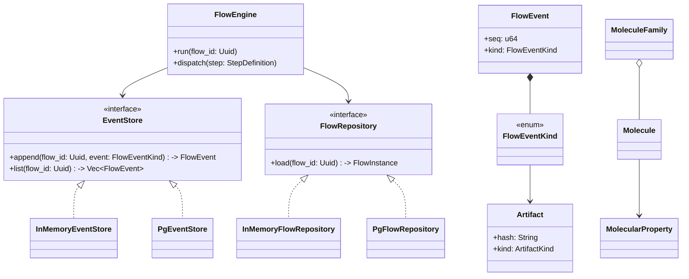
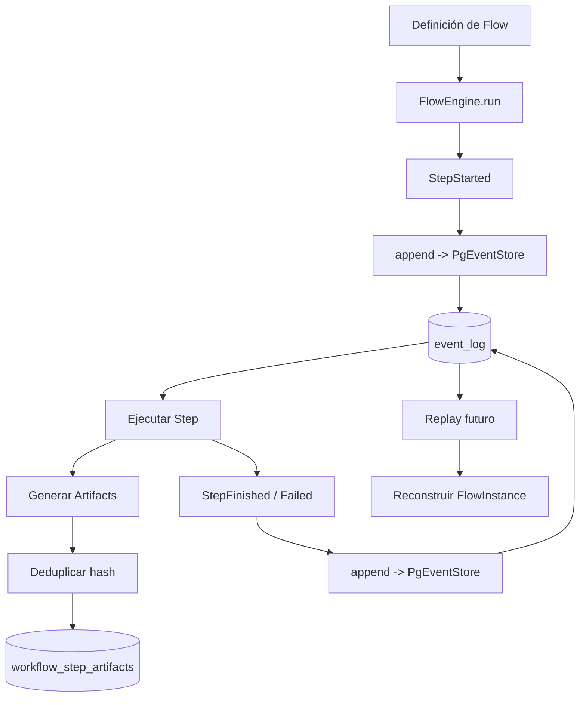

# F3 – Persistencia Event Sourcing Durable (Implementación Final)

Este documento sustituye el plan previo y refleja únicamente lo ya implementado en la fase F3.

## 1. Objetivo

Persistir los eventos del motor (`chem-core`) en Postgres (crate `chem-persistence`) con:

1. Replay idéntico al backend en memoria.
2. Determinismo de fingerprints finales y por step.
3. Orden total estable (`seq` BIGSERIAL) e inmutabilidad (append-only).
4. Deduplicación de artifacts por hash.

## 2. Relación con F1 y F2

F1 aportó entidades y hashing determinista desacoplados. F2 fijó el contrato de eventos y el motor determinista. F3 añade durabilidad implementando `EventStore` y `FlowRepository` sobre Postgres sin cambiar interfaces existentes.

## 3. Componentes Implementados

- Migraciones Diesel embebidas (`event_log`, `workflow_step_artifacts`).
- `PgEventStore` (append + list) serializando el enum completo a JSONB y `event_type` en lowercase con constraint.
- `PgFlowRepository` reutilizando la lógica de replay in-memory.
- Tabla de artifacts con `ON CONFLICT DO NOTHING` (deduplicación por `artifact_hash`).
- Wrapper `with_retry` (20/40/60 ms) para errores transitorios de serialización.
- `PersistenceError` con mapeo semántico de errores Diesel.

## 4. Esquema (DDL efectivo)

`event_log(seq BIGSERIAL PK, flow_id UUID, ts TIMESTAMPTZ DEFAULT now(), event_type TEXT CHECK(lowercase & set permitido), payload JSONB NOT NULL)` + índice `(flow_id, seq)`.

`workflow_step_artifacts(artifact_hash TEXT PK len=64, kind TEXT, payload JSONB, metadata JSONB NULL, produced_in_seq BIGINT FK->event_log(seq))` + índice `produced_in_seq`.

Sólo inserts; no rutas de UPDATE/DELETE en el código.

## 5. Serialización y Replay

Se persiste el JSON completo de cada variante. Replay = SELECT ordenado por `seq` → deserialización → reducción pura ya existente. `event_type` facilita validación y consultas específicas.

## 6. Tests (todos verdes)

- Paridad InMemory vs Postgres (secuencia y fingerprints).
- Fingerprint final idéntico (escenario dual backend).
- Secuencia contigua por flujo.
- Constraint `event_type` (rechazo de tipos inválidos).
- Deduplicación de artifacts.
- Round‑trip exhaustivo del enum.
- Migraciones aplicadas automáticamente.

## 7. Robustez

Reintentos controlados (`with_retry`) ante conflictos de serialización. Deduplicación limita crecimiento redundante. Errores clasificados para métricas futuras.

## 8. Snapshot de Esquema

Archivo: `documentation/snapshots/schema_f3.sql`.

Hash SHA256 actual: `7619e94a7f25c364516408324004cf223cf4db13fb347060d0492b791b7d284e`.

Uso: verificación de drift (comparación CI del hash declarado vs cálculo del dump vigente).

## 9. Alineación Arquitectónica

| Objetivo | Estado |
|----------|--------|
| Event sourcing tipado append-only | Cumplido |
| Determinismo / fingerprints | Cumplido |
| Reproducibilidad completa | Cumplido |
| Inmutabilidad | Cumplido |
| Auditoría (payload completo) | Cumplido |
| Recuperación por replay | Cumplido |
| Detección de drift esquema | Operativo (hash incrustado) |

## 10. Checklist Gate F3

- [x] Migraciones mínimas (`event_log`, `workflow_step_artifacts`).
- [x] Append & list Postgres.
- [x] Replay = memoria (paridad + fingerprint).
- [x] Deduplicación artifacts.
- [x] Reintentos transitorios.
- [x] Constraint `event_type` + test.
- [x] Round‑trip variantes enum.
- [x] Secuencia contigua.
- [x] Snapshot

Estado: GATE_F3 ALCANZADO.

## 11. Riesgos Residuales

| Riesgo | Mitigación futura |
|--------|-------------------|
| Crecimiento infinito de `event_log` | Snapshots / particionado (F4+). |
| Concurrencia futura (branching) | Advisory lock o secuencias por flujo. |
| Payload artifact incompleto | Ampliar schema y validaciones (F4). |

## 12. Próximos (No Bloqueantes)

1. Test CI que recalcula hash del snapshot.
2. Micro‑benchmark (10k eventos) baseline.
3. Diseño branching determinista y snapshots aceleradores.

## 13. Resumen Ejecutivo

`La persistencia Postgres vía Diesel reproduce exactamente la secuencia y fingerprints del backend en memoria sin alterar contratos de dominio ni core. La fase se considera cerrada; quedan optimizaciones evolutivas (snapshots, branching, performance) para siguientes fases.
`
Fin.

## 14. Diagrama de Clases (Vista Simplificada F1–F3)



## 15. Diagrama de Flujo (Ejecución + Persistencia)



## 16. Ejemplo de Uso (Código Simplificado)

```rust
use chem_core::{FlowEngine, InMemoryEventStore, InMemoryFlowRepository, FlowEventKind};
use chem_persistence::{PgEventStore, PgFlowRepository, PgPool};

fn ejemplo_replay(pg_pool: PgPool, flow_id: uuid::Uuid) -> anyhow::Result<()> {
	// 1. Ejecutar flujo con persistencia Postgres
	let pg_store = PgEventStore::new(pg_pool.clone());
	let pg_repo = PgFlowRepository::new(pg_pool.clone());
	let engine = FlowEngine::new(Box::new(pg_store), Box::new(pg_repo));
	engine.run(flow_id)?; // durante run: append de eventos StepStarted/StepFinished

	// 2. Listar eventos desde Postgres
	let pg_store2 = PgEventStore::new(pg_pool.clone());
	let events_pg = pg_store2.list(flow_id)?;

	// 3. Simular ejecución in-memory para comparar
	let mem_store = InMemoryEventStore::default();
	for ev in &events_pg { mem_store.append(flow_id, ev.kind.clone())?; }
	let events_mem = mem_store.list(flow_id)?;

	assert_eq!(events_pg.len(), events_mem.len());
	for (a,b) in events_pg.iter().zip(events_mem.iter()) {
		assert_eq!(a.kind, b.kind);
	}
	Ok(())
}
```

Notas:
- El ejemplo ilustra equivalencia de replays: eventos Postgres se reproyectan en un store in-memory y coinciden.
- En la implementación real `FlowEngine.run` genera los eventos; aquí se asume ya existen definiciones de steps deterministas.

