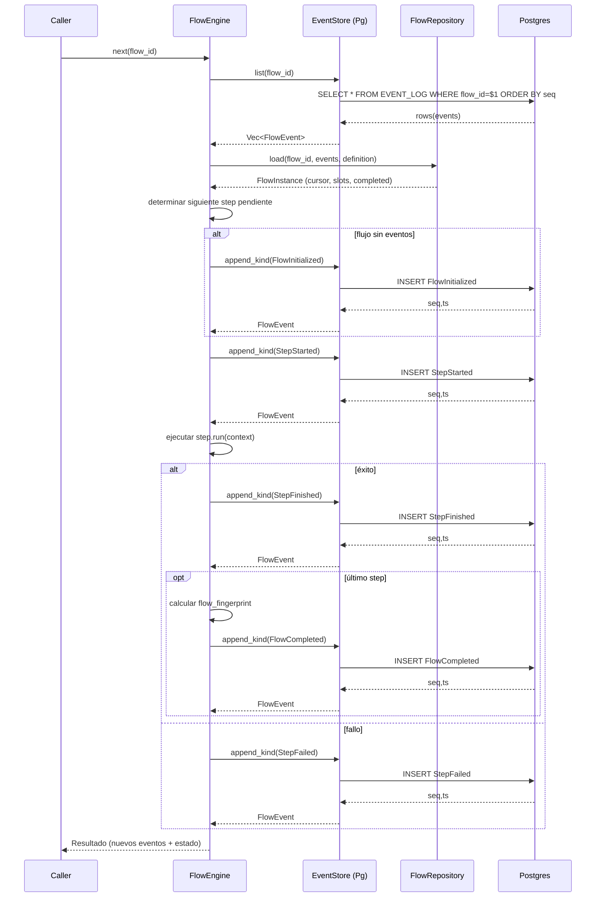
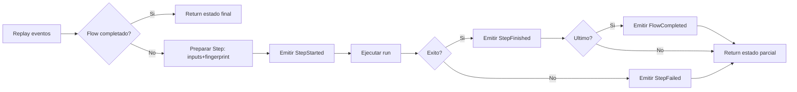
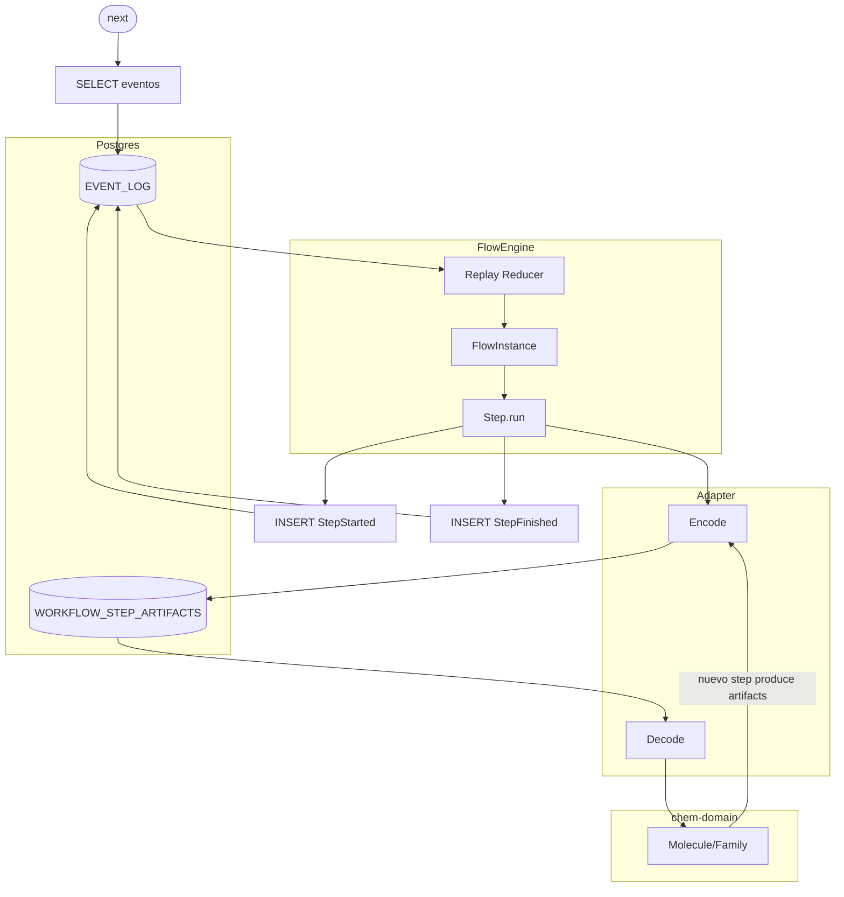

### F3 – Persistencia In-Memory Contratada

| Núcleo                                                     | Contrato Estabilizado      | GATE_F3                     | Paralelo Seguro               |
| ---------------------------------------------------------- | -------------------------- | --------------------------- | ----------------------------- |
| Traits EventStore / FlowRepository + impl memoria + replay | Esquema tablas core fijado | Rehidratación DB == memoria | Diseño preliminar esquema SQL |

Objetivos Clave:

- Durabilidad y equivalencia con backend memoria.
- Aislar mapeos dominio↔filas.

Pasos sugeridos:

1. Migración transaccional inicial.
2. Implementar repos Postgres con transacciones atómicas.
3. Test equivalencia (fingerprint final).
4. Índices secuenciales (flow_id, seq).
5. Manejo de errores transitorios (retry simple).
6. Revisión de tipos (UUID, timestamptz).
7. Snapshot esquema documentado.

GATE_F3:

- Replay DB = Replay memoria.
- Sin divergencias en eventos.

---

## 1. Contexto Actual del Proyecto (Resumen Observado)

- Ya existen crates: `chem-core` (motor lineal + eventos), `chem-domain` (tipos químicos), `chem-engine` (wrapper Python), adaptadores y CLI esqueleto.
- Persistencia actual: implementación in-memory (se infiere por traits en core) para `EventStore` y `FlowRepository` (replay determinista) — todavía no hay capa Postgres.
- Documentación de esquema futuro (sección 12, 04) describe más tablas de las necesarias para F3; para cerrar F3 necesitamos SOLO el subconjunto mínimo que permita: (a) almacenar eventos append-only, (b) reconstruir `FlowInstance` fiel, (c) almacenar artifacts producidos por steps (para verificaciones de equivalencia si se requiere), (d) garantizar orden & sincronía.

## 2. Alcance Concretado de F3 (Recorte Pragmatico)

Incluir en F3 (mínimo viable para GATE_F3):
1. Tabla `EVENT_LOG` (append-only) con: `seq BIGSERIAL PK`, `flow_id UUID NOT NULL`, `ts TIMESTAMPTZ NOT NULL DEFAULT now()`, `step_id UUID NULL`, `event_type TEXT NOT NULL`, `payload JSONB NOT NULL` (payload canónico del evento tipado), índices: `(flow_id, seq)` btree, opcional parcial por `event_type` para queries específicas.
2. Tabla `WORKFLOW_STEP_ARTIFACTS` (persistencia de artifacts opcional pero útil): `artifact_hash TEXT PK`, `kind TEXT NOT NULL`, `payload JSONB NOT NULL`, `metadata JSONB NULL`, `produced_in_seq BIGINT NOT NULL REFERENCES EVENT_LOG(seq)` (integridad temporal). Índice por `(produced_in_seq)`.
3. (Opcional F3 si ya se necesita) Tabla `WORKFLOW_STEP_EXECUTIONS` muy reducida: `execution_id UUID PK`, `flow_id UUID NOT NULL`, `step_index INT NOT NULL`, `step_id TEXT NOT NULL`, `parameter_hash TEXT NOT NULL`, `status TEXT NOT NULL`, `started_at TIMESTAMPTZ`, `finished_at TIMESTAMPTZ`. Clave única: `(flow_id, step_index)` para simplificar queries de replay cross-check.

Diferido a F4+: ramas, retries enriquecidos, errores detallados, proyecciones de propiedades dominio, agregados.

## 3. Principios / Criterios de Diseño para los Contratos DB

1. Determinismo: Replay desde DB produce EXACTAMENTE la misma lista de `FlowEventKind` que el backend en memoria (byte-for-byte al serializar canonical JSON de payload). 
2. Atomicidad: Cada evento se inserta en una transacción que garantiza que `seq` y la fila `EVENT_LOG` están visibles juntos — no se permite insertar artifacts sin su evento productor.
3. Inmutabilidad: No se permiten UPDATE/DELETE sobre `EVENT_LOG` ni `WORKFLOW_STEP_ARTIFACTS` (enforcement: revocar privilegios, no exponer endpoints mutadores, opcional: usar política row-level o triggers que rechacen updates).
4. Aislamiento: Lecturas de replay usan snapshot (`READ COMMITTED` es suficiente si sólo hay append; evaluar `REPEATABLE READ` si se planea branching concurrente en F4).
5. Idempotencia de Inserción: Implementar guardas para no volver a insertar eventos si ya se persistió un `FlowInitialized` con seq=1 para un `flow_id` (opcional lock asesor `pg_advisory_xact_lock(hash(flow_id))`).
6. Canonical JSON: Serialización central (reutilizar módulo `hashing::canonical_json`) antes de persistir, evitando divergencias por orden de claves.
7. Tipos Fuertes: `UUID` para ids, `TIMESTAMPTZ` para tiempos, `TEXT` sólo para enumeraciones con validación (usar CHECK constraint enumerando event types permitidos en F3).
8. Integridad Hash: Si se persisten artifacts, validar que `artifact_hash == blake3(canonical(payload))` previo a INSERT (lado Rust) + constraint `CHECK (length(artifact_hash) = 64)` (asumiendo hex blake3 de 32 bytes → 64 chars).
9. SLO Rehidratación: Replay de N eventos escala O(N) sin joins (SELECT * FROM EVENT_LOG WHERE flow_id = $1 ORDER BY seq ASC).
10. Portabilidad: Evitar características no estándar (sin `IDENTITY` compleja). Usar `BIGSERIAL` / `DEFAULT gen_random_uuid()` (extensión `pgcrypto` si se habilita) explicitando migración.

## 4. Estrategia de Herramientas (Autogeneración y Seguridad)

Evaluación opciones:
- `sqlx` (async, macros de verificación offline, migraciones integradas) → Favorece comprobación en compile-time de consultas (sqlx data.json). Recomendado.
- `refinery` (gestión migraciones en Rust; menos verificación de queries). 
- `diesel` (schema inferido, fuerte tipado, pero puede ser pesado para patrón append-only y JSONB flexible).
- `SeaORM` (similar a Diesel en propósito, overhead mayor para fase mínima).

Decisión propuesta: `sqlx` + migraciones en carpeta `migrations/` (ya existe `0001_init.sql`). Añadir script para compilar offline `cargo sqlx prepare --workspace -- --all-features` generando `sqlx-data.json` (asegura queries chequeadas sin depender de runtime DB en CI). 

Seguridad adicional: preparar roles: `chemflow_app` (INSERT/SELECT) y `chemflow_readonly` (SELECT). Las migraciones crean tablas y conceden permisos mínimos.

## 5. Fases Detalladas (Plan Paso a Paso)

### Fase 0 – Inventario y Congelación de Contratos In-Memory
1. Revisar trait `EventStore` y `FlowRepository` actuales (añadir doc comments precisos: garantías de orden, atomicidad requerida). 
2. Agregar pruebas que: (a) generen un flow con K steps y registren eventos (b) serialicen a JSON canónico (c) snapshot textual (asegura baseline antes de DB).
3. Definir formato de payload persistido: `{ "version": <engine_version>, "kind": "StepStarted", "data": { ... } }` (con campo `version` congelado para replays futuros / migraciones).
4. Añadir enum exhaustivo de event types aceptables en F3 para constraint DB.

### Fase 1 – Diseño Esquema Mínimo v1
5. Redactar archivo `docs/persistence/f3_schema_min.md` (o ampliar esta tarea) con DDL propuesto (subset secciones 04 y 12) – esto se convertirá en `0002_event_log.sql`.
6. Validar mapping: cada variante de `FlowEventKind` → shape JSON (lista llaves ordenadas) + test que genera canonical JSON y compara con fixture.

### Fase 2 – Migraciones
7. Crear migración `0002_event_log.sql`:
	 - Crear extensión `pgcrypto` si no existe (para `gen_random_uuid()` si se usa en artifacts).
	 - Tabla `EVENT_LOG` + índices.
	 - CHECK `event_type IN (...)`.
8. Crear migración `0003_step_artifacts.sql` (si se incluye en F3): tabla y FK a `EVENT_LOG(seq)` (ON DELETE RESTRICT).
9. (Opcional) `0004_step_executions.sql` mínima.
10. Añadir script local `dev_db.sh` que levante `docker compose up` y ejecute migraciones con `sqlx migrate run` (si no existe el flujo).

### Fase 3 – Capa de Abstracción Rust
11. Crear nuevo crate `chem-persistence` (ya existe esqueleto) con módulo `postgres` exportando structs:
		- `PgEventStore` (implementa `EventStore`).
		- `PgFlowRepository` (implementa `FlowRepository`).
12. Definir interfaz interna `trait PgConnectionProvider { fn conn(&self) -> &PgPool; }` para facilitar pruebas in-memory vs real.
13. Añadir función de inicialización `init_persistence(pool) -> Result<PersistenceHandles, PersistenceError>` que corre `sqlx::migrate!()` y devuelve handles.
14. Crear `PersistenceError` (`thiserror`) diferenciando: `Transient`, `Integrity`, `Serialization`, `Unknown`.

### Fase 4 – Implementación `PgEventStore`
15. Método `append_kind(flow_id, kind)` abre transacción:
		a. Serializa evento a canonical JSON (payload).
		b. Inserta: `INSERT INTO EVENT_LOG (flow_id, step_id, event_type, payload) VALUES ($1,$2,$3,$4) RETURNING seq, ts`.
		c. Construye struct de evento en memoria con los datos devueltos.
16. Añadir (opcional) lock asesor por `flow_id` para prevenir mezcla de secuencias concurrentes cruzadas (decisión: no imprescindible si evento seq es global, pero simplifica invariantes de orden relativo por flow).
17. Logging interno de latencias (tracing span `event.append`).

### Fase 5 – Implementación `PgFlowRepository`
18. `list(flow_id)` ejecuta: `SELECT seq, flow_id, step_id, ts, event_type, payload FROM EVENT_LOG WHERE flow_id=$1 ORDER BY seq` y deserializa `payload.kind == event_type` (assert). 
19. Test: comparar vectores de eventos devueltos con la versión InMemory (usar generador de flows sintéticos deterministas). 
20. Stress test pequeño: 10k eventos → tiempo de replay medido & assertion < umbral (p.ej. 200ms en dev — valor documentado, no gate duro).

### Fase 6 – Persistencia de Artifacts (Opcional en F3 si ya añadimos tabla)
21. Extender engine para callback cuando un `StepFinished` existe: registrar artifacts vía `ArtifactStore` trait (nuevo) implementado por memoria y Postgres.
22. Constraint: Insert sólo si hash no existe (ON CONFLICT DO NOTHING) para deduplicar.
23. Test: outputs idénticos multi-run no crean filas duplicadas.

### Fase 7 – Manejo de Errores / Retries Transitorios a Nivel DB
24. Clasificar errores `sqlx::Error` → transient (e.g. `PoolTimedOut`, `Io`, `Database(SerializationFailure/DeadlockDetected)`) vs definitivos.
25. Implementar wrapper `retry_async(max=3, backoff=exp jitter)` únicamente para `append` y `list` (lectura puede reintentarse con consistencia eventual; eventos son append-only).
26. Métrica (temporal, log) de nº de reintentos.

### Fase 8 – Tipos y Validación Extra
27. Añadir test que valida CHECK constraint de `event_type` falla si se intenta insertar un tipo desconocido (usar SQL manual en test para confirmar).
28. Test de integridad: `artifact_hash` hex válido (regex) previo a insert.

### Fase 9 – Pruebas de Equivalencia (CORE del Gate)
29. Escenario: crear flow determinista con N=5 steps, ejecutar dos veces contra InMemory (baseline), capturar secuencia A y fingerprint final.
30. Ejecutar la misma definición usando `PgEventStore`, capturar secuencia B.
31. Assert: A == B (orden, tipos, fingerprints), y fingerprint final coincide.
32. Ejecutar mezcla: primera mitad InMemory, luego migrar (simulate switch) rehidratando desde DB → secuencia conjunta consistente.

### Fase 10 – Snapshot de Esquema / Documentación
33. Generar script `scripts/dump_schema.sh` que ejecute `pg_dump --schema-only` filtrado a tablas F3 → guardar snapshot (`documentation/snapshots/schema_f3.sql`).
34. Añadir sección a este archivo (#F3 Snapshot) con hash SHA256 del archivo `schema_f3.sql` para detectar cambios no planeados.

### Fase 11 – Observabilidad Mínima
35. Integrar `tracing` spans en: `append_kind`, `list`, `artifact_insert` con campos: flow_id, event_type, seq (post-return).
36. Log de advertencia si dif entre reloj local y `ts` DB > 100ms (posible skew/latencia).

### Fase 12 – Hardening Ligero
37. Crear rol read-only; test de conexión con credenciales RO asegurando que no puede `INSERT` (test dev opcional usando transacción abortada).
38. Script verificación de migraciones: ejecutar `sqlx migrate info` y fallar CI si hay migraciones "applied - missing" (control de drift).

### Fase 13 – Cierre (Gate Checklist)
39. Checklist automático en test: (a) `replay_equivalence_passed`, (b) `schema_hash_match`, (c) `read_only_role_enforced`, (d) `event_type_constraint_enforced`.
40. Marcar versión crate `chem-core` bump patch + CHANGELOG sección F3.
41. Tag git: `f3-persistence-achieved`.

## 6. Estructura de Carpetas / Archivos Nuevos Propuestos

```
crates/chem-persistence/
	src/
		lib.rs
		error.rs
		postgres/
			mod.rs
			event_store.rs
			flow_repository.rs
			artifact_store.rs (opc)
	tests/
		equivalence_replay.rs
		artifact_dedup.rs (opc)
documentation/snapshots/schema_f3.sql
scripts/dump_schema.sh
```

## 7. Riesgos y Mitigaciones

| Riesgo | Impacto | Mitigación |
|--------|---------|------------|
| Divergencia de serialización JSON | Replay no coincide | Función central canonical_json + test snapshot evento → JSON |
| Secuencia no determinista bajo concurrencia | Orden distinto en flows | Lock asesor / garantizar single producer por flow en F3 |
| Crecimiento de EVENT_LOG sin partición | Rendimiento degrade replays largos | Diferir particionado a F5; añadir índice (flow_id, seq) ya cubre scans |
| Errores transitorios (deadlocks) | Fallos espurios | Retry wrapper con backoff exponencial |
| Cambios accidentales de esquema | Incompatibilidades | Snapshot hash + revisión PR obligatoria |
| Inserción de tipo evento inválido | Corrupción semántica | CHECK constraint + enum codificado |

## 8. Métricas de Validación (No Gate Duro, Sólo Indicadores)

- Latencia append (p50) < 5ms local dev.
- Replay 10k eventos < 250ms (máquina dev). 
- 0 divergencias fingerprint en 100 ejecuciones stress (loop test). 

## 9. Librerías / Dependencias a Añadir

- `sqlx = { version = "*", features = ["runtime-tokio", "postgres", "uuid", "json", "chrono", "macros"] }`
- `tracing`, `tracing-subscriber` (si no presentes).
- `thiserror` para `PersistenceError`.
- `serde_json` ya presente (reutilizar).
- (Opc) `backoff` o implementación ligera propia.

## 10. Definición Formal de GATE_F3 (Refinada)

Se declara completado F3 cuando TODOS los siguientes checks están verdes en CI:
1. Test `replay_equivalence_replay_mem_vs_pg` pasa (A==B eventos y fingerprints).
2. Test `event_payload_canonical_snapshot` pasa (sin diffs).
3. Test `artifact_dedup` (si artifacts incluidos) pasa.
4. Script `dump_schema.sh` actualizado y hash en este archivo coincide.
5. `sqlx migrate run` y luego `sqlx migrate info` sin migraciones faltantes.
6. `cargo clippy` sin nuevas advertencias (nivel configurado F0).
7. Documentación (esta tarea) actualizada con versión final de pasos marcando completado.

## 11. Siguientes Pasos Posteriores (Paralelo Seguro post GATE)

- Diseño preliminar de tablas branching / retries ampliadas (sin implementación en core todavía).
- Proyección para analytics (vista materializada conteo eventos por tipo). 
- Evaluación de compresión (TOAST / pglz vs external store) para payloads grandes (en F4+).

---

Fin del plan detallado F3.

---

## 12. Aclaraciones Clave Sobre Responsabilidades y Dependencias (Preocupación del Autor)

### 12.1 Dirección de Dependencias (Regla de Oro)

```
chem-domain  ─┐
							│        (NO depende de DB)
chem-core    ─┴──► (traits EventStore / FlowRepository) ◄── chem-persistence (Postgres impl)
																				▲
																				│ (tests de integración ensamblan)
																	 chem-cli / bin
```

1. `chem-core` DEFINE los contratos (traits) pero NO conoce Postgres ni migraciones.
2. `chem-persistence` IMPLEMENTA esos traits y **depende** de `chem-core` (unidireccional).
3. `chem-domain` permanece completamente ajeno a persistencia; sólo se convierte a artifacts vía adaptadores en fases posteriores.
4. Migraciones (archivos `migrations/*.sql`) son propiedad exclusiva del crate / bin que arranca la infraestructura (puede estar en la raíz del workspace o dentro de `chem-persistence` si se decide). Core jamás las importa en compile time.

### 12.2 ¿Dónde viven las migraciones?

Opción recomendada F3: mantenerlas en la raíz (ya existe `migrations/`). `chem-persistence` incluye un módulo `migrate` que llama a `sqlx::migrate!("../migrations")` (ruta relativa resuelta en build). Alternativa: moverlas dentro de `crates/chem-persistence/migrations`; en ese caso actualizar scripts. Criterio: Core no debe tener `mod migrations` ni referirse a rutas SQL.

### 12.3 Evitar Fugas de Tipos de DB

Prohibido en F3:
- Usar `sqlx::types::*` en firmas públicas de traits en `chem-core`.
- Devolver `PgPool` / `Pool<Postgres>` en APIs de core.
- Añadir funciones que hagan `BEGIN/COMMIT` dentro de core; la transaccionalidad se encapsula en la implementación concreta.

Permitido:
- En `chem-persistence`, structs privados que manejan transacciones internas y sólo exponen los tipos de dominio y eventos ya definidos.

### 12.4 Archivos / Módulos a Crear y Contenido Esperado

```
crates/chem-persistence/
	Cargo.toml                # depende de sqlx, thiserror, tracing
	src/lib.rs                # re-exporta módulos públicos controlados
	src/error.rs              # PersistenceError + mapeos a sqlx::Error
	src/postgres/mod.rs       # pub mod event_store; pub mod flow_repository; (opc) artifact_store; migrate
	src/postgres/event_store.rs       # impl PgEventStore { append_kind } + EventStore trait impl
	src/postgres/flow_repository.rs   # impl PgFlowRepository { list } + FlowRepository trait impl
	src/postgres/artifact_store.rs    # (opcional) ArtifactStore trait + impl
	src/postgres/migrate.rs           # fn run_migrations(pool: &PgPool) -> Result<(), PersistenceError>
tests/
	replay_equivalence.rs     # usa core + in-memory vs pg
	artifact_dedup.rs         # (si artifacts incluidos)
	schema_guard.rs           # compara hash dump esquema
```

### 12.5 Feature Flags (Opcionales para Aislar Dependencias)

Agregar en `chem-core` (si se desea máxima pureza) un feature `persistence-pg` que sólo habilite código auxiliar para tests de integración (no necesario estrictamente en F3, pero documentado). Simpler: no añadir flag todavía y mantener core sin referencia a persistence.

### 12.6 Estrategia de Pruebas (Capas)

| Nivel | Objetivo | Herramientas | Data Setup |
|-------|----------|--------------|------------|
| Unit (core) | Determinismo in-memory | cargo test en `chem-core` | No DB |
| Unit (persistence) | Traducción evento ↔ fila | sqlx macros + pool transitorio | Migraciones aplicadas en test setup |
| Integration Replay | Equivalencia secuencia | docker postgres + sqlx migrate | Generar flow sintético determinista |
| Schema Snapshot | Detección drift | `pg_dump --schema-only` | DB luego de migrar |
| Concurrency Light | Orden y atomicidad | spawn tasks append | DB viva, asserts monotonicidad seq |

### 12.7 Cómo Probar Sin Introducir Dependencia Cíclica

En tests de `chem-persistence` se importa `chem-core` para obtener los tipos `FlowEventKind`, etc. Nunca al revés. Para ejecutar un flujo real en integración:
1. Construir `FlowDefinition` de ejemplo en test.
2. Ejecutar con `InMemoryEventStore` capturando baseline.
3. Ejecutar con `PgEventStore` reutilizando la misma definición.
4. Comparar vectores de `FlowEvent` serializados canonical.

### 12.8 Inicialización en Runtime (Bootstrap)

`chem-cli` (o bin principal) orquesta:
1. Lee configuración (URL Postgres) → crea `PgPool`.
2. Llama `chem_persistence::postgres::migrate::run_migrations(&pool)`.
3. Construye `PgEventStore` y `PgFlowRepository`.
4. Inyecta (trait objects o genéricos) en `FlowEngine` builder (si existe) o wrapper que ejecuta steps.

Core no hace pasos 1–3; sólo recibe objetos que implementan los traits.

### 12.9 Política de Migraciones

- Cada cambio estructural = nueva migración incremental `00XX_*.sql` (nunca reescribir anteriores).
- Prohibido editar `0001_init.sql` retroactivamente (si hay error → nueva migración correctiva).
- Naming: `0002_event_log_min.sql`, `0003_step_artifacts.sql`.
- Validación CI: ejecutar `sqlx migrate run` en base vacía + comparar hash del dump.

### 12.10 Qué Sí se Implementa EXACTAMENTE en F3

Incluido:
1. Migraciones mínimas (EVENT_LOG + opcional ARTIFACTS). 
2. Implementaciones Postgres de `EventStore` y `FlowRepository` con equivalencia probada.
3. Retry transitorio simple (máx 3) para `append` & `list`.
4. Tests de equivalencia y snapshot de eventos / esquema.


### 12.11 Check de Independencia (Automatizable)

Añadir script (o make target) que ejecute:
```
cargo tree -i chem-persistence | grep chem-core   # Debe mostrar dependencia (correcto)
cargo tree -i chem-core | grep chem-persistence   # Debe estar vacío (core no depende)
```
Falla CI si el segundo comando encuentra coincidencias.

### 12.12 Patrón de Inyección (Ejemplo Simplificado)

```rust
// En bin / CLI
let pool = PgPool::connect(&cfg.database_url).await?;
chem_persistence::postgres::migrate::run_migrations(&pool).await?;
let event_store = PgEventStore::new(pool.clone());
let repo = PgFlowRepository::new(pool.clone());
let engine = FlowEngine::new(Box::new(event_store), Box::new(repo));
```

`FlowEngine` sigue aceptando cualquier implementador; tests pueden pasar la versión in-memory sin re-compilar.

### 12.13 Resumen Anti-Errores

- NO: `use sqlx` dentro de `chem-core`.
- NO: pasar `PgPool` hacia capas de dominio.
- NO: construir SQL dinámico en core.
- SÍ: centralizar serialización payload antes de persistir.
- SÍ: validar string enumeraciones contra lista cerrada antes de insert.

---
## 13. Diagramas de Flujo: Orden de Operaciones DB (Ejecución, Replay y Acceso Artifacts)

Esta sección NO introduce nuevas tareas obligatorias en F3; clarifica el modelo de interacción entre motor, persistencia y (futuro) dominio para que la implementación sea consistente y extensible.

### 13.1 Secuencia detallada de `engine.next(flow_id)`



Notas:
- Cada `append_kind` es una transacción corta independiente (append-only). Atomicidad StepStarted/StepFinished conjunta se puede evaluar en F4 si se desea transacción envolvente.
- Si la ejecución del step es larga, el evento StepStarted materializa estado observable anticipadamente.

### 13.2 Flujo de control lógico (vista simplificada)



### 13.3 Replay completo (reconstrucción de estado)

1. SELECT ordenado por `seq`.
2. Reducir eventos → `FlowInstance` (pure function).
3. No se consultan otras tablas para estado esencial (F3) → idempotente.

### 13.4 Recuperar estado de un step específico

Método base (F3): replay completo y tomar `steps[index]`.

Optimización futura: índice parcial sobre JSONB y replay filtrado por `step_index` (sin implementarse en F3).

### 13.5 "Guardar estado" del flujo

No existe snapshot; el estado vivo ES la secuencia de eventos. Guardar = emitir nuevos eventos. No hay UPDATEs.

### 13.6 Acceso / persistencia de artifacts sin acoplar dominio

1. Step de dominio produce `Artifact` neutral (payload JSON, kind, hash).
2. Core emite StepFinished y (opcional) inserta fila en `WORKFLOW_STEP_ARTIFACTS` con `artifact_hash`.
3. Otro step obtiene artifact via replay (hash referenciado) → adaptador lo deserializa a tipos de dominio. Core ignora semántica química.

### 13.7 Interacción futura con datos moleculares

Cuando se persistan moléculas en tablas dedicadas (F4+), esas tablas serán gestionadas por un adaptador/servicio de dominio. El Core seguirá usando sólo artifacts; la DB de eventos no consulta directamente `MOLECULES` para replay.

### 13.8 Tabla "quién conoce qué" (recordatorio)

| Capa | Conoce | Ignora |
|------|--------|--------|
| Core | Eventos, orden, fingerprint alg. | Estructura interna de moléculas |
| Persistence | Tablas EVENT_LOG / ARTIFACTS | Reglas químicas | 
| Domain | Invariantes unidad / hash familia | Forma interna EVENT_LOG |
| Adaptador | Mapping dominio↔Artifact | Estrategia de índices EVENT_LOG |

### 13.9 Extensión opcional futura: snapshots

Agregar `FLOW_SNAPSHOTS` cada K eventos para acelerar replay masivo sin cambiar contrato; snapshot = función pura(events[0..k]).

### 13.10 Diagrama Unificado (Ejecución + Replay + Artifact)



### 13.11 Resumen

1. El orden de la base de datos está definido únicamente por `seq` en `EVENT_LOG`.
2. Replay = SELECT ordenado + reducción pura.
3. Estado puntual de un step: subproducto del replay.
4. Persistencia de datos de dominio ocurre vía artifacts neutros; no rompe aislamiento.
5. Optimizaciones futuras (snapshots, índices JSONB) no cambian el contrato base.

---