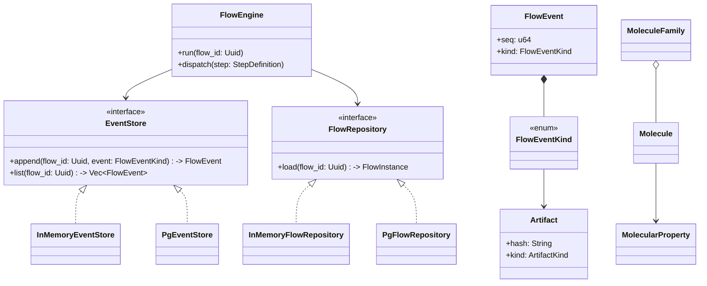
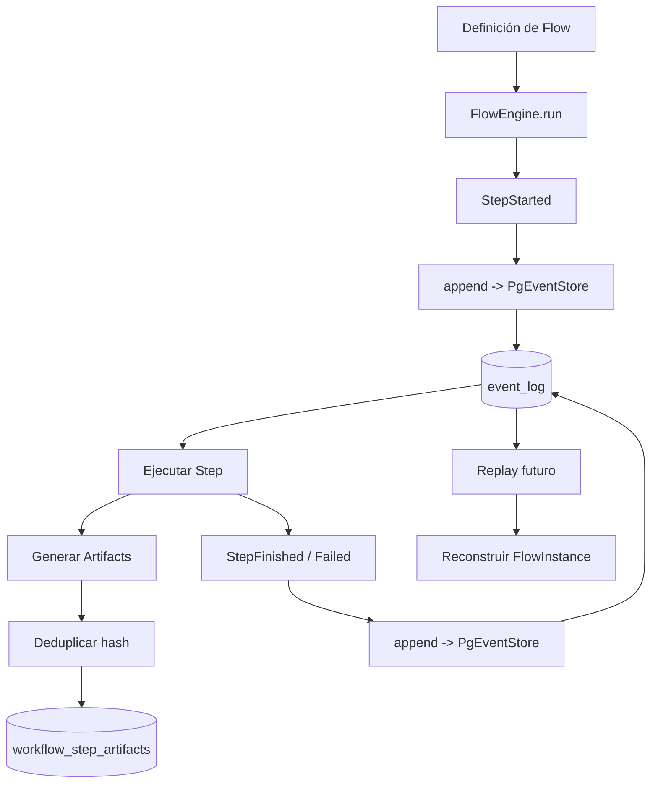

# F3 – Persistencia Event Sourcing Durable (Estado actual)

Este documento describe la implementación de persistencia duradera con Postgres para el motor determinista (F2), y cómo se integran las interfaces `EventStore` y `FlowRepository` con el `FlowEngine`.

## 1) Objetivo

Persistir los eventos del flujo en Postgres (crate `chem-persistence`) manteniendo:

- Paridad con el backend en memoria (replay da el mismo estado y huellas).
- Determinismo de fingerprints por step y agregado del flow.
- Orden total estable e inmutabilidad del log (append-only por `seq`).
- Deduplicación de artifacts por hash (opcional, por tabla auxiliar).

## 2) Resumen del flujo (F2)

Conceptos clave del `chem-core` que sustentan F3:

- Steps deterministas: el primer step debe ser `Source`; luego `Transform`/`Sink`. Cada `StepDefinition::run` recibe un `ExecutionContext` con input y params y devuelve un `StepRunResult` (Success/Failure, con outputs y señales opcionales).
- Artifacts neutrales: JSON + hash canónico calculado por el engine; sirven para encadenar steps y deduplicar.
- Fingerprints: para cada `StepFinished` se calcula un hash estable a partir de engine_version, step_id, hashes de input ordenados, params canonizados y definition_hash. El fingerprint agregado del flow hashéa en orden estable todos los fingerprints de `StepFinished`.
- Secuencia de eventos: el engine emite `FlowInitialized`, `StepStarted`, `StepFinished`/`StepFailed`, `StepSignal` y al final `FlowCompleted { flow_fingerprint }` cuando todos los steps terminaron ok.

## 3) Interfaces de persistencia y repositorio

- EventStore (append-only):
  - `append_kind(flow_id, FlowEventKind)` agrega un evento con `seq` y `ts`.
  - `list(flow_id) -> Vec<FlowEvent>` devuelve la secuencia completa en orden.
  - Implementaciones: `InMemoryEventStore` y `PgEventStore` (sobre Postgres).

- FlowRepository (replay):
  - `load(flow_id, &events, &definition) -> FlowInstance` reconstruye el estado (cursor, estados por step, completado) aplicando la secuencia de eventos.
  - Implementaciones: `InMemoryFlowRepository` y `PgFlowRepository` (reusa la lógica in-memory para mantener paridad).

- Definiciones y tipos:
  - `FlowDefinition` captura el orden de steps y su `definition_hash` (derivado de los ids en orden); puede construirse con `build_flow_definition_auto(steps)`.
  - `FlowInstance` representa el estado reconstruido; cada slot de step tiene un `StepStatus` (Pending/Running/FinishedOk/Failed).

## 4) API del FlowEngine y ergonomía

Modos de uso principales:

- In-memory (ergonómico):
  - `FlowEngine::new().firstStep(...).add_step(...).build()` crea un engine con stores in-memory.
  - Métodos de ejecución: `run_to_end()` y `next()` operan sobre el flow por defecto (id generado, definición cargada).
  - Lecturas sin id: `events()`, `event_variants()`, `flow_fingerprint()`, `last_step_output("step_id")` acceden al flow por defecto.

- Genérico con stores personalizados (ej. Postgres):
  - `FlowEngine::builder(event_store, repository).firstStep(...).add_step(...).build()`.
  - Opcional: `set_default_flow_name("...")`.
  - Ejecución: `run_to_end_default_flow()` genera/usa un `flow_id` por defecto.
  - Lecturas concisas (sin id): `events()`, `event_variants()`, `flow_fingerprint()` y `last_step_output(...)` funcionan igual que en in-memory, ahora disponibles de forma genérica.

Notas:

- También existen constructores utilitarios: `new_with_stores(...)`, `new_with_definition(...)`, `new_with_steps(...)`/`_named(...)`.
- Si se requieren lecturas para un `flow_id` específico, siguen disponibles `events_for(id)`, `event_variants_for(id)`, `flow_fingerprint_for(id)`, etc.

## 5) Postgres: wiring y migraciones

- Conexión y provider:
  - `build_dev_pool_from_env()` crea un pool `r2d2` leyendo `DATABASE_URL` y parámetros de tamaño.
  - `PoolProvider { pool }` implementa un `ConnectionProvider` para pasar al `PgEventStore`.

- Implementaciones:
  - `PgEventStore`: inserta en `event_log` y lista por `flow_id` (ordenado por `seq`). Serializa `FlowEventKind` en JSONB y mantiene `event_type` en minúsculas con constraint.
  - `PgFlowRepository`: mantiene paridad de replay reutilizando la lógica in-memory.

- Migraciones Diesel (embebidas): se aplican al inicializar el pool. Esquema efectivo:

```sql
-- EVENT_LOG: registro append-only de eventos del motor
CREATE EXTENSION IF NOT EXISTS pgcrypto;

CREATE TABLE IF NOT EXISTS event_log (
  seq BIGSERIAL PRIMARY KEY,
  flow_id UUID NOT NULL,
  ts TIMESTAMPTZ NOT NULL DEFAULT now(),
  event_type TEXT NOT NULL CHECK (event_type = lower(event_type)) CHECK (event_type IN (
    'flowinitialized','stepstarted','stepfinished','stepfailed','stepsignal','flowcompleted'
  )),
  payload JSONB NOT NULL
);

CREATE INDEX IF NOT EXISTS idx_event_log_flow_seq ON event_log(flow_id, seq);
```

```sql
-- Tabla opcional (deduplicación de artifacts por hash)
CREATE TABLE IF NOT EXISTS workflow_step_artifacts (
  artifact_hash TEXT PRIMARY KEY CHECK (length(artifact_hash)=64),
  kind TEXT NOT NULL,
  payload JSONB NOT NULL,
  metadata JSONB NULL,
  produced_in_seq BIGINT NOT NULL REFERENCES event_log(seq) ON DELETE RESTRICT
);
CREATE INDEX IF NOT EXISTS idx_artifacts_seq ON workflow_step_artifacts(produced_in_seq);
```

## 6) Determinismo y paridad

- El `definition_hash` depende sólo del orden de ids de los steps. Cambiar parámetros internos no lo altera; cambiar el orden sí.
- Los fingerprints por step son estables dada la misma definición, inputs y params canónicos.
- El fingerprint agregado del flow se deriva de todos los `StepFinished` y es estable entre ejecuciones equivalentes (mismo `flow_id` o distintos engines sobre el mismo backend).
- La secuencia compacta de variantes `I,S,F,X,G,C` permite asserts sencillos (API: `event_variants()` / `event_variants_for(id)`).

## 7) Ejemplos de uso

- In-memory:

```rust
let mut engine = FlowEngine::new()
  .firstStep(SeedStep::new("Hola".to_string()))
  .add_step(SplitStep::new())
  .add_step(PrintAndCountStep::new())
  .build();

engine.set_name("demo_chars");
engine.run_to_end()?;
println!("{:?}", engine.event_variants());
println!("fp={:?}", engine.flow_fingerprint());
```

- Postgres (pasando stores por constructor):

```rust
let pool = build_dev_pool_from_env()?;
let provider = PoolProvider { pool };
let event_store = PgEventStore::new(provider);
let repository = PgFlowRepository::new();

let mut engine = FlowEngine::builder(event_store, repository)
  .firstStep(SeedStep::new("HolaPG".to_string()))
  .add_step(SplitStep::new())
  .add_step(PrintAndCountStep::new())
  .build();

engine.set_default_flow_name("demo_pg_chars");
engine.run_to_end_default_flow()?;
println!("{:?}", engine.event_variants());
println!("fp={:?}", engine.flow_fingerprint());
```

## 8) Errores y límites conocidos

- `CoreEngineError` modela condiciones terminales: `FlowCompleted`, `FlowHasFailed`, `MissingInputs`, etc. El engine deja de avanzar ante fallos y emite `StepFailed`.
- `PersistenceError` encapsula errores de Diesel/DB; algunas condiciones transitorias pueden recuperarse reintentando en la capa de infraestructura.
- La tabla de artifacts es opcional y puede diferirse si no se requiere persistir payloads.

## 9) Conclusión

La capa F3 agrega durabilidad manteniendo intactos los contratos del core. La API del engine ofrece una experiencia uniforme (con o sin Postgres), incluyendo atajos sin `flow_id` para el flow por defecto. La paridad con in-memory asegura reproducibilidad y facilita pruebas y migraciones de backend.
`event_log(seq BIGSERIAL PK, flow_id UUID, ts TIMESTAMPTZ DEFAULT now(), event_type TEXT CHECK(lowercase & set permitido), payload JSONB NOT NULL)` + índice `(flow_id, seq)`.

`workflow_step_artifacts(artifact_hash TEXT PK len=64, kind TEXT, payload JSONB, metadata JSONB NULL, produced_in_seq BIGINT FK->event_log(seq))` + índice `produced_in_seq`.

Sólo inserts; no rutas de UPDATE/DELETE en el código.

## 5. Serialización y Replay

Se persiste el JSON completo de cada variante. Replay = SELECT ordenado por `seq` → deserialización → reducción pura ya existente. `event_type` facilita validación y consultas específicas.

## 6. Tests (todos verdes)

- Paridad InMemory vs Postgres (secuencia y fingerprints).
- Fingerprint final idéntico (escenario dual backend).
- Secuencia contigua por flujo.
- Constraint `event_type` (rechazo de tipos inválidos).
- Deduplicación de artifacts.
- Round‑trip exhaustivo del enum.
- Migraciones aplicadas automáticamente.

## 7. Robustez

Reintentos controlados (`with_retry`) ante conflictos de serialización. Deduplicación limita crecimiento redundante. Errores clasificados para métricas futuras.

## 8. Snapshot de Esquema

Archivo: `documentation/snapshots/schema_f3.sql`.

Hash SHA256 actual: `7619e94a7f25c364516408324004cf223cf4db13fb347060d0492b791b7d284e`.

Uso: verificación de drift (comparación CI del hash declarado vs cálculo del dump vigente).

## 9. Alineación Arquitectónica

| Objetivo | Estado |
|----------|--------|
| Event sourcing tipado append-only | Cumplido |
| Determinismo / fingerprints | Cumplido |
| Reproducibilidad completa | Cumplido |
| Inmutabilidad | Cumplido |
| Auditoría (payload completo) | Cumplido |
| Recuperación por replay | Cumplido |
| Detección de drift esquema | Operativo (hash incrustado) |

## 10. Checklist Gate F3

- [x] Migraciones mínimas (`event_log`, `workflow_step_artifacts`).
- [x] Append & list Postgres.
- [x] Replay = memoria (paridad + fingerprint).
- [x] Deduplicación artifacts.
- [x] Reintentos transitorios.
- [x] Constraint `event_type` + test.
- [x] Round‑trip variantes enum.
- [x] Secuencia contigua.
- [x] Snapshot

Estado: GATE_F3 ALCANZADO.

## 11. Riesgos Residuales

| Riesgo | Mitigación futura |
|--------|-------------------|
| Crecimiento infinito de `event_log` | Snapshots / particionado (F4+). |
| Concurrencia futura (branching) | Advisory lock o secuencias por flujo. |
| Payload artifact incompleto | Ampliar schema y validaciones (F4). |

## 12. Próximos (No Bloqueantes)

1. Test CI que recalcula hash del snapshot.
2. Micro‑benchmark (10k eventos) baseline.
3. Diseño branching determinista y snapshots aceleradores.

## 13. Resumen Ejecutivo

`La persistencia Postgres vía Diesel reproduce exactamente la secuencia y fingerprints del backend en memoria sin alterar contratos de dominio ni core. La fase se considera cerrada; quedan optimizaciones evolutivas (snapshots, branching, performance) para siguientes fases.
`
Fin.

## 14. Diagrama de Clases (Vista Simplificada F1–F3)



## 15. Diagrama de Flujo (Ejecución + Persistencia)



## 16. Ejemplo de Uso (Código Simplificado)

```rust
use chem_core::{FlowEngine, InMemoryEventStore, InMemoryFlowRepository, FlowEventKind};
use chem_persistence::{PgEventStore, PgFlowRepository, PgPool};

fn ejemplo_replay(pg_pool: PgPool, flow_id: uuid::Uuid) -> anyhow::Result<()> {
  // 1. Ejecutar flujo con persistencia Postgres
  let pg_store = PgEventStore::new(pg_pool.clone());
  let pg_repo = PgFlowRepository::new(pg_pool.clone());
  let engine = FlowEngine::new(Box::new(pg_store), Box::new(pg_repo));
  engine.run(flow_id)?; // durante run: append de eventos StepStarted/StepFinished

  // 2. Listar eventos desde Postgres
  let pg_store2 = PgEventStore::new(pg_pool.clone());
  let events_pg = pg_store2.list(flow_id)?;

  // 3. Simular ejecución in-memory para comparar
  let mem_store = InMemoryEventStore::default();
  for ev in &events_pg { mem_store.append(flow_id, ev.kind.clone())?; }
  let events_mem = mem_store.list(flow_id)?;

  assert_eq!(events_pg.len(), events_mem.len());
  for (a,b) in events_pg.iter().zip(events_mem.iter()) {
    assert_eq!(a.kind, b.kind);
  }
  Ok(())
}
```

## Notas

- El ejemplo ilustra equivalencia de replays: eventos Postgres se reproyectan en un store in-memory y coinciden.
- En la implementación real `FlowEngine.run` genera los eventos; aquí se asume ya existen definiciones de steps deterministas.

