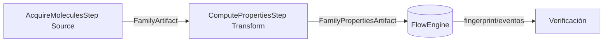
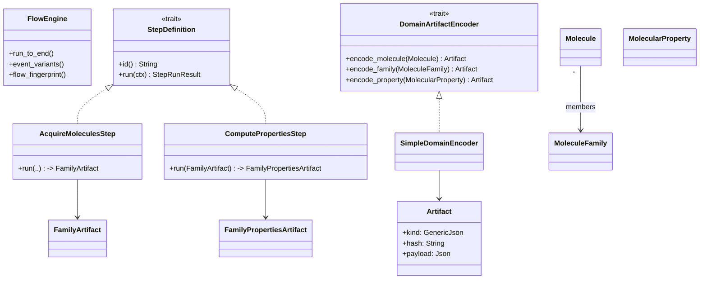

### F4 – Adaptadores y Steps Iniciales (chem-adapters)

| Núcleo                                                                              | Contrato Estabilizado                              | GATE_F4                          | Paralelo Seguro                |
| ----------------------------------------------------------------------------------- | -------------------------------------------------- | -------------------------------- | ------------------------------ |
| DomainStepAdapter, AcquireMoleculesStep, ComputePropertiesStep stub, Artifact shape | `Artifact {id, kind, hash, payload, metadata_min}` | Hash artifact estable (snapshot) | Bosquejo Normalize / Aggregate |

Objetivos Clave:

- Traducir dominio a artifacts neutrales.
- Validar pipeline Acquire→Compute.

Plan ordenado (pasos y entregables):

Diagramas

Diagrama de Flujo (Acquire→Compute)

Diagrama de Clases Simplificado (F4)

Notas

- Este diagrama omite detalles del repo/event store; se centra en F4.
- Los macros `typed_artifact!` y `typed_step!` generan tipos y glue para integrarse con `FlowEngine`.

---
