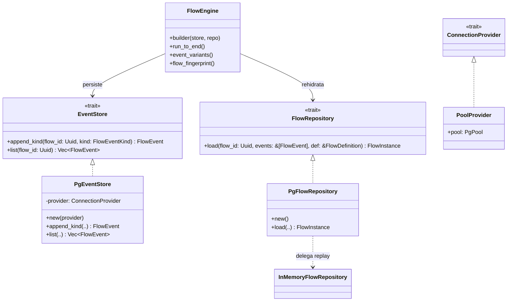
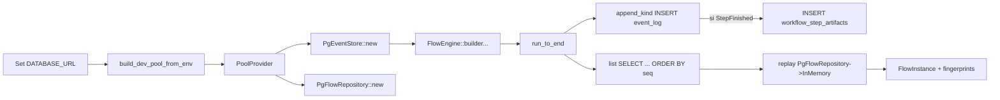

### F5 – Persistencia Postgres Mínima (chem-persistence)

| Núcleo                                                                                                    | Contrato Estabilizado      | GATE_F5                     | Paralelo Seguro                |
| --------------------------------------------------------------------------------------------------------- | -------------------------- | --------------------------- | ------------------------------ |
| Migraciones base (EVENT_LOG, WORKFLOW_STEP_EXECUTIONS, WORKFLOW_STEP_ARTIFACTS), mappers, repos concretos | Esquema tablas core fijado | Rehidratación DB == memoria | Índices secundarios (deferred) |

Objetivos Clave:

- Durabilidad y equivalencia con backend memoria.
- Aislar mapeos dominio↔filas.

Pasos sugeridos:

1. Migración transaccional inicial.
2. Implementar repos Postgres con transacciones atómicas.
3. Test equivalencia (fingerprint final).
4. Índices secuenciales (flow_id, seq).
5. Manejo de errores transitorios (retry simple).
6. Revisión de tipos (UUID, timestamptz).
7. Snapshot esquema documentado.

GATE_F5:

- Replay DB = Replay memoria.
- Sin divergencias en eventos.

---

## Resumen de implementación (qué se hizo)

- Esquema y migraciones (Diesel):
  - Tabla append-only `event_log(seq BIGSERIAL, flow_id UUID, ts timestamptz, event_type TEXT, payload JSONB)` con índice `(flow_id, seq)`.
  - Tabla opcional `workflow_step_artifacts(artifact_hash TEXT PK, kind TEXT, payload JSONB, metadata JSONB NULL, produced_in_seq BIGINT FK)` para deduplicación/encolado de artifacts.
  - Migraciones se aplican automáticamente al crear el pool.
- Implementaciones concretas en Postgres:
  - `PgEventStore` para `append_kind` y `list` con serialización JSONB del enum completo y `event_type` en minúsculas.
  - `PgFlowRepository` reutiliza el replay in-memory para asegurar paridad exacta.
- Atomicidad y consistencia:
  - Inserción de `StepFinished` y artifacts asociados en una única transacción.
  - Log de eventos es estrictamente append-only (sin UPDATE/DELETE).
- Resiliencia:
  - Reintentos con backoff (hasta 3) para errores transitorios (pool, desconexiones, serialization failure).
- Documentación y snapshots:
  - README del crate `chem-persistence` con uso y operabilidad.
  - Snapshot del esquema efectivo en `documentation/snapshots/schema_f5.sql`.
- Validaciones y pruebas:
  - Paridad de replay (DB vs memoria), integridad de secuencia, constraint de `event_type`, fingerprint del engine.

## Diagrama de clases (arquitectura F5)

Notas:

- `payload` contiene el enum `FlowEventKind` completo; `event_type` sirve para constraints y consultas rápidas.
- El repositorio DB reusa el algoritmo de replay in-memory para asegurar identidad del resultado.

## Diagrama de flujo (uso end‑to‑end)

Garantías:

- Atomicidad (event + artifacts) en una sola transacción.
- Orden total por `seq`; consultas ordenadas por `(flow_id, seq)`.
- Paridad exacta con in-memory.

## Ejemplo de uso (resumen del `src/main.rs`)

Prerequisitos:

- `DATABASE_URL` apuntando a tu Postgres (ver `postgress-docker/compose.yaml`).
- Si tu libpq usa GSS y ves errores de teardown: agrega `?gssencmode=disable`.

Secuencia:

1. Construir el pool y providers: `let pool = build_dev_pool_from_env()?; let provider = PoolProvider { pool };`.
2. Instanciar stores: `let event_store = PgEventStore::new(provider); let repo = PgFlowRepository::new();`.
3. Crear el engine con steps tipados (`SeedStep`, `SplitStep`, `ForwardStep`, `PrintAndCountStep`).
4. Ejecutar `run_to_end()` y verificar:
   - `event_variants()` devuelve `["I","S","F","C"]` para el demo.
   - `flow_fingerprint()` estable entre ejecuciones.
5. Ejemplo low‑level adicional (`run_f5_lowlevel`):
   - Inserta eventos mínimos manualmente, lista y hace replay con `PgFlowRepository`.

Salida esperada (demo):

- Secuencia compacta de eventos: `I, S, F, C`.
- `replay lowlevel completed? true` con `steps=1` en el ejemplo.

## Notas operativas

- Las migraciones se ejecutan automáticamente al inicializar el pool r2d2.
- El log es append‑only. Los artifacts son opcionales en F5.
- Reintentos con backoff (15/30/45 ms) en `append`/`list` para errores transitorios.
- Variables útiles: `DATABASE_URL`, `PGGSSENCMODE=disable`.

## Próximos pasos sugeridos (diferidos)

- Persistir `kind/payload/metadata` reales de artifacts de salida.
- Índices por `event_type` y vistas/materializaciones para analítica.
- Métricas/tracing ligero para medir reintentos y latencias.
