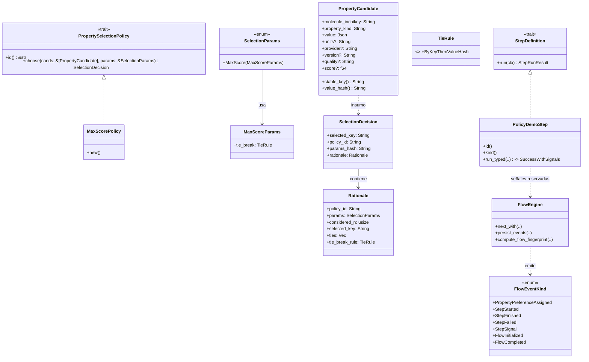

### F6 – Políticas de Selección Básica (chem-policies)

| Núcleo                                                                                      | Contrato Estabilizado           | GATE_F6                                            | Paralelo Seguro                      |
| ------------------------------------------------------------------------------------------- | ------------------------------- | -------------------------------------------------- | ------------------------------------ |
| Trait PropertySelectionPolicy + MaxScore, evento PropertyPreferenceAssigned, preferred flag | Firma choose() + payload evento | Política no altera fingerprint salvo cambio params | Weighted / Consensus (feature gated) |

Objetivos Clave:

- Resolución multi-proveedor determinista.
- Evento auditable con rationale.
- Rationale JSON canónico y conversion a datos tipados.
- verificacion de datos fuertemnete tipados. y funciones parametizables para asegurar que la selección es estable y reproducible.
  Pasos sugeridos:

1. Struct `PropertyCandidate`.
2. Implementación MaxScore (tie-break estable).
3. Emitir evento antes de StepCompleted.
4. Tests: determinismo selección.
5. Parámetros incluidos en fingerprint.
6. Rationale JSON canónico y conversion a datos tipados.
7. Feature flags para políticas extra.
8. disminuir uso de json y usar datos tipados.
   GATE_F6:

- Selección estable en entradas iguales.
- Fingerprint sólo cambia con params/política.

---

## Diagramas

### Diagrama de Clases (F6)

### Diagrama de Flujo (F6)

Notas:

- El engine traduce la señal reservada en un evento tipado P antes de `StepFinished` y elimina la señal genérica de la secuencia.
- El fingerprint del step mezcla `params_hash` únicamente cuando existe el evento de política; el flow fingerprint se mantiene determinista.
