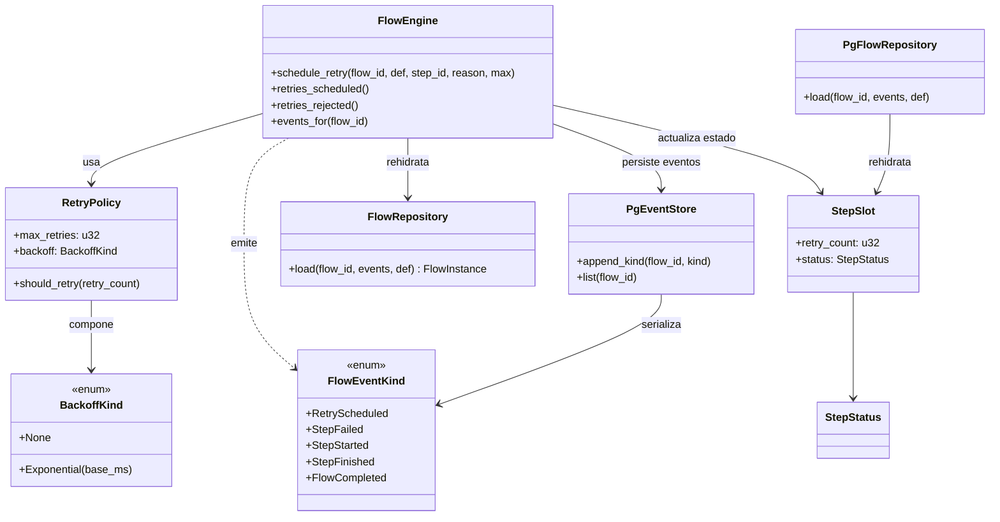
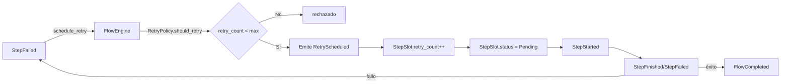

### F7 – Retry Manual Mínimo

| Núcleo                                                                                    | Contrato Estabilizado          | GATE_F7                                 | Paralelo Seguro                |
| ----------------------------------------------------------------------------------------- | ------------------------------ | --------------------------------------- | ------------------------------ |
| RetryPolicy (should_retry), transición Failed→Pending, retry_count, evento RetryScheduled | Semántica retry (no altera fp) | Reintento no cambia fingerprint ni flow | Backoff diseño inicial (draft) |

Objetivos Clave:

Pasos sugeridos:

1. Campo `retry_count` en StepSlot.
2. `FlowEngine::retry(step_id)`.
3. Evento RetryScheduled (si < max).tarea7
4. Test: exceder max rechaza.
5. Nuevos artifacts generan nuevos IDs (no colisión hash).
6. Métrica interna retries.
7. Documentar semántica.
8. Verificar funciones no verbosas para el fingerprint.
9. usar parametrización para definir políticas de reintento y asegurar que estas políticas no afectan el fingerprint a menos que los parámetros cambien.

GATE_F7:

## Diagramas

### Diagrama de Clases (F7)

### Diagrama de Flujo (F7)

Notas:

- El engine sólo permite RetryScheduled si el step está Failed y no excede max_retries.
- El retry no cambia el fingerprint del step ni del flow.
- Artifacts sólo se generan en StepFinished exitoso; no hay duplicados en retries.
