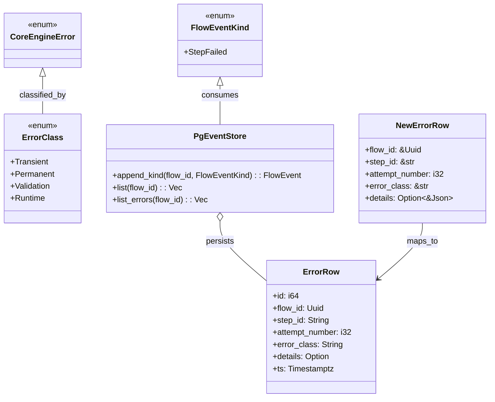

### F8 – Persistencia Extendida de Errores

| Núcleo                                                             | Contrato Estabilizado            | GATE_F8                     | Paralelo Seguro        |
| ------------------------------------------------------------------ | -------------------------------- | --------------------------- | ---------------------- |
| Migración STEP_EXECUTION_ERRORS, persistir retry_count/max_retries | Esquema errores + attempt_number | Rehidratación DB == memoria | Métricas error (luego) |

Objetivos Clave:

- Auditoría granular de fallos con persistencia de errores por step y attempt.
- Base para políticas avanzadas de retry y clasificación de errores (transient vs permanent).
- Mantener paridad entre memoria y DB para rehidratación de estado de errores.

## Implementación realizada (resumen y validación)

Se implementaron y verificaron los siguientes elementos para F8:

- Migración SQL para la tabla `step_execution_errors` (archivo):

  - `crates/chem-persistence/migrations/0005_step_execution_errors/up.sql` y `down.sql`.
  - Crea columnas: `id`, `flow_id`, `step_id`, `attempt_number`, `error_class`, `details`, `ts` e índices útiles.

- Esquema Diesel actualizado:

  - `crates/chem-persistence/src/schema.rs` declara `step_execution_errors` para uso con Diesel.

- Modelos / mapeos y APIs en `chem-persistence`:

  - `ErrorRow` (Queryable) y `NewErrorRow` (Insertable) en `crates/chem-persistence/src/pg/mod.rs`.
  - Inserción atómica de la fila de error dentro de la misma transacción que la inserción del evento en `PgEventStore::append_kind`.
  - Función pública de consulta `PgEventStore::list_errors(flow_id)` que devuelve `Vec<ErrorRow>`.

- Clasificación de errores y helper en `chem-core`:

  - Nuevo enum y helper en `crates/chem-core/src/errors.rs`:
    - `ErrorClass { Transient, Permanent, Validation, Runtime }`.
    - `classify_error(&CoreEngineError) -> ErrorClass`.
  - `PgEventStore` usa `classify_error` para asignar `error_class` textual al persistir.

- Tests y validaciones:

  - `crates/chem-persistence/tests/error_persistence.rs` valida la inserción automática y la clasificación.
  - Se añadió `crates/chem-persistence/tests/validate_f8.rs` como comprobación adicional (mig path y clasificación).

- Documentación actualizada:
  - `crates/chem-persistence/README.md` documenta el esquema, la atomicidad y el uso de `list_errors`.

Estado de validación:

- Migración: presente en el árbol de migraciones y con `up.sql`/`down.sql`.
- Diesel schema: actualizado y compilable (símbolo `step_execution_errors` declarado en `schema.rs`).
- Persistencia en `PgEventStore`: inserción del evento y, dentro de la misma transacción, inserción de `NewErrorRow` cuando el evento es `StepFailed`.
- Clasificación: implementada y usada.
- Tests: existenten; si se dispone de `DATABASE_URL` corren el flujo y validan la persistencia.

## Contrato mínimo (resumen técnico)

- Input: `FlowEventKind::StepFailed { step_id, error, fingerprint }`.
- Output: inserción en `event_log` (evento) y, si aplica, `step_execution_errors` con `error_class` y `details` JSONB.
- Error modes: la inserción ocurre dentro de una transacción Diesel; se aplica retry/backoff a la unidad completa.

## Diagrama de clases (F8)

## Diagrama de flujo (persistencia y validación)

```mermaid
flowchart LR
		subgraph Engine
				A[Emit StepFailed event FlowEventKind::StepFailed]
		end
		A --> B[PgEventStore::append_kind]
		B --> C{Begin Transaction}
		C --> D[INSERT INTO event_log payload,event_type RETURNING seq, ts]
		D --> E{If StepFailed?}
		E -- yes --> F[compute error_class = classify_error error ]
		F --> G[INSERT INTO step_execution_errors flow_id, step_id, attempt_number, error_class, details]
		E -- no --> H[skip error insert]
		G --> I[optional: insert artifacts into workflow_step_artifacts]
		H --> I
		I --> J[COMMIT Transaction]
		J --> K[Event persisted and error row persisted atomically]
		K --> L[PgEventStore::list_errorsflow_id returns ErrorRow records]
		L --> M[Tests inspect details JSON and classification]


```

## Checklist de cobertura vs. `tarea8.txt`

- [x] Migración SQL para `step_execution_errors` (up/down).
- [x] Diesel schema actualizado y tabla accesible desde código.
- [x] Insertable/Queryable (`NewErrorRow`, `ErrorRow`) implementados.
- [x] Inserción atómica de error al emitir `StepFailed` en `PgEventStore::append_kind`.
- [x] `list_errors(flow_id)` expuesto y usado en tests/demo.
- [x] `ErrorClass` y `classify_error` en `chem-core`.
- [x] Tests de persistencia y clasificación añadidos (`error_persistence.rs`, `validate_f8.rs`).
- [x] Documentación (`crates/chem-persistence/README.md`) actualizada.

## Siguientes pasos recomendados (opcional)

- Computar `attempt_number` real contando eventos previos para un `flow_id`/`step_id` (en lugar del valor hardcodeado `1`).
- Persistir `retry_count` y `max_retries` si se adoptará política de reintentos más completa.
- Añadir tests integrados que ejecuten `pg_persistence_demo::run_replay_parity()` en un entorno CI con Postgres.
- Exponer helper `insert_step_execution_error` en la API pública del crate `chem-persistence` si se desea insertar errores fuera del path `append_kind`.

---

Documento generado automáticamente como resumen de la implementación F8 y verificación dentro del repositorio.
