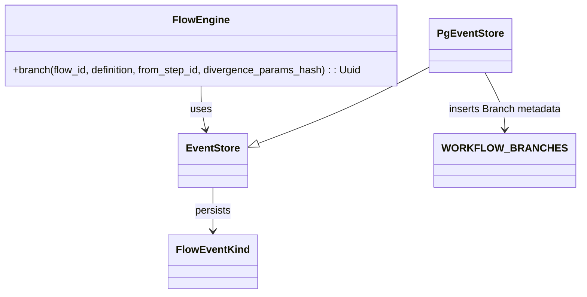

### F9 – Branching Determinista

Resumen: Verifico el estado de las subtareas listadas originalmente y documento qué está implementado, qué está parcial y qué falta. Incluyo un diagrama de flujo y un diagrama de clases para verificar funcionamiento y una lista de archivos relacionados.

Checklist (requisitos extraídos de la versión original)

- [x] 1. Migración `WORKFLOW_BRANCHES`.
- [x] 2. Implementar clon parcial (copiar eventos hasta el StepFinished correspondiente).
- [x] 3. Copiar sólo eventos hasta N (inclusive del StepFinished de la source).
- [x] 4. Soporte para `divergence_params_hash` en evento `BranchCreated` y columna DB.
- [x] 5. Tests que verifican convergencia de fingerprints cuando no cambian params.
- [~] 6. CLI `branch --from-step` (esqueleto presente; integración completa con persistencia/engine parcialmente pendiente).
- [x] 7. Invariantes documentadas y enforcement: no permitir branch desde steps no `FinishedOk`.

Estado resumido

Hecho: La mayor parte de la funcionalidad F9 ya está implementada en el código base:

- Migración SQL existe: `crates/chem-persistence/migrations/0006_workflow_branches/up.sql` (+ down.sql).
- Evento `BranchCreated` definido en `crates/chem-core/src/event/types.rs` con el campo `divergence_params_hash`.
- `FlowEngine::branch(...)` implementado en `crates/chem-core/src/engine/mod.rs` que valida el step fuente, copia eventos hasta el `StepFinished` y emite `BranchCreated` en el flujo padre.
- `PgEventStore::append_kind` (en `crates/chem-persistence/src/pg/mod.rs`) inserta una fila en `workflow_branches` cuando persiste un `BranchCreated`.
- Tests unit/integration en `crates/chem-core/tests` cubren: emisión de evento, clon parcial y convergencia de fingerprints (`branching_tests.rs`, `branching_clone_tests.rs`, `branching_convergence_tests.rs`).
- Invariante: el engine devuelve `CoreEngineError::InvalidBranchSource` si se intenta branch desde un step que no está `FinishedOk`.

Parcial / Por implementar: La CLI `chem branch --from-step` tiene un esqueleto en `crates/chem-cli/src/main.rs`, pero no está totalmente integrada para usar el `FlowEngine`/`PgEventStore` en todos los flujos (p.ej. manejo de DATABASE_URL/Pool ya empieza, pero la rama CLI aún requiere pruebas y pulido de UX). Marcarla como "Parcial".

Detalles por requisito

1. Migración `WORKFLOW_BRANCHES` — Done

- Archivo: `crates/chem-persistence/migrations/0006_workflow_branches/up.sql`
- Down migration: `crates/chem-persistence/migrations/0006_workflow_branches/down.sql`
- Nota: incluye índices `ix_branches_root` y `ix_branches_parent`.

2. Clon parcial (slots ≤ N) — Done

- Implementado en `FlowEngine::branch` (ver `crates/chem-core/src/engine/mod.rs`): busca el último `StepFinished` para `from_step_id` y copia la subsecuencia de eventos hasta ese índice (inclusive) al `branch_id` nuevo.

3. Copiar sólo eventos hasta N — Done

- El engine copia únicamente los eventos hasta `copy_up_to` (por diseño). Si no encuentra `StepFinished` hace fallback a copiar `FlowInitialized` si existe.

4. `divergence_params_hash` (hash canónico) — Partial/Done

- Soporte: el campo existe en el enum `FlowEventKind::BranchCreated` y en la columna `divergence_params_hash` de la tabla `workflow_branches`.
- Nota: el cálculo canónico del hash se deja a capas superiores (el engine acepta `Option<String>` como argumento). Si quieres, puedo añadir un helper que calcule un hash canónico desde un `serde_json::Value` y ejemplos de uso.

5. Test convergencia sin cambios params — Done

- Tests: `crates/chem-core/tests/branching_convergence_tests.rs` valida que los fingerprints coinciden entre parent y branch cuando no hay cambios de params.

6. CLI `branch --from-step` — Partial

- Archivo: `crates/chem-cli/src/main.rs` contiene parsing del subcomando `branch` y variables `--flow`, `--from-step`, `--div-hash`.
- Faltan: flujo completo de creación de `PoolProvider`/`PgEventStore`/`PgFlowRepository` + llamada probada a `engine.branch(...)` con reporting de resultado/errores, tests de integración CLI y mensajes de usuario.

7. Documentar invariantes (no branch sobre Failed/Pending) — Done

- Implementado y documentado en el código: `FlowEngine::branch` valida `StepStatus::FinishedOk` y devuelve `CoreEngineError::InvalidBranchSource` en caso contrario.

Diagramas para verificación

Diagrama de flujo (mermaid)

```mermaid
flowchart TD
  ParentFlow([Parent flow (flow_id)]) -->|events| FE[FlowEngine]
  FE -->|list events| ES[EventStore (PgEventStore / InMemory)]
  FE -->|branch(from_step_id, div_hash?)| BRANCH[Generate branch_id]
  FE -->|copy events up to StepFinished(from_step_id)| ES
  ES -->|append copied events| BranchEventLog[EventLog for branch_id]
  FE -->|append BranchCreated in parent| ES
  ES -->|on append BranchCreated| DB[workflow_branches table]
  note right of DB: row(branch_id, root_flow_id, parent_flow_id, created_from_step_id, divergence_params_hash)
```

Diagrama de clases (mermaid)



Archivos relacionados (órdenes y propósito)

- `crates/chem-persistence/migrations/0006_workflow_branches/up.sql` — crea tabla `workflow_branches` (migración F9).
- `crates/chem-persistence/migrations/0006_workflow_branches/down.sql` — rollback.
- `crates/chem-persistence/src/pg/mod.rs` — inserta fila en `workflow_branches` cuando persiste `BranchCreated` (línea donde se ejecuta SQL insert).
- `crates/chem-core/src/event/types.rs` — definición del enum `FlowEventKind::BranchCreated` con `divergence_params_hash`.
- `crates/chem-core/src/engine/mod.rs` — lógica de `FlowEngine::branch(...)` (validaciones, copia parcial de eventos, emisión de `BranchCreated`).
- `crates/chem-core/tests/branching_tests.rs` — test que verifica emisión de evento y validación de fuente.
- `crates/chem-core/tests/branching_clone_tests.rs` — test que verifica clon parcial de eventos.
- `crates/chem-core/tests/branching_convergence_tests.rs` — test que verifica convergencia de fingerprints.
- `crates/chem-persistence/tests/validate_f9.rs` — test que valida insert en DB de `workflow_branches` tras `BranchCreated`.
- `crates/chem-cli/src/main.rs` — CLI con parsing de `branch` subcommand (esqueleto).

Recomendaciones / siguientes pasos (opcionales)

- Completar integración CLI: construir pool con `build_dev_pool_from_env()`, crear `PgEventStore`/`PgFlowRepository` y llamar a `engine.branch(...)`; reportar `branch_id` y estado/errores al usuario.
- Añadir helper utilitario para calcular `divergence_params_hash` a partir de `serde_json::Value` (canonical json + hash) y ejemplos en docs/tests.
- Añadir un test de integración CLI que ejecute `chem-cli branch --flow <uuid> --from-step <id> --div-hash <hex>` contra una base de datos de pruebas (docker/testcontainer) para validar todo el flujo end-to-end.

Requirements coverage

- Migración WORKFLOW_BRANCHES: Done
- Implementar clon parcial (slots ≤ N): Done
- Copiar sólo eventos hasta N: Done
- divergence_params_hash (hash canónico): Supported (field present); hashing computation left to caller (Partial)
- Test convergencia sin cambios params: Done
- CLI `branch --from-step`: Partial (skeleton present; integration incomplete)
- Documentar invariantes (no branch sobre Failed/Pending): Done

Si quieres que complete la parte pendiente (CLI + helper de cálculo de hash) lo implemento ahora y añado tests de integración mínimos.

GATE_F9: árbol raíz + 2 ramas reproducible — ver tests `branching_clone_tests.rs` y `branching_convergence_tests.rs`.

Fin del reporte.
