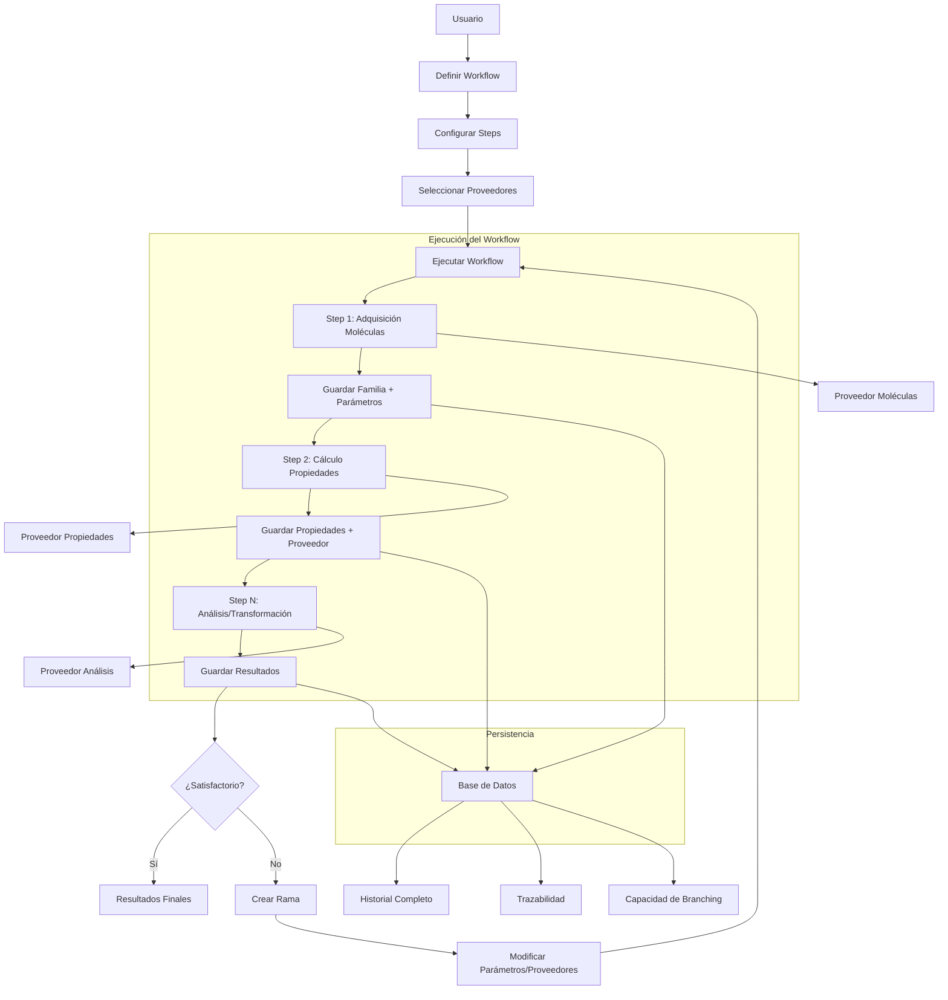

# Implementación de Steps y Proveedores en CadmaFlow

## Visión General del Sistema de Steps

1. Puede recibir 0 a múltiples familias de moléculas
2. Cada familia tiene propiedades y parámetros
3. Los steps pueden usar múltiples proveedores
4. Se guarda toda la trazabilidad de ejecución
5. Soporta bifurcaciones (branching) al cambiar parámetros

## Implementación Detallada

1. **Trazabilidad Completa**: Cada step guarda información detallada de su ejecución
2. **Inmutabilidad**: Los datos se congelan después de cada step
3. **Branching**: Se puede crear ramas al cambiar parámetros en cualquier step
4. **Flexibilidad**: Los steps pueden recibir 0 o múltiples familias de moléculas
5. **Extensibilidad**: Fácil añadir nuevos tipos de proveedores y steps
6. **Configuración**: Soporte para diferentes entornos y configuraciones de proveedores

Este diseño proporciona un sistema robusto y flexible para la ejecución de workflows moleculares con control de versiones y capacidad de ramificación.

# Explicación Breve de Uso

chemFlow se utiliza para definir y ejecutar workflows computacionales en química y bioinformática. A continuación, se describe el proceso de uso:

## 1. Definición del Workflow

- **Crear un Workflow**: Se define una secuencia de pasos (steps) que forman el workflow.
- **Configurar Steps**: Cada step puede ser de diferentes tipos (adquisición de moléculas, cálculo de propiedades, filtrado, análisis, etc.) y se configuran con parámetros específicos.

## 2. Configuración de Proveedores

- **Proveedores de Moléculas**: Se configuran los proveedores que generarán familias de moléculas (ej: desde una base de datos, archivos, o generadores automáticos).
- **Proveedores de Propiedades**: Se configuran los proveedores que calcularán propiedades para las moléculas (ej: logP, toxicidad, etc.).

## 3. Ejecución del Workflow

- **Ejecución Paso a Paso**: El workflow se ejecuta step por step. Cada step recibe las familias de moléculas del step anterior (si aplica) y produce resultados que pueden ser nuevas familias o propiedades.
- **Trazabilidad**: Cada step guarda un snapshot de sus entradas, parámetros y resultados, lo que permite la reproducibilidad.

## 4. Ramificación (Branching)

- **Modificación de Parámetros**: Si un usuario desea cambiar un parámetro en un step, puede crear una rama (branch) a partir de ese step.
- **Ejecución de la Rama**: La nueva rama ejecutará los steps anteriores con los mismos parámetros (usando los datos congelados) y desde el step modificado con los nuevos parámetros.

## 5. Resultados

- **Acceso a Resultados**: Los resultados finales son familias de moléculas con propiedades calculadas, disponibles para su análisis o exportación.
- **Historial**: Todo el historial de ejecuciones y ramas se guarda para su consulta.

## Ejemplo de Flujo de Trabajo

1. **Step 1**: Adquirir 100 moléculas de un proveedor de prueba.
2. **Step 2**: Calcular el logP para todas las moléculas usando un proveedor de propiedades.
3. **Step 3**: Filtrar las moléculas con logP > 2.0.
   creando un nuevo conjunto de moléculas filtradas
4. **Step 4**: Calcular la toxicidad para las moléculas filtradas

Si el usuario decide cambiar el paso 2 para usar un método diferente de cálculo de logP, se crea una rama a partir del step 2 y se ejecuta el workflow con el nuevo método, manteniendo los resultados originales y generando una nueva línea de resultados.

## Beneficios

- **Reproducibilidad**: Cada ejecución guarda todos los parámetros y datos de entrada.
- **Trazabilidad**: Se puede rastrear el origen de cada dato y los métodos utilizados.
- **Flexibilidad**: Fácil modificación de parámetros y creación de ramas para experimentar.
- **Extensibilidad**: Fácil añadir nuevos proveedores y tipos de steps.

chemFlow es ideal para investigadores que necesitan realizar flujos de trabajo computacionales complejos con requisitos de reproducibilidad y control de versiones.



# Explicación del Funcionamiento de chemFlow

## Cómo Usar chemFlow

### 1. Definición del Workflow

```rust
// Crear un nuevo workflow
let workflow = Workflow::new("Mi Primer Workflow");
```

### 2. Configuración de Steps

```rust
// Añadir steps al workflow
workflow.add_step(Box::new(MoleculeAcquisitionStep {
    name: "Obtener Moléculas".to_string(),
    provider: "test_molecule_provider".to_string(),
    parameters: HashMap::from([
        ("count".to_string(), Value::Number(10.into())),
    ]),
}));

workflow.add_step(Box::new(PropertiesCalculationStep {
    name: "Calcular LogP".to_string(),
    provider: "test_properties_provider".to_string(),
    property_name: "logp".to_string(),
    parameters: HashMap::from([
        ("method".to_string(), Value::String("advanced".to_string())),
    ]),
}));
```

### 3. Configuración de Proveedores

```rust
// Registrar proveedores disponibles
let mut molecule_providers = HashMap::new();
molecule_providers.insert(
    "test_molecule_provider".to_string(),
    Box::new(TestMoleculeProvider::new()) as Box<dyn MoleculeProvider>
);

let mut properties_providers = HashMap::new();
properties_providers.insert(
    "test_properties_provider".to_string(),
    Box::new(TestPropertiesProvider::new()) as Box<dyn PropertiesProvider>
);
```

### 4. Ejecución del Workflow

```rust
// Ejecutar el workflow completo
let result = workflow_manager.execute_workflow(workflow).await?;
println!("Workflow completado. Generadas {} moléculas", result.families[0].molecules.len());
```

### 5. Creación de Ramas (Branching)

```rust
// Si necesitas modificar parámetros, crear una rama
let branch_id = workflow_manager.create_branch(
    original_execution_id,
    1, // step index a modificar
    HashMap::from([
        ("method".to_string(), Value::String("super_advanced".to_string())),
    ]),
).await?;

// Ejecutar la rama
let branch_result = workflow_manager.execute_branch(branch_id).await?;
```

## Flujo de Datos

1. **Input**: El workflow comienza sin familias de moléculas (o con familias existentes)
2. **Paso 1**: Un proveedor de moléculas genera una familia con parámetros específicos
3. **Paso 2**: Un proveedor de propiedades calcula datos para todas las moléculas de la familia
4. **Paso N**: Pasos adicionales de análisis, filtrado o transformación
5. **Output**: Familias de moléculas con propiedades calculadas y resultados de análisis

## Características Clave

1. **Trazabilidad Completa**: Cada dato conoce su origen exacto (proveedor, parámetros, versión)
2. **Inmutabilidad**: Los datos se congelan después de cada paso, garantizando reproducibilidad
3. **Branching**: Capacidad de crear ramas al modificar cualquier parámetro
4. **Flexibilidad**: Los steps pueden recibir 0 o múltiples familias y producir múltiples resultados
5. **Extensibilidad**: Fácil añadir nuevos proveedores y tipos de steps

## Ejemplo de Caso de Uso

Un investigador quiere:

1. Obtener 100 moléculas de una base de datos
2. Calcular sus propiedades de logP y toxicidad
3. Filtrar las moléculas con logP > 2.0
4. Realizar un análisis de similitud molecular

Si después decide usar un método diferente de cálculo de logP, puede crear una rama en el paso 2 y ejecutar solo esa parte del workflow con los nuevos parámetros, manteniendo los resultados originales intactos.

## Beneficios

- **Reproducibilidad**: Cada ejecución guarda todos los parámetros y versiones
- **Colaboración**: Múltiples investigadores pueden trabajar en ramas diferentes
- **Auditoría**: Historial completo de todos los cálculos realizados
- **Experimentación**: Fácil probar diferentes parámetros y métodos sin afectar los resultados originales

chemFlow está diseñado específicamente para workflows computacionales en química y bioinformática, donde la reproducibilidad, trazabilidad y experimentación son cruciales.
Sobre los pasos (Steps)
los steps podran resivir de 0 a varias familias de moleculas
cada familia de moleculas podra tener una o varias propiedades definidas
y una lista de parametros extras cada step puede pedir lo necesario para procesar

cada steps puede regresar ya sea las mismas familias de moleculas agregar valores a estas familias pero con trasavilidad
ya que los valores podran venir de diferentes providers y hay que guardar que provaider se uso con que parametros

cada step debera tener acceso a una lista de providers que se usara ya sea para generar familia de moleculas o sus datos
al finalizaar cada step se congelara los parametros que se usaron para ese step y asi poder crear nuevas ejecuciones cambiando los parametros
y asi crear ramas vifurcaciones en el flow

cada step regresara ya sea objetos de resultados(generados con provaiders); o familias con propiedades() y guardara la ejecucion los parametros para la ejecucion de los priver para la trazabilidad y confiansa asi para saber si se debe vifurcar al cambiar algun parametro

Sobre los providers de familias Se definira como trait para que puedan aver varios
cada provaider podra generar una familia de moleculas ya sea que pida parametros para hacerlo o no

sobre los providers propiedades
estos son provedores que pueden definir propiedades para toda una familia de moleculas este siempre guardara todos los parametros con los que
se ejecuta el provaider y la salida completa del programa o funcion que se ejecuta y generara la familia de moleculas con sus datos
agregados y lo regresara
sobre provaiders de datos este solo regresara un dato que se guardara como parametros puede recibir ya sea una familia o un solo dato normalmente
servira para promedios y demas cosas pero que se guardaran para trazabilidad pero tambien esto se podra obtener de diferentes fuentes

Sobre moleculas
estas solo tienen su inchi smile y inchi key como llave maestra son parte de la familia y hay propiedades que hacen referencia a estas si bien cada propidedad debe saber que provider la trajo deben de estar guardada en un lugar separado de los steps ya que estos no deben depender de los steps por si se quieren obtener propiedades de las moleculas ver por ejemplo todos los logP que tienen de que provaider fue obtenido y con que datos
