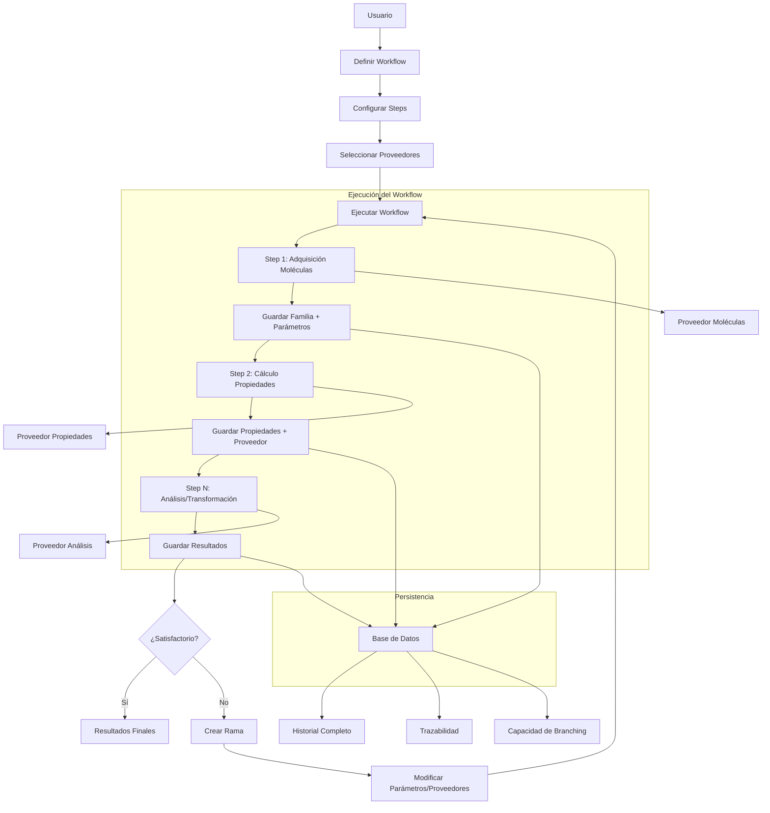

# Implementación de Steps y Proveedores en CadmaFlow

## Visión General del Sistema de Steps

1. Puede recibir 0 a múltiples familias de moléculas
2. Cada familia tiene propiedades y parámetros
3. Los steps pueden usar múltiples proveedores
4. Se guarda toda la trazabilidad de ejecución
5. Soporta bifurcaciones (branching) al cambiar parámetros

## Estructura Actualizada

```
cadmaflow/
├── src/
│   ├── workflow/
│   │   ├── mod.rs
│   │   ├── step.rs
│   │   ├── execution.rs
│   │   ├── branch.rs
│   │   └── manager.rs
│   ├── providers/
│   │   ├── mod.rs
│   │   ├── molecule/
│   │   │   ├── mod.rs
│   │   │   ├── trait.rs
│   │   │   └── implementations/
│   │   └── properties/
│   │       ├── mod.rs
│   │       ├── trait.rs
│   │       └── implementations/
│   └── data/
│       ├── mod.rs
│       ├── types.rs
│       ├── family.rs
│       └── snapshot.rs
```

## Implementación Detallada

### 1. Familias de Moléculas con Propiedades (src/data/family.rs)

```rust
use serde::{Serialize, Deserialize};
use std::collections::HashMap;
use uuid::Uuid;

use crate::molecule::Molecule;
use crate::data::types::MolecularData;

#[derive(Debug, Clone, Serialize, Deserialize)]
pub struct MoleculeFamily {
    pub id: Uuid,
    pub name: String,
    pub description: Option<String>,
    pub molecules: Vec<Molecule>,
    pub properties: HashMap<String, Vec<Box<dyn MolecularData>>>,
    pub parameters: HashMap<String, serde_json::Value>,
    pub source_provider: Option<ProviderReference>,
}

#[derive(Debug, Clone, Serialize, Deserialize)]
pub struct ProviderReference {
    pub provider_type: String,
    pub provider_name: String,
    pub provider_version: String,
    pub execution_parameters: HashMap<String, serde_json::Value>,
    pub execution_id: Uuid,
}

impl MoleculeFamily {
    pub fn new(name: String, description: Option<String>) -> Self {
        Self {
            id: Uuid::new_v4(),
            name,
            description,
            molecules: Vec::new(),
            properties: HashMap::new(),
            parameters: HashMap::new(),
            source_provider: None,
        }
    }

    pub fn add_property(
        &mut self,
        property_name: String,
        data: Vec<Box<dyn MolecularData>>,
        provider_reference: ProviderReference,
    ) {
        self.properties.insert(property_name, data);
        self.source_provider = Some(provider_reference);
    }

    pub fn get_property(&self, property_name: &str) -> Option<&Vec<Box<dyn MolecularData>>> {
        self.properties.get(property_name)
    }
}
```

### 2. Sistema de Steps (src/workflow/step.rs)

```rust
use async_trait::async_trait;
use serde::{Serialize, Deserialize};
use std::collections::HashMap;
use uuid::Uuid;

use crate::data::family::MoleculeFamily;
use crate::providers::molecule::MoleculeProvider;
use crate::providers::properties::PropertiesProvider;
use crate::data::types::MolecularData;

#[derive(Debug, Serialize, Deserialize)]
pub struct StepInput {
    pub families: Vec<MoleculeFamily>,
    pub parameters: HashMap<String, serde_json::Value>,
}

#[derive(Debug, Serialize, Deserialize)]
pub struct StepOutput {
    pub families: Vec<MoleculeFamily>,
    pub results: HashMap<String, serde_json::Value>,
    pub execution_info: StepExecutionInfo,
}

#[derive(Debug, Serialize, Deserialize)]
pub struct StepExecutionInfo {
    pub step_id: Uuid,
    pub parameters: HashMap<String, serde_json::Value>,
    pub providers_used: Vec<ProviderReference>,
    pub start_time: chrono::DateTime<chrono::Utc>,
    pub end_time: chrono::DateTime<chrono::Utc>,
    pub status: StepStatus,
}

#[derive(Debug, Serialize, Deserialize)]
pub enum StepStatus {
    Pending,
    Running,
    Completed,
    Failed(String),
}

#[async_trait]
pub trait WorkflowStep: Send + Sync {
    fn get_id(&self) -> Uuid;
    fn get_name(&self) -> &str;
    fn get_description(&self) -> &str;
    fn get_required_input_types(&self) -> Vec<String>;
    fn get_output_types(&self) -> Vec<String>;
    fn allows_branching(&self) -> bool;

    async fn execute(
        &self,
        input: StepInput,
        molecule_providers: &HashMap<String, Box<dyn MoleculeProvider>>,
        properties_providers: &HashMap<String, Box<dyn PropertiesProvider>>,
    ) -> Result<StepOutput, Box<dyn std::error::Error>>;
}

// Implementaciones concretas de steps
pub struct MoleculeAcquisitionStep {
    pub id: Uuid,
    pub name: String,
    pub description: String,
    pub provider_name: String,
    pub parameters: HashMap<String, serde_json::Value>,
}

#[async_trait]
impl WorkflowStep for MoleculeAcquisitionStep {
    fn get_id(&self) -> Uuid {
        self.id
    }

    fn get_name(&self) -> &str {
        &self.name
    }

    fn get_description(&self) -> &str {
        &self.description
    }

    fn get_required_input_types(&self) -> Vec<String> {
        Vec::new() // No requiere input
    }

    fn get_output_types(&self) -> Vec<String> {
        vec!["molecule_family".to_string()]
    }

    fn allows_branching(&self) -> bool {
        true
    }

    async fn execute(
        &self,
        input: StepInput,
        molecule_providers: &HashMap<String, Box<dyn MoleculeProvider>>,
        _properties_providers: &HashMap<String, Box<dyn PropertiesProvider>>,
    ) -> Result<StepOutput, Box<dyn std::error::Error>> {
        let provider = molecule_providers.get(&self.provider_name)
            .ok_or_else(|| format!("Provider {} not found", self.provider_name))?;

        let family = provider.get_molecule_family(&self.parameters).await?;

        Ok(StepOutput {
            families: vec![family],
            results: HashMap::new(),
            execution_info: StepExecutionInfo {
                step_id: self.id,
                parameters: self.parameters.clone(),
                providers_used: vec![ProviderReference {
                    provider_type: "molecule".to_string(),
                    provider_name: self.provider_name.clone(),
                    provider_version: provider.get_version().to_string(),
                    execution_parameters: self.parameters.clone(),
                    execution_id: Uuid::new_v4(),
                }],
                start_time: chrono::Utc::now(),
                end_time: chrono::Utc::now(),
                status: StepStatus::Completed,
            },
        })
    }
}

pub struct PropertiesCalculationStep {
    pub id: Uuid,
    pub name: String,
    pub description: String,
    pub provider_name: String,
    pub property_name: String,
    pub parameters: HashMap<String, serde_json::Value>,
}

#[async_trait]
impl WorkflowStep for PropertiesCalculationStep {
    // Implementación similar a MoleculeAcquisitionStep pero para propiedades
    // ...
}
```

### 3. Manager de Workflow (src/workflow/manager.rs)

```rust
use std::collections::HashMap;
use uuid::Uuid;

use crate::workflow::step::{WorkflowStep, StepInput, StepOutput};
use crate::data::family::MoleculeFamily;
use crate::providers::molecule::MoleculeProvider;
use crate::providers::properties::PropertiesProvider;
use crate::database::repository::WorkflowExecutionRepository;

pub struct WorkflowManager {
    execution_repo: WorkflowExecutionRepository,
    molecule_providers: HashMap<String, Box<dyn MoleculeProvider>>,
    properties_providers: HashMap<String, Box<dyn PropertiesProvider>>,
}

impl WorkflowManager {
    pub fn new(
        execution_repo: WorkflowExecutionRepository,
        molecule_providers: HashMap<String, Box<dyn MoleculeProvider>>,
        properties_providers: HashMap<String, Box<dyn PropertiesProvider>>,
    ) -> Self {
        Self {
            execution_repo,
            molecule_providers,
            properties_providers,
        }
    }

    pub async fn execute_step(
        &self,
        step: &dyn WorkflowStep,
        input_families: Vec<MoleculeFamily>,
        step_parameters: HashMap<String, serde_json::Value>,
    ) -> Result<StepOutput, Box<dyn std::error::Error>> {
        let input = StepInput {
            families: input_families,
            parameters: step_parameters,
        };

        let output = step.execute(
            input,
            &self.molecule_providers,
            &self.properties_providers,
        ).await?;

        // Guardar la ejecución del step en la base de datos
        self.execution_repo.save_step_execution(&output.execution_info).await?;

        Ok(output)
    }

    pub async fn create_branch(
        &self,
        original_execution_id: Uuid,
        step_index: usize,
        new_parameters: HashMap<String, serde_json::Value>,
    ) -> Result<Uuid, Box<dyn std::error::Error>> {
        // Obtener la ejecución original
        let original_execution = self.execution_repo.get_execution(original_execution_id).await?;

        // Crear una nueva rama
        let branch_id = Uuid::new_v4();

        // Copiar todos los steps hasta el punto de bifurcación
        for i in 0..step_index {
            let step_execution = self.execution_repo.get_step_execution(original_execution_id, i).await?;
            self.execution_repo.save_step_execution_for_branch(&step_execution, branch_id).await?;
        }

        // Crear un nuevo step con los nuevos parámetros
        let step = self.execution_repo.get_step(original_execution.steps[step_index]).await?;
        let mut branched_step = step.clone();
        branched_step.parameters = new_parameters;

        // Guardar el step bifurcado
        self.execution_repo.save_step_for_branch(&branched_step, branch_id).await?;

        Ok(branch_id)
    }
}
```

### 4. Proveedores de Moléculas (src/providers/molecule/trait.rs)

```rust
use async_trait::async_trait;
use serde_json::Value;
use std::collections::HashMap;

use crate::data::family::MoleculeFamily;

#[async_trait]
pub trait MoleculeProvider: Send + Sync {
    fn get_name(&self) -> &str;
    fn get_version(&self) -> &str;
    fn get_description(&self) -> &str;
    fn get_available_parameters(&self) -> HashMap<String, ParameterDefinition>;

    async fn get_molecule_family(
        &self,
        parameters: &HashMap<String, Value>
    ) -> Result<MoleculeFamily, Box<dyn std::error::Error>>;
}

#[derive(Debug, Clone)]
pub struct ParameterDefinition {
    pub name: String,
    pub description: String,
    pub data_type: ParameterType,
    pub required: bool,
    pub default_value: Option<Value>,
}

#[derive(Debug, Clone)]
pub enum ParameterType {
    String,
    Number,
    Boolean,
    Array,
    Object,
}
```

### 5. Proveedores de Propiedades (src/providers/properties/trait.rs)

```rust
use async_trait::async_trait;
use serde_json::Value;
use std::collections::HashMap;

use crate::data::family::MoleculeFamily;
use crate::data::types::MolecularData;

#[async_trait]
pub trait PropertiesProvider: Send + Sync {
    fn get_name(&self) -> &str;
    fn get_version(&self) -> &str;
    fn get_description(&self) -> &str;
    fn get_supported_properties(&self) -> Vec<String>;
    fn get_available_parameters(&self) -> HashMap<String, ParameterDefinition>;

    async fn calculate_properties(
        &self,
        molecule_family: &MoleculeFamily,
        parameters: &HashMap<String, Value>
    ) -> Result<Vec<Box<dyn MolecularData>>, Box<dyn std::error::Error>>;
}
```

### 6. Ejemplo de Implementación de Proveedor (src/providers/properties/implementations/test_provider.rs)

```rust
use async_trait::async_trait;
use serde_json::Value;
use std::collections::HashMap;

use crate::data::family::MoleculeFamily;
use crate::data::types::{MolecularData, LogPData};
use crate::providers::properties::{PropertiesProvider, ParameterDefinition, ParameterType};

pub struct TestPropertiesProvider;

impl TestPropertiesProvider {
    pub fn new() -> Self {
        Self
    }
}

#[async_trait]
impl PropertiesProvider for TestPropertiesProvider {
    fn get_name(&self) -> &str {
        "Test Properties Provider"
    }

    fn get_version(&self) -> &str {
        "1.0.0"
    }

    fn get_description(&self) -> &str {
        "Provides test properties for development and testing"
    }

    fn get_supported_properties(&self) -> Vec<String> {
        vec!["logp".to_string(), "molecular_weight".to_string()]
    }

    fn get_available_parameters(&self) -> HashMap<String, ParameterDefinition> {
        let mut params = HashMap::new();

        params.insert("calculation_method".to_string(), ParameterDefinition {
            name: "calculation_method".to_string(),
            description: "Method to use for calculation".to_string(),
            data_type: ParameterType::String,
            required: false,
            default_value: Some(Value::String("test_method".to_string())),
        });

        params
    }

    async fn calculate_properties(
        &self,
        molecule_family: &MoleculeFamily,
        parameters: &HashMap<String, Value>
    ) -> Result<Vec<Box<dyn MolecularData>>, Box<dyn std::error::Error>> {
        let method = parameters.get("calculation_method")
            .and_then(|v| v.as_str())
            .unwrap_or("test_method");

        let mut results = Vec::new();

        for molecule in &molecule_family.molecules {
            // Simular cálculo de logP basado en el SMILES
            let logp_value = molecule.smiles.len() as f64 * 0.1;

            let logp_data = LogPData {
                value: logp_value,
                source: format!("TestProvider_{}", method),
                frozen: false,
                timestamp: chrono::Utc::now(),
            };

            results.push(Box::new(logp_data) as Box<dyn MolecularData>);
        }

        Ok(results)
    }
}
```

### 7. Configuración de Proveedores (src/config/settings.rs)

```rust
use serde::Deserialize;

#[derive(Debug, Deserialize, Clone)]
pub struct ProviderConfig {
    pub test_molecule_provider: TestMoleculeProviderConfig,
    pub test_properties_provider: TestPropertiesProviderConfig,
    pub rdkit_provider: RdKitProviderConfig,
    pub protx_provider: ProToxProviderConfig,
}

#[derive(Debug, Deserialize, Clone)]
pub struct TestMoleculeProviderConfig {
    pub enabled: bool,
    pub default_family_size: usize,
}

#[derive(Debug, Deserialize, Clone)]
pub struct TestPropertiesProviderConfig {
    pub enabled: bool,
    pub default_method: String,
}

#[derive(Debug, Deserialize, Clone)]
pub struct RdKitProviderConfig {
    pub enabled: bool,
    pub path: String,
    pub timeout_seconds: u64,
}

#[derive(Debug, Deserialize, Clone)]
pub struct ProToxProviderConfig {
    pub enabled: bool,
    pub api_url: String,
    pub api_key: String,
    pub timeout_seconds: u64,
}
```

## Ejemplo de Uso

```rust
// examples/complex_workflow.rs
use cadmaflow::config::CONFIG;
use cadmaflow::workflow::manager::WorkflowManager;
use cadmaflow::workflow::step::{MoleculeAcquisitionStep, PropertiesCalculationStep};
use cadmaflow::providers::molecule::test_provider::TestMoleculeProvider;
use cadmaflow::providers::properties::test_provider::TestPropertiesProvider;
use std::collections::HashMap;

#[tokio::main]
async fn main() -> Result<(), Box<dyn std::error::Error>> {
    // Configurar proveedores
    let mut molecule_providers = HashMap::new();
    let mut properties_providers = HashMap::new();

    // Añadir proveedor de moléculas de test
    let test_molecule_provider = Box::new(TestMoleculeProvider::new());
    molecule_providers.insert("test_molecule_provider".to_string(), test_molecule_provider);

    // Añadir proveedor de propiedades de test
    let test_properties_provider = Box::new(TestPropertiesProvider::new());
    properties_providers.insert("test_properties_provider".to_string(), test_properties_provider);

    // Crear manager de workflow
    let manager = WorkflowManager::new(
        execution_repo, // Repositorio de ejecuciones
        molecule_providers,
        properties_providers,
    );

    // Crear steps del workflow
    let acquisition_step = MoleculeAcquisitionStep {
        id: Uuid::new_v4(),
        name: "Acquire Test Molecules".to_string(),
        description: "Acquires a set of test molecules".to_string(),
        provider_name: "test_molecule_provider".to_string(),
        parameters: HashMap::from([
            ("count".to_string(), serde_json::Value::Number(10.into())),
        ]),
    };

    let properties_step = PropertiesCalculationStep {
        id: Uuid::new_v4(),
        name: "Calculate LogP".to_string(),
        description: "Calculates LogP for all molecules".to_string(),
        provider_name: "test_properties_provider".to_string(),
        property_name: "logp".to_string(),
        parameters: HashMap::from([
            ("calculation_method".to_string(), serde_json::Value::String("advanced".to_string())),
        ]),
    };

    // Ejecutar el primer step
    let acquisition_output = manager.execute_step(
        &acquisition_step,
        Vec::new(), // No input families
        acquisition_step.parameters.clone(),
    ).await?;

    // Ejecutar el segundo step con la familia generada
    let properties_output = manager.execute_step(
        &properties_step,
        acquisition_output.families,
        properties_step.parameters.clone(),
    ).await?;

    println!("Workflow completed successfully");
    println!("Generated {} molecules with properties", properties_output.families[0].molecules.len());

    Ok(())
}
```

## Consideraciones de Implementación

1. **Trazabilidad Completa**: Cada step guarda información detallada de su ejecución
2. **Inmutabilidad**: Los datos se congelan después de cada step
3. **Branching**: Se puede crear ramas al cambiar parámetros en cualquier step
4. **Flexibilidad**: Los steps pueden recibir 0 o múltiples familias de moléculas
5. **Extensibilidad**: Fácil añadir nuevos tipos de proveedores y steps
6. **Configuración**: Soporte para diferentes entornos y configuraciones de proveedores

Este diseño proporciona un sistema robusto y flexible para la ejecución de workflows moleculares con control de versiones y capacidad de ramificación.

# Explicación Breve de Uso

chemFlow se utiliza para definir y ejecutar workflows computacionales en química y bioinformática. A continuación, se describe el proceso de uso:

## 1. Definición del Workflow

- **Crear un Workflow**: Se define una secuencia de pasos (steps) que forman el workflow.
- **Configurar Steps**: Cada step puede ser de diferentes tipos (adquisición de moléculas, cálculo de propiedades, filtrado, análisis, etc.) y se configuran con parámetros específicos.

## 2. Configuración de Proveedores

- **Proveedores de Moléculas**: Se configuran los proveedores que generarán familias de moléculas (ej: desde una base de datos, archivos, o generadores automáticos).
- **Proveedores de Propiedades**: Se configuran los proveedores que calcularán propiedades para las moléculas (ej: logP, toxicidad, etc.).

## 3. Ejecución del Workflow

- **Ejecución Paso a Paso**: El workflow se ejecuta step por step. Cada step recibe las familias de moléculas del step anterior (si aplica) y produce resultados que pueden ser nuevas familias o propiedades.
- **Trazabilidad**: Cada step guarda un snapshot de sus entradas, parámetros y resultados, lo que permite la reproducibilidad.

## 4. Ramificación (Branching)

- **Modificación de Parámetros**: Si un usuario desea cambiar un parámetro en un step, puede crear una rama (branch) a partir de ese step.
- **Ejecución de la Rama**: La nueva rama ejecutará los steps anteriores con los mismos parámetros (usando los datos congelados) y desde el step modificado con los nuevos parámetros.

## 5. Resultados

- **Acceso a Resultados**: Los resultados finales son familias de moléculas con propiedades calculadas, disponibles para su análisis o exportación.
- **Historial**: Todo el historial de ejecuciones y ramas se guarda para su consulta.

## Ejemplo de Flujo de Trabajo

1. **Step 1**: Adquirir 100 moléculas de un proveedor de prueba.
2. **Step 2**: Calcular el logP para todas las moléculas usando un proveedor de propiedades.
3. **Step 3**: Filtrar las moléculas con logP > 2.0.
4. **Step 4**: Calcular la toxicidad para las moléculas filtradas.

Si el usuario decide cambiar el paso 2 para usar un método diferente de cálculo de logP, se crea una rama a partir del step 2 y se ejecuta el workflow con el nuevo método, manteniendo los resultados originales y generando una nueva línea de resultados.

## Beneficios

- **Reproducibilidad**: Cada ejecución guarda todos los parámetros y datos de entrada.
- **Trazabilidad**: Se puede rastrear el origen de cada dato y los métodos utilizados.
- **Flexibilidad**: Fácil modificación de parámetros y creación de ramas para experimentar.
- **Extensibilidad**: Fácil añadir nuevos proveedores y tipos de steps.

chemFlow es ideal para investigadores que necesitan realizar flujos de trabajo computacionales complejos con requisitos de reproducibilidad y control de versiones.



# Explicación del Funcionamiento de chemFlow

## Cómo Usar chemFlow

### 1. Definición del Workflow

```rust
// Crear un nuevo workflow
let workflow = Workflow::new("Mi Primer Workflow");
```

### 2. Configuración de Steps

```rust
// Añadir steps al workflow
workflow.add_step(Box::new(MoleculeAcquisitionStep {
    name: "Obtener Moléculas".to_string(),
    provider: "test_molecule_provider".to_string(),
    parameters: HashMap::from([
        ("count".to_string(), Value::Number(10.into())),
    ]),
}));

workflow.add_step(Box::new(PropertiesCalculationStep {
    name: "Calcular LogP".to_string(),
    provider: "test_properties_provider".to_string(),
    property_name: "logp".to_string(),
    parameters: HashMap::from([
        ("method".to_string(), Value::String("advanced".to_string())),
    ]),
}));
```

### 3. Configuración de Proveedores

```rust
// Registrar proveedores disponibles
let mut molecule_providers = HashMap::new();
molecule_providers.insert(
    "test_molecule_provider".to_string(),
    Box::new(TestMoleculeProvider::new()) as Box<dyn MoleculeProvider>
);

let mut properties_providers = HashMap::new();
properties_providers.insert(
    "test_properties_provider".to_string(),
    Box::new(TestPropertiesProvider::new()) as Box<dyn PropertiesProvider>
);
```

### 4. Ejecución del Workflow

```rust
// Ejecutar el workflow completo
let result = workflow_manager.execute_workflow(workflow).await?;
println!("Workflow completado. Generadas {} moléculas", result.families[0].molecules.len());
```

### 5. Creación de Ramas (Branching)

```rust
// Si necesitas modificar parámetros, crear una rama
let branch_id = workflow_manager.create_branch(
    original_execution_id,
    1, // step index a modificar
    HashMap::from([
        ("method".to_string(), Value::String("super_advanced".to_string())),
    ]),
).await?;

// Ejecutar la rama
let branch_result = workflow_manager.execute_branch(branch_id).await?;
```

## Flujo de Datos

1. **Input**: El workflow comienza sin familias de moléculas (o con familias existentes)
2. **Paso 1**: Un proveedor de moléculas genera una familia con parámetros específicos
3. **Paso 2**: Un proveedor de propiedades calcula datos para todas las moléculas de la familia
4. **Paso N**: Pasos adicionales de análisis, filtrado o transformación
5. **Output**: Familias de moléculas con propiedades calculadas y resultados de análisis

## Características Clave

1. **Trazabilidad Completa**: Cada dato conoce su origen exacto (proveedor, parámetros, versión)
2. **Inmutabilidad**: Los datos se congelan después de cada paso, garantizando reproducibilidad
3. **Branching**: Capacidad de crear ramas al modificar cualquier parámetro
4. **Flexibilidad**: Los steps pueden recibir 0 o múltiples familias y producir múltiples resultados
5. **Extensibilidad**: Fácil añadir nuevos proveedores y tipos de steps

## Ejemplo de Caso de Uso

Un investigador quiere:

1. Obtener 100 moléculas de una base de datos
2. Calcular sus propiedades de logP y toxicidad
3. Filtrar las moléculas con logP > 2.0
4. Realizar un análisis de similitud molecular

Si después decide usar un método diferente de cálculo de logP, puede crear una rama en el paso 2 y ejecutar solo esa parte del workflow con los nuevos parámetros, manteniendo los resultados originales intactos.

## Beneficios

- **Reproducibilidad**: Cada ejecución guarda todos los parámetros y versiones
- **Colaboración**: Múltiples investigadores pueden trabajar en ramas diferentes
- **Auditoría**: Historial completo de todos los cálculos realizados
- **Experimentación**: Fácil probar diferentes parámetros y métodos sin afectar los resultados originales

chemFlow está diseñado específicamente para workflows computacionales en química y bioinformática, donde la reproducibilidad, trazabilidad y experimentación son cruciales.
